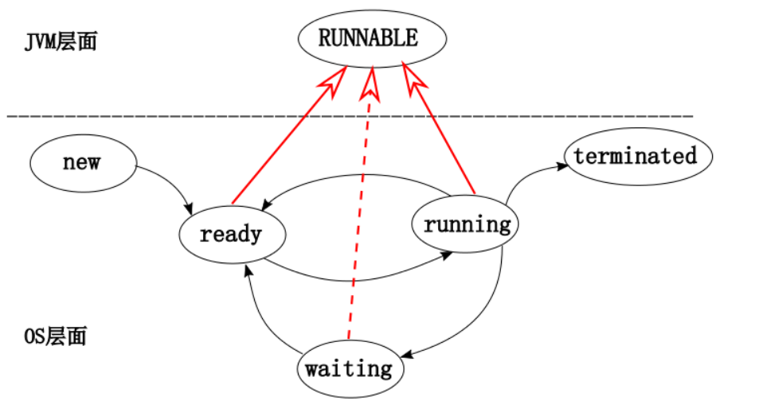
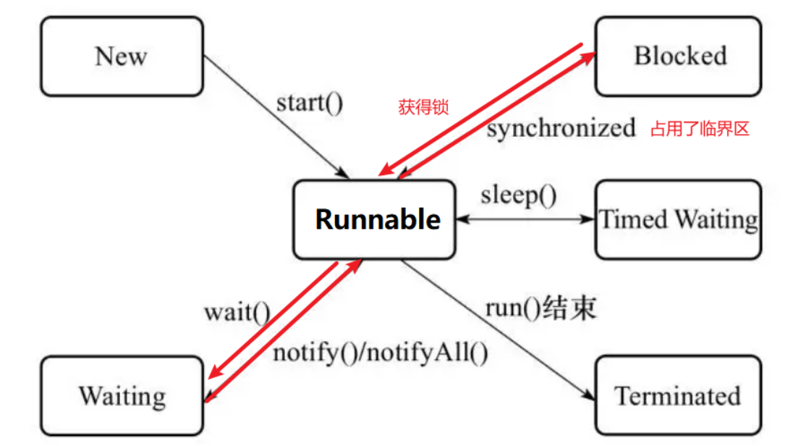
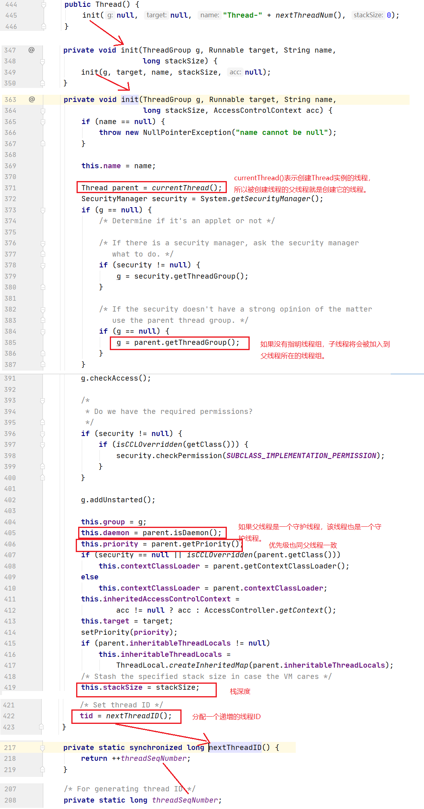
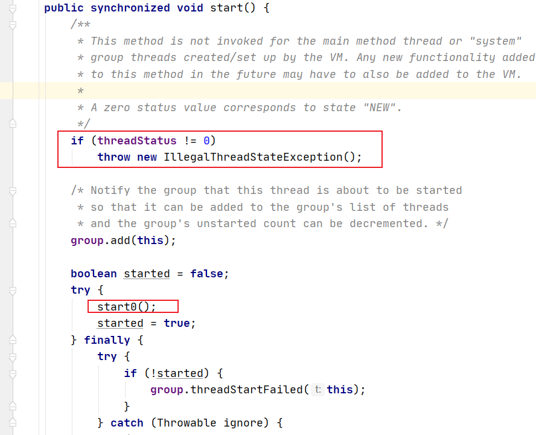
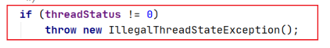
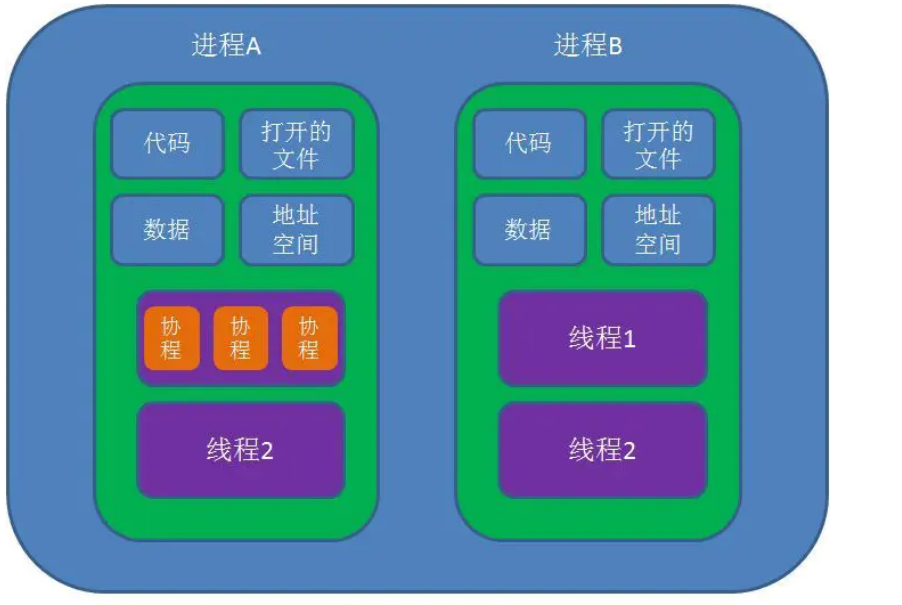

# 1.线程的生命周期

## 1. 线程生命周期

我们看一下一般讲操作系统层面的线程生命周期包括这几部分：New新建态，Ready就绪态，Running运行态，Waiting阻塞等待状态，Terminated终止态。

 

补充：

- ready状态意味着该线程还没有获得CPU调度，所以不会直接变成waiting阻塞状态。除非发生了意外终止，否则ready只能进入running状态。

## 2. Java线程状态

   Java中定义线程状态有6种，分别是：NEW, RUNNABLE, BLOCKED, WAITING, TIMED_WAITING, TERMINATED。其实这是Java虚拟机层面暴露给我们的状态，与操作系统底层的线程状态是两个层面的事情。具体而言，这里说的Java线程状态均来自于Thread类下的State这一内部枚举类中所定义的状态：

   

   具体这6种状态介绍如下：

   - NEW：表示的是刚创建的线程Thread对象，还没有开始启动，没有调用start()方法启动

   - RUNNABLE：表示线程已经通过start()方法调用，线程正式启动，**线程在JVM中处于运行中状态**。但是该线程可能还没被CPU调度，在操作系统层面还处在就绪态，等待被调度执行，不一定立马被调度执行进入运行态。

     重点：Java线程种的Runnable状态意思是在JVM中处于运行中状态，对应在操作系统中可能处在运行态，可能处在就绪态。

   - BLOCKED：表示线程阻塞，等待获取锁，一般是指synchronized关键字占用临界区的情况，一旦获取到锁就进入RUNNABLE状态继续运行。**像wait，sleep，join等引起的WAITING状态可以被interrupt打断重新进入RUNNABLE状态，而因为sync进入的BLOCKED状态无法被打断。**

   - WAITING：表示线程处于无限制等待状态，等待一个特殊的事件来重新唤醒该线程。当一个线程通过wait()方法进入WAITING状态的线程，需要等待一个notify()或者notifyAll()方法唤醒；当一个线程通过join()方法进入WAITING()状态的线程，要等待目标线程运行结束时才会被唤醒。**一旦通过相关事件唤醒线程，线程就进入了RUNNABLE状态继续运行。**

   - TIMED_WAITING：表示状态进入了一个有时限的等待，如sleep(3000)，等待3s后，线程主动重新进入RUNNABLE状态继续运行。

   - TERMINATED：表示线程执行完毕后，进入终止状态。

   

注意我们平常说的线程阻塞或者线程等待，没有说的那么细，没有细分是WAITING还是BLOCKED。

   

## 3. Java线程的Runnable状态

相较于操作系统层面的线程状态，Java线程状态没有Ready和Running状态，我们具体分析一下Java线程的Runnable状态：

1. 我们来详细看一下javadoc注释中是怎么描述runnable状态的：

   处于runnable状态下的线程正在Java虚拟机中执行，但它可能正在等待来自操作系统的其他资源，比如处理器。

   A thread in the runnable state is executing in the Java virtual machine but it may be waiting forother resources from the operating system such as processor.

   所以对于Java线程而言，当一个线程调用了start()方法后，就进入到了Java虚拟机中运行了。但是在JVM下面的操作系统层面来看，这个线程只是刚刚进入`Ready`状态，并不一定立马被调度，被CPU执行进入Running状态。它此时仍然正在JVM中运行着，可能正在等待CPU执行，也可能正在被CPU执行，无论哪种情况，都还在JVM中工作着，都是Runnable状态。

   即对于Java线程状态而言，它的runnale状态包含了ready和running状态。

2. 为什么没有细分：ready和running状态呢？

   现在的时分多任务操作系统架构通常都是用所谓的**时间分片**方式进行抢占式轮状调度的。这个时间分片通常很小，一个线程一次最多只能在cpu上运行10-20ms的时间，即0.0.1秒这一量级，时间片用完后就要被切换下来放到就绪队列末尾等待被再次调度。如果期间进行了I/O操作还会导致提前释放时间分片，并进入WAITING等待队列，或者时间片还没有用完就被高优先级抢占进入Ready队列。

   这一切换到过程称为线程的上下文切换，当然cpu不是简单地把线程踢开就完了，还需要把当时线程的执行状态保存起来，以便后续恢复继续运行该线程。如果不计算切换开销，在1s内大概会发生50-100次切换。但是事实上时间片经常还没有用完，线程就因为各种原因被中断，实际发生切换的次数还会更多。

   10-20ms的时间片对于人而言是非常快，难以感知到的。所以快速切换会带来一种假象，各个线程是同时刻运行的，也就是并发现象，有点类似于一个手脚非常快的杂耍演员可以让好多个球同时在空中运转。时间片是可以配置的，配置的大一点，可以减少多次切换带来的开销。

   通常Java线程状态是服务于监控的，从上面我们知道线程切换的状态是如此之快，如果Java线程区分了ready和running状态，当一个线程正处在Running状态，此时我们通过监控服务看到这个线程是Running状态，但是此时该线程可能早就被切换下去了，所以这个状态是不好准确地维持住，是转瞬即逝的，不太好观察。所以Java线程统一用一个Runnable枚举来包括Ready和Running状态。

   现今主流的JVM实现都把Java线程一一映射到操作系统底层的线程上，把调度委托给了操作系统，**我们在虚拟机层面看到的状态实质是对底层状态的映射和包装。**JVM本省没有做什么实质的调度，**没有将ready和running状态映射为一个Java线程状态，而是统一成了runnable状态。**

3. 再来认识一下Java线程的Runnable状态

   - 首先我们要知道虚拟机是在操作系统的上层工作的，操作系统中有关线程的概念和JVM中定义的线程概念不是一一对应的，我们看到的**JVM层面的线程概念实质上是对底层操作系统中的相关概念进行包装得到的**。JVM下面的操作系统可以理解为作为某种资源来满足虚拟机的需求而存在的。

     

   - 当进行阻塞式I/O操作时，或许底层操作系统线程确实出现阻塞状态，但是我们此时关心的是JVM层面的Java线程状态。JVM并不关心底层操作系统的实现细节，无论是时间片分片还是I/O时会发生阻塞。

     所以Java在JVM层面自己定义了一种状态Runnable：**处于runnable状态下的线程正在Java虚拟机中执行，但它可能正在等待来自于操作系统的其他资源，比如处理器等。**也就是说只要是在**JVM中正在执行的线程**都被Java定义为Runnable，它可能正在等待来自于操作系统得到其他资源。JVM把cpu，硬盘，网卡都视作资源，为Java线程服务的资源，只要这些资源在位Java线程服务，线程在JVM就正在运行着，处于Runnable状态。所以当一个线程在操作系统层面，因为发生了I/O事件，导致进入阻塞队列，但是Java认为它还在JVM中工作着，认为这个线程还在执行着，**侧重点不是CPU有没有正在为这个Java线程工作，而是该线程是不是在JVM中运行着**。所以发生I/O时，Java线程还是Runnable状态。

   - JVM认为一个线程是不是正在执行，侧重点不是CPU有没有为这个线程服务。而操作系统认为一个线程处于Running状态，必须是该线程正在被CPU执行。所以两者的侧重点不一样，那么线程的状态概念上也就会有差异。

   - Java线程状态的改变只与自身显示引入的机制有关，如果JVM中的线程状态发生改变了，通常是自身机制引发的。比如sleep(), join(), interrupt, wait()等Java方法的调用就会在Java定义的线程状态中进行改变。
   
     所以进行传统上的IO操作时，口语上我们也会说阻塞，但是这个阻塞和Java线程的BLOCKED状态时两码事，机制是不同的。
     
   - Runnable状态对应了传统操作系统层面上的ready，running，以及部分waiting状态：
     
     
     
     
## 4. 操作系统的Waiting状态

操作系统的WAITING状态在Java中被细分为了BLOCKED, WAITING, TIMED_WAITING三种，还有一部分像调用了阻塞式API发生I/O阻塞时，在操作系统层面也是进入了WAITING状态，但是从JVM层面来水，该线程还在JVM中运行着，只不过在等待资源（操作系统，CPU），所以在Java中还是RUNNABLE状态。

- 当因为尝试持有同步锁Synchronized时，被阻塞的话会进入Java的BLOCKED状态 ----> 对应操作系统的WAITING状态

- sleep()方法会让Java线程进入Java的Timed Waiting状态 ----> 对应操作系统的WAITING状态

- wait()方法会让Java线程进入Java的Waiting状态 ----> 对应操作系统的WAITING状态

这三种情况和发生I/O阻塞不同之处在于，它们都是由Java的线程机制引起的，所以Java为其做了具体的分类。




# 2.Thread类

- 我们来更正一个说法：创建线程的方式有两种，一种是创建一个Thread，一种是实现Runnable接口。

  这种说法是不严谨的：创建线程只有一种方式，那就是构造Thread类，而实现线程的执行单元则有两种方式，一种是重写Thread中的run()方法；一种是实现Runnable接口的run()方法，并且将Runnable实例作为构造Thread的参数。

  其实也就是表面上何种的构造线程的方式，底层都是派生于Thread类的。

## 1.几种创建线程的方式

1. **方式1：使用 Thread类或继承Thread类**

   ```java
   // 创建线程对象
   Thread t = new Thread() {
       public void run() {
       // 要执行的任务
       }
   };
   // 启动线程
   ```

2. **方式2：实现 Runnable 接口配合Thread**

   好处：把线程和任务单元分开解耦。

   缺点：没有返回值，不能抛异常

   ```java
   Runnable runnable = new Runnable() {
       public void run(){
       // 要执行的任务
       }
   };
   // 创建线程对象
   Thread t = new Thread( runnable );
   // 启动线程
   ```

3. **方式3：使用有返回值 ，且能抛异常的 Callable**

   ```java
   //创建线程池
   ExecutorService service = Executors.newFixedThreadPool(10);
   
   //提交任务，并用 Future提交返回结果
   Future<Object> future = executor.submit(new Callable<Object>() {
       @Override
       public Object call() throws Exception {
           return "abc";
       }
   });
   Object o = future.get();
   System.out.println(o);
   ```

   

## 2.Thread的构造方法

1. 我们看一下无参构造都做了哪些是：

   

   - 线程名称：默认是"Thread-"拼上一个递增的数字

   - 父子关系：被创建线程的父线程就是创建它的线程：一个Thread线程实例肯定是在另一个线程中被创建出来的，那么被创建线程的父线程就是创建它的线程。

     **我们知道在启动JVM时，会先创建一个叫做main的主线程。**那么意味着其他我们创建的线程都是main线程派生出来的。

   - 线程组ThreadGroup：如果构造Thread对象时没有指明线程组，那么子线程的线程组和父线程的线程组保持一致，即子线程将会被加入到父线程的线程组中。

   - 守护线程：是否是守护线程，子线程与父线程保持一致。

   - 优先级：优先级与父线程保持一致

   - 线程ID-tid：为每个线程分配一个递增的线程ID。

## 2.守护线程Daemon

1. 在具体介绍守护线程之前，我们先来了解一下JVM程序在什么情况下会退出：

   正常退出的情况下，当JVM中没有一个非守护线程了，JVM就会正常退出。没有非守护线程意味着没有用户工作线程了。

2. 守护线程：

   是一类比较特殊的线程，一般用于处理一些后台的工作，比如JDK的垃圾回收线程。当JVM中没有一个非守护线程时，JVM就会正常退出，这也就意味着守护线程具备自动结束生命周期的特点。

   它是为用户工作线程服务的，我们希望它在用户工作线程都消亡后，其能够这些服务线程也能自动消亡，那么此时就可以用守护线程。

## 3.start()和run()方法

1. 两者介绍：

   - start()是定义在Thread中的：当我们new一个Thread对象后，此时就仅仅只是一个Java对象。当该对象成功地调用了start()方法后，意味着在JVM进程中真正创建了一个线程。当线程被CPU调度后，就会执行run()中的代码。
   - run()方法在Thread和Runnable接口中都有定义：run()方法是线程的逻辑执行单元，在run方法中实现这个线程要执行的任务逻辑。所以我们既可以重写Thread中的run()方法，也可以实现Runnable接口中的run()方法来实现线程逻辑单元

2. 我们大致看一下start()方法的源码：

   

   - start()方法中会调用一个JNI（ Java Native Interface）Java本地方法**start0()**。线程的启动执行主要是通过start0()这个JNI方法完成的，即在线程调用start()方法启动后，run方法会被这个JNI方法调用执行。
   - 在start()方法的一开始就会进行一个threadStatus判断，而只有先创建的Thread对象的threadStatus属性是0。所以一个Thread只能在刚创建出来时成功调用start()方法，即一个线程不能启动两次。
   - 线程启动后会被加到一个线程组ThreadGroup里面。

3. 每个线程只能调用一次start()方法：

   

   在执行start()时会先进行一个判断，如果线程的threadStatus != 0，那么就会抛出IllegalThreadStateException。而刚构造好的Thead对象就是New状态，其**threadStatus这个内部属性为0**。只有threadStatus=0的Thread对象才能调用start()方法，所以一个Thread线程对象不能调用两次start()方法。也就意味着线程是无法复活的。

   每个线程只能调用一次start()方法，意味着每个线程在经历一次生命周期过后，就死亡了不能再被使用了。比如一个线程运行结束后处于Terminated状态，那么就不能通过调用start()方法再次回到Runnable可执行状态，因为它的生命周期已经结束了。

4. 直接调用run()方法：

   从代码层面看，run()方法是一个实例方法，我们显然可以通过对象实例直接调用run()方法。但此时调用的结果，仅仅是在当前线程中的一个串行调用，并没有达到新开一个线程进行异步执行目的。


# 3.Java线程属于内核级线程

## 3.1.Java线程是内核级线程

Java线程是基于操作系统原生线程模型来实现的，它的Windows版本和Linux版本都是用一对一的线程模型实现，一条Java线程就映射到一条轻量级进程之中。Java线程是一种内核线程很重，是依赖于内核的，它的创建，撤销，切换都由内核实现，

1. 为什么说线程的创建和销毁是一个较为耗费资源的事情

   start()方法的调用，会真正的启动创建一个线程，这个过程会涉及到操作系统的系统调用。像Linux就会通过pThread库来真正创建并启动一个线程，发生了系统调用就意味着发生用户态和内核态的切换，较为耗费资源。所以Java线程是一种内核线程，很重，赖于内核实现。

2. 内核级线程：它们依赖于内核，无论是用户进程中的线程还是系统进程中的线程，它们的创建，撤销，切换都由内核实现。

3. 用户级线程：操作系统内核感知不到应用线程的存在。

## 3.2.协程简述

协程：英文Coroutines是一种基于线程之上，但又比线程更加轻量级的存在，协程不被操作系统内核所管理，而完全是由程序所控制（完全是在用户态执行），具有对内核来说不可见的特性。这样带来的好处就是性能得到了很大的提升，不会像线程切换那样消耗资源。



协程的调度由用户自己进行，线程由操作系统调度，减少了上下文切换。

线程栈远比协程栈大得多。

协程可以在方法内中断，转而执行别的方法，在适当的时候再返回来接着执行。

协程适用于被阻塞，且需要大量并发的场景（网络IO），不适合大量计算的场景。

# 4.Java线程的调度机制

线程调度是指操作系统为线程分配处理器使用权的过程，主要的调度方式分为两种，分别是协同式线程调度和抢占式线程调度。

1. 协同式线程调度

   线程执行时间由线程本身来控制，线程把自己的工作执行完之后，要主动通知系统切换到另一个线程上。好处是调度对于线程自己是可知的，没啥线程同步问题。坏处是线程执行时间不可控，如果一个线程有问题，可能一直阻塞在那里，操作系统没有主动来调度线程的切换。

2. 抢占式线程调度

   每个线程将由系统来分配执行时间，线程的切换不由线程本身来决定（Java中的Thread.yield可以让出执行时间，但谁被调度还是又操作系统决定）。线程执行时间可控，也不会有一个线程导致整个进制阻塞的情况。

3. Java线程调度就是抢占式调度

   希望系统能给某些线程多分配一些时间，给一些线程少分配一些时间，可以通过设置线程优先级来完成。Java语言一共有10个级别的线程优先级，在两个线程同时处于ready状态时，优先级越高的线程越容易被系统调度执行。

   但优先级并不一定起作用，因为Java线程是通过映射到系统的原生线程上来实现的，所以线程调度最终还是取决于操作系统。


# 5.模板设计模式和策略模式

## 1. 模板设计模式：

1. 场景举例：重写Thread中的run方法，通过start()方法创建启动一个Java线程

2. 大致描述：
   - 一般是抽象父类定义一个final方法，在这个final中还会调用一个protected修饰的空方法，这个过程作为任务的执行结构，其中的protected方法作为任务执行单元。
   - 且final修饰的方法表示任务执行结构不允许重写，protected修饰的空方法是暴露给子类交给子类重写的。每个子类重写这个protected方法实现自己的执行逻辑单元。

3. 代码演示：

   ```java
   /**
    * 描述：模板模式的简单举例
    * print控制流程结构，其中会调用warpPrint方法来实现具体的逻辑，而warpPrint方法是父类暴露给子类的一个抽象方法或者空方法，
    * 且被protected修饰，所以只能被子类重写。
    * 程序结构print是由父类控制的，并且是final修饰的不允许重写，子类只需要重写父类暴露出来的空方法，实现想要的逻辑任务即可（执行单元）。
    *
    * @author txl
    * @date 2022-03-06 18:00
    */
   public abstract class TemplateMethod {
       /**
        * 类似Thread的start()方法，其中会调用run()方法
        * @param message
        */
       public final void print(String message) {
           System.out.println("===========");
           warpPrint(message);
           System.out.println("===========");
       }
   
       /**
        * warpPrint类似于Thread的run()方法
        * @param message
        */
       protected abstract void warpPrint(String message);
   
   }
      
   public class MyTemplate extends TemplateMethod{
       @Override
       protected void warpPrint(String message) {
           System.out.println("*" + message + "*");
       }
   }
      
   public class TemplateTest {
       public static void main(String[] args) {
           MyTemplate myTemplate = new MyTemplate();
           myTemplate.print("Hello");
       }
   }
      
   //打印结果：
   ===========
   *Hello*
   ===========
   ```


## 2. 策略模式：

1. 场景举例：Thread类结合Runnable接口实现一个Java线程，抽取出run()方法放到Runnable接口中，且Runnable实例作为Thread构造的一个入参。

2. 大致描述：
   - 比如类A中有一个任务，类A将这个代表任务的逻辑单元的方法抽取出来放到一个函数式接口，函数式接口中只有这一个代表逻辑单元的空方法。
   - 类A中有一个final修饰的成员变量，就是这个函数式接口的实例，该成员变量在构造方法中被初始化，在每个重载的构造函数中都要初始化该成员变量，因为它是final修饰的，必须指定初始值。通过类A执行这个任务时，构造类A实例的时候要传一个接口的实例给类A的构造。这个接口的实例中实现了具体的任务执行单元的逻辑，类A会在一个protected方法中通过接口的实例成员变量调用具体的逻辑单元来实现任务。
   - 在构造类A时，可以根据传入不同的接口实例，来达到我们想要的任务执行逻辑。每个接口的实例，代表了不同的策略。

3. 好处：

   - 做到了任务的执行结构和任务的逻辑单元分离开来，相互独立。
   - 类A中定义的任务执行结构，接口中定义了逻辑单元，两者通过在类A中定义一个接口类型的成员变量结合在一起，在执行任务时类A会在任务执行结构final方法中通过成员变量调用具体的执行逻辑单元。
   - 很灵活，符合单一原则，更加面向抽象。当逻辑单元需要变化时，只需要传入一个新的接口实例即可。

4. 代码演示：

   ```java
   /**
    * 描述：计算税费类
    *
    * @author txl
    * @date 2022-03-07 23:25
    */
   public class TaxCalculator {
   
       private double salary;
       private double bonus;
       private final CalculatorStrategy strategy;
   
       public TaxCalculator(double salary, double bonus, CalculatorStrategy strategy) {
           this.salary = salary;
           this.bonus = bonus;
           this.strategy = strategy;
       }
   
       /**
        * 计算税率：作为结构，不能重写
        */
       public final double calculatorTax() {
           return strategy.calculator(salary, bonus);
       }
   }
      
   /**
    * 描述：计算策略接口
    *
    * @author txl
    * @date 2022-03-07 23:27
    */
   @FunctionalInterface
   public interface CalculatorStrategy {
       // 计算方式
       double calculator(double salary, double bonus);
   }
      
   /**
    * 描述：计算策略实现
    *
    * @author txl
    * @date 2022-03-07 23:42
    */
   public class SimpleCalculatorStrategy implements CalculatorStrategy{
   
       private double SALARY_RATIO = 0.1d;
       private double BONUS_RATIO = 0.15d;
   
       @Override
       public double calculator(double salary, double bonus) {
           return salary * SALARY_RATIO + bonus * BONUS_RATIO;
       }
   }
      
   public class TaxCalculatorTest {
       public static void main(String[] args) {
           /**
            * 策略模式
            */
           SimpleCalculatorStrategy strategy = new SimpleCalculatorStrategy();
           TaxCalculator taxCalculator = new TaxCalculator(10000d, 1000d, strategy);
           System.out.println(taxCalculator.calculatorTax());
       }
   }
      
   //打印结果：
   1150.0
   ```

   
## 3.Runnable构造Java线程的好处

将线程的控制本身和业务逻辑单元分离开，达到职责分明，功能单一的原则。

Thread类的run()方法在不同实例中是不能共享的，而Runnable接口的run()方法可以很容易地在不同Thread中共享，只要在Thread构造方法中传入相同的Runnable实例入参即可。