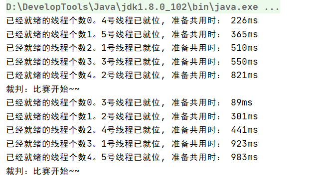

### 1.Semaphore介绍

#### 1.1.介绍

1. Semaphore俗称信号量，它是操作系统中PV操作的原语在Java的实现，他也是基于AbstractQueuedSynchronizer实现的。

2. Semaphore的功能非常强大：

   - 大小为1的信号量类似于互斥锁，大小为1的信号量意味着同时只能有一个线程获取信号量。
   - 大小为n（n > 0）的信号量可以实现限流的功能，他可以实现最多有n个线程同时获取信号量。

3. PV操作

   PV操作是操作系统一种实现进程互斥与同步的有效方法。PV操作与信号量S的处理相关，P表示通过，V表示释放。用PV操作来管理共享资源时，首先要确保PV操作自身执行的正确性。

   P操作的主要动作是：

   - S减1
   - 若S减1后仍大于或等于0，则进程继续执行。
   - 若S减1后小于0，则该进程被阻塞后放入等待该信号量的等待队列中，然后调度其他进程。

   V操作的主要动作是：

   - S加1
   - 若S加1后结果大于0，则进程继续执行。
   - 若加1后结果小于或等于0，则从该信号的等待队列中释放一个等待进程，然后再返回原进程继续执行或调度其他进程。

#### 1.2.Semaphore常用方法

1. 构造器

   ```java
   // permits表示资源（许可证）的数量，默认是非公平锁
   public Semaphore(int permits) {
       sync = new NonfairSync(permits);
   }
   
   // 也可以指定公平锁
   public Semaphore(int permits, boolean fair) {
       sync = fair ? new FairSync(permits) : new NonfairSync(permits);
   }
   ```

2. 常用方法

   ```java
   // acquire表示获取资源，如果获取不到则阻塞
   public void acquire() throws InterruptedException
       
   // tryAcquire没有资源的话返回false，但是线程不会阻塞
   public boolean tryAcquire()
   
   // 释放一个资源
   public void release()
   
   // 返回此信号量中当前可用的资源数
   public int availablePermits()
   
   // 获取正在等待获取资源的线程数    
   public final int getQueueLength()
   
   // 是否有线程正在等待获取资源        
   public final boolean hasQueuedThreads()
   
   // 减少reduction个资源数    
   protected void reducePermits(int reduction)
   
   // 返回所有等待获取资源的线程集合    
   protected Collection<Thread> getQueuedThreads(
   ```

3. 代码示例1

   ```java
   public class SemaphoreTest {
   
       public static void main(String[] args) {
           // 声明3个窗口
           Semaphore windows = new Semaphore(3);
           for (int i = 0; i < 5; i++) {
               new Thread(new Runnable() {
                   @Override
                   public void run() {
                       try {
                           // 占用窗口    加锁
                           windows.acquire();
                           System.out.println(Thread.currentThread().getName() + ": 开始买票");
                           //模拟买票流程
                           Thread.sleep(5000);
                           System.out.println(Thread.currentThread().getName() + ": 购票成功");
                       } catch (InterruptedException e) {
                           e.printStackTrace();
                       } finally {
                           // 释放窗口
                           windows.release();
                       }
                   }
               }, "thread" + i).start();
           }
       }
   }
   ```

4. 代码演示2：限流

   ```java
   public class SemaphoneTest2 {
   
       /**
        * 实现一个同时只能处理5个请求的限流器
        */
       private static Semaphore semaphore = new Semaphore(5);
   
       /**
        * 定义一个线程池
        */
       private static ThreadPoolExecutor executor = new ThreadPoolExecutor
               (10, 50, 60,
                       TimeUnit.SECONDS, new LinkedBlockingDeque<>(200));
   
       /**
        * 模拟执行方法
        */
       public static void exec() {
           try {
               //占用1个资源
               semaphore.acquire(1);
               //TODO  模拟业务执行
               System.out.println("执行exec方法");
               Thread.sleep(2000);
           } catch (Exception e) {
               e.printStackTrace();
           } finally {
               //释放一个资源
               semaphore.release(1);
           }
       }
   
       public static void main(String[] args) throws InterruptedException {
           {
               for (; ; ) {
                   Thread.sleep(100);
                   // 模拟请求以10个/s的速度
                   executor.execute(() -> exec());
               }
           }
       }
   }
   ```


### 2.CountDownLatch介绍

#### 2.1.介绍

1. CountDownLatch是一个同步协助类，允许一个或多个线程等待，直到其他线程完成操作。

   CountDownLatch使用给定的计数值（count）初始化，countDown方法会减少count的值。

   **await方法会阻塞线程直到当前的计数值count达到0，count为0后所有等待的线程都会被释放从原位置继续执行。**并且随后对await方法的调用都会立即返回。

   这是一个一次性现象——count不会被重置。如果你需要一个重置count的版本，那么请考虑使用CyclicBarrier。

2. 常用方法

   1. 构造方法

      ```java
      public CountDownLatch(int count) {
          if (count < 0) throw new IllegalArgumentException("count < 0");
          this.sync = new Sync(count);
      }
      ```

   2. 常用方法

      ```java
       // 调用 await()方法的线程只要state不为0就会被挂起，它会等待直到 count 值为 0 才继续执行
      public void await() throws InterruptedException { };  
      
      // 和 await() 类似，若等待 timeout 时长后，count 值还是没有变为 0，不再等待，继续执行
      public boolean await(long timeout, TimeUnit unit) throws InterruptedException { };  
      
      // 会将 count 减 1
      public void countDown() { };
      ```

3. CountDownLatch应用场景

   CountDownLatch一般用作多线程倒计时计数器，可以强制它们await等待count计数个线程，直到count减到0。有点join的作用。

   - 场景1：让多个线程等待一个线程，count=1。多个线程都await，直到一个线程count-1后，被唤醒。
   - 场景2：让单个线程等待n个线程，count=n。单个线程在await，直到count-n后，被唤醒。

#### 2.2.简单使用

1. 让多个线程等待一个线程：模拟并发，让并发线程一起执行

   ```java
   public class CountDownLatchTest {
       public static void main(String[] args) throws InterruptedException {
   
           CountDownLatch countDownLatch = new CountDownLatch(1);
           for (int i = 0; i < 5; i++) {
               new Thread(() -> {
                   try {
                       //准备完毕……运动员都阻塞在这，等待号令
                       countDownLatch.await();
                       String parter = "【" + Thread.currentThread().getName() + "】";
                       System.out.println(parter + "开始执行……");
                   } catch (InterruptedException e) {
                       e.printStackTrace();
                   }
               }).start();
           }
   
           Thread.sleep(2000);// 裁判准备发令
           countDownLatch.countDown();// 发令枪：执行发令
       }
   }
   ```

2. 让单个线程等待n个线程：多个线程(任务)完成后，进行汇总合并

   ```java
   public class CountDownLatchTest2 {
       public static void main(String[] args) throws Exception {
   
           CountDownLatch countDownLatch = new CountDownLatch(5);
           for (int i = 0; i < 5; i++) {
               final int index = i;
               new Thread(() -> {
                   try {
                       Thread.sleep(1000 +
                               ThreadLocalRandom.current().nextInt(1000));
                       System.out.println(Thread.currentThread().getName()
                               + " finish task" + index);
   
                       countDownLatch.countDown();
                   } catch (InterruptedException e) {
                       e.printStackTrace();
                   }
               }).start();
           }
   
   
   
           // 阻塞主线程，当计数器==0，就唤醒主线程往下执行汇总逻辑
           countDownLatch.await();
           System.out.println("主线程:在所有任务运行完成后，进行结果汇总");
       }
   }
   ```

#### 2.3.CountDownLatch实现原理

1. **大致原理**

   底层基于AbstratcQueuedSynchronizer实现，CountDownLatch构造函数中指定的count直接赋给AQS的state；

   每次countDown()都是调用release(1)将state减一，最后减到0时，减到0的线程会调用unpark唤醒在同步队列中阻塞的线程。

   而调用await()方法时，当前线程就会判断state属性是否为0，如果为0，则继续往下执行即不阻塞。如果不为0，则使当前线程进入等待状态，直到某个线程将state属性置为0，会唤醒在同步队列中等待的线程。所以这里的await方法只是叫做await，不是condition的await也不是obj的wait，就是一个简单的await，只是名字叫做await。

2. CountDownLatch与Thread.join的区别

   CountDownLatch作用就是允许一个或多个线程等待其他线程完成操作，有些类似join()方法，但其提供了比join()更加灵活地API。CountDownLatch可以手动控制n个线程里调用n次countDown()方法使计数器减一操作，也可以在一个线程里调用n次执行减一操作。CountDownLatch控制线程是根据独立于线程的count。

   首先join必须先获得线程对象才能调用join()，如果是线程池还不好拿到线程对象。join()的实现原理是不停地检查join线程是否存活，如果join线程存活则让当前线程继续等待（可能join的线程被阻塞，那么就会一直等待），让join线程和当前线程串行执行。CountDownLatch控制线程是根据独立于线程的count，只要count为0，就唤醒等待的线程。被等待的线程继续执行，不用等到被等待的线程消亡才能执行唤醒等待线程。显然CountDownLatch更灵活且控制粒度更精细。

3. CountDownLatch与CyclicBarrier的区别

   CountDownLatch和CyclicBarrier都能够实现线程之间的等待，只不过他们的侧重点不同。

   1. CountDownLatch的计数器只能使用一次，而CyclicBarrier的计数器可以使用reset()方法重置。所以CyclicBarrier能处理更为复杂的业务场景，比如如果计算发生错误，可以重置计数器，并让线程们重新执行一次。
   2. CyclicBarrier还提供getNumberWaiting（获得CyclicBarrier阻塞的线程数量），isBroken（用来知道阻塞的线程能否被中断）等方法。
   3. CountDownLatch会和CyclicBarrier都能够实现线程之间的等待，只不过他们侧重点不同。CountDownLatch一般用于一个或多个线程，等待其他线程执行完任务后再执行。CyclicBarrier一般用于一组线程互相等待至某个状态，然后这一组线程再同时执行。
   4. CyclicBarrier还可以提供一个barrierAction，当所有线程到达屏障点后执行barrierAction，可以合并多线程计算结果。
   5. CyclicBarrier是通过ReentrantLock的“独占锁”和Condition来实现一组线程的阻塞唤醒的，而CountDownLatch则是通过AQS的“共享锁”实现。

### 3.CyclicBarrier介绍

#### 3.1.介绍

1. CyclicBarrier字面意思就是回环栅栏，通过它可以实现让一组线程等待至某个状态（屏障点）之后再全部同时执行。叫做回环是因为当所有等待线程都被释放后，CyclicBarrier可以被重用。

2. 常用方法

   - 构造方法

     ```java
     // parties表示屏障拦截的线程数量，每个线程调用 await 方法告诉 CyclicBarrier 我已经到达了屏障，然后当前线程被阻塞。
     public CyclicBarrier(int parties)
     
     // 用于在线程到达屏障时，优先执行 barrierAction，方便处理更复杂的业务场景(该线程的执行时机是在到达屏障之后再执行)
     public CyclicBarrier(int parties, Runnable barrierAction)
     ```

   - 重要方法

     ```java
     //调用一次await()方法将parties减一，同时阻塞线程。
     //BrokenBarrierException 表示栅栏已经被破坏，破坏的原因可能是其中一个线程 await() 时被中断或者超时
     public int await() throws InterruptedException, BrokenBarrierException
     public int await(long timeout, TimeUnit unit) throws InterruptedException, BrokenBarrierException, TimeoutException
     
     //循环  通过reset()方法可以进行重置
     public void reset()    
     ```

#### 3.2.CyclicBarrier应用场景

1. CyclicBarrier可以用于多线程先分别计算数据，最后合并计算结果的场景。

   ```java
   public class CyclicBarrierTest2 {
   
       private ConcurrentHashMap<String, Integer> map = new ConcurrentHashMap<String, Integer>();
   
       private ExecutorService threadPool = Executors.newFixedThreadPool(3);
   
       // 当线程到达屏障时，执行runnable逻辑
       private CyclicBarrier cb = new CyclicBarrier(3, () -> {
           int result = 0;
           Set<String> set = map.keySet();
           for (String s : set) {
               result += map.get(s);
           }
           System.out.println("三人平均成绩为："+(result/3)+"分");
       });
   
       public void count() {
           for (int i = 0; i < 3; i++) {
               threadPool.execute(new Runnable() {
                   @Override
                   public void run() {
                       int score = (int)(Math.random()*40+60);
                       map.put(Thread.currentThread().getName(), score);
                       System.out.println(Thread.currentThread().getName() + "同学的平均成绩为："+score);
   
                       try {
                           // 调用一次await()方法将parties减一，同时阻塞线程。
                           cb.await();
                       } catch (InterruptedException | BrokenBarrierException e) {
                           e.printStackTrace();
                       }
                   }
               });
           }
       }
   
       public static void main(String[] args) {
           CyclicBarrierTest2 cyclicBarrierTest2 = new CyclicBarrierTest2();
           cyclicBarrierTest2.count();
       }
   }
   ```

2. 利用CyclicBarrier的计数器能够重置，重复利用屏障，模拟“人一满就发车”的场景

   ```java
   public class CyclicBarrierTest3 {
   
       public static void main(String[] args) {
   
           AtomicInteger counter = new AtomicInteger();
           // 核心线程和最大线程数一样 超时时间没意义了。都是核心线程，不会超时销毁
           ThreadPoolExecutor threadPoolExecutor = new ThreadPoolExecutor(
                   5, 5, 1000, TimeUnit.SECONDS,
                   new ArrayBlockingQueue<>(100),
                   (r) -> new Thread(r, counter.addAndGet(1) + "号"),
                   new ThreadPoolExecutor.AbortPolicy());
   
           CyclicBarrier cyclicBarrier = new CyclicBarrier(5,
                   () -> System.out.println("裁判：比赛开始~~"));
   
           /**
            * 同时提交了10个任务：
            *  创建5个核心线程且只会创建5个线程，剩余的5个任务在任务队列排队。
            *  当其中一个线程执行完后，这个线程会继续从任务队列中拿任务执行。
            */
           for (int i = 0; i < 10; i++) {
               threadPoolExecutor.submit(new Runner(cyclicBarrier));
           }
       }
   
       static class Runner extends Thread {
           private CyclicBarrier cyclicBarrier;
   
           public Runner(CyclicBarrier cyclicBarrier) {
               this.cyclicBarrier = cyclicBarrier;
           }
   
           @Override
           public void run() {
               try {
                   int sleepMills = ThreadLocalRandom.current().nextInt(1000);
                   Thread.sleep(sleepMills);
   
                   // 返回在屏障点处等待的线程个数
                   System.out.println("已经就绪的线程个数" + cyclicBarrier.getNumberWaiting() + "。" +
                           Thread.currentThread().getName() + "线程已就位, 准备共用时： " + sleepMills + "ms ");
                   cyclicBarrier.await();
               } catch (InterruptedException e) {
                   e.printStackTrace();
               } catch (BrokenBarrierException e) {
                   e.printStackTrace();
               }
           }
       }
   }
   ```

   

#### 3.3.CyclicBarrier与CountDownLatch的区别

1. CountDownLatch的计数器只能使用一次，而CyclicBarrier的计数器可以使用reset()方法重置。所以CyclicBarrier能处理更为复杂的业务场景，比如如果计算发生错误，可以重置计数器，并让线程们重新执行一次。

2. CyclicBarrier还提供getNumberWaiting（获得在CyclicBarrier屏障点处等待的线程），isBroken（用来知道阻塞的线程能否被中断）等方法。

3. CountDownLatch会和CyclicBarrier都能够实现线程之间的等待，只不过他们侧重点不同。CountDownLatch一般用于一个或多个线程，等待其他线程执行完任务后再执行。CyclicBarrier一般用于一组线程互相等待至某个状态，然后这一组线程再同时执行。

4. CyclicBarrier还可以提供一个barrierAction，当所有线程到达屏障点后执行barrierAction，可以合并多线程计算结果。

5. **CyclicBarrier是通过ReentrantLock的“独占锁”模式和Condition来实现一组线程的阻塞唤醒的，而CountDownLatch则是通过AQS的“共享锁”实现，操作的是实际上还是同步等待队列**。

   

#### 3.4.原理

1. CyclicBarrier的await调的实际上是Condition的await，所以线程进入条件变量等待队列（单向链表）中等待。CyclicBarrier的Condition条件是触发开关trip，当调用cyclicBarrier的awai会将count减一并将当前线程阻塞在条件队列，所以实际上会调用trip.await，让当前线程在条件等待队列中阻塞。

   当所有线程都到达屏障点或者说count等于0时，满足了条件，会调用trip.signal，**唤醒在条件队列中阻塞的线程让其去同步队列抢锁（涉及到条件队列出队，同步队列入队）**。signal/await会释放锁，所以必须先持有锁，所以CyclicBarrier结合ReentrantLock加锁解锁逻辑。

2. CyclicBarrier用两个变量parties和count来存储初始的计数。每次await会将count减一并将当前线程阻塞在条件队列，当count等于0时。会唤醒所有阻塞在条件队列的线程，让其进入同步队列抢锁，并且重置count=parties实现循环利用。

