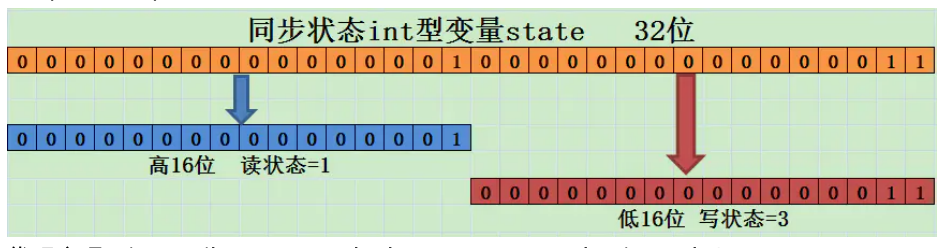

### 1.ReentrantReadWriteLock读写锁

#### 1.1.介绍

1. 现实中有这样一类场景：**对共享资源有读和写的操作，且写操作没有读操作那么频繁（读多写少）**。在没有写操作的时候，多个线程同时读共享资源是没有任何问题的，所以应该允许多个新线程同时读取共享资源（**读读可以并发**）；但是如果有线程想去写这些共享资源，就不应该允许其他线程对该资源进行读和写的操作（**读写，写读，写写互斥**）。**在读多与写的情况下，读写锁能够提供比排它锁更好的并发性和吞吐量**。

   注意：写锁支持同一个线程的重入。

   注意：读写互斥，锁降级场景除外，锁降级场景中可以在持有写锁的同时在获取读锁，然后再释放写锁。

2. 针对这种场景，Java的并发包提供了读写锁ReentrantReadWriteLock，它内部维护了一对相关的锁。一个专门用于读操作，称为读锁；一个用于写入操作，称为写锁。

3. 线程进入读锁的前提条件：
   - 没有其他线程的写锁。
   - 没有其他线程的写请求或者有写请求，但调用线程和持有锁的线程是同一个。

4. 线程进入写锁的前提条件：
   - 没有其他线程的读锁。
   - 没有其他线程的写锁。

5. 读写锁有以下3个重要的特性
   - 公平选择性：支持非公平（默认）和公平的锁获取方式，吞吐量还是非公平优于公平。
   - 可重入：读锁和写锁都支持线程重入，以读写线程为例。读线程获取读锁后能够再次获取读锁，写线程在获取写锁之后能够再次获取写锁同时也能够获取读锁。
   - 锁降级：遵循获取写锁，再获取读锁最后释放写锁的次序。写锁能够降级为读锁。
   - 没有锁降级

#### 1.2.ReentrantReadWriteLock的使用

1. 读写锁接口ReadWriteLock：一对方法，分别获得读锁和写锁Lock对象

   ```java
   public interface ReadWriteLock {
       /**
        * Returns the lock used for reading.
        *
        * @return the lock used for reading
        */
       Lock readLock();
   
       /**
        * Returns the lock used for writing.
        *
        * @return the lock used for writing
        */
       Lock writeLock();
   }
   ```

   ReentrantReadWriteLock是可重入的读写锁实现类，在它内部维护了一对相关的锁，一个用于只读操作，另一个用于写入操作。只要没有Writer线程，读锁可以由多个Readeer线程同时持有。**也就是说写锁是独占的，读锁是共享的。**

   ```java
   public ReentrantReadWriteLock() {
       this(false);
   }
   
   public ReentrantReadWriteLock(boolean fair) {
       sync = fair ? new FairSync() : new NonfairSync();
       readerLock = new ReadLock(this);
       writerLock = new WriteLock(this);
   }
   
   public ReentrantReadWriteLock.WriteLock writeLock() { return writerLock; }
   public ReentrantReadWriteLock.ReadLock  readLock()  { return readerLock; }
   ```

2. 使用示例：ReentrantReadWriteLock适合读多写少的场景

   ```java
   public class CacheDemo {
   
       static Map<String, Object> map = new HashMap<String, Object>();
       static ReentrantReadWriteLock rwl = new ReentrantReadWriteLock();
       static Lock r = rwl.readLock();
       static Lock w = rwl.writeLock();
   
       // 获取一个key对应的value
       public static final Object get(String key) {
           r.lock();
           try {
               return map.get(key);
           } finally {
               r.unlock();
           }
       }
   
       // 设置key对应的value，并返回旧的value
       public static final Object put(String key, Object value) {
           w.lock();
           try {
               return map.put(key, value);
           } finally {
               w.unlock();
           }
       }
   
       // 清空所有的内容
       public static final void clear() {
           w.lock();
           try {
               map.clear();
           } finally {
               w.unlock();
           }
       }
   }
   ```

   上述示例中，Cache使用一个非线程安全的HashMap作为缓存的实现，同时使用读写锁的读锁和写锁来保证Cache是线程安全的。在读操作get方法中需要先获取读锁，读锁是共享锁，并发访问该方法时不会被阻塞。写操作put方法和clear方法需要先获取写锁，写锁是独占锁，当获取写锁后其他线程对于读锁和写锁的获取均被阻塞。只有写锁被释放后，其他读写操作才能继续执行。

   Cache使用读写锁提升读操作的并发性，也保证每次写操作对所有的读写操作的可见性，同时简化了编码方式。

3. 锁降级

   锁降级指的是写锁降级为读锁。如果当前线程拥有写锁，然后将其释放，在获取读锁，这种分段获取锁的过程不能成为锁降级。**锁降级是指持有写锁的线程，再获取读锁，然后释放写锁的过程。**锁降级可以帮助我们拿到当前线程修改后的结果而不被其他线程锁破坏，防止更新丢失。

   ```java
   public class ReadWriteLockDemo2 {
   
       private final ReentrantReadWriteLock rwl = new ReentrantReadWriteLock();
       private final Lock readLock = rwl.readLock();
       private final Lock writeLock = rwl.writeLock();
       private volatile boolean update = false;
   
       public void processData() {
           readLock.lock();
           if (!update) {
               // 必须先释放读锁
               readLock.unlock();
               // 锁降级从写锁获取到开始
               writeLock.lock();
               try {
                   if (!update) {
                       // TODO 准备数据的流程（略）
                       update = true;
                   }
                   readLock.lock();
               } finally {
                   writeLock.unlock();
               }
               // 锁降级完成，写锁降级为读锁
           }
           try {
               //TODO  使用数据的流程（略）
           } finally {
               readLock.unlock();
           }
       }
   }
   ```

   锁降级中读锁的获取是否有必要？答案是肯定的。

   - 必要性1：锁降级使得当前线程在释放写锁之前，先获取读锁。能保证当前线程对自己这次写操作的可见性。避免直接释放写锁后，其他线程抢占到写锁，导致当前线程无法再读数据，感知不到自己的修改。
   - 必要性2：提高并发性，如果长时间独占写锁，无法响应其他线程读请求，会降低并发度。所以在执行完写操作后，就可以执行锁降级执行后续的读操作，使其他新线程可以获取到读锁，提高并发度。

   ReentrantReadWriteLock不支持锁升级：不允许持有读锁的情况下，再获取写锁，最后释放读锁的过程。如果读锁已被多个线程获取，当某个线程如果能升级为写锁并更新了数据的话，那么其他线程读取到值可能就会前后不一致，无法保证可见性。

   lock/unlock方法底层都会调用到park/unpark方法，所以是可以保证可见性的。

#### 1.3.ReentrantReadWriteLock分析

1. 读写锁是怎么实现分别记录读写状态，和读锁的重入次数的？

   如何用一个变量维护多种状态：在ReentrantReadWriteLock中，使用Sync继承自AQS中int类型的state来表示各种锁状态，state的初始值为0。ReentrantReadWriteLock采用“按位切合使用”的方式来用这一个变量来维护多种状态。**高16位记录读锁状态，低16位记录写锁状态。**通过对state进行位运算，能快速得到读锁状态和写锁状态。加入ReentrantReadWriteLock当前的state为S：

   - 读锁状态：得到S的高16位，S >>> 16无符号右移16位，高16补0低16位就是之前的高16位。
   - 读状态+1：让S的高16+1，S + (1 << 16)，S + 0x0001 0000。
   - 写锁状态：得到S的低16位，那么直接让高16位变为0即可，S & 0x0000 ffff
   - 写淘汰+1：因为低16位表示写锁状态，直接在低位+1，S + 1即可

   

   注意：高16位表示读锁状态，记录的只是有多少个线程持有了读锁。但是因为读锁是可重入的，一共重入了多少次，需要在每个持有的线程中再分别计算重入次数。

   **注意：其实用高位表示写，低位表示读更方面。因为读操作更频繁，如果用低位表示读，那么加减更直接不用移位。**

2. 看一下代码

   ```java
   // 获取读锁时需要右移位数
   static final int SHARED_SHIFT   = 16;
   
   // 读锁的自增单位：每次获取读锁时，state+SHARE_UNIT即可
   static final int SHARED_UNIT    = (1 << SHARED_SHIFT);
   
   static final int MAX_COUNT      = (1 << SHARED_SHIFT) - 1;
   
   // 低16位都是1：0x0000 ffff，与state进行&运算得到低16位写锁状态
   static final int EXCLUSIVE_MASK = (1 << SHARED_SHIFT) - 1;
   
   // int c = getState(); c是state
   // 1.获得高16位，读锁状态
   static int sharedCount(int c)    { return c >>> SHARED_SHIFT; }
   // 2.得到低16位，写锁状态
   static int exclusiveCount(int c) { return c & EXCLUSIVE_MASK; }
   ```

3. HoldCounter计数器

   不同于写锁，读锁可以同时被多个线程持有。而每个线程持有的读锁都支持重入，所以需要知道每个线程单独的重入次数，这里就用到了HoldCounter计数器。

   读锁的内在机制其实就是一个共享锁，一次读锁的操作就相当于对HoldCounter计数器的操作。获取读锁则该计数器+1，释放读锁则该计数器-1。只有当线程获取读锁后才能对读锁进行释放，重入操作。

   通过ThreadLocalHoldCount类继承自ThreadLocal，HoldCounter与当前线程绑定。HoldCounter中的count记录读锁重入次数。

   ```java
   static final class HoldCounter {
       int count = 0;
       final long tid = getThreadId(Thread.currentThread());
   }
   
   static final class ThreadLocalHoldCounter
       extends ThreadLocal<HoldCounter> {
       public HoldCounter initialValue() {
           return new HoldCounter();
       }
   }
   
   private transient ThreadLocalHoldCounter readHolds;
   
   private transient HoldCounter cachedHoldCounter;
   ```

4. 有线程读的过程中不允许写，这种设计有什么问题？

   写线程可能会长时间饥饿。

5. ReentrantReadWriteLock的读锁是悲观读。

   尝试持有读锁时，不会直接获取，而是先判断是否已经有其他线程持有写锁。如果写锁已被其他线程持有，就不允许再持有读锁，读写互斥。

   有没有乐观的读锁，也就是会直接获取读锁，先默认没有写操作。

6. StampedLockTest额外支持乐观读的读写锁。

   有一个版本号机制，可以先进行乐观读，通过版本号检查乐观读期间是否发生了写操作，如果发生了那么重新进行悲观读，如果没有发生写操作继续乐观读。**这里的乐观读其实没有用到锁，也就是一种无锁算法，所以乐观读锁和写锁不互斥（乐观读不会阻塞写操作），可以解决写锁的饥饿现象。**
   
   没有广泛应用：不能重入，比较复杂。
   
   ```java
   public class StampedLockTest{
   
       public static void main(String[] args) throws InterruptedException {
           Point point = new Point();
   
           //第一次移动x,y
           new Thread(()-> point.move(100,200)).start();
           Thread.sleep(100);
           new Thread(()-> point.distanceFromOrigin()).start();
           Thread.sleep(500);
           //第二次移动x,y
           new Thread(()-> point.move(300,400)).start();
   
       }
   }
   
   @Slf4j
   class Point {
       private final StampedLock stampedLock = new StampedLock();
   
       private double x;
       private double y;
   
       public void move(double deltaX, double deltaY) {
           // 获取写锁
           long stamp = stampedLock.writeLock();
           log.debug("获取到writeLock");
           try {
               x += deltaX;
               y += deltaY;
           } finally {
               // 释放写锁
               stampedLock.unlockWrite(stamp);
               log.debug("释放writeLock");
           }
       }
   
       /**
        * 计算当前坐标到原点的距离
        * @return
        */
       public double distanceFromOrigin() {
           // 获得一个乐观读锁
           long stamp = stampedLock.tryOptimisticRead();
           // 注意下面两行代码不是原子操作
           // 假设x,y = (100,200)
           // 此处已读取到x=100，但x,y可能被写线程修改为(300,400)
           double currentX = x;
           log.debug("第1次读，x:{},y:{},currentX:{}",
                   x,y,currentX);
           try {
               Thread.sleep(2000);
           } catch (InterruptedException e) {
               e.printStackTrace();
           }
   
           // 此处已读取到y，如果没有写入，读取是正确的(100,200)
           // 如果有写入，读取是错误的(100,400)
           double currentY = y;
           log.debug("第2次读，x:{},y:{},currentX:{},currentY:{}",
                   x,y,currentX,currentY);
   
           // 检查乐观读锁后是否有其他写锁发生
           if (!stampedLock.validate(stamp)) {
               // 乐观读期间发生了写操作，重新获取一个悲观读锁，重新读
               stamp = stampedLock.readLock();
               try {
                   currentX = x;
                   currentY = y;
   
                   log.debug("最终结果，x:{},y:{},currentX:{},currentY:{}",
                           x,y,currentX,currentY);
               } finally {
                   // 释放悲观读锁
                   stampedLock.unlockRead(stamp);
               }
           }
        return Math.sqrt(currentX * currentX + currentY * currentY);
       }
   }
   ```
   
7. sql中的一种乐观锁（无锁算法）：

   update table set count = count - 1, version = version + 1 where id = #{id} and version = #{version}

   T1 update：成功，返回值为1，version=101

   T2 update：成功，返回值为0，因为此时version已经是101了。

   根据返回值来作为是否加锁成功（其实是一种无锁算法）。