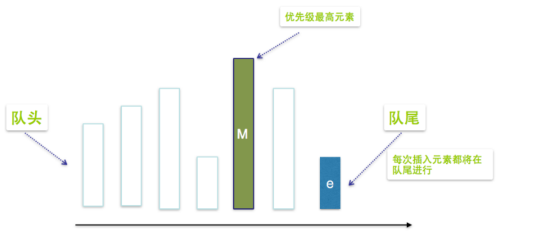

### 1.阻塞队列介绍

1. Queue接口

   Queue队列接口，这个是非阻塞的。

   ```java
   public interface Queue<E> extends Collection<E> {
       //添加一个元素，添加成功返回true, 如果队列满了，就会抛出异常
       boolean add(E e);
       //添加一个元素，添加成功返回true, 如果队列满了，返回false
       boolean offer(E e);
       //返回并删除队首元素，队列为空则抛出异常
       E remove();
       //返回并删除队首元素，队列为空则返回null
       E poll();
       //返回队首元素，但不移除，队列为空则抛出异常
       E element();
       //获取队首元素，但不移除，队列为空则返回null
       E peek();
   }
   ```

2. BlockingQueue接口

   BlockingQueue继承了Queue接口，是队列的一种。Queue和BlockingQueue都是在Java5中加入的，阻塞队列BlockingQueue是一个在Queue队列基础上又支持了两个方法的队列，常用于解耦。阻塞插入元素的线程，或者让获取元素的线程阻塞，可以均衡生产者和消费者各自的生产消费速度。BlockingQueue和JDK集合包中的Queue接口兼容，同时在其基础上增加了阻塞功能。

   **入队：**

   （1）offer(E e)：如果队列没满，添加一个元素返回true，如果队列已满，返回false（不阻塞）

   （2）offer(E e, long timeout, TimeUnit unit)：可以设置阻塞时间，如果队列已满，则进行阻塞。超过阻塞时间，则返回false

   （3）put(E e)：支持阻塞的插入方法put，队列满时，队列会阻塞插入元素的线程，知道队列不满。

   **出队：**

   （1）poll()：如果有数据，出队，如果没有数据，返回null   （不阻塞）

   （2）poll(long timeout, TimeUnit unit)：可以设置阻塞时间，如果没有数据，则阻塞，超过阻塞时间，则返回null

   （3）take()：支持阻塞的移除方法take，队列空时，获取元素的线程会阻塞队列直到队列非空。

3. 阻塞队列的特性

   - 阻塞：阻塞度列区别于其他类型的队列的最主要的特点就是“阻塞”这两个字，**阻塞功能使得生产者线程和消费者线程两端的能力得以平衡，当有任何一段速度过快时，阻塞队列便会把速度过快的线程给阻塞。**实现阻塞最重要的两个方法是take和put。
   - take方法：take方法的功能是获取并移除队列的头结点，通常在队列里面有数据的时候是可以正常移除的。当队列无数据时，执行take方法会阻塞当前线程。一旦队列里有数据了，就会立刻解除阻塞状态，并且取到数据。
   - put方法：put方法插入元素，如果队列没满，就成功插入。当队列已满时，调用put方法会阻塞当前线程，知道队列不满。一旦后续有了空闲空间，线程就会被唤醒，并把数据添加到队列中。

4. 阻塞队列是否有容量限制

   是否有界：阻塞队列还有一个非常重要的属性，那就是容量大小，分为有界和无界两种。无界队列意味着可以容纳非常多的元素，例如LinkedBlockingQueuq的上限是Integer.MAX_VALUE，可以近似的认为是无限容量。ArrayBlockingQueue是有界队列，容量满了也不会扩容。（数组有界，链表理论上无界）

5. 应用场景

   BlockingQueue是线程安全的，我们在很多场景下都可以利用线程安全的队列来优雅地解决我们业务自身的线程安全问题。比如说，使用生产/消费者模式的时候，我们生产者只需要往队列里面添加语速，而消费者只需要从队列里取出它们就可以。如图所示：

   

   因为阻塞队列是线程安全的，所以生产者和消费者都可以是多线程的，不会发生线程安全问题。生产者/消费者直接使用即可，不用考虑更多的线程安全问题。这也就意味着，考虑锁等线程安全问题的重任转移到了队列上，降低了开发的难度和工作量。

   同时队列他还能**起到一个隔离的作用**：比如说我们开发一个银行转账的程序，那么生产者线程不需要关心聚义的转账逻辑，只需要把转账任务，如账户和金额等信息放到队列中即可，不需要去关心银行这个类如何实现具体的转账业务。而作为银行这个类来讲，它会去从队列里取出来将要执行的具体的任务，再去通过自己的各种方法来完成本次转账。这样就**实现了具体任务与执行任务类之间的解耦**，任务被放在了阻塞队列中，而负责放任务的线程是无法直接访问到我们银行具体实现转账操作的对象。**实现了隔离，提高了安全性。**

6. 常见的阻塞队列：BlockingQueue 接口的实现类都被放在了 juc 包中，它们的区别主要体现在存储结构上或对元素操作上的不同，但是对于take与put操作的原理，却是类似的。

   - ArrayBlockingQueue：基于数组结构实现的一个有界阻塞队列。
   - LinkedBlockingQueue：基于链表接口实现的一个有界阻塞队列，默认容量是Integer.MAX_VALUE，也可以指定容量。
   - PriorityBlockingQueue：支持按优先级排序的无界阻塞队列
   - DelayQueue：基于优先级队列PriorityBlockingQueue实现的无界阻塞队列。
   - SynchronousQueue：同步阻塞队列，其中没有容量的概念，因为只有任务被消费后，才能向其中添加新的任务。不存储元素的阻塞队列。
   - LinkedTransferQueue：基于链表结构实现的一个无界阻塞队列
   - LinkedBlockingDeque：基于链表结构实现的一个双端阻塞队列。

7. 例子：

   ```java
   ExecutorService executorService2 = Executors.newFixedThreadPool(10);
   // 这里为什么用LinkedBlockingQueue：因为我们设置的核心线程数和最大线程数一样，意味着没有非核心线程。那么当提交任务非常多时，工作线程只有核心线程这么多，很可能就会发生来不及处理的情况。我们无法预估有多少任务，那么就需要一个足够大的队列来存下来来不及处理的任务。
   new ThreadPoolExecutor(nThreads, nThreads,
                          0L, TimeUnit.MILLISECONDS,
                          new LinkedBlockingQueue<Runnable>());
   ```

   所以一般指定了最大线程数的话，很可能某短时间内公做线程来不及处理提交的任务。那么就需要一个足够到的队列来存储任务。

   隐患：疯狂的提交任务，工作线程来不及处理，不断地往队列中入队，造成一个非常大的队列，此时很可能就会OOM。


### 2.ArrayBlockingQueue

1. ArrayBlockingQueue是最典型的有界阻塞队列，其内部是用数组存储元素的，初始化时需要指定容量大小，利用ReentrantLock（默认非公平）实现线程安全和Condition实现阻塞唤醒机制。

2. 适用场景：如果生产速度和消费速度基本匹配的情况下，适用ArrayBlockingQueue是个不错的选择。因为容量是固定且有界的，当生产速度远远大于消费速度或者消费速度远远大于生成速度，会导致队列满或队空，后续的生产线程或消费线程被阻塞。

3. 缺点

   - 性能瓶颈：因为ArrayBlockingQueue使用的是独占锁模式的ReentrantLock实现线程安全，入队和出队操作使用同一个锁对象，也就是只能有一个线程可以进行入队或者出队操作。这也就意味着生产者和消费者无法并行操作，在高并发场景下会成为性能瓶颈。
   - 容量固定不能扩容：当生产速度远远大于消费速度或者消费速度远远大于生成速度，会导致队列满或队空，后续的生产线程或消费线程被阻塞。

4. **ArrayBlockingQueue的原理**

   - **数据结构**

     ```java
     //数据元素数组
     final Object[] items;
     
     //下一个待取出元素索引
     int takeIndex;
     
     //下一个待添加元素索引
     int putIndex;
     
     //元素个数
     int count;
     
     //内部锁
     final ReentrantLock lock;
     
     //消费者
     private final Condition notEmpty;
     
     //生产者
     private final Condition notFull; 
     
     
     public ArrayBlockingQueue(int capacity) {
         this(capacity, false);
     }
     public ArrayBlockingQueue(int capacity, boolean fair) {
         ...
         lock = new ReentrantLock(fair); //公平，非公平（默认）
         notEmpty = lock.newCondition();
         notFull =  lock.newCondition();
     }
     ```

   - **入队put方法**

     ```java
     public void put(E e) throws InterruptedException {
     	//检查是否为空
         checkNotNull(e);
         final ReentrantLock lock = this.lock;
         //加锁，调用的是可中断的锁。可能会调用这个线程的中断方法，允许其抛出异常，然后正常结束。 
         lock.lockInterruptibly();
         try {
            //阻塞队列已满，则将生产者挂起，等待消费者唤醒
            //设计注意点： 用while不用if是为了防止虚假唤醒
             while (count == items.length)
                 notFull.await(); //队列满了，使用notFull等待（生产者阻塞）
             // 入队
             enqueue(e);
         } finally {
             lock.unlock(); // 唤醒消费者线程
         }
     }
         
     private void enqueue(E x) {
         final Object[] items = this.items;
         //入队   使用的putIndex
         items[putIndex] = x;
         if (++putIndex == items.length) 
             putIndex = 0;  //设计的精髓： 环形数组，putIndex指针到数组尽头了，返回头部
         count++;
         //notEmpty条件队列转同步队列，准备唤醒消费者线程，因为入队了一个元素，肯定不为空了
         notEmpty.signal();
     }
     ```

   - **出队take方法**

     ```java
     public E take() throws InterruptedException {
         final ReentrantLock lock = this.lock;
         //加锁，如果线程中断抛出异常 
         lock.lockInterruptibly();
         try {
            //如果队列为空，则消费者挂起
             while (count == 0)
                 notEmpty.await();
             //出队
             return dequeue();
         } finally {
             lock.unlock();// 唤醒生产者线程
         }
     }
     private E dequeue() {
         final Object[] items = this.items;
         @SuppressWarnings("unchecked")
         E x = (E) items[takeIndex]; //取出takeIndex位置的元素
         items[takeIndex] = null;
         if (++takeIndex == items.length)
             takeIndex = 0; //设计的精髓： 环形数组，takeIndex 指针到数组尽头了，返回头部
         count--;
         if (itrs != null)
             itrs.elementDequeued();
         //notFull条件队列转同步队列，准备唤醒生产者线程，此时队列有空位
         notFull.signal();
         return x;
     }
     ```

   - 为什么数组设计成环形数组

     因为一般数组的删除操作是时间复杂度是O(n)，环形数组的删除操作时间复杂度是O(1)。只需要移动指针，不需要移动元素。

   - 通过两个指针从队首向队尾移动，用数组实现队列这个抽象数据结构，保证了队列的先进先出原则

     int takeIndex：下一个待取出元素索引
     int putIndex：下一个待添加元素索引

### 3.LinkedBlockingQueue

#### 3.1.介绍

1. LinkedBlockingQueue是一个基于链表实现的阻塞队列，默认情况下该阻塞队列的大小为Integer.MAX_VALUE，由于这个数值特别大，所以LinkedBlockingQueue也被称为无界队列，意味着它几乎没有界限，队列会随着因素的添加而动态增长，所以有OOM隐患。当然LinkedBlockingQueue也可以指定容量，为了避免队列过大造成机器负载过大或内存爆满的情况，建议手动传一个队列的大小。

2. LinkedBlockingQueue内部由单链表实现，只能从head取元素，从tail添加元素。LinkedBlockingQueue采用两把锁的锁分离技术实现入队出队互不阻塞，添加元素和获取元素都有独立的锁，也就是说LinkedBlockingQueue是读写分离的，读写操作可以并行执行。**所以LinkedBlockingQueue的吞吐量比ArrayBlockingQueue大，但是有OOM隐患。**

   **删除操作时是两个锁一起加，避免删除时还有添加操作或者读取操作。**

3. **LinkedBlockingQueue的原理**

   - **数据结构**

     ```java
     // 容量,指定容量就是有界队列
     private final int capacity;
     // 元素数量
     private final AtomicInteger count = new AtomicInteger();
     // 链表头  本身是不存储任何元素的，初始化时item指向null
     transient Node<E> head;
     // 链表尾
     private transient Node<E> last;
     // take锁   锁分离，提高效率
     private final ReentrantLock takeLock = new ReentrantLock();
     // notEmpty条件
     // 当队列无元素时，take锁会阻塞线程在notEmpty条件上，等待其它线程唤醒
     private final Condition notEmpty = takeLock.newCondition();
     // put锁
     private final ReentrantLock putLock = new ReentrantLock();
     // notFull条件
     // 当队列满了时，put锁会阻塞线程在notFull上，等待其它线程唤醒
     private final Condition notFull = putLock.newCondition();
     
     //典型的单链表结构
     static class Node<E> {
         E item;  //存储元素
         Node<E> next;  //后继节点    单链表结构
         Node(E x) { item = x; }
     }
     ```

   - 构造器

     ```java
     public LinkedBlockingQueue() {
         // 如果没传容量，就使用最大int值初始化其容量
         this(Integer.MAX_VALUE);
     }
     
     public LinkedBlockingQueue(int capacity) {
         if (capacity <= 0) throw new IllegalArgumentException();
         this.capacity = capacity;
         // 初始化head和last指针为空值节点
         last = head = new Node<E>(null);
     }
     ```

   - **入队put方法**

     ```java
     public void put(E e) throws InterruptedException {    
         // 不允许null元素
         if (e == null) throw new NullPointerException();
         int c = -1;
         // 新建一个节点
         Node<E> node = new Node<E>(e);
         final ReentrantLock putLock = this.putLock;
         final AtomicInteger count = this.count;
         // 使用put锁加锁
         putLock.lockInterruptibly();
         try {
             // 如果队列满了，就阻塞在notFull上等待被其它线程唤醒（阻塞生产者线程）
             while (count.get() == capacity) {
                 notFull.await();
             }  
             // 队列不满，就入队
             enqueue(node);
             c = count.getAndIncrement();// 队列长度加1，返回原值
             // 如果现队列长度小于容量，notFull条件队列转同步队列，准备唤醒一个阻塞在notFull条件上的线程(可以继续入队) 
             // 这里为啥要唤醒一下呢？
             // 因为可能有很多线程阻塞在notFull这个条件上,而取元素时只有取之前队列是满的才会唤醒notFull,此处不用等到取元素时才唤醒
             if (c + 1 < capacity)
                 notFull.signal();
         } finally {
             putLock.unlock(); // 真正唤醒生产者线程
         }  
         // 如果原队列长度为0，现在加了一个元素后立即唤醒阻塞在notEmpty上的线程
         if (c == 0)
             signalNotEmpty();
     }
     private void enqueue(Node<E> node) { 
         // 直接加到last后面,last指向入队元素
         last = last.next = node;
     }    
     private void signalNotEmpty() {
         final ReentrantLock takeLock = this.takeLock; 
         takeLock.lock();// 加take锁
         try {  
             notEmpty.signal();// notEmpty条件队列转同步队列，准备唤醒阻塞在notEmpty上的线程
         } finally {
             takeLock.unlock();  // 真正唤醒消费者线程
         }
     }
     ```

   - **出队take方法**

     ```java
     public E take() throws InterruptedException {
         E x;
         int c = -1;
         final AtomicInteger count = this.count;
         final ReentrantLock takeLock = this.takeLock;
         // 使用takeLock加锁
         takeLock.lockInterruptibly();
         try {
             // 如果队列无元素，则阻塞在notEmpty条件上（消费者线程阻塞）
             while (count.get() == 0) {
                 notEmpty.await();
             }
             // 否则，出队(先进先出，虽然是链，但是要实现的是一个队列)
             x = dequeue();
             c = count.getAndDecrement();//长度-1，返回原值
             if (c > 1)// 如果取之前队列长度大于1，notEmpty条件队列转同步队列，准备唤醒阻塞在notEmpty上的线程，原因与入队同理
                 notEmpty.signal();
         } finally {
             takeLock.unlock(); // 真正唤醒消费者线程
         }
         // 如果取之前队列长度等于容量（已满），取出操作后就不满了，则唤醒阻塞在notFull的线程
         if (c == capacity)
             signalNotFull();
         return x;
     }
     private E dequeue() {
          // head节点本身是不存储任何元素的
         // 这里把head删除，并把head下一个节点作为新的值
         // 并把其值置空，返回原来的值
         Node<E> h = head;
         Node<E> first = h.next;
         h.next = h; // 方便GC
         head = first;
         E x = first.item;
         first.item = null;
         return x;
     }
     private void signalNotFull() {
         final ReentrantLock putLock = this.putLock;
         putLock.lock();
         try {
             notFull.signal();// notFull条件队列转同步队列，准备唤醒阻塞在notFull上的线程
         } finally {
             putLock.unlock(); // 解锁，这才会真正的唤醒生产者线程
         }
     }
     ```


#### 3.2.LinkedBlockingQueue与ArrayBlockingQueue对比

LinkedBlockingQueue是一个阻塞队列，内部由两个ReentrantLock来实现出队和入队的线程拿权，由各自Condition对象的await和signal来实现等待和唤醒功能。他和ArrayBlockingQueue的不同点在于：

- 队列大小不同：ArrayBlockingQueue是有界的，初始化必须指定大小。而LinkedBlockingQueue可以是有界的也可以是无界的（Integer.MAX_VALUE）。当添加速度大于移出速度，且队列无界时，很可能造成内存溢出的问题。
- 数据存储容器不同：ArrayBlockingQueue采用的是数组作为数据存储容器，而LiknedBlockingQueue采用的则是以Node节点作为连接对象的链表。
- 由于ArrayBlockingQueue采用的是循环数组作为存储容器，通过移动首尾指针来实现入队和出队，因此在插入或者删除元素时不会产生或销毁任何额外的对象实例。而LinkedBlockingQueue则会生成一个额外的Node对象，这可能再长时间的大并发情况下出现过多对象，有GC的隐患。
- 两者实现队列的出队入队的锁不一样：ArrayBlockingQueue中的入队和出队加的锁是同一把ReentrantLock锁，出队入队互斥，吞吐量较低。而LinkedBlockingQueue中的入队和出队各自用一把ReentrantLock锁，出队入队不互斥可以并行执行。意味着即使在高并发情况下生产者和消费者都可以并行的操作队列中的数据，提高整个队列的并发性能。

#### 3.3.LinkeBlockingDeque

循环双向链表实现的双端队列，队首队尾都可出队入队，其他和LinkedBlockingQueue差不多。


### 4.SynchronousQueue

1. SynchronousQueue是一个没有数据缓冲的BlockingQueue，生产者线程对其的插入操作put必须等待消费者的移除操作take。SynchronousQueue最大的不同之处在于，它的容量为0，所有没有一个地方来暂存元素，导致每次获取数据都要先阻塞，直到有数据被放入。同理，每次放数据的时候也会阻塞，直到有消费者来取。

   需要注意的是，SynchronousQueue的容量不是1而是0，因为SynchronousQueue不需要去持有元素，它所做的就是直接传递。由于每当需要传递的时候，SynchronousQueue会把元素直接从生产和传给消费者，在此期间并不需要做存储，所以如果运用得当，它的效率是很高的。

2. 应用场景

   SynchronousQueue非常适合传递性场景做交换工作，生产者的线程和消费者的线程同步传递某些信息，事件或者任务。SynchronousQueue的一个使用场景是在线程池里。如果我们不确定来自生产者请求数量，但是这些请求需要很快的处理掉，那么配合SynchronousQueue为每个生产者请求分配一个消费者线程是处理效率最高的办法。

   Executors.newCachedThreadPool()就使用了SynchronousQueue，**这个线程池没有核心线程数且最大线程数是最大值，使用同步阻塞队列SynchronousQueue作为任务队列，意味着每次生产者线程提交任务，如果没有空闲线程的话会立即创建一个生产者线程去执行。**如果有空闲线程则会重复使用，线程空闲了60s后会被回收。那么意味着在并发量特别大时，只要有队列中有任务且没有空闲线程，那么就会创建线程去消费。很可能造成CPU占用率达到100%。

3. 特点

   - 支持公平和非公平模式：先进先出和后进先出。默认是非公平的

     ```java
     public SynchronousQueue(boolean fair) {
         // 公平用队列非公平用栈结构
         transferer = fair ? new TransferQueue<E>() : new TransferStack<E>();
     }
     ```

   - CAS + 自旋实现同步操作，无锁。自旋一定时间后会调用park阻塞线程。

4. 代码示例

   - 每次获取数据都要先阻塞，直到有数据被放入。同理，每次放数据的时候也会阻塞，直到有消费者来取。

   ```java
   public class SynchronousQueueDemo {
   
       final static BlockingQueue<Integer> blockingQueue = new SynchronousQueue<>();
   
       public static void main(String[] args) throws InterruptedException {
   
           // 模拟消费者取数据：没有数据会阻塞
           new Thread(()->{take();},"consumer1").start();
           // 控制第一个消费者先调用
           Thread.sleep(10);
           // 模拟消费者取数据：没有数据阻塞到consumer1后面
           new Thread(()->{take();},"consumer2").start();
   
           Thread.sleep(100);
   
           //TODO  模拟生产者写数据
           // new Thread(()->{put(1);},"producer1").start();
           // 控制第一个生产者先调用
           // Thread.sleep(10);
           // new Thread(()->{put(5);},"producer2").start();
       }
   
       public static void take(){
           try {
               Integer item = blockingQueue.take();
               System.out.println(Thread.currentThread().getName() + " Take: " + item);
           } catch (InterruptedException e) {
               e.printStackTrace();
           }
       }
   
       public static void put(Integer item){
           try {
               blockingQueue.put(item);
               System.out.println(Thread.currentThread().getName() + " Put: " + item);
           } catch (InterruptedException e) {
               e.printStackTrace();
           }
   
       }
   }
   ```
```
   

   
   ```java
   public class SynchronousQueueDemo {
   
       final static BlockingQueue<Integer> blockingQueue = new SynchronousQueue<>();
   
       public static void main(String[] args) throws InterruptedException {
   
           // 模拟消费者取数据
           new Thread(()->{take();},"consumer1").start();
           // 控制第一个消费者先调用
           Thread.sleep(10);
           new Thread(()->{take();},"consumer2").start();
   
           Thread.sleep(100);
   
           // 模拟生产者写数据
           new Thread(()->{put(1);},"producer1").start();
           // 控制第一个生产者先调用
           Thread.sleep(10);
           new Thread(()->{put(5);},"producer2").start();
       }
   
       public static void take(){
           try {
               Integer item = blockingQueue.take();
               System.out.println(Thread.currentThread().getName() + " Take: " + item);
           } catch (InterruptedException e) {
               e.printStackTrace();
           }
       }
   
       public static void put(Integer item){
           try {
               blockingQueue.put(item);
               System.out.println(Thread.currentThread().getName() + " Put: " + item);
           } catch (InterruptedException e) {
               e.printStackTrace();
           }
       }
   }
```

   

   

5. LinkedTransferQueue

   一个由链表结构组成的无界阻塞队列，是SynchronousQueue和LinkedBlockingQueue的合体。

   可以控制存元素时是否需要阻塞线程，比如put/offer会没有消费者线程也不会阻塞生产者线程。transfer会先阻塞生产者线程，等待一个消费者线程来消费然后再生产。

   取元素与SynchronousQueue基本一样，都会阻塞消费者线程，等待有新的元素进入被匹配到。

   


### 5.PriorityBlockingQueue

#### 5.1.介绍

1. PriorityBlockingQueue是一个无界的基于数组的优先级阻塞队列，数组的默认长度是11，虽然指定了数组的长度，但是可以无限的扩充，直到资源消耗尽为止。每次出队都返回优先级别最高或者最低的元素。默认情况下元素采用自然顺序升序排序，当我也可以通过构造函数来指定Comparator来对元素进行排序。需要注意的是PriorityBlockingQueue不能保证同级优先级元素的顺序。

   优先级队列PriorityBlockingQueue：队列中每个元素都有一个优先级，出队的时候，优先级最高的先出。

2. 应用场景

   电商抢购活动，会员级别高的用户优先抢购到商品。

   银行办理业务。VIP客户插队。

3. 使用

   1. 默认按照自然顺序升序排序

      ```java
      public class PriorityBlockingQueueDemo {
      
          public static void main(String[] args) throws InterruptedException {
              //创建优先级阻塞队列  Comparator为null,自然排序
              PriorityBlockingQueue<Integer> queue=new PriorityBlockingQueue<Integer>(3);
      //         自定义Comparator
      //        PriorityBlockingQueue queue=new PriorityBlockingQueue<Integer>(
      //                5, new Comparator<Integer>() {
      //            @Override
      //            public int compare(Integer o1, Integer o2) {
      //                return o2-o1;
      //            }
      //        });
      
              Random random = new Random();
              System.out.println("put:");
              for (int i = 0; i < 5; i++) {
                  int j = random.nextInt(100);
                  System.out.print(j+"  ");
                  queue.put(j);
              }
      
              System.out.println("\ntake:");
              for (int i = 0; i < 5; i++) {
                  System.out.print(queue.take()+"  ");
              }
          }
      }
      ```

      

   2. 指定排序规则：降序

      ```java
      public class PriorityBlockingQueueDemo {
      
          public static void main(String[] args) throws InterruptedException {
              // 创建优先级阻塞队列  Comparator为null,自然排序
              // PriorityBlockingQueue<Integer> queue=new PriorityBlockingQueue<Integer>(3);
              // 自定义Comparator
              PriorityBlockingQueue queue=new PriorityBlockingQueue<Integer>(
                      5, new Comparator<Integer>() {
                  @Override
                  public int compare(Integer o1, Integer o2) {
                      return o2-o1;
                  }
              });
      
              Random random = new Random();
              System.out.println("put:");
              for (int i = 0; i < 5; i++) {
                  int j = random.nextInt(100);
                  System.out.print(j+"  ");
                  queue.put(j);
              }
      
              System.out.println("\ntake:");
              for (int i = 0; i < 5; i++) {
                  System.out.print(queue.take()+"  ");
              }
          }
      }
      ```

      

#### 5.2.选择哪种数据结构来实现优先级队列

1. 使用普通线性数组（无序）来表示优先级队列

   

   - 执行插入操作时：直接将元素插入到数组末端，需要的成本为O(1)。
   - 获取优先级最高的元素：需要遍历整个线性队列，匹配出优先级最高的元素，需要的成本为O(n)
   - 删除优先级最高的元素：需要两步2，第一步先找出优先级最高的元素，第二部删除优先级最高的元素并且将后面的元素前移，需要的成本为O(n)+O(n)=O(n)。

2. 使用一个排好序的数组

   

   - 获取优先级最高的元素：O(1)
   - 删除优先级最高的元素：O(1)
   - 插入一个元素：需要两个步骤，第一步二分法找出要插入的位O(logN)，第二部插入元素后将后续元素进行后移操作，成本为O(n)，总成本为O(logN) + O(n) = O(n)

3. 二叉堆

   - 完全二叉树：除了最后一行，其他行都满的二叉树，并且最后一行的所有叶子节点都是按照顺序从左向右排列中间没有空缺。

     

     完全二叉树和数组有个逻辑上的对应关系：比如上面两个完全二叉树对应的数组为[54,  23,  45, 67, 80, 90, 16, 50]，[1, 3, 4, 5, 6, 8]

     根据某个元素的下标为t，那么父节点和左右子节点的下标计算公式为：

     - parent(t) = (t-1) >> 1 ==== (t-1)/2
     - left(t) = t << 1 + 1   === t*2 + 1
     - right(t) = t << 1 + 2 === 2*t +2

   - 满二叉树：叶子节点也满

   - 二叉堆：在完全二叉树的基础上，加上一定条件约束的一种特殊的二叉树。根据约束条件的不同，二叉堆又可以分为两个类型

     - 大顶堆（最大堆）：父节点的键值总是大于或等于任何一个子节点的键值
     - 小顶堆（最小堆）：父节点的键值总是小于或等于任何一个子节点的键值

     

     **默认是一个小顶堆。**
     
     
#### 5.3.特点

1. 一个支持优先级排序的无界阻塞队列

   - 优先级高的先出队
   - 无界：默认容量是11，也可以指定初始容量，会自动扩容。所以不考虑满的情况，即入队时不考虑因为Full而阻塞。
   - 阻塞：Empty时，阻塞消费者线程，NotEmpty.await()。

2. 数据结构：数组实现的一个二叉堆。

   如果传入比较器对象就按照比较器的排序规则排序，如果没有传比较器按照自然顺序排序。

3. 锁：ReentrantLock，存取是同一把锁，意味着存取两个动作互斥。

   

### 6.DelayQueue


1. DelayQueue是一个支持延时获取元素的阻塞队列，内部采用优先队列PriorityQueue存储元素，同时元素必须实现Delayed接口。在创建元素时可以指定多久可以从队列中获取当前元素，只有在延迟期满时才能从队列中提取该元素。

2. 延迟队列的特点是：不是先进先出，而是按照延迟时间的长短来排序，下一个即将执行的任务会排到队列的最前面。

3. 它是无界队列，放入的元素必须实现Delayed接口，而Delayed接口又继承了Comparable接口，所以自然就拥有了比较和排序的能力。

   ```java
   public interface Delayed extends Comparable<Delayed> {
       //getDelay 方法返回的是“还剩下多长的延迟时间才会被执行”，
       //如果返回 0 或者负数则代表任务已过期。
       //元素会根据延迟时间的长短被放到队列的不同位置，越靠近队列头代表越早过期。
       long getDelay(TimeUnit unit);
   }
   ```

4. 应用场景：

   - 商城订单超时关闭：下单之后如果30分钟之内没有付款就自动取消订单。
   - 异步短信通知：下单成功60s后给用户发送短信通知
   - 关闭空闲连接：服务器中，空闲一段时间的客户端连接要关闭
   - 缓存过期清除：缓存中的对象超过了存活时间，需要从缓存中移除
   - 任务超时处理：在网络协议滑动窗口请求应答交互时，处理超时未响应的请求。

5. 示例

   ```java
   public class DelayQueueDemo {
   
       public static void main(String[] args) throws InterruptedException {
   
           //实例化一个DelayQueue
           BlockingQueue<DelayObject> blockingQueue = new DelayQueue<>();
   
           //向DelayQueue添加四个元素对象，注意延时时间不同
           blockingQueue.put(new DelayObject("A", 1000 * 10));  //延时10秒
           blockingQueue.put(new DelayObject("B", 4000 * 10));  //延时40秒
           blockingQueue.put(new DelayObject("C", 3000 * 10));  //延时30秒
           blockingQueue.put(new DelayObject("D", 2000 * 10));  //延时20秒
   
           //将对象从DelayQueue取出，注意取出的顺序与延时时间有关
           System.out.println(blockingQueue.take());  //取出A
           System.out.println(blockingQueue.take());  //取出D
           System.out.println(blockingQueue.take());  //取出C
           System.out.println(blockingQueue.take());  //取出B
   
       }
   
   }
   
   
   class DelayObject implements Delayed {
       private String name;
       private long time;   //延时时间
   
       public DelayObject(String name, long delayTime) {
           this.name = name;
           this.time = System.currentTimeMillis() + delayTime;
       }
   
       @Override
       public long getDelay(TimeUnit unit) {
           long diff = time - System.currentTimeMillis();
           return unit.convert(diff, TimeUnit.MILLISECONDS);
       }
   
       @Override
       public int compareTo(Delayed obj) {
           if (this.time < ((DelayObject) obj).time) {
               return -1;
           }
           if (this.time > ((DelayObject) obj).time) {
               return 1;
           }
           return 0;
       }
   
       @Override
       public String toString() {
           Date date = new Date(time);
           SimpleDateFormat sd = new SimpleDateFormat("yyyy-MM-dd HH:mm:ss");
   
           return "\nDelayObject:{"
                   + "name=" + name
                   + ", time=" + sd.format(date)
                   + "}";
       }
   }
   ```

   

### 7.如何选择合适的阻塞队列

1. 线程池对于阻塞队列的选择：线程池有很多种，不同种类的线程池会根据自己的特点来选择适合自己的阻塞队列。

   - FixedThreadPool/SingleThreadExecutor：选取的是LinkedBlockingQueue，这两种线程池只有固定的核心线程，没有非核心线程。所以任务量很大时核心线程就处理不过来，需要任务队列大一些，能存放来不及处理的任务。
   - CachedThreadPool：选择的是同步阻塞队列SynchronousQueue。**这个线程池没有核心线程数且最大线程数是最大值，使用同步阻塞队列SynchronousQueue作为任务队列，意味着每次生产者线程提交任务，如果没有空闲线程的话会立即创建一个生产者线程去执行。**所以不需要任务队列有容量，每次一有任务提交就会保证立即被执行。所以速度会很快，但是在并发量特别大时，只要有队列中有任务且没有空闲线程，那么就会创建线程去消费。很可能造成CPU占用率达到100%。
   - ScheduledThreadPool/SingalScheduledThreadPool：处于功能考虑，选择的是延迟队列。

2. 选择策略：通常我们可以从以下5个角度考虑，来选择适合的阻塞队列

   - 功能：第一个需要考虑的就是功能层面，比如是否需要阻塞队列帮我们排序，比如优先级排序，延迟执行等。那么可以考虑优先级队列PriorityBlockingQueue或DelayQueue这样有排序功能的阻塞队列。

   - 容量：第二个需要考虑的是容量，或者说是否有存储的要求。比如ArrayBlockingQueue的容量是固定的，如果消费者生产者的速度是匹配的话可以考虑ArrayBlockingQueue。如果任务可能会生产很多，我们就需要存储容量较大的阻塞队列，比如LinkedBlockingQueue。**如果不需要存储功能，因为每次提交的任务都会被立即消费掉，那么就用SynchronousQueue同步阻塞队列。**DelayQueue的容量是固定Integer.MAX_VALUE。

     所以不同阻塞队列的容量千差万别，我们需要根据任务数量来推算出合适的容量，从而选取合适的BlockingQueue。

   - 能否扩容：第三个需要考虑的是能否扩容，因为有时我们并不能在初始的时候就准确的预估出需要队列的大小。此时需要任务队列有扩容的功能，来满足业务突然地高峰期。比如PriorityBlockingQueue可以扩容。

   - 内存结构：第四个需要考虑的点就是内存结构。比如ArrayBlockingQueue底层内部结构是“数组”实现的。LinkedBlockingQueue的内部是用“链表”实现的。所以ArrayBlockingQueue没有链表所需要的节点Node，空间利用率更高。所以如果我们对性能有要求可以从内存的结构角度去考量。

   - 性能：第五点就是从性能的角度去考虑。比如LinkedBlockingQueue由于拥有两把锁，它的存取操作应用不同的锁，所以存取的并发性更高。而ArrayBlockingQueue只有一把锁，所以存取其实是互斥的，性能较差。SynchronousQueue性能往往由于其他队列，因为它只需要起到“传递”的作用，提交的任务会很快别消费线程消费掉，不需要存储过程。所以如果我们的场景是一个类似传递任务的情况的话，可以优先考虑SynchronousQueue。

​     