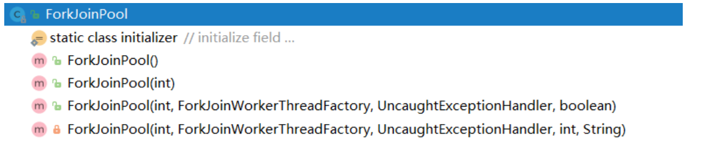

### 1.任务类型

1. 线程池的线程数设置多少合适？

   我们调整线程池中的线程数量，最主要的目的是为了充分并合理地使用CPU和内存等资源，从而最大限度地提高程序的性能。在实际工作中我们需要根据任务类型的不同选择对应的策略。

2. CPU密集型任务

   CPU密集型任务也叫**计算密集型任务**，比如加密，解密，压缩，计算等一系列需要大量耗费CPU资源的任务。**对于这样的任务最佳的线程数设置为CPU核心数的1~2倍**，如果设置过多的线程数，实际上并不会起到很好的效果，反而会因为不必要的线程切换而降低性能。

3. IO密集型任务

   IO密集型任务，比如数据库，文件的读写，网络通信等任务，这种任务的特点是**并不会特别消耗CPU资源，但是IO操作很耗时，总体会占用比较多的时间。**对于这种任务最大线程数一般会大于CPU核心数很多倍，因为IO读写速度相比于CPU的速度而言是比较慢的，如果我们设置过少的线程数，就会导致CPU频繁的等待IO操作，浪费CPU资源。设置较多的线程数，那么当一部分线程在等待IO时，他们此时不需要CPU上来计算，那么就CPU可以切换到其他线程来执行CPU计算，充分利用CPU资源。

4. 线程数计算方法

   《Java并发编程实战》的作者Brain Goetz推荐的计算方法：

   ```shell
   线程数 = CPU核心数 * （1 + 平均等待时间/平均工作时间）
   ```

   通过这个公式，我们可以计算出一个合理的线程数量，如果任务的平均等待时间长，线程数就随之增加。如果平均工作时间长，也就是CPU密集型任务，线程数就随着减少。

   太少的线程数会使得程序整体性能降低，而过多的线程也会消耗内存等其他资源。所以如果想要更准确的话，可以进行压测，监控JVM的线程情况以及CPU的负载情况，根据实际情况衡量应该创建的线程数，合理并充分利用资源。

5. 如何充分利用多核CPU的性能，计算一个很大数组中所有整数的和？

   - 单线程相加，一个for循环搞定

   - 利用多线程进行任务拆分，比如借助线程池进行分段相加，最后再把每个段的结果相加。

     

     ```java
     public class SumMultiThreads {
         //拆分的粒度
         public final static int NUM = 20000000;
     
         public static long sum(int[] arr, ExecutorService executor) throws Exception {
             long result = 0;
             int numThreads = arr.length / NUM > 0 ? arr.length / NUM : 1;
             int num = arr.length / numThreads;
             //任务分解
             SumTask[] tasks = new SumTask[numThreads];
             Future<Long>[] sums = new Future[numThreads];
             for (int i = 0; i < numThreads; i++) {
                 tasks[i] = new SumTask(arr, (i * NUM),
                         ((i + 1) * NUM));
                 // 提交Callable，返回Future，从Future.get得到返回值
                 sums[i] = executor.submit(tasks[i]);
             }
             //结果合并
             for (int i = 0; i < numThreads; i++) {
                 result += sums[i].get();
             }
     
             return result;
         }
     
         public static void main(String[] args) throws Exception {
             // 准备数组:1亿个整数
             int[] arr = Utils.buildRandomIntArray(100000000);
             //获取线程数
             int numThreads = arr.length / NUM > 0 ? arr.length / NUM : 1;
     
             System.out.printf("The array length is: %d\n", arr.length);
             // 构建线程池
             ExecutorService executor = Executors.newFixedThreadPool(numThreads);
     
             //预热：将核心线程提前创建出来
             ((ThreadPoolExecutor)executor).prestartAllCoreThreads();
     
             Instant now = Instant.now();
             // 数组求和
             long result = sum(arr, executor);
             System.out.println("执行时间："+Duration.between(now,Instant.now()).toMillis());
     
             System.out.printf("The result is: %d\n", result);
     
             executor.shutdown();
         }
     }
     
     
     public class SumTask implements Callable<Long> {
         int lo;
         int hi;
         int[] arr;
     
         public SumTask(int[] a, int l, int h) {
             lo = l;
             hi = h;
             arr = a;
         }
     
         @Override
         public Long call() { //override must have this type
             //System.out.printf("The range is [%d - %d]\n", lo, hi);
             long result = SumUtils.sumRange(arr, lo, hi);
             return result;
         }
     }
     ```

6. 分治算法

   分治算法的基本思想是讲一个规模为N的问题分解为K个规模较小的子问题，这些子问题先相互独立且与原问题性质同步。求出子问题的解，就可得到原问题的解。
   
   分治算法的步骤如下：
   
   -  分解：将要解决的问题划分成若干规模较小的同类问题
   - 求解：用较简单的方法解决规模较小的子问题
   - 合并：按原问题的要求，将子问题的解逐层合并构成原问题的解
   
   
   
7. 场景
	
   在分治算法中，子问题一般是相互独立的，因此经常通过递归调用算法来求解子问题。
   
   
   
   分治思想在很多领域都有广泛的应用，例如算法领域有分治算法（归并排序，快速排序都属于分治算法，二分查找也是一种分治算法）；大数据领域知名的计算框架MapReduce背后的思想也是分治。**Java并发包里提供了一种叫做Fork/Join的并行计算框架，就是用来支持分治解决任务的。**


### 2.Fork/Join框架介绍

传统线程池ThreadPoolExecutor有两个明显的缺点：**一是无法对大任务进行拆分，对于某个具体任务只能由单线程执行；二是工作线程从任务队列获取任务时存在竞争情况。**这两个缺点都会影响任务的执行效率。为了解决传统线程池的缺陷，Java7中引入了Fork/Join框架，并在Java8中得到广泛应用。Fork/Join框架的核心是ForkJoinPool类，它是对AbstractExecutorService类的扩展。


**ForkJoinPool允许其他线程向它提交任务，并根据设定将这些任务拆分为粒度更细的子任务，这些子任务将由ForkJoinPool内部的工作线程来并行执行，并且工作线程之间可以窃取彼此之间的任务。**

ForkJoinPool最适合计算密集型任务，而且最好是非阻塞任务。ForkJoinPool是ThreadPoolExecutor线程池的一种补充，是对计算密集型任务场景的加强。根据经验和实验，**任务总数，单任务执行耗时以及并行数都会影响到Fork/Join的性能。**所以当你使用Fork/Join框架时，你需要谨慎的评估这三个指标，最好能通过模拟对比评估，不要凭感觉冒然在生产环境中使用。


#### 2.1.ForkJoinPool

Fork/Join计算框架主要包含两部分，一部分是分治任务线程池ForkJoinPool，另一部分是分支任务ForkJoinTask.

ForkJoinPool是用于执行ForkJoinTask任务的执行池，不再是传统执行池Worker+Queue的组合模式，而是维护了一个队列数组WorkQueue[]，这样在提交任务和线程任务的时候大幅度减少碰撞。

1. 构造器：ForkJoinPool中有四个核心参数，用于控制线程池的并行数，工作线程的创建，异常处理和模式指定等。各参数解释如下

   

   - int parallelism：指定并行级别 parallelism level。ForkJoinPool将根据这个设定决定工作线程的数量，如果未设置的话，将使用Runtime.getRuntime().availableProcessors()获取本机核心数来设置并行级别。
   - ForkJoinWorkerThreadFactory factory：ForkJoinPool在创建线程时，会通过factory来创建。
   - UncaughtExceptionHandler handler：指定异常处理器，当任务在运行中出错时，将有设定的处理器处理。
   - boolean asyncMode：设置队里的工作模式。asyncMode ? FIFO_QUEUE : LIFO_QUEUE。当asyncMode为true是将使用先进先出队列，否则后进先出。**默认是后进先出。**

2. 按类型提交不同人物

   ForkJoinPool提交任务有三种方式

   

   - execute：execute提交的任务不会返回结果。ForkJoinPool不仅允许提交ForkJoinTask类型任务，还允许提交RUnnable任务。执行Runnable类型任务时，将会转换为ForkJoinTask类型任务。由于任务不需要拆分，所以这类任务无法获得任务拆分这方面的小一，不过仍然可以获得任务窃取带来的好处和性能提升。
   - invoke：invoke提交的是ForkJoinTask类型的任务，并在任务执行结束后返回泛型结果。如果提交的任务是null，将抛出空指针异常。
   - submit方法支持三种类型的任务提交：ForkJoinTask类型，Callable类型和Runnable类型。在提交任务后，将返回ForkJoinTask类型的结果。如果提交的任务是null，将抛出控指针异常，并且当任务不能按计划执行的话，将抛出任务拒绝异常。

#### 2.2.ForkJoinTask

1. ForkJoinTask是ForkJoinPool的核心之一，它是任务的实际载体，定义了任务执行时的具体逻辑和拆分逻辑。ForkJoinTask继承了Future接口，所以也可以将其看做是轻量级的Future。ForkJoinTask是一个抽象类，它的方法有很多，最核心的是fork()方法和join()方法，承载着主要的任务协调作用。一个用于任务提交，一个用于结果获取。

2. fork()提交任务

   fork()方法用于向当前任务所运行的线程池中提交任务。如果当前线程是ForkJoinWorkerThread类型，将会放入该线程的工作队列，否则放入common线程池的工作队列中。

3. join()获取任务执行结果

   join()方法用于获取任务的执行结果。调用join()时，将阻塞当前线程直到对应的子任务完成运行并返回结果。

4. 通常情况下我们不需要直接继承ForkJoinTask类，而只需要继承它的子类，Fork/Join框架提供了一下三个子类：

   - RecursiveAction：用于递归执行但不需要返回结果的任务
   - RecusiveTask：用于递归执行且需要返回结果的任务
   - CountedComplete< T >：在任务（子任务）完成执行后会触发执行一个自定义的钩子函数。
   
5. ForkJoinTask使用限制

   ForkJoinTask最适合用于纯粹的计算任务，也就是纯函数计算，计算过程中的对象都是独立的，对外部没有依赖。提交到ForkJoinPool中的任务应避免执行阻塞I/O。

6. 示例代码

   ```java
   public class LongSum extends RecursiveTask<Long> {
       // 任务拆分最小阈值
       static final int SEQUENTIAL_THRESHOLD = 10000000;
   
       int low;
       int high;
       int[] array;
   
       LongSum(int[] arr, int lo, int hi) {
           array = arr;
           low = lo;
           high = hi;
       }
   
       @Override
       protected Long compute() {
   
           //当任务拆分到小于等于阀值时开始求和
           if (high - low <= SEQUENTIAL_THRESHOLD) {
   
               long sum = 0;
               for (int i = low; i < high; ++i) {
                   sum += array[i];
               }
               return sum;
           } else {  // 任务过大继续拆分
               int mid = low + (high - low) / 2;
               LongSum left = new LongSum(array, low, mid);
               LongSum right = new LongSum(array, mid, high);
               // 提交任务
               left.fork();
               right.fork();
               //获取任务的执行结果,将阻塞当前线程直到对应的子任务完成运行并返回结果
               //long rightAns = right.compute();
               long rightAns = right.join();
               long leftAns = left.join();
               return leftAns + rightAns;
           }
       }
   }
   ```

   ```java
   public class LongSumMain {
   	// 获取逻辑处理器数量 16
   	static final int NCPU = Runtime.getRuntime().availableProcessors();
   
   	static long calcSum;
   
   	public static void main(String[] args) throws Exception {
   		//准备数组
   		int[] array = Utils.buildRandomIntArray(100000000);
   
   		Instant now = Instant.now();
   		// 单线程计算数组总和
   		calcSum = seqSum(array);
   		System.out.println("seq sum=" + calcSum);
   		System.out.println("执行时间："+ Duration.between(now,Instant.now()).toMillis());
   
   		//递归任务
   		LongSum ls = new LongSum(array, 0, array.length);
   		// 构建ForkJoinPool
     		ForkJoinPool fjp  = new ForkJoinPool(NCPU);
   
   		now = Instant.now();
   		//ForkJoin计算数组总和
   		ForkJoinTask<Long> result = fjp.submit(ls);
   		System.out.println("forkjoin sum=" + result.get());
   		System.out.println("执行时间："+ Duration.between(now,Instant.now()).toMillis());
   
   		fjp.shutdown();
   
   		now = Instant.now();
   		//并行流计算数组总和
   		Long sum = (Long) IntStream.of(array).asLongStream().parallel().sum();
   		System.out.println("IntStream sum="+sum);
   		System.out.println("执行时间："+ Duration.between(now,Instant.now()).toMillis());
   	}
   
   	static long seqSum(int[] array) {
   		long sum = 0;
   		for (int i = 0; i < array.length; ++i) {
   			sum += array[i];
   		}
   		return sum;
   	}
   }
   ```

   
#### 2.3.ForkJoinPool的工作原理

1. 大致原理

   - ForkJoinPool能提交ForkJoinTask任务：**execute/submit/invoke。**ForkJoinTask在compute()方法中还能提交ForkJoinTask子任务：**fork()**。前者称为线程池的外部提交，后者称为ForkJoinTask内部提交。

   - 当我们通过ForkJoinPool的execute/invoke/submit方法外部提交任务时，此时没有工作队列数组WorkerQueues [ ]。会创建一个工作队列数组WorkerQueues [ ]，再创建工作队列WorkerQueue并且是没有绑定ForkJoinWorkThread线程。将这个工作队列放到工作队列数组的偶数位下标上，然后将外部提交的任务ForkJoinTask放到工作队列WorkerQueue的ForkJoinTask<?>[] array数组中。

     如果外部提交任务时，已经有了工作队列数组WorkerQueues [ ]，ForkJoinPoll会根据一定的hash路由规则把任务放到一个工作队列中。

     ```java
     // 某种映射规则得到的int
     int r = ThreadLocalRandom.getProbe();
     ws = workQueues;
     // 得到workQueues中的某个workQueue
     q = ws[m & r & SQMASK];
     a = q.array；
     sun.misc.Unsafe.putOrderedObject(a, j, task);
     ```

     

   - 外部任务提交成功后，如果没有空闲线程，要创建新的ForkJoinWorkerThread工作线程来运行刚才提交的任务。此时会为这个工作线程绑定一个工作队列：`this.workQueue = pool.registerWorker(this);`新创建一个工作队列绑定到这个新创建的工作线程中：`WorkQueue w = new WorkQueue(this, wt);`。并且将这个新创建的工作队列放到WorkerQueues[ ]数组的奇数位上。

   - 然后执行ForkJoinWorkerThread的statr()启动工作线程，执行线程的run()方法。run方法中会有一个死循环，一直在扫描工作队列中的任务，扫描到任务会最终调用到task的compute()方法，也就是我们的任务逻辑。如果未扫描到任务，则会阻塞工作线程等待被唤醒。

   - 因为task中的compute()方法可能还会执行fork提交子任务，走到这里时，此时不同于外部提交任务，此时是工作线程ForkJoinWorkerThread在提交子任务。这个子任务会被放到工作线程绑定的工作队列的top位置。然后在唤醒空闲的线程或者创建新线程来执行任务。工作线程在处理自己的工作队列时，使用的是后进先出LIFO方式，即每次从top端去任务执行。

   - 在遇到join()时，如果需要join的任务尚未完成，则会先处理其他任务，并等待其完成。

   - 在既没有自己的任务，也没有刻意窃取的任务时，进入休眠。

2. 图示

   

3. 工作窃取

   ForkJoinPool与ThreadPoolExecutor有个很大的不同之处在于，ForkJoinPool存在引入了工作窃取设计，它是保证性能的关键之一。工作窃取，就是**允许空闲线程从繁忙线程的工作队列中窃取任务**。默认情况下，工作线程从它自己的双端队列的头部获取任务，但是当自己的任务为空时，线程会从其他繁忙线程双端队列的**尾部**中获取任务。这种方法，最大限度地减少了线程竞争任务的可能性。

   ForkJoinPool的大部分操作都发生在工作窃取队列（work-stealing queues）中，该队列由内部类WorkQueue实现。它是Deques的特殊形式，但仅支持三种操作方式：push，pop和poll（窃取，**尾部**获取）。在ForkJoinPool中，队列的读取有着严格的约束，push和pop仅能从其所属线程调用，而poll则可以从其他线程调用。

   并发多个线程都去偷取某个繁忙线程工作队列中的任务：CAS处理。

   

4. 工作窃取的优缺点

- 工作窃取算法的优点：充分利用线程进行并行计算，并减少了线程间的竞争。
   - 工作窃取算法的缺点：是在某些情况下还是存在竞争，比如双端队列里只有一个任务是。消耗了更多的系统资源，每个创建的线程都要再维护一个双端工作队列。

4. 工作线程总是从头部获取任务，窃取线程从尾部获取任务？

   工作线程总是从头部获取任务这样做主要是是为了提高性能，最近提交的任务可能相关的资源还在CPU缓存中还没清，通过始终选择最近提交的任务可以增加缓存的命中率，这样CPU处理器来要快一些。而窃取任务之所以从尾部获取任务，则是降低线程之间的竞争可能，因为那任务默认是从头部拿，窃取从尾部拿可以避免一部分的竞争。
   
   此外这样设计还有一种考虑，由于任务是可分割的，那么队列中较旧的任务的粒度可能最大，因为他们可能还没有被分割，而空闲的线程则更有精力来完成这些粒度更大的任务。
   
5. 工作队列WorkQueue
   
   - WorkQueue是双向队列，用于任务的有序执行。如果WorkQueue用于自己的执行线程，线程默认将会从top端选取任务来执行LIFO。
   - 每个ForkJoinWorkThread都有属于自己的WorkQueue，但不是每个WorkQueue工作队列都有对应的ForkJoinWorkThread线程。
   - 没有ForkJoinWorkThread线程的WorkQueue双端队列保存的是外部提交的任务，在WorkQueues[]双端队列数组的下标是偶数位。
   
   
   
   
   
6. ForkJoinWorkThread
   
   ForkJoinWorkThread是用于执行任务的线程，每次启动一个该Thread会自动注册一个WorkQueue并和ForkJoinWorkThread绑定。拥有ForkJoinWorkThread的WorkQueue只能在WorkQueues[ ]的奇数位。
   
   非ForkJoinWorkThread线程提交任务一般是execute/invoke/submit，ForkJoinWorkThread提交线程是用调用ForkJoinWorkTask的fork()方法。
   
7. 小结

   Fork/Join是一种基于分治算法的模型，在并发处理计算型任务时有着显著的优势。其效率的提升主要得益于两个方面：

   - 任务切分：将大的任务分割成更小粒度的小任务，让更多的线程参与执行。
   - 任务窃取：通过任务窃取，充分对利用空闲线程，减少竞争。

   在使用ForkJoinPool时需要特别注意任务的类型是否为纯函数计算类型，也就是这些任务不应该惯性状态变化或者外界的变化，这样才是最安全的做法。如果是阻塞类型任务，那么你需要谨慎评估技术方法。虽然ForkJoinPool也能处理阻塞类型任务，但可能会带来复杂的管理成本。

8. 并发一般网络IO很大，不会用ForkJoin

   

   
