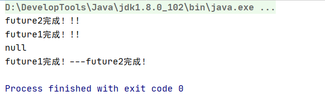
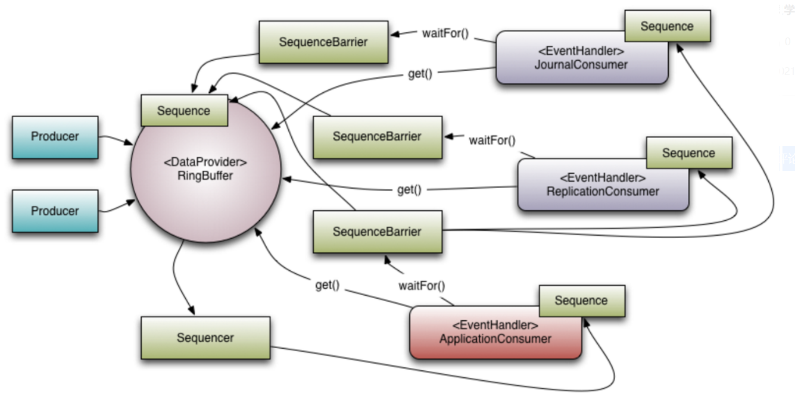

### 1.Callable，Future介绍

直接继承Thread或者实现Runnable接口都可以创建线程，但是这两种方法都有一个问题：没有返回值。因此java1.5提供了Callable接口来实现这一需求，而Future和FutureTask就是和Callable接口配合起来使用的。

Runnable要想获取任务执行结果，需要传一个参数来接收，但是这个参数还得是final，所以处理起来很麻烦。

#### 1.1.Callable

1. Callable与Runnable的区别

   ```java
   @FunctionalInterface
   public interface Runnable {
       public abstract void run();
   }
   @FunctionalInterface
   public interface Callable<V> {
       V call() throws Exception;
   }
   ```

2. Runnable的缺陷

   - 不能返回任务执行结果
   - 不能排除 checked Exception
   
3. **Callable的call方法可以有返回值，也可以声明抛出异常。**和Callable配合的有一个Future类，通过Future可以了解到任务执行情况，或者取消任务的执行，还可以获取任务执行的结果，这些功能都是Runnable做不到的，Callabel的功能要比Runnable强大。

   ```java
   // Thread结合Runnable
   new Thread(new Runnable() {
       @Override
       public void run() {
           System.out.println("通过Runnable方式执行任务");
       }
   }).start();
   
   
   // Thread结合Future结合Callable
   FutureTask task = new FutureTask(new Callable() {
       @Override
       public Object call() throws Exception {
           System.out.println("通过Callable方式执行任务");
           Thread.sleep(3000);
           return "返回任务结果";
       }
   });
   new Thread(task).start();
   System.out.println(task.get());
   ```

#### 1.2.Future

1. Future就是对于具体的Runnable或者Callable任务的执行结果进行取消，查询是否完成，获取结果等。必要时可以通过get方法获取执行结果，该方法**会阻塞当前线程直到任务获取返回结果。**

   - boolean cancel (boolean mayInterruptIfRunning)：取消任务的执行。参数指定是否立即中断任务执行，或者等等任务结束
   - boolean isCancelled () ：任务是否已经取消，任务正常完成前将其取消，则返回 true
   - boolean isDone ()： 任务是否已经完成。需要注意的是如果任务正常终止、异常或取消，都将返回true
   - V get () throws InterruptedException, ExecutionException ： 等待任务执行结束，然后获得V类型的结果。InterruptedException 线程被中断异常， ExecutionException任务执行异常，如果任务被取消，还会抛出CancellationException
   - V get (long timeout, TimeUnit unit) throws InterruptedException, ExecutionException, TimeoutException ：同上面的get功能一样，多了设置超时时间。参数timeout指定超时时间，uint指定时间的单位，在枚举类TimeUnit中有相关的定义。如果计算超时，将抛出TimeoutException

2. 利用FutureTask创建Future

   

   Future实际采用FutureTask实现，该对象相当于消费者和生产者的桥梁。消费者通过FutureTask存储任务的处理结果，更新任务的状态（未开始，正在处理，已完成等）。通过Future对象，可以阻塞式获取任务的处理结果，非租塞式的获取任务状态。

   **FutureTask实现了Runnable和Future接口，所以即可以被当作Runnable来执行，也可以被当作Future来获取Callable的返回结果。**

   

3. 使用：把Callable实例当作FutureTask构造函数的参数，生成FutureTask对象，然后把FutureTask对象作为Runnable对象，提交给线程池或者另起线程执行，最后通过FutureTask获取任务执行结果。

   ```java
   public class FutureTest1 {
       public static void main(String[] args) {
           // Callable对象
           Callable<Integer> callable = new Callable() {
               @Override
               public Integer call() throws Exception {
                   Thread.sleep(5000L);
                   return 1;
               }
           };
           // FutureTask对象
           FutureTask<Integer> task = new FutureTask<>(callable);
           // FutureTask作为task启动线程
           new Thread(task).start();
           try {
               // get会阻塞当前线程直到返回结果
               System.out.println(task.get());
               System.out.println(33333);
           } catch (InterruptedException | ExecutionException e) {
               e.printStackTrace();
           }
       }
   }
   ```

4. 使用案例：促销活动中商品信息查询

   在维护促销活动时需要查询商品信息（包括商品基本信息，商品价格，商品库存，商品图片，商品销售状态等）。这些信息分布在不同的业务中心，由不同的系统提供服务。如果采用同步方式，假设一个接口需要50ms，那么一个商品查询下来就需要200ms~300ms。如果用Future开多个线程分别到不同模块去查询，然后合并结果，这样会节省很多时间。

   ```java
   public class FutureTaskDemo2 {
   
       public static void main(String[] args) throws ExecutionException, InterruptedException {
   
           FutureTask<String> ft1 = new FutureTask<>(new T1Task());
           FutureTask<String> ft2 = new FutureTask<>(new T2Task());
           FutureTask<String> ft3 = new FutureTask<>(new T3Task());
           FutureTask<String> ft4 = new FutureTask<>(new T4Task());
           FutureTask<String> ft5 = new FutureTask<>(new T5Task());
   
           //构建线程池
           ExecutorService executorService = Executors.newFixedThreadPool(5);
           executorService.submit(ft1);
           executorService.submit(ft2);
           executorService.submit(ft3);
           executorService.submit(ft4);
           executorService.submit(ft5);
           //获取执行结果
           System.out.println(ft1.get());
           System.out.println(ft2.get());
           System.out.println(ft3.get());
           System.out.println(ft4.get());
           System.out.println(ft5.get());
   
           executorService.shutdown();
   
       }
   
       static class T1Task implements Callable<String> {
           @Override
           public String call() throws Exception {
               System.out.println("T1:查询商品基本信息...");
               TimeUnit.MILLISECONDS.sleep(5000);
               return "商品基本信息查询成功";
           }
       }
   
       static class T2Task implements Callable<String> {
           @Override
           public String call() throws Exception {
               System.out.println("T2:查询商品价格...");
               TimeUnit.MILLISECONDS.sleep(50);
               return "商品价格查询成功";
           }
       }
   
       static class T3Task implements Callable<String> {
           @Override
           public String call() throws Exception {
               System.out.println("T3:查询商品库存...");
               TimeUnit.MILLISECONDS.sleep(50);
               return "商品库存查询成功";
           }
       }
   
       static class T4Task implements Callable<String> {
           @Override
           public String call() throws Exception {
               System.out.println("T4:查询商品图片...");
               TimeUnit.MILLISECONDS.sleep(50);
               return "商品图片查询成功";
           }
       }
   
       static class T5Task implements Callable<String> {
           @Override
           public String call() throws Exception {
               System.out.println("T5:查询商品销售状态...");
               TimeUnit.MILLISECONDS.sleep(50);
               return "商品销售状态查询成功";
           }
       }
   }
   ```

5. Future的局限性

   - 注意事项：

     - 当for循环批量获取Future的结果时容易block，get方法调用时应当使用timeout限制
     - Future的生命周期不能后退，一旦完成了任务，它就永久停在了“已完成”的状态，不能重头再来。

   - 局限性：本质上说，Future是只用来获取异步任务状态和任务结果地工具。它提供了isDone来检测计算是否已经完成，通过get()方法来获取计算结果。在异步计算中，Future确实是个非常优秀的接口，但是它本身也确实存在着许多限制。

     - 并发执行多任务：**Future提供了get()方法来获取结果，并且是阻塞的。如果要获得多个Future的get结果，即使后面的任务执行完了，也只能等待执行最慢的任务执行完才能获取后面的结果。**

     - 无法对多个任务进行链式调用：如果你希望在计算任务完成后执行特定动作，比如发邮件等，Future没有提供这样的能力。

     - 无法组合多个任务：如果你运行了10个任务，并且希望在它们全部执行结束后执行特定动作，但是Future没有提供这个能力。

       
### 2.CompletionService

1. Callable + Future可以实现多个task并行执行，当我们需要多个任务的结果时，调用多个Future.get()方法时，会阻塞当前线程。**如果前面的task执行较慢时，后面的task.get()会阻塞在前面的task的get方法处，需要等待前面的task执行完后后面的task.get()方法才开始执行。**而CompletionService的主要功能就是一边生成任务，一边获取任务的返回值。让两件事分开执行。让两件事分开执行，可以实现先获取到先执行完的任务结果。

   

2. 大致原理：CompletionService内部通过阻塞队列+FutureTask实现了先获取到先执行完的任务结果。内部有一个先进先出的阻塞队列，用于保存已经执行完的Future，通过调用它的take()或者poll()方法可以获取到一个已经执行完成的Future，进而通过调用Future接口实现类的get方法获取到最终的结果。

3. 使用案例

   询价应用：向不同电商平台询价，并保存价格。采用ThreadPoolExecutore+Future的方法，异步执行询价然后再保存。先获取到执行完的任务结果。

   ```java
   @Slf4j
   public class CompletionServiceDemo {
   
       public static void main(String[] args) throws InterruptedException, ExecutionException {
   
           //创建线程池
           ExecutorService executor = Executors.newFixedThreadPool(10);
           //创建CompletionService：结合线程池创建一个CompletionService
           CompletionService<Integer> cs = new ExecutorCompletionService<>(executor);
           //异步向电商S1询价
           cs.submit(() -> getPriceByS1());
           //异步向电商S2询价
           cs.submit(() -> getPriceByS2());
           //异步向电商S3询价
           cs.submit(() -> getPriceByS3());
           //将询价结果异步保存到数据库
           for (int i = 0; i < 3; i++) {
               //从阻塞队列获取futureTask：会先获取到执行完的Future
               Integer r = cs.take().get();
               executor.execute(() -> save(r));
           }
   
           executor.shutdown();
       }
   
       private static void save(Integer r) {
           log.debug("保存询价结果:{}",r);
       }
   
       private static Integer getPriceByS1() throws InterruptedException {
           TimeUnit.MILLISECONDS.sleep(5000);
           log.debug("电商S1询价信息1200");
           return 1200;
       }
       private static Integer getPriceByS2() throws InterruptedException {
           TimeUnit.MILLISECONDS.sleep(8000);
           log.debug("电商S2询价信息1000");
           return 1000;
       }
       private static Integer getPriceByS3()  throws InterruptedException {
           TimeUnit.MILLISECONDS.sleep(3000);
           log.debug("电商S3询价信息800");
           return 800;
       }
   }
   ```

4. 实现类似Dubbo的Forking Cluster场景

   Dubbo中有一种叫做Forking的集群模式，这种集群模式下**支持并行地调用多个服务实例，只要有一个成功就返回结果。**

   ```java
   // 创建线程池
   ExecutorService executor = Executors.newFixedThreadPool(3);
   // 创建CompletionService
   CompletionService<Integer> cs = new ExecutorCompletionService<>(executor);
   // 用于保存Future对象
   List<Future<Integer>> futures = new ArrayList<>(3);
   //提交异步任务，并保存future到futures。用来后面取消任务
   futures.add(cs.submit(()->geocoderByS1()));
   futures.add(cs.submit(()->geocoderByS2()));
   futures.add(cs.submit(()->geocoderByS3()));
   
   // 获取最快返回的任务执行结果
   Integer r = 0;
   try {
     // 只要有一个成功返回，则break
     for (int i = 0; i < 3; ++i) {
       r = cs.take().get();
       //简单地通过判空来检查是否成功返回
       if (r != null) {
         break;
       }
     }
   } finally {
     //取消所有任务
     for(Future<Integer> f : futures)
       f.cancel(true);
   }
   ```

5. 应用场景总结

   - 当需要**批量提交异步任务**的时候建议使用CompletionService，CompletionService结合线程池Executor和自己内部的阻塞队列实现了先获取执行完的任务结果。让批量异步任务的管理更简单。
   - CompletionService能够让异步任务的执行结果有序化，先执行完的先进入阻塞队列。利用这个特性可以轻松实现后续处理的有序性，避免无谓的等待，同时还可以快速实现诸如Forking Cluster这样的需求。
   - 线程池隔离：CompletionService支持自己创建线程池，这种隔离性能避免几个特别耗时的任务拖垮整个应用的风险。

### 3.CompletableFuture使用详解

简单的任务用Future获取结果还好，但是我们并行提交的多个异步任务往往不是各自独立的，很多时候并行提交的任务之间存在业务上的依赖，需要一定程度上的串行关系。这个时候如果还用Future实现就不合适了。

CompletableFuture是Future接口的扩展和增强，CompletableFuture实现了Future接口并在此基础上进行了丰富地扩展，完美弥补了Future上述的种种问题。更为重要的是CompletableFuture实现了对任务的编排能力，借助这项能力我们**可以轻松地按照业务逻辑组织不同任务的运行方式，顺序。**从某种程度上说，这项能力是它的核心能力。而在以往虽然通过CountDownLatch等工具类也可以实现任务的编排，但需要复杂的逻辑处理，不仅耗费精力而且难以维护。


CompletionStage接口：执行某一个阶段，可向下执行后续阶段。

CompletableFuture的默认线程池是ForkJoinPool.commonPool()，这是一个静态的线程池，java有些地方也在用这个线程池。如果我们用CompletableFuture的时候没有指定线程池，代码里大量用这个线程池的话，可能会导致这个线程耗尽出现性能的问题。

#### 3.1.相关API

4. 相关API

   - 描述依赖关系：
     - thenApply()：将前面异步任务的结果，交给后面的Function
     - thenCompose()：用来连接两个有依赖关系的任务，结果由第二个任务返回
   - 描述and聚合干洗
     - thenCombine：任务合并，有返回值
     - thenAccepetBoth：两个任务执行完成后，将结果交给thenAccepetBoth消费，无返回值
     - runAfterBoth：两个任务都执行完成后，执行下一步操作（Runnable）
   - 描述or聚合关系：
     - applyToEither：两个任务谁执行的快，就用那一个任务的结果，有返回值。
     - acceptEither：两个任务谁执行的快，就消耗那一个结果，无返回值。
     - runAfterEither：任意一个任务执行完成，进行下一个操作（Runnable）
   - 并行执行：
     - CompletableFurure类自己也提供了anyOf()和allOf()用于支持多个CompletableFuture并行执行。

2. 创建异步操作：CompleytableFuture提供了四个静态方法来创建一个异步操作

   ```java
   public static CompletableFuture<Void> runAsync(Runnable runnable)
   public static CompletableFuture<Void> runAsync(Runnable runnable, Executor executor)
   public static <U> CompletableFuture<U> supplyAsync(Supplier<U> supplier)
   public static <U> CompletableFuture<U> supplyAsync(Supplier<U> supplier, Executor executor)
   ```

   这四个方法区别如下：

   - runAsync：以Runnable函数式接口类型为参数，没有返回结果，而supplyAsync方法Supplier函数式接口类型为参数，返回结果类型为U；**Supplier接口的get()方法是有返回值的（会阻塞）**。
   - 没有指定Executor的方法会使用ForkJoinPool.commonPool()作为他的线程池执行异步任务，如果指定线程池，则使用指定的线程池运行。
   - 默认情况下CompletableFuture会使用公共的ForkJoinPool线程池，这个线程池默认创建的线程数是CPU的核心数（也可以通过JVM参数设置ForkJoinPool线程池的线程数：JVM option:-Djava.util.concurrent.ForkJoinPool.common.parallelism）。如果所有CompletableFuture共享一个线程池，很可能造成线程耗尽，进而影响整个系统的性能。所以，强烈建议根据不同的业务类型创建不同的线程池，避免相互干扰。

   **大致原理：传入的Supply对象需要重写Supply中的get方法，我们的逻辑就写在这个get方法里，最后CompletableFuture会通过CAS将Supply.get()方法的返回值更新到CompletableFuture中的Result属性中。**

3. runAsync和supplyAsync

   ```java
   public class CompletableFutureDemo01 {
   
       public static void main(String[] args) throws ExecutionException, InterruptedException {
   
           // 无返回值Future：runAsync
           CompletableFuture<Void> future = CompletableFuture.runAsync(
                   () -> System.out.println("执行无返回结果的异步任务")
           );
   
           // 有返回值的Future：supplyAsync
           CompletableFuture<String> future1 = CompletableFuture.supplyAsync(() -> {
               // 重写的Supply的get方法
               System.out.println("执行有返回值的异步任务");
               try {
                   Thread.sleep(5000);
               } catch (InterruptedException e) {
                   e.printStackTrace();
               }
               return "Hello World";
           });
           // 无返回值
           Void aVoid = future.get();
           // 有返回值
           String result = future1.join();
           System.out.println(result);
       }
   }
   ```

   获取结果：**join和get都可以用来获取CompletableFuture异步之后的返回值，并且都会阻塞当前线程**。join()方法抛出的是uncheck异常（**即如果出现了未检查到异常，才会抛出来**），不会强制开发者抛出。get()方法抛出的是经过检查的异常（InterruptedException | ExecutionException）需要开发者手动处理。

4. 结果处理：当CompletableFuture的计算结果完成后或者抛出异常时，我们可以执行特定的的Action，主要是下面的方法。

   ```java
   public CompletableFuture<T> whenComplete(BiConsumer<? super T,? super Throwable> action)
   public CompletableFuture<T> whenCompleteAsync(BiConsumer<? super T,? super Throwable> action)
   public CompletableFuture<T> whenCompleteAsync(BiConsumer<? super T,? super Throwable> action, Executor executor)
   ```

   - Action的类型是BiConsumer<? super T,? super Throwable>，它可以处理正常的计算结果或者异常境况。

   - 方法不以Async结尾，意味着Action和Future使用相同的线程执行，而Async可能会使用其他的线程去执行（方法也可以指定线程池。如果使用相同的线程池也可能会被同一个线程选中执行。）

   - 这几个方法都会返回CompletableFuture，当Action执行完毕后它的结果返回原始的CompletableFuture的计算结果或返回异常。

   - whenComplete和exceptionally：正常的回调和异常的回调   

     ```java
     public class CompletableFutureDemo02 {
     
         public static void main(String[] args) throws ExecutionException, InterruptedException {
     
             CompletableFuture<String> future = CompletableFuture.supplyAsync(() -> {
                 try {
                     TimeUnit.SECONDS.sleep(1);
                 } catch (InterruptedException e) {
                 }
                 if (new Random().nextInt(10) % 2 == 0) {
                     int i = 12 / 0;
                 }
                 System.out.println("执行结束！");
                 return "test";
             });
     
             // 为future注册一个成功的回调函数：future正常执行成功后会回调这个方法
             future.whenComplete(new BiConsumer<String, Throwable>() {
                 @Override
                 public void accept(String t, Throwable action) {
                     System.out.println(t+" 执行完成！");
                 }
             });
     
             // 为future注册一个异常的回调函数：future出现异常的的话后会回调这个方法
             future.exceptionally(new Function<Throwable, String>() {
                 @Override
                 public String apply(Throwable t) {
                     System.out.println("执行失败：" + t.getMessage());
                     return "异常xxxx";
                 }
             }).join();
         }
     }
     ```

     

5. 结果再加工：具有依赖关系的异步任务

   1. thenApply：接收一个函数作为参数，使用该函数处理上一个CompletableFuture调用的结果，并返回一个具有处理结果的Future对象。

      ```java
      // 上一个CompletableFuture和这个CompletableFuture 使用同一个线程
      public <U> CompletableFuture<U> thenApply(Function<? super T,? extends U> fn)
      // Async结尾的方法表示异步：上一个CompletableFuture和这个CompletableFuture 使用不同的线程
      public <U> CompletableFuture<U> thenApplyAsync(Function<? super T,? extends U> fn)
      ```

      ```java
      CompletableFuture<Integer> future = CompletableFuture.supplyAsync(() -> {
          int result = 100;
          System.out.println("一阶段：" + result);
          return result;
      }).thenApply(number -> {
          int result = number * 3;
          System.out.println("二阶段：" + result);
          return result;
      });
      ```

   2. thenCompose：thenCompose的参数为一个返回CompletableFuture实例的函数，该函数的参数为先前计算步骤的结果。

      ```java
      public <U> CompletableFuture<U> thenCompose(Function<? super T, ? extends CompletionStage<U>> fn);
      public <U> CompletableFuture<U> thenComposeAsync(Function<? super T, ? extends CompletionStage<U>> fn) ;
      ```

      ```java
      public class CompletableFutureComposeDemo {
      
          public static void main(String[] args) {
      
              CompletableFuture<Integer> future = CompletableFuture.supplyAsync(
                      new Supplier<Integer>() {
                          @Override
                          public Integer get() {
                              int number = new Random().nextInt(30);
                              System.out.println("第一阶段：" + number);
                              return number;
                          }
                      }).thenCompose(
                      new Function<Integer, CompletionStage<Integer>>() {
                          @Override
                          public CompletionStage<Integer> apply(Integer param) {
                              return CompletableFuture.supplyAsync(new Supplier<Integer>() {
                                  @Override
                                  public Integer get() {
                                      int number = param * 2;
                                      System.out.println("第二阶段：" + number);
                                      return number;
                                  }
                              });
                          }
                      });
          }
      }
      ```

   3. thenApply和thenCompose的区别

      - thenApply用的是同一个CompletableFuture来处理上一步Future返回的结果
      - thenCompose将内部的CompletableFuture调用展开来并使用上一个Completable调用的结果在下一步的CompletableFurure调用中进行运算，是生成一个新的CompletableFuture。

      ```java
      CompletableFuture<String> future01 = CompletableFuture.supplyAsync(() -> "Hello");
      
      CompletableFuture<String> result01 = future01.thenApply(param -> param + " World");
      CompletableFuture<String> result02 = future01
          .thenCompose(param -> CompletableFuture.supplyAsync(() -> param + " World"));
      
      try {
          System.out.println(result01.get());
          System.out.println(result02.get());
      } catch (InterruptedException | ExecutionException e) {
          e.printStackTrace();
      }
      ```

6. 结果消费：与结果处理和结果再加工供系列函数返回一个新的CompletableFuture不同，结果消费系列函数只对结果执行Action，而不返回新的计算值。根据对结果的处理方式，结果消费函数又分为下面几种：

   - thenAccept系列：对单个结果进行消费，通过观察该洗礼函数的参数类型可知，它们是函数式接口Consumer，这个接口只有输入，没有返回值。

     ```java
     public CompletionStage<Void> thenAccept(Consumer<? super T> action);
     public CompletionStage<Void> thenAcceptAsync(Consumer<? super T> action);
     ```

     ```java
             CompletableFuture<Void> future = CompletableFuture
                     .supplyAsync(() -> {
                         int number = new Random().nextInt(10);
                         System.out.println("第一阶段：" + number);
                         return number;
                     }).thenAccept(number ->
                             System.out.println("第二阶段：" + number * 5));
     ```

   - thenAcceptBoth系列：对两个结果进行消费。当两个CompletionStage都正常完成计算的时候，就会执行提供的action消费两个异步结果。

     ```java
     public <U> CompletionStage<Void> thenAcceptBoth(CompletionStage<? extends U> other,BiConsumer<? super T, ? super U> action);
     public <U> CompletionStage<Void> thenAcceptBothAsync(CompletionStage<? extends U> other,BiConsumer<? super T, ? super U> action);
     ```

     ```java
     public class ThenAcceptBothDemo {
         public static void main(String[] args) {
             CompletableFuture<Integer> futrue1 = CompletableFuture.supplyAsync(new Supplier<Integer>() {
                 @Override
                 public Integer get() {
                     try {
                         TimeUnit.SECONDS.sleep(2);
                     } catch (InterruptedException e) {
                         e.printStackTrace();
                     }
                     System.out.println("第一阶段：" + 2);
                     return 2;
                 }
             });
     
             CompletableFuture<Integer> future2 = CompletableFuture.supplyAsync(new Supplier<Integer>() {
                 @Override
                 public Integer get() {
                     try {
                         TimeUnit.SECONDS.sleep(4);
                     } catch (InterruptedException e) {
                         e.printStackTrace();
                     }
                     System.out.println("第二阶段：" + 4);
                     return 4;
                 }
             });
     
             // 对futrue1和futrue2两个结果进行消费
             futrue1.thenAcceptBoth(future2, new BiConsumer<Integer, Integer>() {
                 @Override
                 public void accept(Integer x, Integer y) {
                     System.out.println("最终结果：" + (x + y));
                 }
             }).join();
         }
     }
     
     ```

     

   - thenRUn系列：不关心结果，只对结果执行Action。也是对任务结果的一种消费函数，与thenAccept不同的是，thenRun会在上一阶段CompletableFuture计算完成的时候执行一个Runnable，Runnable并不使用该CompletableFuture计算的结果。

     ```java
     public CompletionStage<Void> thenRun(Runnable action);
     public CompletionStage<Void> thenRunAsync(Runnable action);
     ```

     ```java
     CompletableFuture<Void> future = CompletableFuture.supplyAsync(() -> {
                 int number = new Random().nextInt(10);
                 System.out.println("第一阶段：" + number);
                 return number;
             }).thenRun(() ->
                     System.out.println("thenRun 执行"));
     ```

7. 结果组合：thenCombine方法，合并两个线程任务的结果，并进一步处理。

   ```java
   public <U,V> CompletionStage<V> thenCombine(CompletionStage<? extends U> other,BiFunction<? super T,? super U,? extends V> fn);
   public <U,V> CompletionStage<V> thenCombineAsync(CompletionStage<? extends U> other,BiFunction<? super T,? super U,? extends V> fn);
   ```

   ```java
   public class ThenCombineDemo {
       public static void main(String[] args) {
           CompletableFuture<Integer> future1 = CompletableFuture
                   .supplyAsync(new Supplier<Integer>() {
                       @Override
                       public Integer get() {
                           int number = new Random().nextInt(10);
                           System.out.println("第一阶段：" + number);
                           return number;
                       }
                   });
           CompletableFuture<Integer> future2 = CompletableFuture
                   .supplyAsync(new Supplier<Integer>() {
                       @Override
                       public Integer get() {
                           int number = new Random().nextInt(10);
                           System.out.println("第二阶段：" + number);
                           return number;
                       }
                   });
           
           // 整合两个阶段的结果
           CompletableFuture<Integer> result = future1
                   .thenCombine(future2, new BiFunction<Integer, Integer, Integer>() {
                       @Override
                       public Integer apply(Integer x, Integer y) {
                           return x + y;
                       }
                   });
           System.out.println(result.join());
       }
   }
   ```

8. 任务交互：所谓任务交互指的是将两个线程任务获取结果的速度相比较，按一定的规则进行下一步处理。

   - applyToEither：两个线程任务相比较，先获得执行结果的，就对该结果进行下一步操作。速度快的任务执行完后，速度慢的就不在执行了。

     ```java
     public <U> CompletionStage<U> applyToEither(CompletionStage<? extends T> other,Function<? super T, U> fn);
     public <U> CompletionStage<U> applyToEitherAsync(CompletionStage<? extends T> other,Function<? super T, U> fn);
     ```

     ```java
     public class ApplyToEitherDemo {
         public static void main(String[] args) {
             CompletableFuture<Integer> future1 = CompletableFuture
                     .supplyAsync(new Supplier<Integer>() {
                         @Override
                         public Integer get() {
                             int number = 2;
                             System.out.println("第一阶段start：" + number);
                             try {
                                 TimeUnit.SECONDS.sleep(number);
                             } catch (InterruptedException e) {
                                 e.printStackTrace();
                             }
                             System.out.println("第一阶段end：" + number);
                             return number;
                         }
                     });
             CompletableFuture<Integer> future2 = CompletableFuture
                     .supplyAsync(new Supplier<Integer>() {
                         @Override
                         public Integer get() {
                             int number = 4;
                             System.out.println("第二阶段start：" + number);
                             try {
                                 TimeUnit.SECONDS.sleep(number);
                             } catch (InterruptedException e) {
                                 e.printStackTrace();
                             }
                             System.out.println("第二阶段end：" + number);
                             return number;
                         }
                     });
     
             future1.applyToEither(future2, new Function<Integer, Integer>() {
                 @Override
                 public Integer apply(Integer number) {
                     System.out.println("最快结果：" + number);
                     return number * 2;
                 }
             }).join();
         }
     }
     ```

     

   - acceptEither：两个线程任务相比较，先获得执行结果的，就对该结果进行下一步消费操作。速度快的任务执行完后，速度慢的就不在执行了。

     ```java
     public CompletionStage<Void> acceptEither(CompletionStage<? extends T> other,Consumer<? super T> action);
     public CompletionStage<Void> acceptEitherAsync(CompletionStage<? extends T> other,Consumer<? super T> action);
     ```

     ```java
     public class AcceptEitherDemo {
         public static void main(String[] args) {
             CompletableFuture<Integer> future1 = CompletableFuture
                     .supplyAsync(new Supplier<Integer>() {
                         @Override
                         public Integer get() {
                             int number = 2;
                             try {
                                 TimeUnit.SECONDS.sleep(number);
                             } catch (InterruptedException e) {
                                 e.printStackTrace();
                             }
                             System.out.println("第一阶段：" + number);
                             return number;
                         }
                     });
     
             CompletableFuture<Integer> future2 = CompletableFuture
                     .supplyAsync(new Supplier<Integer>() {
                         @Override
                         public Integer get() {
                             int number = 4;
                             try {
                                 TimeUnit.SECONDS.sleep(number);
                             } catch (InterruptedException e) {
                                 e.printStackTrace();
                             }
                             System.out.println("第二阶段：" + number);
                             return number;
                         }
                     });
     
             future1.acceptEither(future2, new Consumer<Integer>() {
                 @Override
                 public void accept(Integer number) {
                     System.out.println("最快结果：" + number);
                 }
             }).join();
         }
     }
     ```

     

   - runAfterEither：两个线程任务相比较，有任何一个执行完成就进行下一步操作，不关心运行结果。

     ```java
     public CompletionStage<Void> runAfterEither(CompletionStage<?> other,Runnable action);
     public CompletionStage<Void> runAfterEitherAsync(CompletionStage<?> other,Runnable action);
     ```

     ```java
     public class RunAfterEitherDemo {
         public static void main(String[] args) {
             CompletableFuture<Integer> future1 = CompletableFuture
                     .supplyAsync(new Supplier<Integer>() {
                         @Override
                         public Integer get() {
                             int number = new Random().nextInt(5);
                             try {
                                 TimeUnit.SECONDS.sleep(number);
                             } catch (InterruptedException e) {
                                 e.printStackTrace();
                             }
                             System.out.println("第一阶段：" + number);
                             return number;
                         }
                     });
     
             CompletableFuture<Integer> future2 = CompletableFuture
                     .supplyAsync(new Supplier<Integer>() {
                         @Override
                         public Integer get() {
                             int number = new Random().nextInt(5);
                             try {
                                 TimeUnit.SECONDS.sleep(number);
                             } catch (InterruptedException e) {
                                 e.printStackTrace();
                             }
                             System.out.println("第二阶段：" + number);
                             return number;
                         }
                     });
     
             // future1和future2有任何一个完成了就执行该逻辑
             future1.runAfterEither(future2, new Runnable() {
                 @Override
                 public void run() {
                     System.out.println("已经有一个任务完成了");
                 }
             }).join();
         }
     }
     ```

   - runAfterBoth：两个线程任务都执行完成后，才进行下一步操作，不关心运行结果。

     ```java
     public CompletionStage<Void> runAfterBoth(CompletionStage<?> other,Runnable action);
     public CompletionStage<Void> runAfterBothAsync(CompletionStage<?> other,Runnable action);
     ```

     ```java
     public class RunAfterBothDemo {
         public static void main(String[] args) {
             CompletableFuture<Integer> future1 = CompletableFuture
                     .supplyAsync(new Supplier<Integer>() {
                         @Override
                         public Integer get() {
                             try {
                                 TimeUnit.SECONDS.sleep(1);
                             } catch (InterruptedException e) {
                                 e.printStackTrace();
                             }
                             System.out.println("第一阶段：1");
                             return 1;
                         }
                     });
     
             CompletableFuture<Integer> future2 = CompletableFuture
                     .supplyAsync(new Supplier<Integer>() {
                         @Override
                         public Integer get() {
                             try {
                                 TimeUnit.SECONDS.sleep(2);
                             } catch (InterruptedException e) {
                                 e.printStackTrace();
                             }
                             System.out.println("第二阶段：2");
                             return 2;
                         }
                     });
     
             future1.runAfterBoth(future2, new Runnable() {
                 @Override
                 public void run() {
                     System.out.println("上面两个任务都执行完成了。");
                 }
             }).join();
         }
     }
     ```

   - anyOf：anyOf方法的参数是多个给定的CompletableFuture，当其中的任何一个完成时，方法返回这个CompletableFuture。

     ```java
     public static CompletableFuture<Object> anyOf(CompletableFuture<?>... cfs)
     ```

     ```java
     public class AnyOfDemo {
         public static void main(String[] args) {
             CompletableFuture<String> future1 = CompletableFuture
                     .supplyAsync(() -> {
                         int time = 3;
                         try {
                             TimeUnit.SECONDS.sleep(time);
                         } catch (InterruptedException e) {
                             e.printStackTrace();
                         }
                         return time + " hello";
                     });
     
             CompletableFuture<String> future2 = CompletableFuture
                     .supplyAsync(() -> {
                         int time = 2;
                         try {
                             TimeUnit.SECONDS.sleep(time);
                         } catch (InterruptedException e) {
                             e.printStackTrace();
                         }
                         return time + " world";
                     });
     
             CompletableFuture<String> future3 = CompletableFuture
                     .supplyAsync(() -> {
                         int time = 4;
                         try {
                             TimeUnit.SECONDS.sleep(time);
                         } catch (InterruptedException e) {
                             e.printStackTrace();
                         }
                         return time + " thanks";
                     });
             CompletableFuture<Object> result = CompletableFuture.anyOf(future1, future2, future3);
             System.out.println(result.join());
         }
     }
     ```

     

   - allOf：allOf方法用来实现多CompletableFuture的都执行完成后，在再执行后续的代码。

     ```java
     public static CompletableFuture<Void> allOf(CompletableFuture<?>... cfs)
     ```

     ```java
     public class AllOfDemo {
         public static void main(String[] args) {
             CompletableFuture<String> future1 = CompletableFuture
                     .supplyAsync(() -> {
                         try {
                             TimeUnit.SECONDS.sleep(2);
                         } catch (InterruptedException e) {
                             e.printStackTrace();
                         }
                         System.out.println("future1完成！!!");
                         return "future1完成！";
                     });
     
             CompletableFuture<String> future2 = CompletableFuture
                     .supplyAsync(() -> {
                         System.out.println("future2完成！!!");
                         return "future2完成！";
                     });
     
             CompletableFuture<Void> combindFuture = CompletableFuture
                     .allOf(future1, future2);
             try {
                 // 阻塞直到多个Future都完成
                 System.out.println(combindFuture.get());
                 // 执行后续逻辑
                 System.out.println(future1.get() + "---" + future2.get());
             } catch (InterruptedException | ExecutionException e) {
                 e.printStackTrace();
             }
         }
     }
     ```

     

9. CompletableFuture常用方法总结

   


#### 3.2.案例：烧水泡茶程序

著名数学家华罗庚先生在《统筹方法》这篇文章里面介绍了一个烧水泡茶的例子，文中提到的最优工序应该是下面这样：


对于烧水泡茶这个程序，一种最优的分工方案：用两个线程T1和T2来完成烧水泡茶程序，T1负责洗水壶，烧开水，泡茶三道工序。T2负责喜茶胡，洗茶杯，拿茶叶三道工序，其中T1在执行泡茶这道工序时需要等到T2完成拿茶叶的工序。

1. 基于Future的实现

   ```java
   public class FutureTaskDemo3 {
   
       public static void main(String[] args) throws ExecutionException, InterruptedException {
           // 创建任务T2的FutureTask
           FutureTask<String> ft2 = new FutureTask<>(new T2Task());
           // 创建任务T1的FutureTask：T1要等待T2拿到茶叶，所以这里T1和T2结构不同，将t2传给了t1。
           FutureTask<String> ft1 = new FutureTask<>(new T1Task(ft2));
   
           // 线程T1执行任务ft1
           Thread T1 = new Thread(ft1);
           T1.start();
           // 线程T2执行任务ft2
           Thread T2 = new Thread(ft2);
           T2.start();
           // 等待线程T1执行结果
           System.out.println(ft1.get());
   
       }
   }
   
   // T1Task需要执行的任务：
   // 洗水壶、烧开水、泡茶
   class T1Task implements Callable<String> {
       FutureTask<String> ft2;
       // T1任务需要T2任务的FutureTask
       T1Task(FutureTask<String> ft2){
           this.ft2 = ft2;
       }
       @Override
       public String call() throws Exception {
           System.out.println("T1:洗水壶...");
           TimeUnit.SECONDS.sleep(1);
   
           System.out.println("T1:烧开水...");
           TimeUnit.SECONDS.sleep(15);
           // 获取T2线程的茶叶
           String tf = ft2.get();
           System.out.println("T1:拿到茶叶:"+tf);
   
           System.out.println("T1:泡茶...");
           return "上茶:" + tf;
       }
   }
   // T2Task需要执行的任务:
   // 洗茶壶、洗茶杯、拿茶叶
   class T2Task implements Callable<String> {
       @Override
       public String call() throws Exception {
           System.out.println("T2:洗茶壶...");
           TimeUnit.SECONDS.sleep(1);
   
           System.out.println("T2:洗茶杯...");
           TimeUnit.SECONDS.sleep(2);
   
           System.out.println("T2:拿茶叶...");
           TimeUnit.SECONDS.sleep(1);
           return "龙井";
       }
   }
   ```

2. 基于CompletableFuture实现

   ```java
   public class CompletableFutureDemo2 {
   
       public static void main(String[] args) {
   
           //任务1：洗水壶->烧开水
           CompletableFuture<Void> f1 = CompletableFuture
                   .runAsync(() -> {
                       System.out.println("T1:洗水壶...");
                       sleep(1);
   
                       System.out.println("T1:烧开水...");
                       sleep(15);
                   });
           //任务2：洗茶壶->洗茶杯->拿茶叶
           CompletableFuture<String> f2 = CompletableFuture
                   .supplyAsync(() -> {
                       System.out.println("T2:洗茶壶...");
                       sleep(1);
   
                       System.out.println("T2:洗茶杯...");
                       sleep(2);
   
                       System.out.println("T2:拿茶叶...");
                       sleep(1);
                       return "龙井";
                   });
           //任务3：任务1和任务2完成后执行：泡茶
           CompletableFuture<String> f3 = f1.thenCombine(f2, (__, tf) -> {
                       System.out.println("T1:拿到茶叶:" + tf);
                       System.out.println("T1:泡茶...");
                       return "上茶:" + tf;
                   });
           //等待任务3执行结果
           System.out.println(f3.join());
       }
   
       static void sleep(int t){
           try {
               TimeUnit.SECONDS.sleep(t);
           } catch (InterruptedException ignored) {
           }
       }
   }
   ```

### 4.Disruptor

#### 4.1.介绍

1. Disruptor主要是用于金融领域的交易撮合系统。Disruptor是英国外汇交易公司LMAX开发的一个高性能队列，研发的初衷是解决内存队列的延迟问题。基于Disruptor开发的系统单线程能支撑每秒600万订单。2010年在QCon演讲后，获得了业界关注。2011年企业应用软件专家Martin Fowler专门撰写长文介绍。同年他还获得了Oracle官方的Duke大奖。目前，包括Apache Storm，Camel，Loa4j2在内的很多知名项目都应用了Disruptor以获得高性能。**注意：这里所说的队列是系统内部的内存队列，而不是Kafka这样的分布式队列。**

   Github：https://github.com/LMAX-Exchange/disruptor

   **Disruptor实现了队列的功能，并且是一个有界队列，可以用于生产者-消费者模型。**

2. juc包下队列存在的问题

   

   - JUC下的队列大部分采用加ReentrantLock锁方式保证线程安全，在稳定性要求特别高的系统中，为了防止生产者速度过快，导致内存溢出，只能选择有界队列。比如LinkedBlockingQueue可能会不停地创建Node，有OOM的隐患，一般不会用无界队列。
   - 加锁的方式通常会严重影响性能。线程会因为竞争不到锁而被挂起，等待其他线程释放锁而唤醒，这个过程存在很大的开销，而且存在死锁的隐患。
   - 有界队列通常采用数组实现，但是采用数组实现又会引发另外一个问题，伪共享False Sharing。

#### 4.2.Disruptor设计

1. Disruptor通过以下设计来解决队列速度慢的问题

   - 环形数组结构：为了避免垃圾回收，采用数组而非链表，同时数组对处理器的缓存机制更加友好（**空间局部性原理**）。
   - 元素位置定位：数组长度2^n，通过位运算，加快定位的速度。下标采取递增的形式，不用担心index溢出的问题。index是long类型，即使100万QPS的处理速度，也需要30万年才能用完。
   - 无锁设计：每个生产者或者消费者线程，会先申请可以操作的元素在数组中的位置，申请到之后直接在该位置写入或者读取数据，
   - 利用缓存行填充解决了伪共享问题
   - 实现了基于事件驱动的生产者消费者模型（观察者模式）：消费者时刻关注着队列里有没有消息，一旦有新消息缠着，消费者线程就会立刻把他消费。

2. RingBuffer数据结构

   - 使用RingBuffer来作为队列的数据结构，RingBuffer就是一个可自定义大小的环形数组。除数组外还有一个序列号Sequence，用于指向下一个可用的元素，共生产者与消费者使用。原理图如下所示：

     

   - Disruptor要求设置数组长度为2的n次幂，再知道索引index下标的情况下，存与取数组上的元素时间复杂度只有O(1)，而这个index我们可以通过序列号与数组长度取模来计算得出，index=sequence * entries.length。但是因为长度是2的n次幂，所以可以转换成等价的位运算来提高运算效率：index=sequence & (entries.length-1)

   - 当所有位置都满了再放下一个时，就会把0号位置覆盖掉。当需要覆盖数据时，会执行一个策略，Disruptor提供多种策略，比较常用的有：
   
     - BlockingWaityStrategy：常见且默认的等待策略，当这个队列里满了，不执行覆盖而是阻塞等待。使用ReentrantLock+Condition实现阻塞，最节省CPU，但高并发场景下性能最差。适合CPU资源紧缺，吞吐量和延迟并不重要的场景。
     - SleepingWaitStrategy：会在循环中不断等待数据，先进行自旋等待如果不成成功，则使用Thread.yield()让出CPU，并最终使用LockSupport.parkNonos(1L)进行线程休眠，以确保不占用太多的CPU资源。因此这个策略会产生比较多的平均延迟，典型的应用场景就是异步日志。
     - YieldingWaitStrategy：这个策略用于低延时的场合。消费者线程会不断循环监控缓冲区变化，在循环内部使用Thread.yield()让出CPU给别人的线程执行时间。如果需要一个高性能的系统，并且对延时有比较严格的要求，可以考虑这种策略。
     - BusySpinWaitStrategy：采用死循环，消费者线程会尽最大努力监控缓冲区的变化。对延时非常苛刻的场景使用，CPU核数必须大于消费者线程数量。推荐在线程绑定到固定的CPU场景下使用。
     
#### 4.3.读写数据的流程

1. 一个生产者单线程写数据的流程

   - 申请写入m个元素
   - 若是有m个元素可以写入，则返回最大的序列号，这里主要判断是否会覆盖未读的元素
   - 若是返回的正确，则生产者开始写入元素。

   

2. 多个生产者的情况下，会遇到**“如何防止多个线程重复写同一个元素”**的问题。Disruptor的解决方法是每个线程获取不同的一段数组空间进行操作。这个通过CAS很容易达到，只需要在分配元素的时候，通过CAS判断一下这段空间是否已经分配出去了即可。但是会遇到一个新问题：**“如何方式读取的时候，读到还未写的元素”**。Disruptor在多个生产者的情况下，引入了一个与RingBuffer大小相同的buffer：**available Buffer**。当某个位置写入成功得到时候，便把availble Buffer响应的位置标记为写入成功，读取的时候会遍历avaliable Buffer来判断元素是否已经就绪。

3. 消费者读数据：多生产者写入的情况下读数据会复杂很多。

   - 申请读取到序号n
   - 若writer cursor >= n，这时仍然无法确定连续可读的最大小标。从reader cursor开始读取available Buffer，一直查到第一个不可用的元素，然后返回最大连续可读元素的位置。
   - 消费者读取元素。

   如下图所示，读线程读到下标为2的元素，三个线程Writer1/Writer2/Writer3正在向RingBuffer相应位置写数据，写线程被分配到的最大元素下标是11。读线程申请到下标从3到11的元素，判断writer cursor>=11。然后开始读取available Buffer，从3开始往后读取，发现下标为7的元素没有生产成功，于是WaitFor(11)返回6。然后消费者读取下标从3到6共计4个元素。

   
   
4. 多个生产者写数据

   - 申请写入m个元素
- 若是有m个元素可以写入，则返回最大的序列号，每个生产者会被分配一段共享的空间
   - 生产者写入元素，写入元素的同时设置available Buffer里面相应的位置，以标记自己哪些位置是已经写入成功的。

   如下图所示，Writer1和Writer2两个线程写入数组，都申请可写的数组空间，Writer1被分配了下标3到下标5的空间，Writer2被分配了下标6到下标9的空间。Writer1写入下标3位置的元素，同时把avaliable Buffer相应位置位置，标记已经写入成功，往后移一位，开始写下标4位置的元素。Writer2同样的方式，最终都写入完成。
   
   
   
#### 4.4.Disruptor的使用

##### 4.4.1.Disruptor核心概念

- RingBuffer环形缓冲区：基于数组的内存级缓存，是创建Sequence序号与定义WaitStrategy等待策略的入口。
- Disruptor总体执行入口：对RingBuffer的封装，持有RingBuffer，消费者线程池Executor，消费者之集合ConsumerRepository等引用。
- Sequence（序号分配器）：对RingBuffer中的元素进行序号标记，通过顺序递增的方式来管理进行交换的数据(事件/Event)，一个Sequence可以跟踪标识某个事件的处理进度，同时还能消除伪共享。
- Sequencer（数据传输器）：Sequencer里面包含了Sequence，是Disruptor的核心，Sequencer有两个实现类：SingleProducerSequencer(单生产者实现)、MultiProducerSequencer(多生产者实现)，Sequencer主要作用是实现生产者和消费者之间快速、正确传递数据的并发算法
- SequenceBarrier（消费者屏障）：用于控制RingBuffer的Producer和Consumer之间的平衡关系，并且决定了Consumer是否还有可处理的事件的逻辑。
- WaitStrategy（消费者等待策略）：决定了消费者如何等待生产者将Event生产进Disruptor，WaitStrategy有多种实现策略
- Event：从生产者到消费者过程中所处理的数据单元，Event由使用者自定义。
- EventHandler：由用户自定义实现，就是我们写消费者逻辑的地方，代表了Disruptor中的一个消费者的接口。
- EventProcessor：这是个事件处理器接口，实现了Runnable，处理主要事件循环，处理Event，拥有消费者的Sequence



##### 4.4.2.单生产者单消费者模式

1. 依赖

   ```java
   <dependency>
       <groupId>com.lmax</groupId>
       <artifactId>disruptor</artifactId>
       <version>3.3.4</version>
   </dependency>
   ```

2. Disruptor构造器

   ```java
   //创建disruptor
   Disruptor<OrderEvent> disruptor = new Disruptor<OrderEvent>(
       new OrderEventFactory(),
       1024 * 1024,
       Executors.defaultThreadFactory(),
       ProducerType.MULTI, //多生产者
       new YieldingWaitStrategy()  //等待策略
   );
   ```

   EventFactory：创建事件（任务）的工厂类

   ringBufferSize：容器的长度

   ThreadFactory：用于才创建执行任务的线程。

   ProductType：生产者类型：单生产者/多生产者。

   WaitStrategy：等待策略。

3. 创建OrderEvent类，这个类将会被放入环形队列中作为消息内容。

   ```java
   @Data
   public class OrderEvent {
   
       private long value;
       private String name;
   }
   
   ```

4. 创建OrderEventFactory类，用于创建OrderEvent事件。

   ```java
   public class OrderEventFactory implements EventFactory<OrderEvent> {
       @Override
       public OrderEvent newInstance() {
           return new OrderEvent();
       }
   }
   ```

5. 创建消息（事件）生产者：OrderEventProducer类

   ```java
   public class OrderEventProducer {
       //事件队列
       private RingBuffer<OrderEvent> ringBuffer;
   
       public OrderEventProducer(RingBuffer<OrderEvent> ringBuffer) {
           this.ringBuffer = ringBuffer;
       }
   
       public void onData(long value,String name) {
           // 获取事件队列 的下一个槽
           long sequence = ringBuffer.next();
           try {
               //获取消息（事件）
               OrderEvent orderEvent = ringBuffer.get(sequence);
               // 写入消息数据
               orderEvent.setValue(value);
               orderEvent.setName(name);
           } catch (Exception e) {
               // TODO  异常处理
               e.printStackTrace();
           } finally {
               System.out.println("生产者"+ Thread.currentThread().getName()
                       +"发送数据value:"+value+",name:"+name);
               //发布事件
               ringBuffer.publish(sequence);
           }
       }
   }
   ```
   
6. 创建消费者：OrderEventHandler类，并实现EventHandler< T >作为消费者
   
```java
   public class OrderEventHandler implements EventHandler<OrderEvent>, WorkHandler<OrderEvent> {
   
       @Override
       public void onEvent(OrderEvent event, long sequence, boolean endOfBatch) throws Exception {
           // TODO 消费逻辑
           System.out.println("消费者"+ Thread.currentThread().getName()
                   +"获取数据value:"+ event.getValue()+",name:"+event.getName());
       }
   
       @Override
       public void onEvent(OrderEvent event) throws Exception {
           // TODO 消费逻辑
           System.out.println("消费者"+ Thread.currentThread().getName()
                   +"获取数据value:"+ event.getValue()+",name:"+event.getName());
       }
   }
```
7. 测试
	
   ```java
   public class DisruptorDemo {
   
       public static void main(String[] args) throws Exception {
   
           //创建disruptor
           Disruptor<OrderEvent> disruptor = new Disruptor<>(
                   new OrderEventFactory(),
                   1024 * 1024,
                   Executors.defaultThreadFactory(),
                   ProducerType.SINGLE, //单生产者
                   new YieldingWaitStrategy()  //等待策略
           );
           //设置消费者用于处理RingBuffer的事件
           disruptor.handleEventsWith(new OrderEventHandler());
           disruptor.start();
   
           //创建ringbuffer容器
           RingBuffer<OrderEvent> ringBuffer = disruptor.getRingBuffer();
           //创建生产者
           OrderEventProducer eventProducer = new OrderEventProducer(ringBuffer);
           //发送消息
           for(int i=0;i<100;i++){
               eventProducer.onData(i,"Fox"+i);
           }
           
           disruptor.shutdown();
       }
   }
   ```
##### 4.4.3. 单生产者多消费者模式

1. 如果消费者是多个，只需要在调用handleEventWit方法时将多个消费者传递进去。

   ```java
   disruptor.handleEventsWith(new OrderEventHandler(),new OrderEventHandler());
   ```

2. 上面传入的消费者会重复消费每一条消息，如果想实现一条消息在有多个消费者的情况下，只会被一个消费者消费，那么需要调用handlerEventsWithWorkersPool方法。**并且消费者要实现WorkHandler接口**

   ```java
   disruptor.handleEventsWithWorkerPool(new OrderEventHandler(), new OrderEventHandler());
   ```

3. 消费者

   ```java
   public class OrderEventHandler implements EventHandler<OrderEvent>, WorkHandler<OrderEvent> {
   
       @Override
       public void onEvent(OrderEvent event, long sequence, boolean endOfBatch) throws Exception {
           // TODO 消费逻辑
           System.out.println("消费者"+ Thread.currentThread().getName()
                   +"获取数据value:"+ event.getValue()+",name:"+event.getName());
       }
   
       @Override
       public void onEvent(OrderEvent event) throws Exception {
           // TODO 消费逻辑
           System.out.println("消费者"+ Thread.currentThread().getName()
                   +"获取数据value:"+ event.getValue()+",name:"+event.getName());
       }
   }
   ```

##### 4.4.4.多生产者多消费者模式

 在实际开发中，多个生产者发送消息，多个消费者处理消息才是常态。

```java
public class DisruptorDemo2 {

    public static void main(String[] args) throws Exception {

        //创建disruptor
        Disruptor<OrderEvent> disruptor = new Disruptor<OrderEvent>(
                new OrderEventFactory(),
                1024 * 1024,
                Executors.defaultThreadFactory(),
                ProducerType.MULTI, //多生产者
                new YieldingWaitStrategy()  //等待策略
        );
        
        //设置消费者用于处理RingBuffer的事件
        //disruptor.handleEventsWith(new OrderEventHandler());
        //设置多消费者,消息会被重复消费
        //disruptor.handleEventsWith(new OrderEventHandler(),new OrderEventHandler());
        //设置多消费者,消费者要实现WorkHandler接口，一条消息只会被一个消费者消费
        disruptor.handleEventsWithWorkerPool(new OrderEventHandler(), new OrderEventHandler());

        //启动disruptor
        disruptor.start();

        //创建ringbuffer容器
        RingBuffer<OrderEvent> ringBuffer = disruptor.getRingBuffer();

        new Thread(()->{
            //创建生产者
            OrderEventProducer eventProducer = new OrderEventProducer(ringBuffer);
            // 发送消息
            for(int i=0;i<100;i++){
                eventProducer.onData(i,"Fox"+i);
            }
        },"producer1").start();

        new Thread(()->{
            //创建生产者
            OrderEventProducer eventProducer = new OrderEventProducer(ringBuffer);
            // 发送消息
            for(int i=0;i<100;i++){
                eventProducer.onData(i,"monkey"+i);
            }
        },"producer2").start();


        //disruptor.shutdown();

    }
}
```

##### 4.4.5.消费者优先级模式

1. 在实际场景中，我们通常会因为业务逻辑而形成一条消费链。比如一个消息必须由 消费者A -> 消费者B -> 消费者C 的顺序依次进行消费。在配置消费者时，可以通过 .then 方法去实现顺序消费。

   ```java
   disruptor.handleEventsWith(new OrderEventHandler())
            .then(new OrderEventHandler())
   ```

2. handleEventsWith 与 handleEventsWithWorkerPool 都是支持 .then 的，它们可以结合使用。比如可以按照 消费者A -> (消费者B 消费者C) -> 消费者D 的消费顺序

   ```java
   disruptor.handleEventsWith(new OrderEventHandler())
            .thenHandleEventsWithWorkerPool(new OrderEventHandler(), new OrderEventHandler())
            .then(new OrderEventHandler());
   ```

   

   

   

   


​    

   

