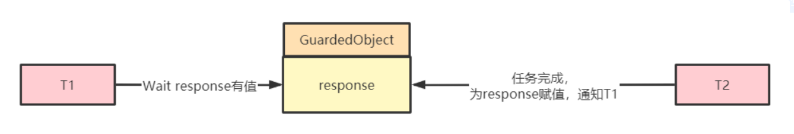
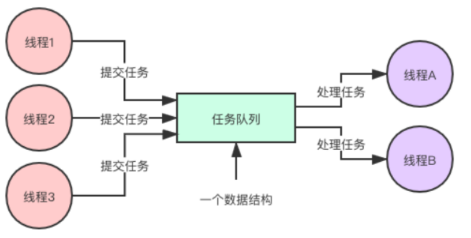
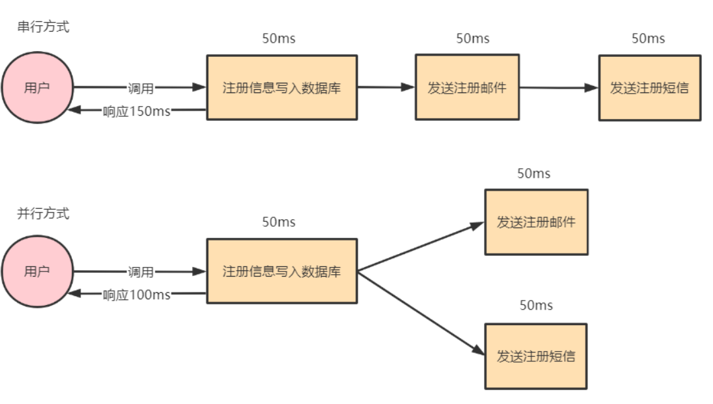
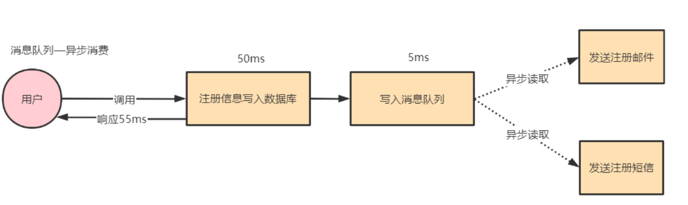
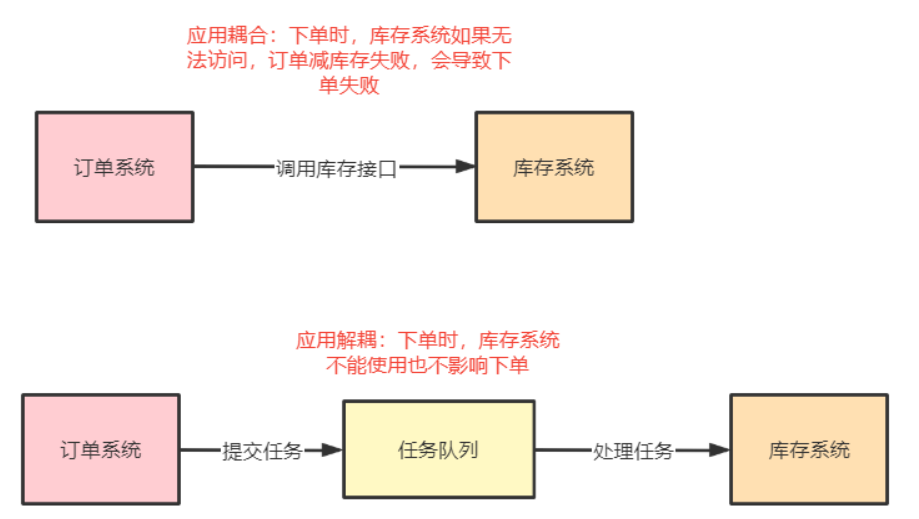
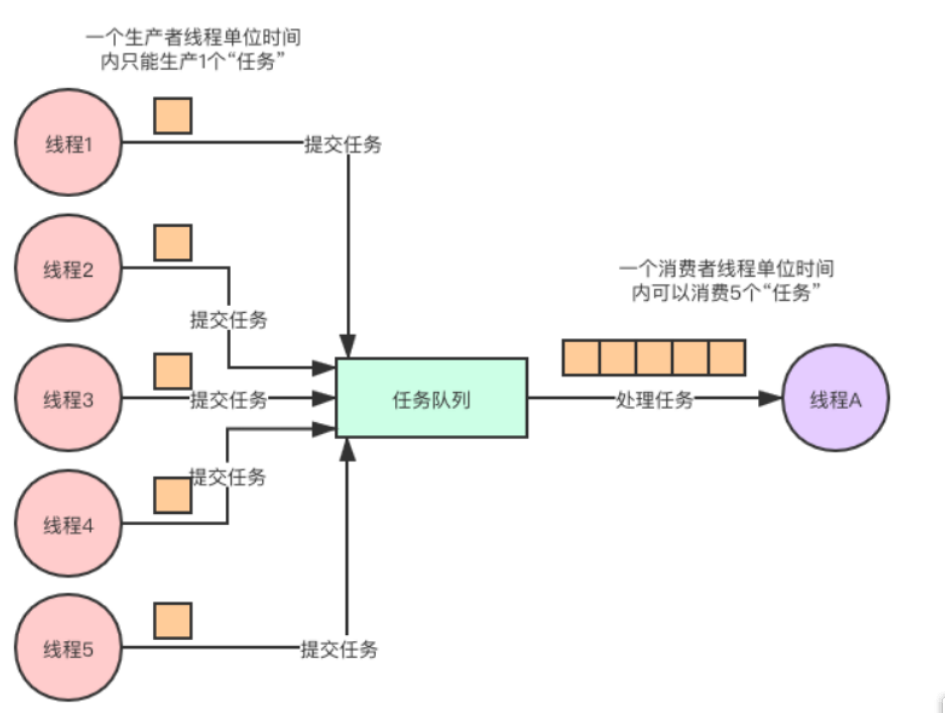
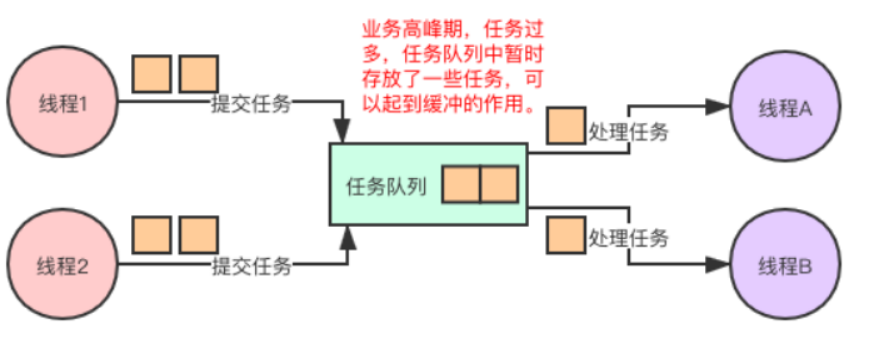
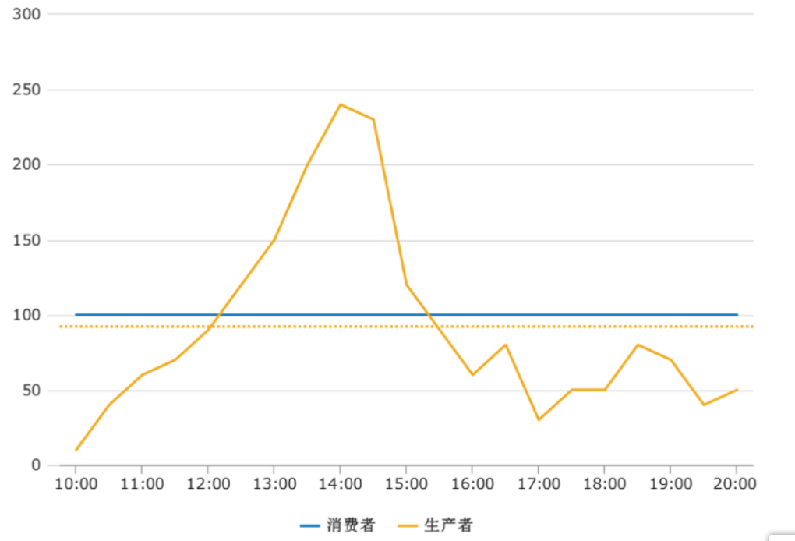
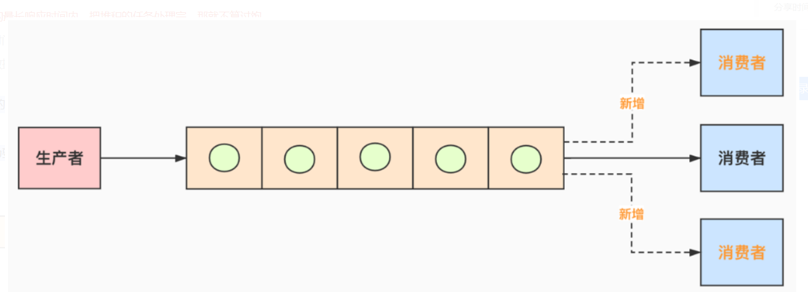
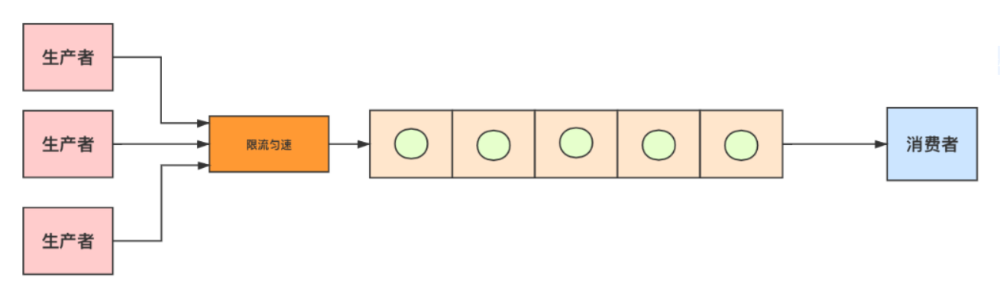

### 1.Two-phase Termination两阶段终止模式

1. 为什么不建议线程对象stop()方法停止线程

   - 使用线程对象stop()方法停止线程。stop方法会真正杀死线程，stop会导致代码逻辑不完整，一旦执行stop会立即终止当前正在运行的线程，不管线程逻辑是否完整，这是非常危险的。我们不知道子线程会在什么时候被终止，stop连基本的逻辑完整性都无法保证。而且此种操作也是非常隐蔽的，子线程执行到何处会被关闭很难定位，这为以后的维护带来了很多麻烦。比如子线程的主逻辑、资源回收、情景初始化等，但是因为stop线程了，这些就都不再执行，于是就产生了业务逻辑不完整的情况
   - 而且线程会释放持有的锁资源：即使此时线程正在同步代码块中，也会立即释放锁，会破坏同步代码块的原子逻辑。很可能造成严重的业务问题。比如原本期望synchronized同步代码块中的逻辑都是原子逻辑，不受外界线程的干扰，但是结果却出现原子逻辑被破坏的情况，这也是stop方法被废弃的一个重要原因：破坏了原子逻辑。
   - 要让Java线程自己执行完run()方法然后终止线程。

2. System.exit(int)方法停止线程：这会让整个JVM进程都终止。

3. Two-phase Termination两阶段终止模式

   将终止过程分为两个阶段，其中阶段一主要是线程T1向线程T2发送终止指令，而第二个阶段是线程T2响应终止指令。

   **Java线程进入终止状态的前提是线程先进入RUNNABLE状态**。而利用Java线程中断机制的interrupt()方法，可以让线程从休眠状态转为RUNNABLE状态。

   - 当Thread实例对象调用interrupt()方法后，会将线程对象的中断标志位置为true。**如果线程正在执行可中断方法，处于阻塞等待状态的话，interrupt()会中断阻塞状态，使线程回到Runnable状态，并且再清除中断标志位，重新置为false。**当然如果一个线程已经死亡，尝试调用其interrupt()方法时，会被忽略。

   从RUNNABLE状态转换到终止状态，优雅的方式是**让Java线程自己执行完run()方法**，所以我们采用的方法是设置一个标志位，然后线程会在合适的时机检查这个标志位，如果发现符合终止条件，执行完run()方法结束线程。

   两阶段终止模式是一种应用很广泛的并发设计模式，在Java语言中使用两阶段终止模式来优雅地终止线程。需要注意两个关键点：一是仅检查终止标志位是不够的，因为线程的状态可能处于休眠态。另一个是仅检查线程的中断状态也是不够的，因为我们依赖的第三方类库很可能没有正确处理中断异常。例如第三方类库在捕获到Thread.sleep()方法抛出的中断异常后，没有重新设置线程的中断状态，那么就会导致线程不能够正常终止。所以我们可以自定义线程的终止标志位用于终止线程。

4. 代码演示：

   ```java
   /**
    * 描述：通过中断标志位来优雅地停止线程，即将中断标志位作为开关
    *
    * @author txl
    * @date 2022-03-10 00:04
    */
   public class CloseThreadGraceful2 {
       private static class Worker extends Thread {
           @Override
           public void run() {
               while (true) {
                   if (Thread.interrupted()) {
                       //如果中断标志位为true，跳出循环，很快执行完线程任务
                       break;
                   }
               }
               System.out.println("break-opera after while");
           }
       }
   
       public static void main(String[] args) throws InterruptedException {
           Worker worker = new Worker();
           worker.start();
   
           Thread.sleep(10_000);
   
           worker.interrupt();
       }
   }
   ```

5. 代码演示：调用interrupt()方法**先为阻塞着的thread1设置中断标志位**，然后打断其阻塞状态恢复到RUNNABLE，再清除中断标志位。

   ```java
   public class InterruptTest3 {
       public static void main(String[] args) {
           // thread1线程一运行着，因为调用可中断方法sleep处于阻塞状态：所以调用interrupt()方法后，会清除中断标志位
           Thread thread1 = new Thread("thread1") {
               @Override
               public void run() {
                   try {
                       // 调用可中断方法：处于阻塞等待状态；被interrupt打断时会抛出异常
                       TimeUnit.SECONDS.sleep(5000);
                   } catch (InterruptedException e) {
                       // 清除了中断标志位：捕获异常后，重新回到就绪队列。被调度后执行catch中的代码
                       System.out.println(this.getName() + " after interrupt, inner中断标志位：" + this.isInterrupted());
                   }
               }
           };
           thread1.start();
   
           try {
               // 主线程休眠1s，为了thread1充分启动起来
               TimeUnit.SECONDS.sleep(1);
           } catch (InterruptedException e) {
               e.printStackTrace();
           }
   
           // 此时thread1已经开始sleep
           System.out.println(thread1.getName() + " before interrupt, 中断标志位：" + thread1.isInterrupted());
           // 打断thread1：或者说为thread1打上中断标志
           thread1.interrupt();
           // 还是打上了中断标志位：
           System.out.println(thread1.getName() + " after interrupt, outer中断标志位：" + thread1.isInterrupted());
       }
   }
   ```

   

   注意：因为是先设置中断标志位，然后再打断阻塞状态并清除中断标志位。所以调用Interrupt方法后，在main线程直接打印thread1.isInterrupted()此时thread1线程还没有来的及重置中断标志位，所以打印的是true。

   

### 2.避免共享的设计模式

   Immutability模式，Copy-on-Write模式，Thread-Specific Storage模式本质上都是为了避免共享。

- 使用时需要注意Immutability模式的属性不可变性
- Copy-on-Write模式需要注意拷贝的性能问题
- Thread-Specific Storage模式需要注意异步执行问题。

#### 2.1.Immutability不变性模式

1.   “多个线程同时读写同一共享变量存在并发问题”，这里的必要条件之一是读写，如果只有读，而没有写，是没有并发问题的。解决并发问题，其实最简单的办法就是让共享变量只有读操作，而没有写操作。这个办法如此重要，以至于被上升到了一种解决并发问题的设计模式：不变性（Immutability）模式。所谓不变性，简单来讲，就是对象一旦被创建之后，状态就不再发生变化。换句话说，就是变量一旦被赋值，就不允许修改了（没有写操作）；没有修改操作，也就是保持了不变性。

2. 如何实现

   将一个类所有的属性都设置成 final 的，并且只允许存在只读方法，那么这个类基本上就具备不可变性了。更严格的做法是这个类本身也是 final 的，也就是不允许继承。jdk中很多类都具备不可变性，例如经常用到的 String 和 Long、Integer、Double 等基础类型的包装类都具备不可变性，这些对象的线程安全性都是靠不可变性来保证的。它们都严格遵守了不可变类的三点要求：类和属性都是 final 的，所有方法均是只读的。

3. 使用 Immutability 模式的注意事项

   在使用 Immutability 模式的时候，需要注意以下两点：

   - 对象的所有属性都是 final 的，并不能保证不可变性；
   - 不可变对象也需要正确发布。

   在使用 Immutability 模式的时候一定要确认保持不变性的边界在哪里，是否要求**属性对象**也具备不可变性。下面的代码中，Bar 的属性 foo 虽然是 final 的，依然可以通过 setAge() 方法来设置 foo 的属性 age。

   ```java
   class Foo{
     int age=0;
     int name="abc";
   }
   final class Bar {
     final Foo foo;
     void setAge(int a){
       foo.age=a;
     }
   }
   ```

   可变对象虽然是线程安全的，但是并不意味着引用这些不可变对象的对象就是线程安全的。下面的代码中，Foo 具备不可变性，线程安全，但是类 Bar 并不是线程安全的，类 Bar 中持有对 Foo 的引用 foo，对 foo 这个引用的修改在多线程中并不能保证可见性和原子性。

   ```java
   //Foo线程安全
   final class Foo{
     final int age=0;
     final String name="abc";
   }
   //Bar线程不安全
   class Bar {
     Foo foo;
     void setFoo(Foo f){
       this.foo=f;
     }
   }
   ```


#### 2.2.Copy-on-Write写时复制模式

1. Java 里 String 在实现 replace() 方法的时候，并没有更改原字符串里面 value[]数组的内容，而是创建了一个新字符串，这种方法在解决不可变对象的修改问题时经常用到。它本质上是一种 Copy-on-Write 方法。所谓 Copy-on-Write，经常被缩写为 COW 或者CoW，顾名思义就是写时复制。

   不可变对象的写操作往往都是使用 Copy-on-Write 方法解决的，当然 Copy-on-Write 的应用领域并不局限于 Immutability 模式。Copy-on-Write 才是最简单的并发解决方案，很多人都在无意中把它忽视了。它是如此简单，以至于 Java 中的基本数据类型 String、Integer、Long 等都是基于 Copy-on-Write 方案实现的。

   Copy-on-Write 缺点就是消耗内存，每次修改都需要复制一个新的对象出来，好在随着自动垃圾回收（GC）算法的成熟以及硬件的发展，这种内存消耗已经渐渐可以接受了。所以在实际工作中，如果写操作非常少（读多写少的场景），可以尝试使用 Copy-on-Write。

2. 应用场景：**读多写少**

   在Java中，**CopyOnWriteArrayList** 和 **CopyOnWriteArraySet** 这两个 Copy-on-Write 容器，它们背后的设计思想就是 Copy-on-Write；通过 Copy-on-Write 这两个容器实现的读操作是无锁的，由于无锁，所以将读操作的性能发挥到了极致。

   Copy-on-Write 在操作系统领域也有广泛的应用。类 Unix 的操作系统中创建进程的 API 是 fork()，传统的 fork() 函数会创建父进程的一个完整副本，例如父进程的地址空间现在用到了 1G 的内存，那么 fork() 子进程的时候要复制父进程整个进程的地址空间（占有 1G 内存）给子进程，这个过程是很耗时的。而 Linux 中fork() 子进程的时候，并不复制整个进程的地址空间，而是让父子进程共享同一个地址空间；只用在父进程或者子进程需要写入的时候才会复制地址空间，从而使父子进程拥有各自的地址空间。

   Copy-on-Write 最大的应用领域还是在函数式编程领域。函数式编程的基础是不可变性（Immutability），所以函数式编程里面所有的修改操作都需要 Copy-on-Write 来解决。像一些RPC框架还有服务注册中心，也会利用Copy-on-Write设计思想维护服务路由表。路由表是典型的读多写少，而且路由表对数据的一致性要求并不高，一个服务提供方从上线到反馈到客户端的路由表里，即便有 5 秒钟延迟，很多时候也都是能接受的。

#### 2.3.Thread-Specific Storage线程本地存储模式

1. Thread-Specific Storage（线程本地存储） 模式是一种即使只有一个入口，也会在内部为每个线程分配特有的存储空间的模式。**在 Java 标准类库中，ThreadLocal 类实现了该模式。**线程本地存储模式本质上是一种**避免共享的方案，由于没有共享，所以自然也就没有并发问题。**如果你需要在并发场景中使用一个线程不安全的工具类，最简单的方案就是避免共享。避免共享有两种方案，一种方案是将这个工具类作为局部变量使用，另外一种方案就是线程本地存储模式。这两种方案，局部变量方案的缺点是在高并发场景下会频繁创建对象，而线程本地存储方案，每个线程只需要创建一个工具类的实例，所以不存在频繁创建对象的问题。

2. 应用场景：SimpleDateFormat 不是线程安全的，那如果需要在并发场景下使用它，有一个办法就是用 ThreadLocal 来解决。

   ```java
   static class SafeDateFormat {
     //定义ThreadLocal变量
     static final ThreadLocal<DateFormat> tl=ThreadLocal.withInitial(
       ()-> new SimpleDateFormat("yyyy-MM-dd HH:mm:ss"));
         
     static DateFormat get(){
       return tl.get();
     }
   }
   //不同线程执行下面代码，返回的df是不同的
   DateFormat df = SafeDateFormat.get()；
   ```

3. 注意：在线程池中使用ThreadLocal 需要避免内存泄漏和线程安全的问题

   ```java
   ExecutorService es;
   ThreadLocal tl;
   es.execute(()->{
     //ThreadLocal增加变量
     tl.set(obj);
     try {
       // 省略业务逻辑代码
     }finally {
       //手动清理ThreadLocal 
       tl.remove();
     }
   });
   ```


### 3.多线程版本的if模式

Guarded Suspension模式和Balking模式属于多线程版本的if模式

- Guarded Suspension模式需要注意性能。

- Balking模式需要注意竞态问题。

#### 3.1.Guarded Suspension守护-挂起模式

1. Guarded Suspension 模式是通过让线程等待来保护实例的安全性，即守护-挂起模式。在多线程开发中，常常为了提高应用程序的并发性，会将一个任务分解为多个子任务交给多个线程并行执行，而多个线程之间相互协作时，仍然会存在一个线程需要等待另外的线程完成后继续下一步操作。而Guarded Suspension模式可以帮助我们解决上述的等待问题。

   Guarded Suspension 模式允许多个线程对实例资源进行访问，但是实例资源需要对资源的分配做出管理。Guarded Suspension 模式也常被称作 Guarded Wait 模式、Spin Lock 模式（因为使用了 while 循环去等待），它还有一个更形象的非官方名字：多线程版本的 if。

2. 介绍

   - 有一个结果需要从一个线程传递到另一个线程，让他们关联同一个 GuardedObject 
   - 如果有结果不断从一个线程到另一个线程那么可以使用消息队列
   - JDK 中，join 的实现、Future 的实现，采用的就是此模式 
   - 因为要等待另一方的结果，因此归类到同步模式
   - 等待唤醒机制的规范实现。此模式依赖于Java线程的阻塞唤醒机制：
     - sychronized+wait/notify/notifyAll
     - reentrantLock+Condition(await/singal/singalAll)
     - cas+park/unpark   

3. 阻塞唤醒机制底层原理： linux pthread_mutex_lock/unlock pthread_cond_wait/singal

   解决线程之间的协作不可避免会用到阻塞唤醒机制

   

4. 代码演示

   ```java
   public class GuardedObject<T> {
       //结果
       private T obj;
       //获取结果
       public T get(){
           synchronized (this){
               //没有结果等待   防止虚假唤醒
               while (obj==null){
                   try {
                       this.wait();
                   } catch (InterruptedException e) {
                       e.printStackTrace();
                   }
               }
               return obj;
           }
       }
       //产生结果
       public void complete(T obj){
           synchronized (this){
               //获取到结果，给obj赋值
               this.obj = obj;
               //唤醒等待结果的线程
               this.notifyAll();
           }
       }
   }
   ```

#### 3.2.Balking模式——不需要就算了

1. Balking是“退缩不前”的意思。如果现在不适合执行这个操作，或者没必要执行这个操作，就停止处理，直接返回。当流程的执行顺序依赖于某个共享变量的场景，可以归纳为**多线程if模式**。Balking 模式常用于一个线程发现另一个线程已经做了某一件相同的事，那么本线程就无需再做了，直接结束返回。

   Balking模式是一种多个线程执行同一操作A时可以考虑的模式；在某一个线程B被阻塞或者执行其他操作时，其他线程同样可以完成操作A，而当线程B恢复执行或者要执行操作A时，因A已被执行，而无需线程B再执行，从而提高了B的执行效率。Balking模式和Guarded Suspension模式一样，存在守护条件，如果守护条件不满足，则中断处理；这与Guarded Suspension模式不同，Guarded Suspension模式在守护条件不满足的时候会一直等待至可以运行。

2. 常见的应用场景

   - sychronized轻量级锁膨胀逻辑， 只需要一个线程膨胀获取monitor对象  
   - DCL单例实现
   - 服务组件的初始化

3. 如何实现Balking模式

   需要快速放弃的一个最常见的场景是各种编辑器提供的自动保存功能。自动保存功能的实现逻辑一般都是隔一定时间自动执行存盘操作，存盘操作的前提是文件做过修改，如果文件没有执行过修改操作，就需要快速放弃存盘操作。

   - 锁机制 （synchronized reentrantLock）

   - cas

   - 对于共享变量不要求原子性的场景，可以使用volatile

4. 代码演示

   ```java
   boolean changed=false;
   // 自动存盘操作
   void autoSave(){
     synchronized(this){
       if (!changed) {
         return;
       }
       changed = false;
     }
     // 执行存盘操作
     // 省略且实现
     this.execSave();
   }
   // 编辑操作
   void edit(){
     // 省略编辑逻辑
     ......
     change();
   }
   // 改变状态
   void change(){
     synchronized(this){
       changed = true;
     }
   }
   Balking 模式有一个非常典型的应用场景就是单次初始化。
   boolean inited = false;
   synchronized void init(){
       if(inited){
         return;
       }
       //省略doInit的实现
       doInit();
       inited=true;
   }
   ```

### 4.多线程分工模式

Thread-Per-Message 模式、Worker Thread 模式和生产者 - 消费者模式属于多线程分工模式。

- Thread-Per-Message 模式需要注意线程的创建，销毁以及是否会导致OOM。
- Worker Thread 模式需要注意死锁问题，提交的任务之间不要有依赖性。
- 生产者 - 消费者模式可以直接使用线程池来实现

#### 4.1.Thread-Per-Message 模式

1. **应用场景**

   Thread-Per-Message 模式的一个最经典的应用场景是**网络编程里服务端的实现**，服务端为每个客户端请求创建一个独立的线程，当线程处理完请求后，自动销毁，这是一种最简单的并发处理网络请求的方法。Thread-Per-Message 模式就是为每个任务分配一个独立的线程，这是一种最简单的分工方法。

2. 代码演示

   ```java
   final ServerSocketChannel  ssc= ServerSocketChannel.open().bind(new InetSocketAddress(8080));
   //处理请求    
   try {
     while (true) {
       // 接收请求
       SocketChannel sc = ssc.accept();
       // 每个请求都创建一个线程
       new Thread(()->{
         try {
           // 读Socket
           ByteBuffer rb = ByteBuffer.allocateDirect(1024);
           sc.read(rb);
           //模拟处理请求
           Thread.sleep(2000);
           // 写Socket
           ByteBuffer wb = (ByteBuffer)rb.flip();
           sc.write(wb);
           // 关闭Socket
           sc.close();
         }catch(Exception e){
           throw new UncheckedIOException(e);
         }
       }).start();
     }
   } finally {
     ssc.close();
   }     
   ```

3. Thread-Per-Message 模式作为一种最简单的分工方案，Java 中使用会存在性能缺陷。在 Java 中的线程是一个重量级的对象，创建成本很高，一方面创建线程比较耗时，另一方面线程占用的内存也比较大。所以为每个请求创建一个新的线程并不适合高并发场景。为了解决这个缺点，Java 并发包里提供了线程池等工具类。

   在其他编程语言里，例如 Go 语言，基于轻量级线程实现 Thread-Per-Message 模式就完全没有问题。对于一些并发度没那么高的异步场景，例如定时任务，采用 Thread-Per-Message 模式是完全没有问题的。

#### 4.2.Worker Thread模式——如何避免重复创建线程

1. 要想有效避免线程的频繁创建、销毁以及 OOM 问题，就不得不提 Java 领域使用最多的 Worker Thread 模式。Worker Thread 模式可以类比现实世界里车间的工作模式：车间里的工人，有活儿了，大家一起干，没活儿了就聊聊天等着。Worker Thread 模式中 Worker Thread 对应到现实世界里，其实指的就是车间里的工人。

2. Worker Thread 模式实现：之前的服务端例子用线程池实现

   ```java
   ExecutorService es = Executors.newFixedThreadPool(200);
   final ServerSocketChannel ssc = ServerSocketChannel.open().bind(new InetSocketAddress(8080));
   //处理请求    
   try {
     while (true) {
       // 接收请求
       SocketChannel sc = ssc.accept();
       // 将请求处理任务提交给线程池
       es.execute(()->{
         try {
           // 读Socket
           ByteBuffer rb = ByteBuffer.allocateDirect(1024);
           sc.read(rb);
           //模拟处理请求
           Thread.sleep(2000);
           // 写Socket
           ByteBuffer wb = 
             (ByteBuffer)rb.flip();
           sc.write(wb);
           // 关闭Socket
           sc.close();
         }catch(Exception e){
           throw new UncheckedIOException(e);
         }
       });
     }
   } finally {
     ssc.close();
     es.shutdown();
   }   
   ```

3. 应用场景

     Worker Thread 模式能避免线程频繁创建、销毁的问题，而且能够限制线程的最大数量。Java 语言里可以直接使用线程池来实现 Worker Thread 模式，线程池是一个非常基础和优秀的工具类，甚至有些大厂的编码规范都不允许用 new Thread() 来创建线程，必须使用线程池。

#### 4.3.生产者 - 消费者模式——用流水线的思想提高效率

1. Worker Thread 模式类比的是工厂里车间工人的工作模式。但其实在现实世界，工厂里还有一种流水线的工作模式，类比到编程领域，就是生产者 - 消费者模式。

   生产者 - 消费者模式的核心是一个任务队列，生产者线程生产任务，并将任务添加到任务队列中，而消费者线程从任务队列中获取任务并执行。

   

2. 代码演示

   ```java
   public class Test {
       public static void main(String[] args) {
           // 生产者线程池
           ExecutorService producerThreads = Executors.newFixedThreadPool(3);
           // 消费者线程池
           ExecutorService consumerThreads = Executors.newFixedThreadPool(2);
           // 任务队列，长度为10
           ArrayBlockingQueue<Task> taskQueue = new ArrayBlockingQueue<Task>(10);
           // 生产者提交任务
           producerThreads.submit(() -> {
               try {
                   taskQueue.put(new Task("任务"));
               } catch (InterruptedException e) {
                   e.printStackTrace();
               }
           });
           // 消费者处理任务
           consumerThreads.submit(() -> {
               try {
                   Task task = taskQueue.take();
               } catch (InterruptedException e) {
                   e.printStackTrace();
               }
           });
       }
       static class Task {
           // 任务名称
           private String taskName;
           public Task(String taskName) {
               this.taskName = taskName;
           }
       }
   }
   ```

3. 生产者 - 消费者模式的优点

   - 支持异步处理：

     - 用户注册后，需要发注册邮件和注册短信。传统的做法有两种 1.串行的方式；2.并行方式。

       

     - 引入消息队列，将不是必须的业务逻辑异步处理

       

   - 解耦

     - 场景：用户下单后，订单系统需要通知库存系统扣减库存。

     

     - 可以消除生产者生产与消费者消费之间速度差异

       

   

4. 在计算机当中，创建的线程越多，CPU进行上下文切换的成本就越大，所以我们在编程的时候创建的线程并不是越多越好，而是适量即可，采用生产者和消费者模式就可以很好的支持我们使用适量的线程来完成任务。

   如果在某一段业务高峰期的时间里生产者“生产”任务的速率很快，而消费者“消费”任务速率很慢，由于中间的任务队列的存在，也可以起到缓冲的作用，我们在使用MQ中间件的时候，经常说的削峰填谷也就是这个意思。

   

   

#### 4.4.过饱问题解决方案

1. 在实际生产项目中会有些极端的情况，导致生产者/消费者模式可能出现过饱的问题。单位时间内，生产者生产的速度大于消费者消费的速度，导致任务不断堆积到阻塞队列中，队列堆满只是时间问题。

   思考：是不是只要保证消费者的消费速度一直比生产者生产速度快就可以解决过饱问题？

   

2. 我们只要在业务可以容忍的最长响应时间内，把堆积的任务处理完，那就不算过饱。什么是业务容忍的最长响应时间？

   比如埋点数据统计前一天的数据生成报表，第二天老板要看的，你前一天的数据第二天还没处理完，那就不行，这样的系统我们就要保证，消费者在24小时内的消费能力要比生产者高才行。

3. 场景一：消费者每天能处理的量比生产者生产的少；如生产者每天1万条，消费者每天只能消费5千条。

   解决办法：消费者加机器

   原因：生产者没法限流，因为要一天内处理完，只能消费者加机器

   

4. 场景二：消费者每天能处理的量比生产者生产的多。系统高峰期生产者速度太快，把队列塞爆了

   解决办法：适当的加大队列

   原因：消费者一天的消费能力已经高于生产者，那说明一天之内肯定能处理完，保证高峰期别把队列塞满就好

   

5. 场景三：消费者每天能处理的量比生产者生产的多。条件有限或其他原因，队列没法设置特别大。系统高峰期生产者速度太快，把队列塞爆了

   解决办法：生产者限流

   原因：消费者一天的消费能力高于生产者，说明一天内能处理完，队列又太小，那只能限流生产者，让高峰期塞队列的速度慢点

   