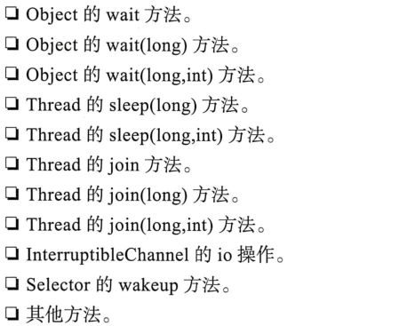
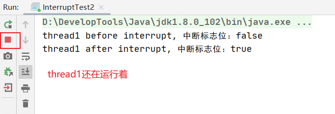
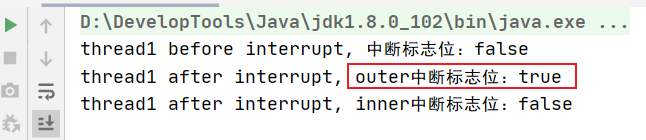
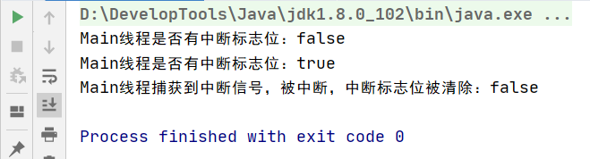
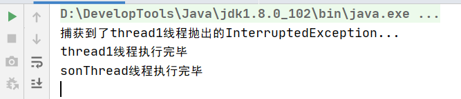
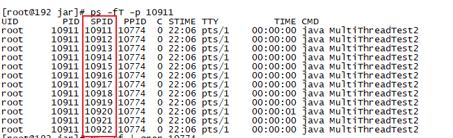
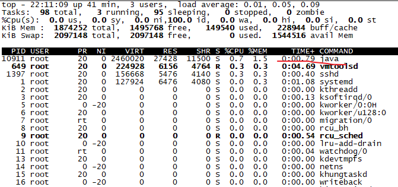

# 2.Thread API

## 1.sleep和yield

### 1.1.sleep()

1. sleep方法：是线程类的静态方法，当前执行的线程休眠n毫秒，主动放弃了CPU时间片的使用，将CPU让渡给其他线程。

   它的状态也由RUNNABLE状态变成TIMED_WAITING状态，即进入一个有时限的等待状态（因为sleep方法是要传递一个时间参数的，时间到了就停止等待）。当该线程休眠结束时，会重新进入就绪队列，变成RUNNABLE状态，等待下一次被调度。

   TIMED_WAITING状态是Java特有的，Java自身引入的线程机制，操作系统层面的线程没有此状态。

2. 代码演示：

   ```java
   @Slf4j(topic = "c.SleepTest1")
   public class SleepTest1 {
       public static void main(String[] args) throws InterruptedException {
           Thread t1 = new Thread("t1") {
               @SneakyThrows
               @Override
               public void run() {
                   Thread.sleep(2000);
   
                   // 休眠结束后，进入RUNNABLE状态
                   log.debug("sleep结束的状态： {}", this.getState());
               }
           };
   
           // start之前的状态
           log.debug("sleep之前的状态：{}", t1.getState());
   
           t1.start();
   
           // 主线程休眠1s：让t1线程启动起来
           Thread.sleep(1000);
           log.debug("sleep时的状态：{}", t1.getState());
       }
   }
   ```

   

3. sleep()是一个可中断方法，通过interrupt()方法可以在其他线程中打断因为sleep()正在阻塞等待的线程，被打断的线程会从TIMED_WAITING状态变成Runnable状态。

   所谓的打断其实就是把正在休眠阻塞的线程唤醒，唤醒的方式就是休眠的线程会在sleep()方法中抛出一个**InterruptException异常**。然后线程回到就绪队列，我们可以通过异常，然后再catch块中写上后续的逻辑。

   建议用TimeUnit类中的sleep方法代替Thread的sleep来获得更好的可读性。

   ```java
   public class InterruptTest1 {
       public static void main(String[] args) {
           Thread thread = new Thread("测试线程1") {
               @Override
               public void run() {
                   try {
                       TimeUnit.SECONDS.sleep(3);
                   } catch (InterruptedException e) {
                       // ②捕获到中断信号，即捕获到异常，线程中断了阻塞状态，后面做什么具体看代码怎么写
                       System.out.println(getName() + " 被中断了，线程状态：" + getState());
                   }
               }
           };
           thread.start();
   
           try {
               // 主线程休眠1s，为了thread充分启动起来
               TimeUnit.SECONDS.sleep(1);
               // 此时测试线程1已经开始sleep
               System.out.println(thread.getName() + " 运行阻塞中，线程状态：" + thread.getState());
           } catch (InterruptedException e) {
               e.printStackTrace();
           }
   
           // ①在主线程中打断测试线程1，相当于发出一个中断信号，会导致测试线程1中sleep()代码出抛出异常，
           thread.interrupt();
       }
   }
   ```

4. sleep的一个应用：

   如果有需要while(true)这种死循环的代码，那么要在其中加上sleep，不然while(true)空转会非常浪费cpu，加上sleep会在休眠时间内将cpu让渡给其他程序使用。

   ```java
   public static void main(String[] args) {
       while (true) {
           try {
               Thread.sleep(50);
           } catch (InterruptedException e) {
               e.printStackTrace();
           }
       }
   }
   ```

### 1.2.yield()

1. 调用yield当前线程会释放占有的CPU执行权，并**提示**调度器，当前线程可以让渡出cpu的使用权：如果CPU资源很紧张，当前线程执行yield()后，会将CPU让渡给那些比当前线程优先级同级或更高的线程去执行。如果没有这样的线程，那么当前线程很可能会继续抢占到CPU的占有权。

3. Java线程的优先级：Thread中有一个属性priority：默认优先级是5，最大优先级10，最小优先级1。线程优先级会提示（hint）调度器优先调度高优先级线程，但它仅仅只是一个提示，很多情况下调度会有自己的考量，不会起到太大作用。

### 1.3.sleep和yield的区别

1. 调用了sleep的线程，要传递一个时间参数，线程会进入TIMED_WAITING这样一个阻塞状态，在休眠时间结束之前，CPU不会调度这个线程。而调用了yield()的线程，如果没有比当前线程优先级同级或更高更高的线程，或者CPU资源不紧张，就会忽略yield()方法的提示继续调度执行当前线程。

2. 当前线程调用了sleep方法后，其他低优先级的也有可能被调度执行。当前线程调用了yield方法后，低优先级线程不会被执行。
3. 调用了sleep后，线程进入TIMED_WAITING状态；调用了yield()方法后，线程可能进入RUNNABLE状态。

## 2.interrupt和join

如下方法的调用会使得当前线程进入阻塞状态，而调用当前线程的interrupt()方法可以打断阻塞状态，使线程重新回到就绪队列。



这些方法也被称为可中断方法，注意interrupt打断一个线程并不意味着结束该线程的生命周期，仅仅是打断了当前线程的阻塞等待状态。一旦线程在阻塞的情况下被打断，都会抛出一个称为InterruptedException的异常，这个异常就像一个signal信号一样通知当前线程被打断了。

### 2.1.interrupt()相关方法

这几种方法的作用：Java没有提供一种安全，直接的方法来停止某个线程，而是提供了中断机制。中断机制是一种协作机制，也就是说说通过中断并不能直接终止另一个线程，而需要被中断的线程自己处理。被中断的线程拥有完全的自主权，它既可以选择立即停止，也可以选择一段时间后停止，也可以选择压根不停止。

1. 介绍：

   - interrupt()：是Thread的一个成员方法，当Thread实例对象调用interrupt()方法后，会将线程对象的中断标志位置为true。如果线程正在执行可中断方法，处于阻塞等待状态的话，interrupt()会中断阻塞状态，使线程回到Runnable状态，并且清除中断标志位，重新置为false。当然如果一个线程已经死亡，尝试调用其interrupt()方法时，会被忽略。

   - isInterrupted()：是Thread的一个成员方法，它主要判断当前线程是否被打上中断标志。仅仅是对中断标志的一个判断，并不会对标志做出任何改变。

   - interrupted()：interrupted是一个静态方法，也是用于判断当前线程是否被中断并清除中断标志位。调用该方法时，如果中断标志位是true会返回true，而且会清除中断标志位。

2. 代码演示：调用interrupt()方法为运行着的thread1线程打上中断标志位

   ```java
   public class InterruptTest2 {
       public static void main(String[] args) {
           // thread1线程一运行着，且没有调用可中断方法：所以调用interrupt()方法后，不会清除中断标志位
           Thread thread1 = new Thread("thread1") {
               @Override
               public void run() {
                   while (true) {}
               }
           };
           thread1.start();
   
           try {
               // 主线程休眠1s，为了thread1充分启动起来
               TimeUnit.SECONDS.sleep(1);
           } catch (InterruptedException e) {
               e.printStackTrace();
           }
   
           // 打断之前
           System.out.println(thread1.getName() + " before interrupt, 中断标志位：" + thread1.isInterrupted());
           // 打断thread1：或者说为thread1打上中断标志
           thread1.interrupt();
           System.out.println(thread1.getName() + " after interrupt, 中断标志位：" + thread1.isInterrupted());
       }
   }
   ```

   

3. 代码演示2：调用interrupt()方法**先为阻塞着的thread1设置中断标志位**，然后打断其阻塞状态，再清除中断标志位。

   ```java
   public class InterruptTest3 {
       public static void main(String[] args) {
           // thread1线程一运行着，因为调用可中断方法sleep处于阻塞状态：所以调用interrupt()方法后，会清除中断标志位
           Thread thread1 = new Thread("thread1") {
               @Override
               public void run() {
                   try {
                       // 调用可中断方法：处于阻塞等待状态；被interrupt打断时会抛出异常
                       TimeUnit.SECONDS.sleep(5000);
                   } catch (InterruptedException e) {
                       // 清除了中断标志位：捕获异常后，重新回到就绪队列。被调度后执行catch中的代码
                       System.out.println(this.getName() + " after interrupt, inner中断标志位：" + this.isInterrupted());
                   }
               }
           };
           thread1.start();
   
           try {
               // 主线程休眠1s，为了thread1充分启动起来
               TimeUnit.SECONDS.sleep(1);
           } catch (InterruptedException e) {
               e.printStackTrace();
           }
   
           // 此时thread1已经开始sleep
           System.out.println(thread1.getName() + " before interrupt, 中断标志位：" + thread1.isInterrupted());
           // 打断thread1：或者说为thread1打上中断标志
           thread1.interrupt();
           // 还是打上了中断标志位：
           System.out.println(thread1.getName() + " after interrupt, outer中断标志位：" + thread1.isInterrupted());
       }
   }
   
   ```

   

   注意：因为是先设置中断标志位，然后再打断阻塞状态并清除中断标志位。所以调用Interrupt方法后，在main线程直接打印thread1.isInterrupted()此时thread1线程还没有来的及重置中断标志位，所以打印的是true。

4. 代码演示3：如果先调用interrupt()方法为一个线程打上中断标志位，之后再调用可中断方法，比如sleep，那么该线程会立马被中断，并且清除中断标志位（还是要复原中断标志位，效果同调用可中断方法，再interrupt打断）。

   ```java
   public class InterruptTest4 {
       public static void main(String[] args) {
   
           // 1.当前线程没有中断标志位
           System.out.println("Main线程是否有中断标志位：" + Thread.currentThread().isInterrupted());
   
           // 2.中断当前线程
           Thread.currentThread().interrupt();
   
           // 3.当前线程有中断标志位
           System.out.println("Main线程是否有中断标志位：" + Thread.currentThread().isInterrupted());
   
           // 4.一旦执行可中断方法，立马被打断
           try {
               TimeUnit.SECONDS.sleep(100);
           } catch (InterruptedException e) {
               System.out.println("Main线程捕获到中断信号，被中断，中断标志位被清除：" + Thread.currentThread().isInterrupted());
           }
       }
   }
   ```

   


### 2.2.join()方法

1. thread.join()，会使得当前线程进入阻塞等待，直到thread线程结束生命周期，或者到达给定的事件。在此期间当前线程处于BLOCKED。

2. 当前线程：thread.join()这句代码在哪个线程中执行的，就阻塞当前线程。

3. join()方法也是可中断方法：如果调用了因为join阻塞的线程的interrupt()，也会打断当前线程的阻塞状态，抛出InterruptedException异常，再清除中断标志位。

4. 代码演示：

   ```java
   public class JoinTest {
       public static void main(String[] args) throws InterruptedException {
           Thread thread1 = new Thread("thread1") {
               @Override
               public void run() {
                   Thread sonThread = new Thread("sonThread") {
                       @Override
                       public void run() {
                           try {
                               TimeUnit.SECONDS.sleep(10);
                           } catch (InterruptedException e) {
                               System.out.println("捕获到了sonThread线程抛出的InterruptedException...");
                           }
                           System.out.println("sonThread线程执行完毕");
                       }
                   };
                   // 启动sonThread线程
                   sonThread.start();
                   try {
                       // 阻塞thread1线程，直到sonThread线程执行完thread1线程才会执行
                       sonThread.join();
                   } catch (InterruptedException e) {
                       System.out.println("捕获到了thread1线程抛出的InterruptedException...");
                   }
                   System.out.println("thread1线程执行完毕");
               }
           };
           // 启动thread1线程
           thread1.start();
   
           // 确保thread1能启动
           TimeUnit.SECONDS.sleep(1);
   
           // thread1线程被join时的状态；WAITING
           System.out.println("thread1线程被join时的状态：" + thread1.getState());
           
           // 打断因为join而阻塞的thread1线程：所以thread1会抛出异常，在调用join的地方抛出异常
           thread1.interrupt();
    }
   }
   ```
   
   

### 2.3.stop()方法

stop方法已经被jdk废弃，原因就是stop方法太过于暴力，强行把执行到一半的线程终止，并且释放锁。


## 3.优雅的关闭线程

1. 使用开关变量控制是否启动

   ```java
   /**
    * 描述：优雅地停止线程 Graceful thread stop
    * 1. 使用开关变量控制是否启动
    *
    * @author txl
    * @date 2022-03-10 00:04
    */
   public class CloseThreadGraceful {
       private static class Worker extends Thread {
           private volatile boolean start = true;
   
           @Override
           public void run() {
               // start为false时，线程跳出循环很快执行完毕，线程死亡
               while (start) {
               }
           }
   
           public void shutdown() {
               this.start = false;
           }
       }
   
       public static void main(String[] args) throws InterruptedException {
           Worker worker = new Worker();
           worker.start();
   
           Thread.sleep(10_000);
   
           worker.shutdown();
       }
   }
   ```

2. 通过中断标志位来优雅地停止线程，即将中断标志位作为开关

   ```java
   /**
    * 描述：通过中断标志位来优雅地停止线程，即将中断标志位作为开关
    *
    * @author txl
    * @date 2022-03-10 00:04
    */
   public class CloseThreadGraceful2 {
       private static class Worker extends Thread {
           @Override
           public void run() {
               while (true) {
                   if (Thread.interrupted()) {
                       //如果中断标志位为true，跳出循环，很快执行完线程任务
                       break;
                   }
               }
               System.out.println("break-opera after while");
           }
       }
   
       public static void main(String[] args) throws InterruptedException {
           Worker worker = new Worker();
           worker.start();
   
           Thread.sleep(10_000);
   
           worker.interrupt();
       }
   }
   ```

## 4.查看和杀死进程

### 4.1.windows下查看进程

- 任务管理器可以查看进程和进程数，也可以用来杀死进程

  

- tasklist查看进程

  - tasklist：查看所有进程

  - tasklist | findstr java ：查看java开头的进程

  - 演示：

    运行该代码：

  ```java
  @Slf4j(topic = "c.MultiThreadTest")
  public class MultiThreadTest {
      public static void main(String[] args) {
  
          // 1.启动一个线程t1
          new Thread(() -> {
              while (true) {
                  log.debug("running");
              }
          }, "t1").start();
  
          // 2.启动一个线程t2
          new Thread(() -> {
              while (true) {
                  log.debug("running");
              }
          }, "t2").start();
      }
  }
  ```

  用`tasklist | findstr java `命令查看java进程
	
  
- taskkill杀死进程

  先用`jps`命令查出详细的Java进程：发现PID为11864的进程就是上面启动的Java进程MultiThreadTest

  

  `taskkill /F /PID 11864`：杀死MultiThreadTest进程

  


### 4.2.Linux下查看进程

1. 测试代码：

   有两个线程，其中`while (true)`保证一直在运行，但是如果一直`while (true)`的话，两个线程会占用整个的CPU。所以当线程被调度时，先让它睡眠500ms。此时线程就会让渡出CPU的使用权，保证其他进程的顺利运行。

   ```java
   public class MultiThreadTest2 {
       public static void main(String[] args) {
   
           new Thread(() -> {
               while (true) {
                   try {
                       Thread.sleep(500);
                   } catch (InterruptedException e) {
                       e.printStackTrace();
                   }
               }
           }, "t1").start();
   
           new Thread(() -> {
               while (true) {
                   try {
                       Thread.sleep(500);
                   } catch (InterruptedException e) {
                       e.printStackTrace();
                   }
               }
           }, "t2").start();
       }
   }
   ```

   

2. 命令演示：注意在这个Linux下的`MultiThreadTest2`Java程序要想运行成功，要么在对应的包下，要么Java程序不带包名。

   - 先编译，在运行Java程序：

     

   - ps -fe：查看所有进程

     我们看到了刚才运行的`MultiThreadTest2`Java进程

     

   - ps -fe | grep java：快速查看Java进程

     

   - jps：JDK自带得到查看Java进程命令

     

   - ps -fT -p <PID>：查看某个进程的所有线程

     SPID：线程ID

     PPID：父进程ID，这里是bash。`root     10774 10766  0 21:39 pts/1    00:00:00 -bash`

     

   - kill PID：杀死`MultiThreadTest2`进程，kill 10866

   - top：以一种动态的方式查看进程信息，每隔一段时间就会重新采集一下进程的运行情况。

     

   - top -H -p <PID>：查看某个进程（PID）的所有线程

     top -H -p 10911：动态查看10911`MultiThreadTest2`进程的所有线程

     

### 4.3.JDK自带的相关命令

先启动该程序：

```java
public class MultiThreadTest2 {
    public static void main(String[] args) {

        new Thread(() -> {
            while (true) {
                try {
                    Thread.sleep(500);
                } catch (InterruptedException e) {
                    e.printStackTrace();
                }
            }
        }, "t1").start();

        new Thread(() -> {
            while (true) {
                try {
                    Thread.sleep(500);
                } catch (InterruptedException e) {
                    e.printStackTrace();
                }
            }
        }, "t2").start();
    }
}
```

- jps命令查看所有java进程：其中MultiThreadTest就是上面运行的Java程序

  

- jstack <PID> ：查看运行jstack那一刻，该Java进程的快照信息

  jstack 10911

  

- jconsole图形工具：来查看某个Java进程的中线程得到运行情况

  1. 运行启动jconslole程序

     


