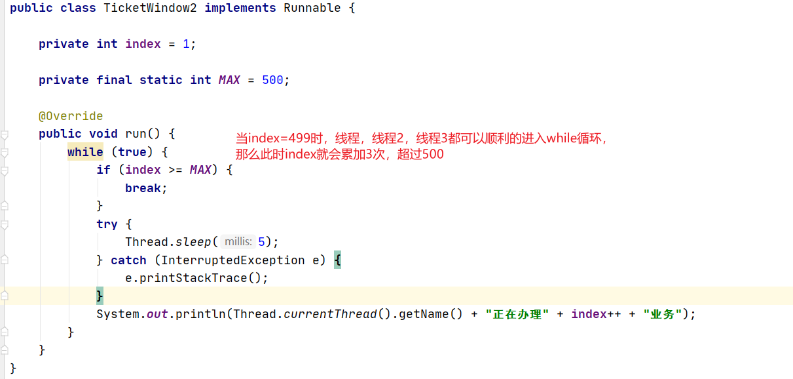
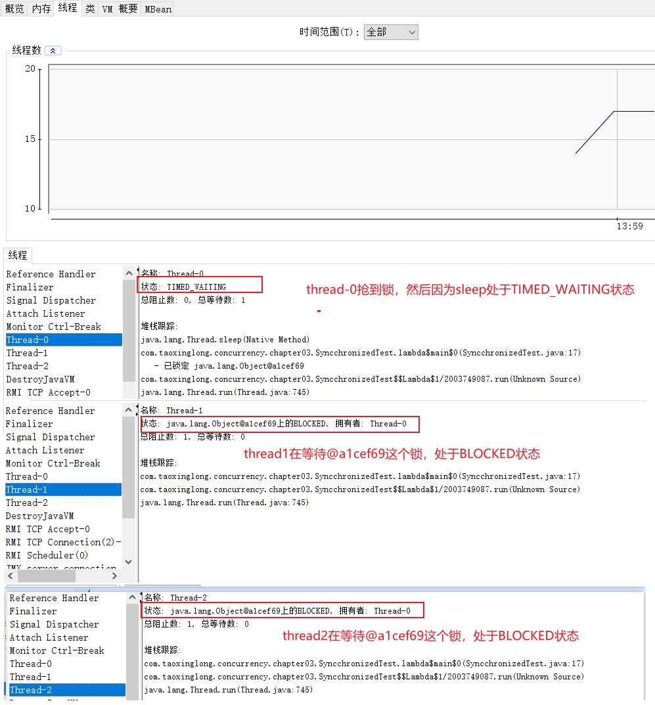
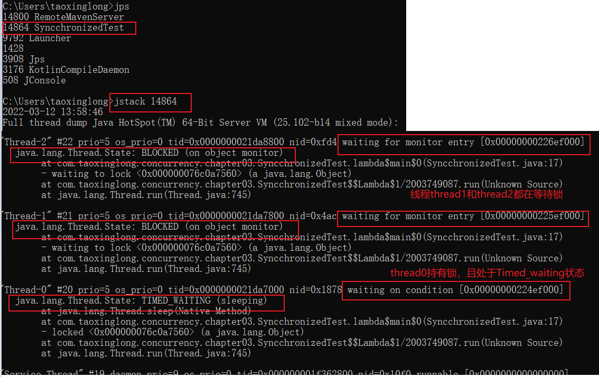
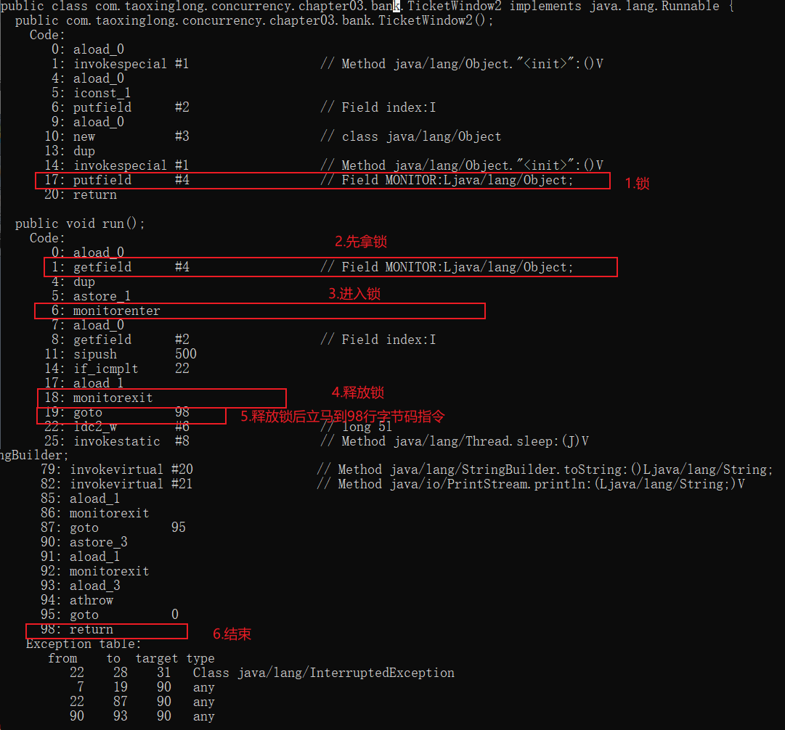
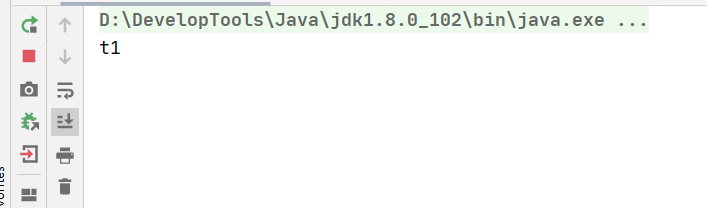
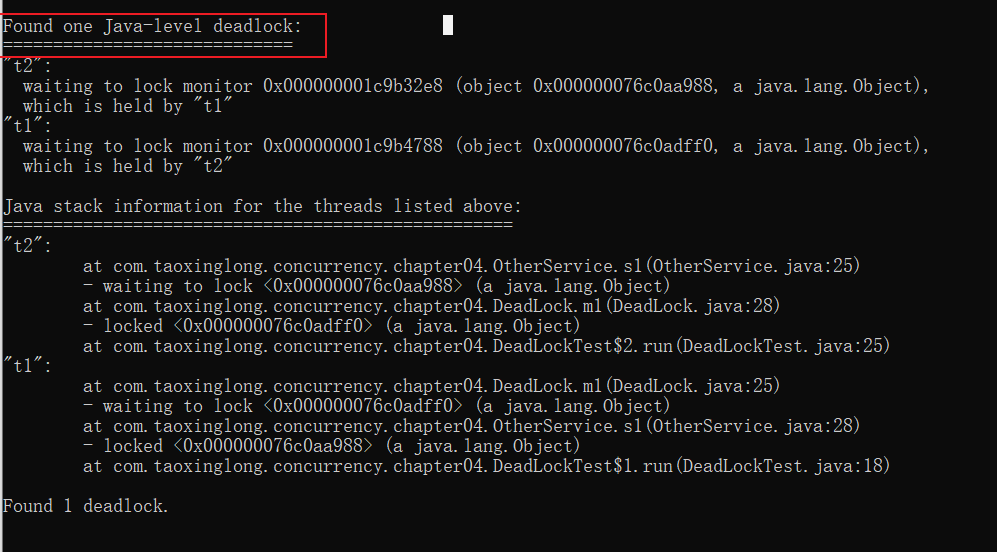
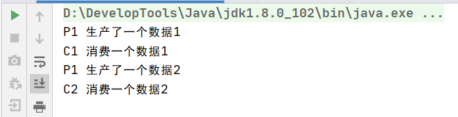
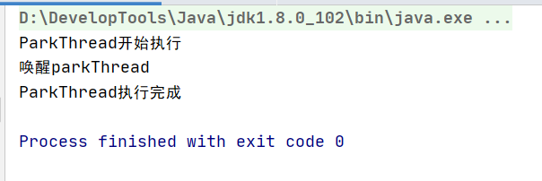
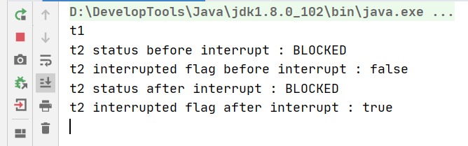

# 3.线程安全

## 1.一个案例引出数据同步

```java
public class TicketWindow2 implements Runnable {

    private int index = 1;

    private final static int MAX = 500;

    @Override
    public void run() {
        while (true) {
            if (index >= MAX) {
                break;
            }
            try {
                Thread.sleep(5);
            } catch (InterruptedException e) {
                e.printStackTrace();
            }
            System.out.println(Thread.currentThread().getName() + "正在办理" + index++ + "业务");
        }
    }
}

public class TicketWindowTest {
    public static void main(String[] args) {
        final TicketWindow2 task = new TicketWindow2();
        Thread thread1 = new Thread(task,"一号柜台");
        Thread thread2 = new Thread(task,"二号柜台");
        Thread thread3 = new Thread(task,"三号柜台");
        Thread thread4 = new Thread(task,"四号柜台");

        thread1.start();
        thread2.start();
        thread3.start();
        thread4.start();
    }
}
```

1. 分析上述代码：我们想要实现的是当index达到500时，就不再执行线程的逻辑单元。但是却产生了意料之外的结果：

   

   显然在4个线程同时叫号的情况下，发生了错误，超过了500号。

2. 分析原因：

   

3. 一种解决方案：同步代码块

   ```java
   public class TicketWindow2 implements Runnable {
   
       private int index = 1;
   
       private final static int MAX = 500;
   
       private final Object MONITOR = new Object();
   
       @Override
       public void run() {
           while (true) {
               synchronized (MONITOR) {
                   if (index >= MAX) {
                       break;
                   }
                   try {
                       Thread.sleep(5);
                   } catch (InterruptedException e) {
                       e.printStackTrace();
                   }
                   System.out.println(Thread.currentThread().getName() + "正在办理" + index++ + "业务");
               }
           }
       }
   }
   ```

   最后得到了我们想要的执行结果，但是明显感觉出比之前的要慢很多：同步代码块保证数据安全：但是导致了该部分代码变成了多线程串行执行，影响效率。

## 2.相关的堆栈信息和字节码

```java
public class SyncchronizedTest {

    private final static Object LOCK = new Object();

    public static void main(String[] args) {
        Runnable runnable = () -> {
            synchronized (LOCK) {
                try {
                    Thread.sleep(200_000);
                } catch (InterruptedException e) {
                    e.printStackTrace();
                }
            }
        };

        Thread t1 = new Thread(runnable);
        Thread t2 = new Thread(runnable);
        Thread t3 = new Thread(runnable);

        t1.start();
        t2.start();
        t3.start();
    }
}
```

1. 分析下代码：启动了3个线程，但是3个线程的执行单元是一个同步块。当第一个线程抢到LOCK后，会休眠200s，另外两个线程会进入BOLCKED等待锁的释放。

2. 启动，通过jconsole看下相关线程状态：
	


	
3. jstack看堆栈信息

   

4. 看一下字节码文件：

   ```java
   public class TicketWindow2 implements Runnable {
   
       private int index = 1;
   
       private final static int MAX = 500;
   
       private final Object MONITOR = new Object();
   
       @Override
       public void run() {
           while (true) {
               // 同步代码块保证数据安全：但是导致了该部分代码变成了多线程串行执行
               synchronized (MONITOR) {
                   if (index >= MAX) {
                       break;
                   }
                   try {
                       Thread.sleep(5);
                   } catch (InterruptedException e) {
                       e.printStackTrace();
                   }
                   System.out.println(Thread.currentThread().getName() + "正在办理" + index++ + "业务");
               }
           }
       }
   }
   ```

   

   通过字节码指令我们可以看出synchronized关键字主要靠三个字节码指令来实现同步：getField拿到锁，monitorenter进入锁，monitorexit退出锁。

## 3.synchronized关键字

1. 锁加在方法方法上：**持有的锁对象是当前实例对象this**

   ```java
   public class SynchronizedRunnable implements Runnable {
       private int index = 1;
   
       private final static int MAX = 500;
   
       /**
        * synchronized同步方法
        */
       @Override
       public synchronized void run() {
           while (true) {
                   if (index >= MAX) {
                       break;
                   }
                   try {
                       Thread.sleep(5);
                   } catch (InterruptedException e) {
                       e.printStackTrace();
                   }
                   System.out.println(Thread.currentThread().getName() + "正在办理" + index++ + "业务");
               }
           }
   }
   ```

   此时当一个线程抢到该锁时，会把整个任务执行完，只有一个线程在叫号。

   

2. 重构一下：因为synchronized锁住的整个方法（线程执行单元），范围太大，我们让其只锁住共享数据**index**的相关操作。

   ```java
   public class SynchronizedRunnable2 implements Runnable {
       private int index = 1;
   
       private final static int MAX = 5000;
   
       /**
        * synchronized同步方法
        */
       @Override
       public void run() {
           while (true) {
               // 只锁住共享数据相关的操作
               synchronized (this) {
                   if (index >= MAX) {
                       break;
                   }
                   try {
                       Thread.sleep(5);
                   } catch (InterruptedException e) {
                       e.printStackTrace();
                   }
                   System.out.println(Thread.currentThread().getName() + "正在办理" + index++ + "业务");
               }
           }
       }
   }
   ```

   ```java
   // 抽出方法重构一下
   public class SynchronizedRunnable3 implements Runnable {
       private int index = 1;
   
       private final static int MAX = 5000;
   
       /**
        * synchronized同步方法
        */
       @Override
       public void run() {
           while (true) {
               if (ticket()) {
                   break;
               }
           }
       }
   
       private synchronized boolean ticket() {
           // 只锁住共享数据相关的操作
           if (index >= MAX) {
               return true;
           }
           try {
               Thread.sleep(5);
           } catch (InterruptedException e) {
               e.printStackTrace();
           }
           System.out.println(Thread.currentThread().getName() + "正在办理" + index++ + "业务");
           return false;
       }
   }
   ```

3. sychronized关键字：不能仅仅理解成让代码同步执行，最重要的是每个执行该部分代码的线程都需要先尝试获取锁。

   如果两个方法用synchronized声明的是同一个锁对象，那么这两个方法只能串行执行。

   ```java
   /**
    * 描述：synchronized声明在两个方法上，且声明同一个锁对象
    *
    * @author txl
    * @date 2022-03-12 15:03
    */
   public class SynchronizedTest2 {
       public static void main(String[] args) {
   
           ThisLock thisLock = new ThisLock();
   
           new Thread("t1"){
               @Override
               public void run() {
                   thisLock.m1();
               }
           }.start();
   
           new Thread("t2"){
               @Override
               public void run() {
                   thisLock.m2();
               }
           }.start();
       }
   }
   
   /**
    * m1()和m2()都被synchronized申明加上了this锁
    */
   class ThisLock {
   
       public synchronized void m1() {
           System.out.println(Thread.currentThread().getName());
           try {
               Thread.sleep(100_000);
           } catch (InterruptedException e) {
               e.printStackTrace();
           }
       }
   
       public synchronized void m2() {
           System.out.println(Thread.currentThread().getName());
           try {
               Thread.sleep(100_000);
           } catch (InterruptedException e) {
               e.printStackTrace();
           }
       }
   }
   ```

   演示结果：虽然两个线程分别调用两个方法，但是先抢到thisLock对象锁的线程执行，没想到thisLock对象锁的线程BLOCKED。

   

   
   
4. synchronized声明在静态方法或者静态代码块上，持有的锁对象是类对应的Class对象
   
   ```java
   /**
    * 描述：synchronized声明在静态方法或者静态代码块上，持有的锁对象是类对应的Class对象
    *
    * @author txl
    * @date 2022-03-12 15:03
    */
   public class SynchronizedTest3 {
   
       static {
           synchronized (SynchronizedTest3.class) {
               try {
                   System.out.println(Thread.currentThread().getName() + "monitor enter...");
                   Thread.sleep(1_000);
               } catch (InterruptedException e) {
                   e.printStackTrace();
               }
           }
       }
       public static void main(String[] args) {
   
           new Thread("t1"){
               @Override
               public void run() {
                   SynchronizedTest3.m1();
               }
           }.start();
   
           new Thread("t2"){
               @Override
               public void run() {
                   SynchronizedTest3.m2();
               }
           }.start();
       }
   
       public synchronized static void m1() {
           System.out.println(Thread.currentThread().getName());
           try {
               System.out.println(Thread.currentThread().getName() + "monitor enter...");
               Thread.sleep(1_000);
           } catch (InterruptedException e) {
               e.printStackTrace();
           }
       }
   
       public synchronized static void m2() {
           System.out.println(Thread.currentThread().getName());
           try {
               System.out.println(Thread.currentThread().getName() + "monitor enter...");
               Thread.sleep(1_000);
           } catch (InterruptedException e) {
               e.printStackTrace();
           }
       }
   }
   ```
   
5. sychronized一个缺点就是：当一个线程去尝试持有该锁而BLOCKED进入锁池等待话，如果持有该锁的线程一直工作的话，这个线程就会什么都不干一直等待，而且无法打断。

## 4.死锁分析

锁机制能够保证锁区间内的代码串行化执行，起到了数据同步保护的作用，但是它也可能引用一个非常严重的风险，即线程死锁。

```java
public class DeadLock {

    private OtherService otherService;

    private final Object mlock = new Object();

    public DeadLock(OtherService otherService) {
        this.otherService = otherService;
    }

    /**
     * 会先拿mlock锁进入m1方法，然后尝试拿slock锁进入s1方法时，发现slock被t1线程持有，那么t2线程进入BLOCKED状态等待锁释放
     */
    public void m1() {
        synchronized (mlock) {
            try {
                System.out.println("m1 get monitor mlock");
                Thread.sleep(50);
                System.out.println("m1 want monitor slock");
                otherService.s1();
            } catch (InterruptedException e) {
                e.printStackTrace();
            }
        }
        System.out.println("m1 success exit");
    }
}
```

```java
public class OtherService {

    private DeadLock deadLock;

    private final Object slock = new Object();

    public void setDeadLock(DeadLock deadLock) {
        this.deadLock = deadLock;
    }

    /**
     * 会先拿slock锁进入s1方法，然后尝试拿mlock锁进入m1方法时，发现mlock锁已被t2线程持有，那么t1线程进入BLOCKED状态等待锁释放
     */
    public void s1() {
        synchronized (slock) {
            try {
                System.out.println("s1 get monitor slock");
                Thread.sleep(500);
                System.out.println("s1 want monitor mlock");
                deadLock.m1();
            } catch (InterruptedException e) {
                e.printStackTrace();
            }
        }
        System.out.println("s1 success exit");
    }
}
```

```java
/**
 * 描述：演示死锁案例
 *
 * @author txl
 * @date 2022-03-13 10:27
 */
public class DeadLockTest {
    public static void main(String[] args) {
        OtherService otherService = new OtherService();
        DeadLock deadLock = new DeadLock(otherService);
        otherService.setDeadLock(deadLock);

        new Thread("t1"){
            @Override
            public void run() {
                otherService.s1();
            }
        }.start();

        new Thread("t2"){
            @Override
            public void run() {
                deadLock.m1();
            }
        }.start();
    }
}
```

死锁发生场景：比如线程t1持有了锁A，线程t2持有锁B。当线程t1去申请锁B时，发现锁B已经被占用，那么t1进入BOLCKED等待锁B的释放。同时t2线程去申请锁A，发现锁A被线程1持有，线程t2也会进入BLOCKED状态等待锁A的释放。而且两个线程都在循环等待，没有一方放弃获取锁或者释放已持有的锁。

通过jstack查看是否发生了死锁：



所以尽量不要出现多个锁相互层叠，互相持有的情况。

## 5.线程间的通讯：等待唤醒机制

线程间进行通讯，最常见的模型就是消息生产者和消息消费者，即生产者和消费者模型。

### 5.1.版本1

版本1：有问题的生产者/消费者模型。

这里**没有实现生产者和消费者通讯**的机制：导致生产者自顾自己生产，消费者随便消费，没有实现生产者生产一次数据，然后消费者消费一次数据的结果。

```java
public class ProduceConsumerVersion1 {

    private int i = 1;

    private final Object LOCK = new Object();

    private void produce() {
        synchronized (LOCK) {
            System.out.println("p->" + (i++));
        }
    }

    private void consume() {
        synchronized (LOCK) {
            System.out.println("C->" + i);
        }
    }

    public static void main(String[] args) {

        ProduceConsumerVersion1 pc = new ProduceConsumerVersion1();

        new Thread("P"){
            @Override
            public void run() {
                while (true)
                    pc.produce();
            }
        }.start();

        new Thread("C") {
            @Override
            public void run() {
                while (true)
                    pc.consume();
            }
        }.start();
    }
}
```

### 5.3.wait(), notify(), notifyAll()

1. 先解释了两个概念：
   - 等待池：当调用了某个对象的wait()方法，当前线程就会释放该对象的锁然后进入到该对象的等待池，等待池中的线程不会去竞争该对象的锁。
   - 锁池：锁池中的线程会不停尝试获取该锁。

- wait()方法：放弃CPU执行权，让当前线程**释放该对象锁，然后进入该锁的等待队列中（等待池中）**。

- notify()方法：

  会从该锁的等待队列中唤醒**一个**线程，让其处于Runnable状态**进入锁池，去竞争该锁**。**如果竞争到该锁，那么会从上一次释放锁的现场继续向下执行。**如果有多个等待该锁的线程，那么会根据具体虚拟机/操作系统的实现来选择一个唤醒（可能是FIFO，随机，出栈顶，优先权）。

  我们说会从该锁的等待队列中唤醒一个线程，告诉它可以去参与该锁的竞争，进入锁池。那么这个等待队列中其他线程还是处于WAITING状态，在等待队列中。如果唤醒的线程没有竞争到该锁，它继续在锁池中处在BLOCKED状态，继续尝试获取锁。

- notifyAll()方法：让该锁等待队列中的所有线程都变成Runnable状态进入锁池，去竞争该锁。没有竞争到的就处于BLOCKED状态继续循环尝试获取锁。

### 5.2.版本2

版本2：一个生产者，一个消费者，并且实现了线程间通讯：生产出一个消息通知消费者，消费者消费完再通知生产者继续生产。

```java
public class ProduceConsumerVersion2 {

    private int i = 0;

    private final Object LOCK = new Object();

    // 信号：true生产了消费者会去消费，false没有生产消费者继续等
    private volatile boolean isProduced = false;

    public void produce() {
        synchronized (LOCK) {
            if (isProduced) {
                // 如果已经生产了一个且还没有被消费者消费
                try {
                    // 当前线程会wait并且释放锁，直到其他线程通过notify/notifyall唤醒它
                    LOCK.wait();
                } catch (InterruptedException e) {
                    e.printStackTrace();
                }
            } else {
                // 需要生产：生产出来最新的数据后要通知消费者去消费
                i++;
                System.out.println("P->生产了一个数据" + i);
                LOCK.notify();
                isProduced = true;
            }
        }
    }

    public void consume() {
        synchronized (LOCK) {
            if(isProduced) {
                // 发现已经生产了一个数据
                System.out.println("C->消费一个数据" + i);
                // 通知生产者我消费了，你可以继续生产
                LOCK.notify();
                isProduced = false;
            } else {
                // 发现还没有生产，继续等待并且释放锁
                try {
                    LOCK.wait();
                } catch (InterruptedException e) {
                    e.printStackTrace();
                }
            }
        }
    }

    public static void main(String[] args) {

        ProduceConsumerVersion2 pc = new ProduceConsumerVersion2();

        new Thread("P"){
            @Override
            public void run() {
                while (true)
                    pc.produce();
            }
        }.start();

        new Thread("p") {
            @Override
            public void run() {
                while (true)
                    pc.consume();
            }
        }.start();
    }
}
```


### 5.3.版本2的问题：程序假死

多生产者消费者版本：版本2只适用于单生产者，单消费者；在多生产者消费者场景是就会出现程序假死问题。

再来回顾一下Object类中的两个有关线程通讯的方法：

- wait()方法：放弃CPU执行权，让当前线程**释放持有的锁，然后等待该锁，即进入该锁的等待队列中**。
- notify()方法：会从该锁的等待队列中唤醒**一个**线程，如果有多个等待该锁的线程，那么会根据具体虚拟机/操作系统的实现来选择一个唤醒（可能是FIFO，随机，出栈顶，优先权）。只是告诉调用过wait方法的线程可以去参与获得锁的竞争了，但不是马上得到锁，因为锁还在别人手里，别人还没释放

```java
public class ProduceConsumerVersion3 {

    private int i = 0;

    private final Object LOCK = new Object();

    // 信号：true生产了消费者会去消费，false没有生产消费者继续等
    private volatile boolean isProduced = false;

    public void produce() {
        synchronized (LOCK) {
            if (isProduced) {
                // 如果已经生产了一个且还没有被消费者消费
                try {
                    // 当前线程会wait直到其他线程通过notify/notifyall唤醒它
                    LOCK.wait();
                } catch (InterruptedException e) {
                    e.printStackTrace();
                }
            } else {
                // 需要生产：生产出来最新的数据后要通知消费者去消费
                i++;
                System.out.println(Thread.currentThread().getName() + " 生产了一个数据" + i);
                LOCK.notify();
                isProduced = true;
            }
        }
    }

    public void consume() {
        synchronized (LOCK) {
            if(isProduced) {
                // 发现已经生产了一个数据
                System.out.println(Thread.currentThread().getName() + " 消费一个数据" + i);
                // 通知生产者我消费了，你可以继续生产
                LOCK.notify();
                isProduced = false;
            } else {
                // 发现还没有生产，继续等待
                try {
                    LOCK.wait();
                } catch (InterruptedException e) {
                    e.printStackTrace();
                }
            }
        }
    }

    public static void main(String[] args) {

        ProduceConsumerVersion3 pc = new ProduceConsumerVersion3();
        // 2个生产者线程
        Stream.of("P1", "P2").forEach(name ->
                new Thread(name) {
                    @Override
                    public void run() {
                        while (true)
                            pc.produce();
                    }
                }.start()
        );
        // 2个消费者线程
        Stream.of("C1", "C2").forEach(name ->
                new Thread(name) {
                    @Override
                    public void run() {
                        while (true)
                            pc.consume();
                    }
                }.start()
        );
    }
}
```



代码很快就执行不下去了，并且JVM还没有退出（上图是我自己关的），我们分析一下怎么运行会导致上面的结果。

- 一开始isProduced=false，说明还没有生产出数据。
- P1线程先拿到LOCK锁，其他线程因为没有抢占到锁对象处于BLOCKED状态，一直在尝试获取该锁。
- P1生产一个数据，调用notify()唤醒一个等待LOCK的线程让其去尝试获取LOCK锁。（因为此时还没有等待LOCK锁的线程，所以没什么影响）。isProduced置为true，退出produce方法，并且释放LOCK锁。
- P1又抢到了LOCK锁，发现已经生产了一个数据了。调用waiti()方法释放LOCK锁，并陷入WAITING状态等待LOCK锁。
- P2线程拿到LOCK锁，发现已经生产了一个数据了。调用waiti()方法释放LOCK锁，并陷入WAITING状态等待LOCK锁。
- C1线程拿到LOCK锁，消费一个数据，然后调用notify()告诉P1和P2可以去竞争LOCK锁了，然后C1将isProduced置为false，执行结束释放LOCK锁。
- C1线程又拿到LOCK锁，发现还没有生产数据，那么会调用wait()放弃CPU执行权，C1线程释放持有的锁，然后等待该锁。
- C2线程拿到LOCK锁，发现还没有生产数据，那么会调用wait()放弃CPU执行权，C2线程释放持有的锁，然后等待该锁。
- P1又抢到了LOCK锁，生产一个数据，调用notify()随机唤醒P2，C1，C2中的一个让其去尝试获取LOCK锁。**并且自身也会去竞争该锁。**
- 最极端的情况：P2被notify唤醒，C1和C2还处于该锁对象的等待池中。此时无论是P2或者P1竞争到LOCK锁时，发现已经已经生产了一个数据了。调用waiti()方法释放LOCK锁，都会重新陷入WAITING状态等待LOCK锁。
- 最终的结果：P1，P2，C1，C2都陷入了Waiting状态，并且没有线程回去Notify它们了。JVM中的这4个线程**都放弃了CPU，发生假死**处于Waiting状态。
- 根本原因：当C1和C2都处于WAITING状态时，P1生产了一个数据然后调用notify()，会发生下一次还是生产者抢到锁，然后P1和P2又再次陷入Waiting状态了。**应该是生产者调用notify()时，也能唤醒消费者让其有机会去抢锁；消费者notify()时，也能唤醒生产者调让其有机会去抢锁。**

### 5.4.版本3：多线程生产者消费者模型

1. 回想一下版本2的代码为什么在多生产者多消费者时会报错：

   因为当3个线程在等待池中都处于WAITING状态时，假设只剩下一个生产者P1线程，当其生产一个数据后会调用notify()，执行完一次produce()方法后，释放了锁，**然后自己也会去竞争该锁。**

   假设唤醒的是另一个生产者线程P2，P2和P1一起竞争该锁：此时无论P1还是P2先竞争到该锁都会发现已经生产出来数据了，然后调用wait()方法，最后两者都会回到等待池变成WAITING状态。

   那么最后所有线程都会放弃CPU执行权，进入等待池Waiting状态。

2. 根本原因：生产者没有唤醒消费者线程，让其进入锁池也去竞争锁。

3. 回顾一下notifyAll()方法：让该锁等待队列中的所有线程都变成Runnable状态进入锁池，去竞争该锁。没有竞争到的就处于BLOCKED状态继续循环尝试获取锁。那么消费者线程和生产者线程都会从该锁对象的等待队列中被唤醒，

4. 代码演示：

   ```java
   public class ProduceConsumerVersion4 {
   
       private int i = 0;
   
       private final Object LOCK = new Object();
   
       // 信号：true生产了消费者会去消费，false没有生产消费者继续等
       private volatile boolean isProduced = false;
   
       public void produce() {
           synchronized (LOCK) {
               while (isProduced) {
                   // 如果已经生产了一个且还没有被消费者消费
                   try {
                       // 当前线程会wait直到其他线程通过notify/notifyall唤醒它
                       LOCK.wait();
                   } catch (InterruptedException e) {
                       e.printStackTrace();
                   }
               }
               // 需要生产：生产出来最新的数据后要通知消费者去消费
               i++;
               System.out.println(Thread.currentThread().getName() + " 生产了一个数据" + i);
               LOCK.notifyAll();
               isProduced = true;
           }
       }
   
       public void consume() {
           synchronized (LOCK) {
               while (!isProduced) {
                   // 发现还没有生产，继续等待
                   try {
                       LOCK.wait();
                   } catch (InterruptedException e) {
                       e.printStackTrace();
                   }
               }
               // 发现已经生产了一个数据
               System.out.println(Thread.currentThread().getName() + " 消费一个数据" + i);
               // 通知生产者我消费了，你可以继续生产
               LOCK.notifyAll();
               isProduced = false;
           }
       }
   
       public static void main(String[] args) {
   
           ProduceConsumerVersion4 pc = new ProduceConsumerVersion4();
           // 2个生产者线程
           Stream.of("P1", "P2").forEach(name ->
                   new Thread(name) {
                       @Override
                       public void run() {
                           while (true)
                               pc.produce();
                       }
                   }.start()
           );
           // 2个消费者线程
           Stream.of("C1", "C2").forEach(name ->
                   new Thread(name) {
                       @Override
                       public void run() {
                           while (true)
                               pc.consume();
                       }
                   }.start()
           );
       }
   }
   ```

### 5.5.wait()和sleep()的区别

不同之处：

- sleep()方法是静态的Thread类方法，wait()是Object对象方法
- sleep()方法不会释放持有的锁，然后进入TIMED_WAITING状态。wait()会释放当前线程持有的对象锁，然后进入该锁的等待池中，线程状态变成WAITING。
- **wait()方法的使用必须结合synchronized代码块**，否则运行时会抛出**java.lang.IllegalMonitorStateException**异常，而sleep()方法直接使用即可。
- wait()方法如果没有指定时间的话，一般需要notify/notifyAll来唤醒。sleep()方法可以自动唤醒。

相同之处：

- 都可以被interrupt()打断其TIME_WAITING和WAITING状态，然后进入RUNNABLE状态。

代码演示：

```java
public class SleepAndWait {

    private static final Object MONITOR = new Object();

    public static void main(String[] args) throws InterruptedException {
        Thread thread = new Thread() {
            @Override
            public void run() {
                while (true)
                    m1();
            }
        };
        thread.start();
        Thread.sleep(50);
        while (true) {
            // WAITING状态
            Thread.sleep(1000);
            System.out.println(thread.getState());
            thread.interrupt();
        }
    }

    public static void m1(){
        // MONITOR.wait()必须被synchronized (MONITOR)包住	
        synchronized (MONITOR) {
            try {
                MONITOR.wait();
                // 只有被notify时才会执行该行代码
                System.out.println(Thread.currentThread().getState());
            } catch (InterruptedException e) {
                // WAITING状态被打断：进入RUNNABLE状态且能够再次获取该锁
                System.out.println(Thread.currentThread().getState());
                e.printStackTrace();
            }
        }
    }
}
```

### 5.6.线程间通信综合案例

1. 需求：

   假设我们需要采集10台机器的数据，每个机器都分配对应一个线程来进行采集，但我们最多只能允许5个线程同时去做这件事。如果每个机器需要采集10s，假设CPU不紧张的话，那么我们每次5个线程一起执行，大约花费20s.

2. 代码演示

   ```java
   public class CaptureService {
   
       final static private LinkedList<Control> CONTROLS = new LinkedList<>();
   
       // 最多只能有5个线程同时工作
       private final static int MAX_THREAD_SIZE = 5;
   
       public static void main(String[] args) {
   
           List<Thread> worker = new ArrayList<>();
   
           // 新建10个Thread对象，并启动
           long startTime = System.currentTimeMillis();
           Arrays.asList("M1", "M2", "M3", "m4", "m5", "M6", "M7", "M8", "M9", "M10").stream()
                   .map(CaptureService::createCaptureThread)
                   .forEach(t->{
                       t.start();
                       worker.add(t);
                   });
   
           // 10个线程都采集完之后在进行汇总。
           worker.forEach(t-> {
               try {
                   t.join();
               } catch (InterruptedException e) {
                   e.printStackTrace();
               }
           });
           long endTime = System.currentTimeMillis();
           // 10个线程都采集完之后开始进行总结处理
           Optional.of("All of capture work finished, and cost time：" + (endTime -startTime) + "ms, begin summary data.").ifPresent(System.out::println);
       }
   
       private static Thread createCaptureThread(String name) {
           return new Thread(() -> {
               Optional.of("The worker [" + Thread.currentThread().getName() + "] will begin capture data.").ifPresent(System.out::println);
               synchronized (CONTROLS) {
                   // 如果已经达到5个捕获数据的线程正在工作，那么等待：即第6，7，8，9，10个线程会进入while里面，然后wait()进入等待队列
                   while (CONTROLS.size() >= MAX_THREAD_SIZE) {
                       try {
                           CONTROLS.wait();
                       } catch (InterruptedException e) {
                           e.printStackTrace();
                       }
                   }
                   CONTROLS.addLast(new Control());
               }
               // 开始工作
               Optional.of("The worker [" + Thread.currentThread().getName() + "] is capturing data.").ifPresent(System.out::println);
               try {
                   Thread.sleep(10000);
               } catch (InterruptedException e) {
                   e.printStackTrace();
               }
               // 唤醒其他处于等待队列的线程
               synchronized (CONTROLS) {
                   Optional.of("The worker [" + Thread.currentThread().getName() + "] end capture data.").ifPresent(System.out::println);
                   CONTROLS.removeFirst();
                   CONTROLS.notifyAll();
               }
           }, name);
       }
   
       // 只起到填充容器的作用
       private static class Control {
   
       }
   }
   ```


### 5.7.LockSupport

LockSupport相较于wiat/notify的好处是：

​	1.不需要依赖sync可以直接使用。

​	2.可以唤醒指定的线程。

​	3.而且我可以先发放许可，后面遇到等待许可的代码就不会再阻塞了。也就是可以先执行unpark，在执行park

```java
public class LockSupportTest {
    public static void main(String[] args) throws InterruptedException {
        Thread parkThread = new Thread(new ParkThread());
        parkThread.start();

        Thread.sleep(3000L);
        System.out.println("唤醒parkThread");
        // 唤醒：为指定线程parkThread提供“许可”
        LockSupport.unpark(parkThread);
    }

    static class ParkThread implements Runnable {

        @Override
        public void run() {
            System.out.println("ParkThread开始执行");
            // 阻塞：等待“许可”
            LockSupport.park();
            System.out.println("ParkThread执行完成");
        }
    }
}
```




## 6.自定义一个显示锁

1. synchronized的缺点：

   我们之前在锁东西的时候，要么锁方法要么锁代码块。语法上简单的加上synchronized这个关键字就帮我们在底层实现加锁。现在我们要实现一个显示锁，在使用的时候我们要手动的调用lock/unlock等API。

   我们实现一个显示锁的主要目的是为了解决sync关键字的2个缺点：

   ​	1.没有获取到锁时会因为sync关键字进入BLOCKED状态，而且这个状态无法被打。

   ​	2.进入BLOCKED的线程在之后会什么都不干，一直尝试获取该锁。我们想实现其尝试获取锁一段时间后就自动中断。

   ```java
   public class SynchronizedProblem {
       public static void main(String[] args) throws InterruptedException {
   
           // t1抢占到锁且一直没有释放
           new Thread("t1") {
               @Override
               public void run() {
                   SynchronizedProblem.run();
               }
           }.start();
   
           // 主线程休眠1s
           Thread.sleep(1000);
   
           // t2尝试去抢占class锁，因为sync被BLOCKED。
           Thread t2 = new Thread("t2") {
               @Override
               public void run() {
                   SynchronizedProblem.run();
               }
           };
           t2.start();
   
           // 主线程休眠1s
           Thread.sleep(1000);
   
           // 此时t2会一直尝试获取该锁，而且无法被打断，一直处于BLOCKED状态
           System.out.println("t2 status before interrupt : " + t2.getState());
           System.out.println("t2 interrupted flag before interrupt : "+t2.isInterrupted());
           t2.interrupt();
           System.out.println("t2 status after interrupt : " + t2.getState());
           // 只能打上中断标志位
           System.out.println("t2 interrupted flag after interrupt : "+t2.isInterrupted());
       }
   
       private synchronized static void run() {
           System.out.println(Thread.currentThread().getName());
           while (true) {
   
           }
       }
   }
   ```

   

2. 自定义一个显示锁：

   - Lock接口：

     ```java
     /**
      * 描述：自定义一个显示锁，解决synchronized的一些缺点：1.无法打断，2.什么都不干一直重试获取锁
      *
      * @author txl
      * @date 2022-03-13 21:50
      */
     public interface Lock {
     
         class TimeOutException extends Exception {
     
             public TimeOutException(String message) {
                 super(message);
             }
         }
     
         // 获取该锁：能被中断
         void lock() throws InterruptedException;
     
         // 获取该锁：超时会主动中断
         void lock(long mills) throws InterruptedException, TimeOutException;
     
         // 释放锁
         void unlock();
     
         // 阻塞住的线程
         Collection<Thread> getBlockedThread();
     
         // 返回有多少个线程阻塞住了
         int getBlockedSize();
     }
     ```

   - BooleanLock显示锁

     ```java
     package com.taoxinglong.concurrency.chapter06.customize;
     
     import java.util.ArrayList;
     import java.util.Collection;
     import java.util.Collections;
     
     /**
      * 描述：
      *
      * @author txl
      * @date 2022-03-13 21:56
      */
     public class BooleanLock implements Lock {
     
         /**
          * true：说明这个锁已经被持有了
          * false：说明这个锁是空闲的，可以被抢占
          */
         private boolean initValue;
     
         // 记录被BLOCKED的线程，类似因sync被BLOCKED的线程
         private Collection<Thread> blockedThreadCollection = new ArrayList<>();
     
         private Thread currentThread;
     
         public BooleanLock() {
             this.initValue = false;
         }
     
         /**
          * 获取该this锁
          * @throws InterruptedException
          */
         @Override
         public synchronized void lock() throws InterruptedException {
             // 这个while循环就相当于一直在尝试获取锁：每次被notify时，都会再尝试获取一下锁
             while (initValue) {
                 blockedThreadCollection.add(Thread.currentThread());
                 this.wait();
             }
             // 该锁空闲：当前线程获取该锁
             blockedThreadCollection.remove(Thread.currentThread());
             this.initValue = true;
             this.currentThread = Thread.currentThread();
         }
     
         /**
          * 获取锁，如果超时的话，就会结束这次获取动作
          * @param mills
          * @throws InterruptedException
          * @throws TimeOutException
          */
         @Override
         public synchronized void lock(long mills) throws InterruptedException, TimeOutException {
     
             // 参数不合法时，按照lock逻辑
             if (mills <= 0)
                 lock();
     
             // 还需等待时间
             long hasRemaining = mills;
             long endTime = System.currentTimeMillis() + mills;
     
             // 这个while循环就相当于一直在尝试获取锁：每次被notify时，都会再尝试获取一下锁。此时还要判断一下等待时间，如果没有等待时间了，就不再尝试获取该锁
             while (initValue) {
                 if (hasRemaining <= 0)
                     throw new TimeOutException("Time out");
                 blockedThreadCollection.add(Thread.currentThread());
                 /**
                  * mills时间后自动从等待队列中唤醒该线程，然后尝试获取锁：此时一定会超时，hasRemaining<=0，那么就会退出while循环，lock(mills)执行结束
                  * 如果没有等待mills时间就被其他线程notify了，就会重新去尝试持有该锁。如果尝试持有锁的时候，又发现已被其他线程抢占了，此时还要重新计算下剩余等待时间。
                  * 如果超时：就不再尝试获取该锁
                  */
                 this.wait(mills);
                 hasRemaining = endTime - System.currentTimeMillis();
                 //System.out.println(hasRemaining);
             }
             this.initValue = true;
             this.currentThread = Thread.currentThread();
         }
     
         /**
          * 释放锁
          */
         @Override
         public synchronized void unlock() {
             // 只有当前线程是持有显示锁的线程currentThread，才允许从等待队列中唤醒一个线程去尝试持有锁
             if (Thread.currentThread() == currentThread) {
                 // initValue赋值和notifyAll要同步执行
                 this.initValue = false;
                 System.out.println(Thread.currentThread().getName() + " release the lock monitor.");
                 // 执行unlock时还持有着this锁，当unlock方法执行完，自动释放锁。WAITING状态的线程开始抢占该锁。
                 this.notifyAll();
             }
         }
     
         @Override
         public Collection<Thread> getBlockedThread() {
             // 如果直接返回blockedThreadCollection，可能其他线程会对其做出修改，这是不允许的
             return Collections.unmodifiableCollection(blockedThreadCollection);
         }
     
         @Override
         public int getBlockedSize() {
             return blockedThreadCollection.size();
         }
     }
     ```

   - LockTest：测试类

     ```java
     package com.taoxinglong.concurrency.chapter06.customize;
     
     import java.util.Optional;
     import java.util.stream.Stream;
     
     /**
      * 描述：
      *
      * @author txl
      * @date 2022-03-13 22:13
      */
     public class LockTest {
         public static void main(String[] args) throws InterruptedException {
     
             // 唯一的显示锁对象
             final BooleanLock booleanLock = new BooleanLock();
     
             Stream.of("T1", "T2", "T3", "T4").forEach(name ->
                     new Thread(() -> {
                         try {
                             // booleanLock.lock();
                             /**
                              * 其实lock方法执行完后，this对象锁会被释放了，但是为什么其他三个线程没有抢占到booleanLock显示锁呢？
                              * 首先注意：this锁说的是BooleanLock中的sync关键字持有的锁对象。booleanLock显示锁是靠sync和wait，notifyAll实现的
                              * 其实它们都抢占到过this锁，但是后面因为initValue=true，然后调用wait()又释放了this锁，并且进入了this锁的等待池。
                              */
                             booleanLock.lock(100L);
                             Optional.of(Thread.currentThread().getName() + " get the lock monitor...")
                                     .ifPresent(System.out::println);
                             // work()被lock住：只能串行执行
                             work();
                         } catch (InterruptedException e) {
                             e.printStackTrace();
                         } catch (Lock.TimeOutException e) {
                             System.out.println(Thread.currentThread().getName() + " time out...");
                         } finally {
                             // 正常情况下：当一个线程执行完后，才会通过调用unlock去唤醒其他线程尝试持有该锁。
                             booleanLock.unlock();
                         }
                     }, name).start());
             // 一个bug：在T1线程执行结束前，主线程可以调用unlock()方法释放锁，唤醒一个线程开始执行，破坏了同步机制。
             // 只有当前线程是持有显示锁的线程currentThread，才能去唤醒等待队列中的其他线程：在unlock方法中加上该判断
             // Thread.sleep(1000);
             // booleanLock.unlock();
         }
     
         private static void work() throws InterruptedException {
             Optional.of(Thread.currentThread().getName() + " is working...").ifPresent(System.out::println);
             Thread.sleep(10000);
         }
     }
     ```

   

   
   


