装了JDK的虚拟机：

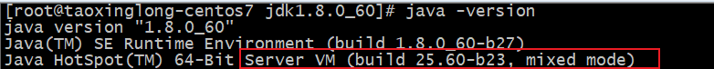

​	Server模式的JVM：会进行一些JIT---（运行时）即时编译，可能会导致代码实际的运行顺序和你写的顺序不一致。因为JVM会从性能方面考虑来进行编译顺序，比如指令重排。

### 1.为Java应用程序注入一个钩子

1. 当程序应为异常以为退出时，我们要能捕获到这一时刻，然后进行一些收尾的工作，比如释放资源。

2. 代码演示：

   ```java
   public class ExitCapture {
       public static void main(String[] args) {
           /**
            * 拿到Runtime能执行一些脚本命令等:
            *  当Java程序将要退出时，会执行这里注册的钩子。钩子的具体内容是新开了一个线程来释放资源。
            */
           Runtime.getRuntime().addShutdownHook(new Thread(() -> {
               System.out.println("The application will be exit!");
               notifyAndRelease();
           }));
           int i = 0;
           while(true) {
               try {
                   Thread.sleep(1_000L);
                   System.out.println("I am working...");
               } catch (Throwable e) { }
               i++;
               
               // 模拟了一个异常：会导致Java应用退出
               if (i>20) {
                   throw new RuntimeException("Error...");
               }
           }
       }
   
       private static void notifyAndRelease() {
           System.out.println("notify to the admin.");
           try {
               Thread.sleep(1_000L);
           } catch (Throwable e) { }
           System.out.println("will release resource (socket, fil, connection...)");
           try {
               Thread.sleep(1_000L);
           } catch (Throwable e) { }
           System.out.println("Release and Notify Done");
       }
   }
   ```

3. 效果演示1：等待20s程序异常自动退出，触发钩子

   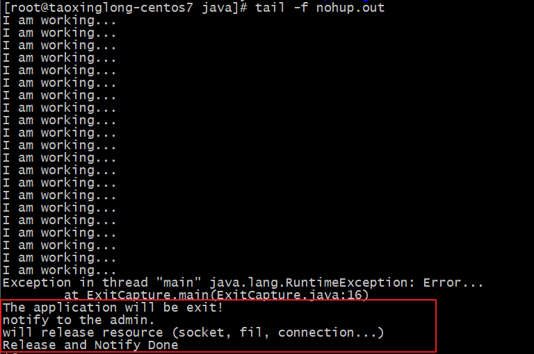

4. 效果演示2：kill java程序，也能触发钩子

   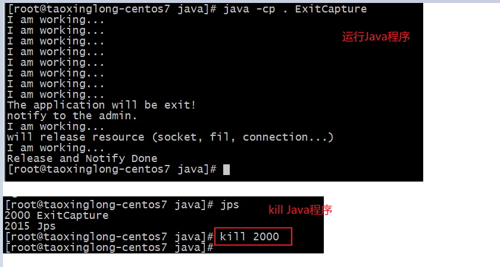

5. 效果演示3：kill -9 不会触发钩子，直接强制杀死Java应用。

   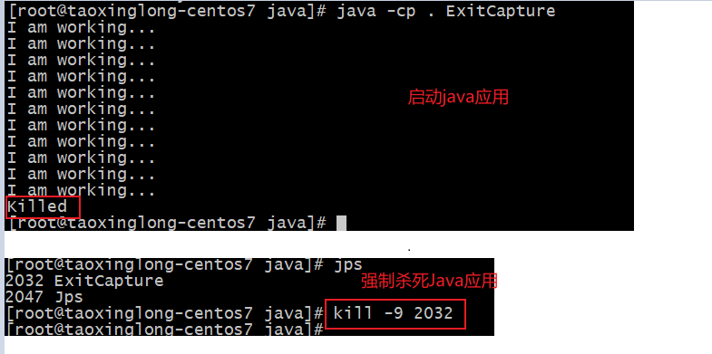

### 2.捕获线程运行期间的异常

1. 前言：我们知道线程的执行单元式run()方法，而run方法的签名是不能抛出异常的，只能在线程的执行单元里面进行捕获处理。如果我们想要在外面捕获线程的异常该怎么做呢？

   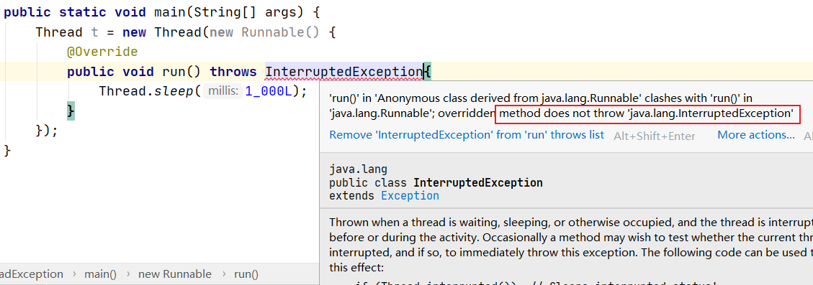

   run()方法的签名不允许抛出任何异常。

2. 我们顶多只能在run()方法中捕获异常，或者在log中看到异常。但是这个异常对于main线程是感知不到的。

   ```java
   public class ThreadException {
       private final static int A = 10;
       private final static int B = 0;
   
       public static void main(String[] args) {
           Thread t = new Thread(new Runnable() {
               @Override
               public void run() {
                   try {
                       Thread.sleep(1_000L);
                       int result = A / B;
                   } catch (InterruptedException e) {
                       // 这里只捕获了InterruptedException
                       e.printStackTrace();
                   }
               }
           }, "t1");
           t.start();
   
           // 线程t1的异常不会被main线程感知到
           try {
               Thread.sleep(10_000L);
           } catch (InterruptedException e) {
               e.printStackTrace();
           }
       }
   }
   
   ```

   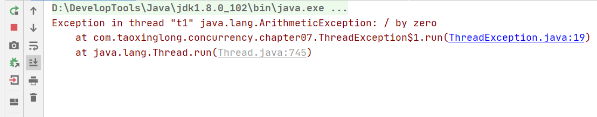

3. 通过setUncaughtExceptionHandler在main线程中捕获run方法中没有捕获到的异常：

   ```java
   public class ThreadException {
       private final static int A = 10;
       private final static int B = 0;
   
       public static void main(String[] args) {
           Thread t = new Thread(new Runnable() {
               @Override
               public void run() {
                   try {
                       Thread.sleep(1_000L);
                       int result = A / B;
                   } catch (InterruptedException e) {
                       // 这里只捕获了InterruptedException
                       e.printStackTrace();
                   }
               }
           }, "t1");
           t.start();
   
           // 为thread注入一个FunctionalInterface，能处理run方法中没有捕获到得到 java.lang.ArithmeticException 异常
           t.setUncaughtExceptionHandler((thread, e) -> {
               System.out.println(e);
               System.out.println(thread);
           });
   
           // 线程t1的异常不会被main线程感知到
           try {
               Thread.sleep(10_000L);
           } catch (InterruptedException e) {
               e.printStackTrace();
           }
       }
   }
   ```

   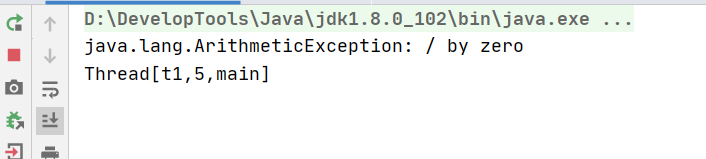

4. 打印线程的堆栈调用信息

   ```java
   // 打印线程的堆栈调用信息
   Arrays.asList(Thread.currentThread().getStackTrace()).stream()
   		.filter(e -> !e.isNativeMethod())
   		.forEach(e -> Optional.of(e.getClassName() + ": " + e.getMethodName() + ": " + e.getLineNumber())
   				.ifPresent(System.out::println));
   ```

### 3.自定义一个线程池

1. 背景：为什么需要线程池

   在需要线程来执行一些任务时，肯定要经历创建线程和销毁线程的过程。当下次又需要用到线程时，会再次的创建线程，执行完后销毁线程。频繁的创建线程和销毁线程是非常耗费资源的，所以需要线程池来帮我们统一管理线程的创建，执行，销毁。
   
2. 想法：在服务器启动的时候，就已经创建了若干个线程。当需要线程执行任务的时候，就从这若干个线程中拿一个。线程任务执行完，也不进行销毁，让其回到原来的地方，留待下一次被复用。可以避免重复的创建和销毁线程。

#### 3.1.简单线程池

1. 代码演示：

   ```java
   public class SimpleThreadPool {
   
       // 初始值
       private final int size;
   
       // 默认初始值
       private final static int DEFAULT_SIZE = 10;
   
       // 作为创建线程名称的部分
       private static volatile int seq = 0;
   
       // 线程名前缀
       private final static String THREAD_PREFIX = "SIMPLE_THREAD_POOL-";
   
       // 线程组
       private final static ThreadGroup GROUP = new ThreadGroup("Pool_Group");
   
       // 任务队列
       private final static LinkedList<Runnable> TASK_QUEUE = new LinkedList<>();
   
       // 线程队列
       private final static List<WorkerTask> THREAD_QUEUE = new ArrayList<>();
   
       public SimpleThreadPool() {
           this(DEFAULT_SIZE);
       }
   
       public SimpleThreadPool(int size) {
           this.size = size;
           // 初始化线程池
           init();
       }
   
       // 初始化线程池：创建DEFAULT_SIZE个线程任务
       private void init() {
           for (int i = 0; i < size; i++) {
               createWorkTask();
           }
       }
   
       // 创建一个自定义线程
       private void createWorkTask() {
           WorkerTask task = new WorkerTask(GROUP, THREAD_PREFIX + (seq++));
           /**
            * 想一下这个start会导致什么：当一个线程池被new出来后，默认会创建10个线程。
            * 每创建一个线程同时都会start：但是由于一开始任务队列中没有任务，线程都会wait()然后进入该锁的等待池中。
            * 所以当一个线程池被new出来后：默认创建10个线程，10个线程都变成WAITING状态，等待提交任务submit()唤醒后执行任务
            */
           task.start();
           THREAD_QUEUE.add(task);
       }
   
       // 暴露给外部的接口：提交任务。同时会唤醒因wait()而WAITING住的线程去执行任务。
       public void submit(Runnable runnable) {
           synchronized (TASK_QUEUE) {
               // 加到队尾
               TASK_QUEUE.addLast(runnable);
               // 唤醒TASK_QUEUE锁等待池中的线程：可以抢锁了
               TASK_QUEUE.notifyAll();
           }
       }
   
       // 线程任务状态
       private enum TaskState {
           FREE, RUNNING, BLOCKED, DEAD
       }
   
       // 自定义线程：是正在执行的线程--当前线程
       private static class WorkerTask extends Thread {
   
           private volatile TaskState taskState = TaskState.FREE;
   
           public WorkerTask(ThreadGroup group, String name) {
               super(group, name);
           }
   
           public TaskState getTaskState() {
               return this.taskState;
           }
   
           public void close() {
               this.taskState = TaskState.DEAD;
           }
   
           @Override
           public void run() {
               OUTER:
               // 如果线程没有“逻辑死亡”：就会一直在循环。尝试从任务队列中执行任务
               while (this.taskState != TaskState.DEAD) {
                   Runnable runnable;
                   synchronized (TASK_QUEUE) {
                       // 任务队列是空
                       while (TASK_QUEUE.isEmpty()) {
                           try {
                               taskState = TaskState.BLOCKED;
                               TASK_QUEUE.wait();
                           } catch (InterruptedException e) {
                               // 如果在WAITING时被打断：让其跳出内层while，执行外层while。继续尝试从任务队列中拿任务执行
                               break OUTER;
                           }
                       }
   
                       // 任务队列不为空：取出队头任务
                       runnable = TASK_QUEUE.removeFirst();
                   }
   
                   /**
                    * 执行新的任务：为什么把任务的执行放到synchronized外部。
                    * 因为这个任务的执行时间是不确定的，可能会很长，这样就导致每个任务执行时都会一直占着该锁.执行完才释放，然后被下一个任务抢占到执行。
                    * 相当于串行执行每个提交的任务。
                    */
                   if (runnable != null) {
                       taskState = TaskState.RUNNING;
                       runnable.run();
                       // 执行完：该线程成为空闲状态
                       taskState = TaskState.FREE;
                   }
   
                   /**
                    * 每执行完一个任务后，这个线程不会死亡。怎么控制这个线程不死的？
                    * 让这个线程的run一直在while循环中：没有任务就WAITING，有任务就notify。
                    * 执行完一个任务后，又进入到外层的while，开始看看有没有新任务。
                    * 这样我们就实现了线程池中的10个线程能重复利用。
                    */
               }
           }
       }
   }
   ```

2. 测试：创建40个runnable，并submit。注意不是创建40个线程

   ```java
       // 测试一下
       public static void main(String[] args) {
           SimpleThreadPool threadPool = new SimpleThreadPool();
           System.out.println("方便打断点...");
           IntStream.rangeClosed(0,40).forEach(i -> threadPool.submit(() -> {
               System.out.println("The runnable " + i + " be serviced by " + Thread.currentThread() + " start");
               try {
                   Thread.sleep(10_000L);
               } catch (InterruptedException e) {
                   e.printStackTrace();
               }
               System.out.println("The runnable " + i + " be serviced by " + Thread.currentThread() + " done");
           }));
       }
   ```

3. 效果演示：

   我们创建了40个任务，但是线程池中只创建了10个线程，所以最多同时10个线程同时工作。

   我们实现了线程池中的10个线程能重复利用。

   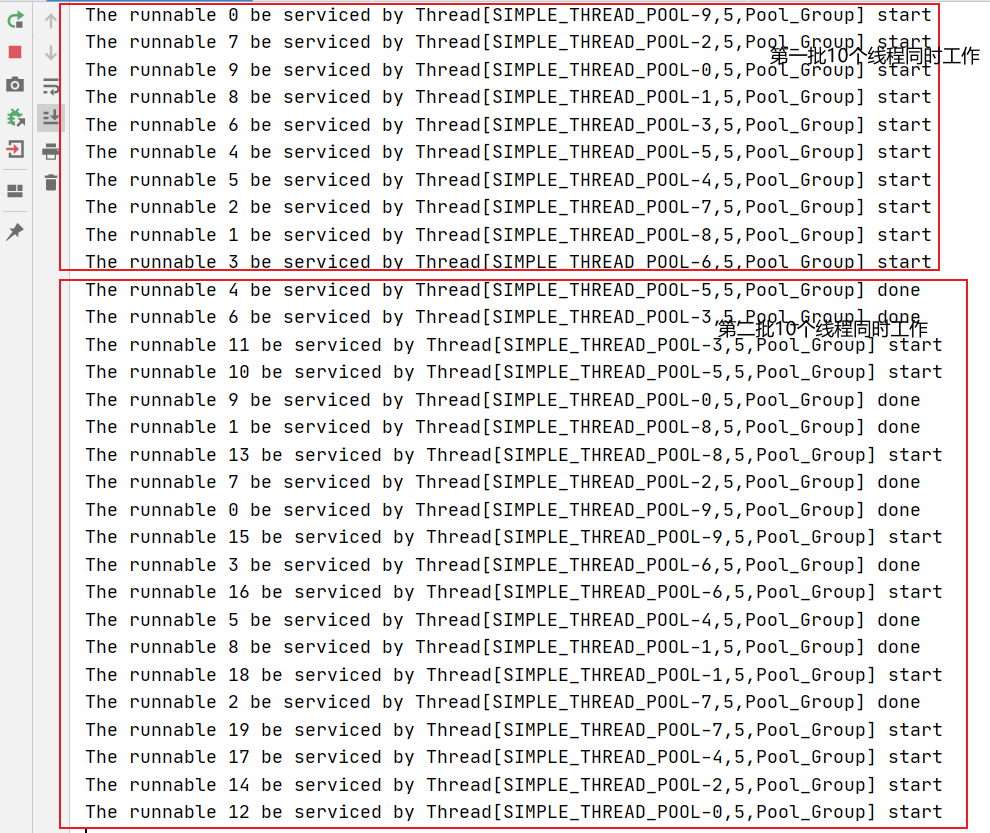

4. 待完善点：

   我们注意到，当40个任务都执行完后，应用没有结束。因为SimpleThreadPool中的10个线程并没有死亡，由于任务队列已空，导致10个线程都处于WAITING状态。所以程序还没有结束。

   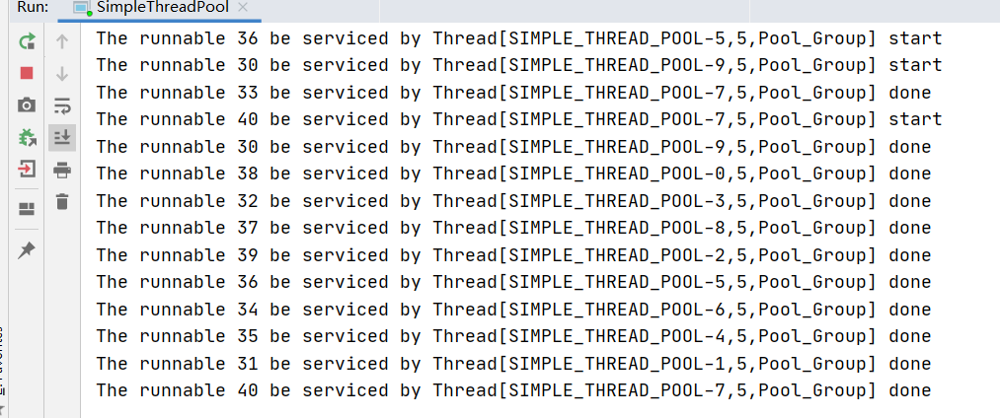

   待完善点：销毁线程池，拒绝策略，活跃线程active...

#### 3.2.拒绝策略

1. 我们不允许无限制的submit任务，当达到一定的阈值后，就启用拒绝策略：抛异常，丢弃，放到一个临时队列中...

2. 代码演示：当达到任务队列的最大长度后，在主线程中抛出异常：导致后续的submit直接失败

   ```java
   public class SimpleThreadPoolV2 {
   
       // 线程数量初始值
       private final int size;
   
       // 任务数量
       private final int queueSize;
   
       // 拒绝策略
       private final DiscardPolicy discardPolicy;
   
       // 默认线程数量初始值
       private final static int DEFAULT_SIZE = 10;
   
       // 默认任务数量初始值
       private final static int DEFAULT_TASK_QUEUE_SIZE = 2000;
   
       // 默认拒绝策略
       public final static DiscardPolicy DEFAULT_DISCARD_POLICY = () -> {
           throw new DiscardException("Discard this task");
       };
   
       // 作为创建线程名称的部分
       private static volatile int seq = 0;
   
       // 线程名前缀
       private final static String THREAD_PREFIX = "SIMPLE_THREAD_POOL-";
   
       // 线程组
       private final static ThreadGroup GROUP = new ThreadGroup("Pool_Group");
   
       // 任务队列
       private final static LinkedList<Runnable> TASK_QUEUE = new LinkedList<>();
   
       // 线程队列
       private final static List<WorkerTask> THREAD_QUEUE = new ArrayList<>();
   
       public SimpleThreadPoolV2() {
           this(DEFAULT_SIZE, DEFAULT_TASK_QUEUE_SIZE, DEFAULT_DISCARD_POLICY);
       }
   
       public SimpleThreadPoolV2(int size, int queueSize, DiscardPolicy discardPolicy) {
           this.size = size;
           this.queueSize = queueSize;
           this.discardPolicy = discardPolicy;
           // 初始化线程池
           init();
       }
   
       // 初始化线程池：创建DEFAULT_SIZE个线程任务
       private void init() {
           for (int i = 0; i < size; i++) {
               createWorkTask();
           }
       }
   
       // 创建一个自定义线程
       private void createWorkTask() {
           WorkerTask task = new WorkerTask(GROUP, THREAD_PREFIX + (seq++));
           /**
            * 想一下这个start会导致什么：当一个线程池被new出来后，默认会创建10个线程。
            * 每创建一个线程同时都会start：但是由于一开始任务队列中没有任务，线程都会wait()然后进入该锁的等待池中。
            * 所以当一个线程池被new出来后：默认创建10个线程，10个线程都变成WAITING状态，等待提交任务submit()唤醒后执行任务
            */
           task.start();
           THREAD_QUEUE.add(task);
       }
   
       // 线程状态
       private enum TaskState {
           FREE, RUNNING, BLOCKED, DEAD
       }
   
       // 自定义拒绝异常
       public static class DiscardException extends RuntimeException {
           public DiscardException(String message) {
               super(message);
           }
       }
   
       // 拒绝策略：抛出自定义拒绝异常
       public interface DiscardPolicy {
           void discard() throws DiscardException;
       }
   
       // 暴露给外部的接口：提交任务。同时会唤醒因wait()而WAITING住的线程去执行任务。
       public void submit(Runnable runnable, int index) {
           synchronized (TASK_QUEUE) {
               if (TASK_QUEUE.size() > queueSize)
                   // 因为触发拒绝策略会抛异常，直接结束这次submit的执行
                   discardPolicy.discard();
               // 加到队尾
               TASK_QUEUE.addLast(runnable);
               System.out.println("The runnable " + index + " add to task queue");
               // 唤醒TASK_QUEUE锁等待池中的线程：可以抢锁了
               TASK_QUEUE.notifyAll();
           }
       }
   
       // 自定义线程：是正在执行的线程--当前线程
       private static class WorkerTask extends Thread {
   
           private volatile TaskState taskState = TaskState.FREE;
   
           public WorkerTask(ThreadGroup group, String name) {
               super(group, name);
           }
   
           public TaskState getTaskState() {
               return this.taskState;
           }
   
           public void close() {
               this.taskState = TaskState.DEAD;
           }
   
           @Override
           public void run() {
               OUTER:
               // 如果线程没有“逻辑死亡”：就会一直在循环。尝试从任务队列中执行任务
               while (this.taskState != TaskState.DEAD) {
                   Runnable runnable;
                   synchronized (TASK_QUEUE) {
                       // 任务队列是空
                       while (TASK_QUEUE.isEmpty()) {
                           try {
                               taskState = TaskState.BLOCKED;
                               TASK_QUEUE.wait();
                           } catch (InterruptedException e) {
                               // 如果在WAITING时被打断：让其跳出内层while，执行外层while。继续尝试从任务队列中拿任务执行
                               break OUTER;
                           }
                       }
   
                       // 任务队列不为空：取出队头任务
                       runnable = TASK_QUEUE.removeFirst();
                   }
   
                   /**
                    * 执行新的任务：为什么把任务的执行放到synchronized外部。
                    * 因为这个任务的执行时间是不确定的，可能会很长，这样就导致每个任务执行时都会一直占着该锁.执行完才释放，然后被下一个任务抢占到执行。
                    * 相当于串行执行每个提交的任务。
                    */
                   if (runnable != null) {
                       taskState = TaskState.RUNNING;
                       runnable.run();
                       // 执行完：该线程成为空闲状态
                       taskState = TaskState.FREE;
                   }
   
                   /**
                    * 每执行完一个任务后，这个线程不会死亡。怎么控制这个线程不死的？
                    * 让这个线程的run一直在while循环中：没有任务就WAITING，有任务就notify。
                    * 执行完一个任务后，又进入到外层的while，开始看看有没有新任务。
                    * 这样我们就实现了线程池中的10个线程能重复利用。
                    */
               }
           }
       }
   }
   ```

3. 测试一下：线程数量6，任务队列容量10，拒绝策略-抛运行时异常

   ```java
   // 测试一下
   public static void main(String[] args) {
   	/**
   	 * 加上拒绝策略后：new SimpleThreadPoolV2(6, 10, SimpleThreadPoolV2.DEFAULT_DISCARD_POLICY);
   	 * 线程池有6个线程，任务队列最大容量10.当我们初始化完成这个线程池后，线程池中创建了6个线程，且由于此时任务队列为空，都处于WAITING状态。
   	 */
   	SimpleThreadPoolV2 threadPool = new SimpleThreadPoolV2(6, 10, SimpleThreadPoolV2.DEFAULT_DISCARD_POLICY);
   	System.out.println("方便打断点...");
   	// 注意：只要这里的submit因为拒绝策略报了一次错，main线程就执行结束了
   	IntStream.rangeClosed(0,40).forEach(i -> threadPool.submit(() -> {
   		System.out.println("The runnable " + i + " be serviced by " + Thread.currentThread().getName() + " start");
   		try {
   			Thread.sleep(10_000L);
   		} catch (InterruptedException e) {
   			e.printStackTrace();
   		}
   		System.out.println("The runnable " + i + " be serviced by " + Thread.currentThread().getName() + " done");
   	}, i));
   
   	System.out.println("因为submit的报错，没有执行这一行...");
   }
   ```

   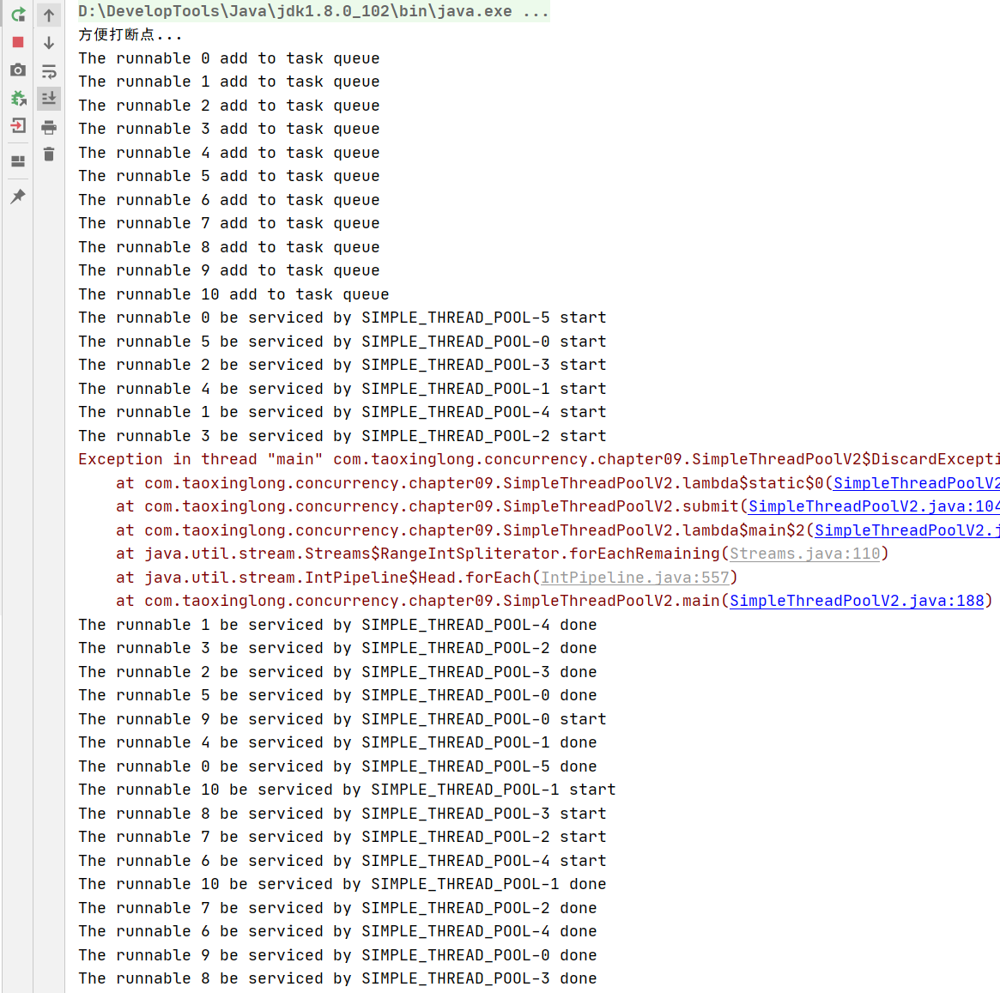

4. 我们来根据结果，来看一下代码究竟执行了些什么

   1. SimpleThreadPoolV2 threadPool = new SimpleThreadPoolV2(6, 10, SimpleThreadPoolV2.DEFAULT_DISCARD_POLICY);

      当我们初始化完成这个线程池后，线程池中创建了6个线程，任务队列最大容量10，且由于此时任务队列为空，这6个线程都处于WAITING状态。

   2. 开始submit：通过控制台我们发现main线程连着抢到11次TASK_QUEUE同步锁。

      也就是每次入runnable到任务队列时，虽然会notifyAll WAITING的线程，但是下次还是被main线程抢到了TASK_QUEUE锁，然后main线程继续入runnable到任务队列。直到入了11个runnable，在入第12个runnable时，触发了拒绝策略。

      为什么能入11个：因为是TASK_QUEUE.size() > queueSize，不是 >= 。在入第12个runnable时，触发了拒绝策略。导致main线程直接结束，所以线程池只接收了11个任务。当然由于存在main线程和6个工作线程抢占锁的情况，可能每次执行结果不同。可能任务队列还没满时，就被工作线程开始消费了，导致能多入几个runnable。

      最多能入几个：在任务队列还没满时，6个线程也都抢占了一次锁，然后开始执行任务单元。然后任务队列才达到11，触发了拒绝策略。最多能入17个runnable任务。

      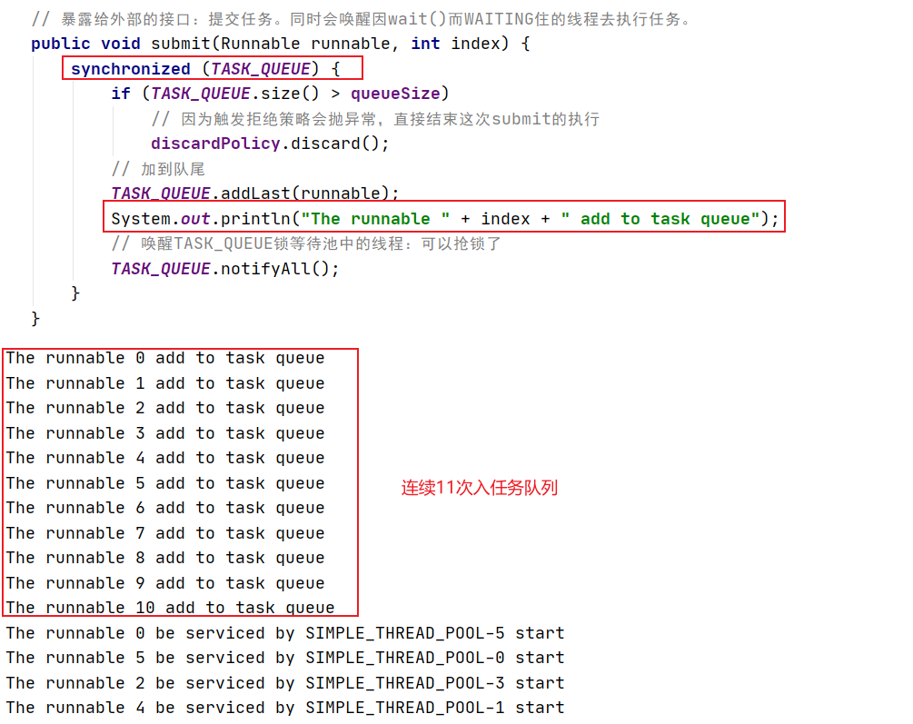

#### 3.3.销毁线程池

   1. 我们之前也看到了，即使任务都执行完了，我们的Java应用仍然在运行着。原因是线程池中创建的线程在执行完任务队列中的任务后，并没有销毁。而是因为wait()方法的调用，处于WAITING状态。等待着其他线程的唤醒。

      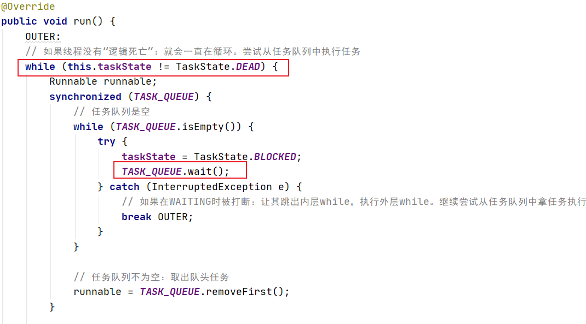

   2. 实现一个销毁线程池的方法：

      ```java
          // 关闭这个线程池
          public void shutdown() throws InterruptedException {
      
              // 如果任务队列还有任务，我们等待一会在检查
              while (!TASK_QUEUE.isEmpty()) {
                  Thread.sleep(50);
              }
      
              int initValue = THREAD_QUEUE.size();
              while (initValue > 0) {
                  for (WorkerTask task : THREAD_QUEUE) {
                      // 任务队列为空，并且这个线程还处于WAITING状态（调用wait()导致的）
                      if (task.getTaskState() == TaskState.BLOCKED) {
                          // 打断其WAITING状态，并且将状态置成DEAD。
                          task.interrupt();
                          task.close();
                          initValue--;
                      }else {
                          /**
                           * 如果任务队列为空，但是这个线程没有处于WAITING状态，说明它当前任务还没执行完。
                           * 我们休眠一会然后跳过，检查下一个线程：反正后面还会再次进入外层while，直到将这个线程置为DEAD，然后initValue--，最后跳出循环
                           */
                          Thread.sleep(10);
                      }
                  }
              }
      
              this.destroy = true;
              System.out.println("The thread pool disposed");
          }
      ```

   3. 总体代码：

      ```java
      public class SimpleThreadPoolV2 {
      
          // 线程数量初始值
          private final int size;
      
          // 任务数量
          private final int queueSize;
      
          // 拒绝策略
          private final DiscardPolicy discardPolicy;
      
          // 默认线程数量初始值
          private final static int DEFAULT_SIZE = 10;
      
          // 默认任务数量初始值
          private final static int DEFAULT_TASK_QUEUE_SIZE = 2000;
      
          // 默认拒绝策略
          public final static DiscardPolicy DEFAULT_DISCARD_POLICY = () -> {
              throw new DiscardException("Discard this task");
          };
      
          // 作为创建线程名称的部分
          private static volatile int seq = 0;
      
          // 线程名前缀
          private final static String THREAD_PREFIX = "SIMPLE_THREAD_POOL-";
      
          // 线程组
          private final static ThreadGroup GROUP = new ThreadGroup("Pool_Group");
      
          // 任务队列
          private final static LinkedList<Runnable> TASK_QUEUE = new LinkedList<>();
      
          // 线程队列
          private final static List<WorkerTask> THREAD_QUEUE = new ArrayList<>();
      
          // 线程池是否已被销毁
          private volatile boolean destroy = false;
      
          public SimpleThreadPoolV2() {
              this(DEFAULT_SIZE, DEFAULT_TASK_QUEUE_SIZE, DEFAULT_DISCARD_POLICY);
          }
      
          public SimpleThreadPoolV2(int size, int queueSize, DiscardPolicy discardPolicy) {
              this.size = size;
              this.queueSize = queueSize;
              this.discardPolicy = discardPolicy;
              // 初始化线程池
              init();
          }
      
          // 初始化线程池：创建DEFAULT_SIZE个线程任务
          private void init() {
              for (int i = 0; i < size; i++) {
                  createWorkTask();
              }
          }
      
          // 创建一个自定义线程
          private void createWorkTask() {
              WorkerTask task = new WorkerTask(GROUP, THREAD_PREFIX + (seq++));
              /**
               * 想一下这个start会导致什么：当一个线程池被new出来后，默认会创建10个线程。
               * 每创建一个线程同时都会start：但是由于一开始任务队列中没有任务，线程都会wait()然后进入该锁的等待池中。
               * 所以当一个线程池被new出来后：默认创建10个线程，10个线程都变成WAITING状态，等待提交任务submit()唤醒后执行任务
               */
              task.start();
              THREAD_QUEUE.add(task);
          }
      
          // 线程状态
          private enum TaskState {
              FREE, RUNNING, BLOCKED, DEAD
          }
      
          // 自定义拒绝异常
          public static class DiscardException extends RuntimeException {
              public DiscardException(String message) {
                  super(message);
              }
          }
      
          // 拒绝策略：抛出自定义拒绝异常
          public interface DiscardPolicy {
              void discard() throws DiscardException;
          }
      
          public int getQueueSize() {
              return queueSize;
          }
      
          public int getSize() {
              return size;
          }
      
          public boolean isDestroy() {
              return this.destroy;
          }
      
          // 关闭这个线程池
          public void shutdown() throws InterruptedException {
      
              // 如果任务队列还有任务，我们等待一会在检查
              while (!TASK_QUEUE.isEmpty()) {
                  Thread.sleep(50);
              }
      
              int initValue = THREAD_QUEUE.size();
              while (initValue > 0) {
                  for (WorkerTask task : THREAD_QUEUE) {
                      // 任务队列为空，并且这个线程还处于WAITING状态（调用wait()导致的）
                      if (task.getTaskState() == TaskState.BLOCKED) {
                          // 打断其WAITING状态，并且将状态置成DEAD。
                          task.interrupt();
                          task.close();
                          initValue--;
                      }else {
                          /**
                           * 如果任务队列为空，但是这个线程没有处于WAITING状态，说明它当前任务还没执行完。
                           * 我们休眠一会然后跳过，检查下一个线程：反正后面还会再次进入外层while，直到将这个线程置为DEAD，然后initValue--，最后跳出循环
                           */
                          Thread.sleep(10);
                      }
                  }
              }
      
              this.destroy = true;
              System.out.println("The thread pool disposed");
          }
      
          // 暴露给外部的接口：提交任务。同时会唤醒因wait()而WAITING住的线程去执行任务。
          public void submit(Runnable runnable, int index) {
              if (destroy)
                  throw new IllegalStateException("The thread pool already destroy and not allow submit");
              synchronized (TASK_QUEUE) {
                  if (TASK_QUEUE.size() > queueSize)
                      // 因为触发拒绝策略会抛异常，直接结束这次submit的执行
                      discardPolicy.discard();
                  // 加到队尾
                  TASK_QUEUE.addLast(runnable);
                  System.out.println("The runnable " + index + " add to task queue");
                  // 唤醒TASK_QUEUE锁等待池中的线程：可以抢锁了
                  TASK_QUEUE.notifyAll();
              }
          }
      
          // 自定义线程：是正在执行的线程--当前线程
          private static class WorkerTask extends Thread {
      
              private volatile TaskState taskState = TaskState.FREE;
      
              public WorkerTask(ThreadGroup group, String name) {
                  super(group, name);
              }
      
              public TaskState getTaskState() {
                  return this.taskState;
              }
      
              public void close() {
                  this.taskState = TaskState.DEAD;
              }
      
              @Override
              public void run() {
                  OUTER:
                  // 如果线程没有“逻辑死亡”：就会一直在循环。尝试从任务队列中执行任务
                  while (this.taskState != TaskState.DEAD) {
                      Runnable runnable;
                      synchronized (TASK_QUEUE) {
                          // 任务队列是空
                          while (TASK_QUEUE.isEmpty()) {
                              try {
                                  taskState = TaskState.BLOCKED;
                                  TASK_QUEUE.wait();
                              } catch (InterruptedException e) {
                                  // 如果在WAITING时被打断：让其跳出内层while，执行外层while。继续尝试从任务队列中拿任务执行
                                  break OUTER;
                              }
                          }
      
                          // 任务队列不为空：取出队头任务
                          runnable = TASK_QUEUE.removeFirst();
                      }
      
                      /**
                       * 执行新的任务：为什么把任务的执行放到synchronized外部。
                       * 因为这个任务的执行时间是不确定的，可能会很长，这样就导致每个任务执行时都会一直占着该锁.执行完才释放，然后被下一个任务抢占到执行。
                       * 相当于串行执行每个提交的任务。
                       */
                      if (runnable != null) {
                          taskState = TaskState.RUNNING;
                          runnable.run();
                          // 执行完：该线程成为空闲状态
                          taskState = TaskState.FREE;
                      }
      
                      /**
                       * 每执行完一个任务后，这个线程不会死亡。怎么控制这个线程不死的？
                       * 让这个线程的run一直在while循环中：没有任务就WAITING，有任务就notify。
                       * 执行完一个任务后，又进入到外层的while，开始看看有没有新任务。
                       * 这样我们就实现了线程池中的10个线程能重复利用。
                       */
                  }
              }
          }
      }
      ```

   4. 测试一下：

      ```java
      // 测试一下
      public static void main(String[] args) {
      	/**
      	 * 加上拒绝策略后：new SimpleThreadPoolV2(6, 10, SimpleThreadPoolV2.DEFAULT_DISCARD_POLICY);
      	 * 线程池有6个线程，任务队列最大容量10.当我们初始化完成这个线程池后，线程池中创建了6个线程，且由于此时任务队列为空，都处于WAITING状态。
      	 */
      	SimpleThreadPoolV2 threadPool = new SimpleThreadPoolV2(6, 10, SimpleThreadPoolV2.DEFAULT_DISCARD_POLICY);
      	// 注意：只要这里的submit因为拒绝策略报了一次错，main线程就执行结束了
      	try {
      		IntStream.rangeClosed(0,40).forEach(i -> threadPool.submit(() -> {
      			System.out.println("The runnable " + i + " be serviced by " + Thread.currentThread().getName() + " start");
      			try {
      				Thread.sleep(5_000L);
      			} catch (InterruptedException e) {
      				e.printStackTrace();
      			}
      			System.out.println("The runnable " + i + " be serviced by " + Thread.currentThread().getName() + " done");
      		}, i));
      	} catch (DiscardException e) {
      		try {
      			// 销毁线程池
      			threadPool.shutdown();
      			// 演示一下线程池被销毁后，再次提交任务，会抛出IllegalStateException异常
      			threadPool.submit(() -> System.out.println("====="), 999);
      		} catch (InterruptedException | IllegalStateException ex) {
      			ex.printStackTrace();
      		}
      		// 这里抓住的是拒绝策略抛出的异常
      		e.printStackTrace();
      	}
      }
      ```

      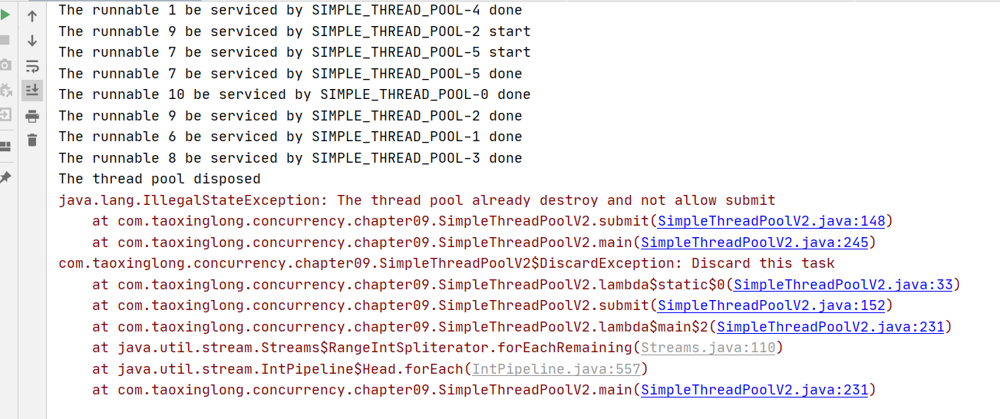


#### 3.4.动态扩容线程数量和缩减空闲线程

看代码和注释吧：

```java
package com.taoxinglong.concurrency.chapter09;

import java.util.ArrayList;
import java.util.Iterator;
import java.util.LinkedList;
import java.util.List;
import java.util.stream.IntStream;

/**
 * 描述：简单线程池
 *  实现线程的重复利用。并且加上拒绝策略。再加上active，max，min等逻辑
 *
 * @author txl
 * @date 2022-03-16 12:03
 */
public class SimpleThreadPoolV3 extends Thread{

    // 线程数量初始值
    private int size;

    // 任务数量
    private final int queueSize;

    // 拒绝策略
    private final DiscardPolicy discardPolicy;

    // 默认任务数量初始值
    private final static int DEFAULT_TASK_QUEUE_SIZE = 2000;

    // 默认拒绝策略
    public final static DiscardPolicy DEFAULT_DISCARD_POLICY = () -> {
        throw new DiscardException("Discard this task");
    };

    // 作为创建线程名称的部分
    private static volatile int seq = 0;

    // 线程名前缀
    private final static String THREAD_PREFIX = "SIMPLE_THREAD_POOL-";

    // 线程组
    private final static ThreadGroup GROUP = new ThreadGroup("Pool_Group");

    // 任务队列
    private final static LinkedList<Runnable> TASK_QUEUE = new LinkedList<>();

    // 线程队列
    private final static List<WorkerTask> THREAD_QUEUE = new ArrayList<>();

    // 线程池是否已被销毁
    private volatile boolean destroy = false;

    private int min;

    private int max;

    private int active;

    // 不传size线程数量了，线程数量现在是动态变化的
    public SimpleThreadPoolV3() {
        this(4, 8, 12, DEFAULT_TASK_QUEUE_SIZE, DEFAULT_DISCARD_POLICY);
    }

    public SimpleThreadPoolV3(int min, int active, int max, int queueSize, DiscardPolicy discardPolicy) {
        this.min = min;
        this.active = active;
        this.max = max;
        this.size = size;
        this.queueSize = queueSize;
        this.discardPolicy = discardPolicy;
        // 初始化线程池
        init();
    }

    // 初始化线程池：创建DEFAULT_SIZE个线程任务
    private void init() {
        // 先初始化min个线程
        for (int i = 0; i < this.min; i++) {
            createWorkTask();
        }
        this.size = min;
        // 启动线程池的任务执行单元
        this.start();
    }

    // 创建一个自定义线程
    private void createWorkTask() {
        WorkerTask task = new WorkerTask(GROUP, THREAD_PREFIX + (seq++));
        /**
         * 想一下这个start会导致什么：当一个线程池被new出来后，默认会创建10个线程。
         * 每创建一个线程同时都会start：但是由于一开始任务队列中没有任务，线程都会wait()然后进入该锁的等待池中。
         * 所以当一个线程池被new出来后：默认创建10个线程，10个线程都变成WAITING状态，等待提交任务submit()唤醒后执行任务
         */
        task.start();
        THREAD_QUEUE.add(task);
    }

    /**
     * 线程池的任务执行单元：对线程池整体做一些调整
     */
    @Override
    public void run() {
        while (!isDestroy()) {
            System.out.printf("Pool# Min: %d, Active: %d, Max: %d, CurrentThreadSize: %d, TaskQueueSize: %d\n",
                    this.min, this.active, this.max, this.size, TASK_QUEUE.size());
            try {
                // 这里休眠5s后：任务队列会入40个任务，同时有4个线程开始工作了。size=4
                Thread.sleep(5_000);
                // 首先扩容：当任务数量大于预设的活跃线程数，且目前线程数小于预设的活跃线程数：新增线程数到active
                if (TASK_QUEUE.size() > active && size < active) {
                    for (int i = size; i < active; i++) {
                        createWorkTask();
                    }
                    System.out.printf("The PoolSize from %d increment to %d\n", this.size, this.active);
                    size = active;
                } else if (TASK_QUEUE.size() > max && size < max) {
                    // 再次扩容：当任务数量大于预设的最大线程数，且目前线程数小于预设的最大线程数：新增线程数到max
                    for (int i = size; i < max; i++) {
                        createWorkTask();
                    }
                    System.out.printf("The PoolSize from %d increment to %d\n", this.size, this.max);
                    size = max;
                }

                // 对THREAD_QUEUE加锁：因为缩减线程时会修改THREAD_QUEUE
                synchronized (THREAD_QUEUE) {
                    // 对TASK_QUEUE加锁：避免缩减线程时又有新的runnable任务submit进来
                    synchronized (TASK_QUEUE) {
                        if (TASK_QUEUE.isEmpty() && size > active) {
                            int releaseSize = size - active;
                            // 迭代器：遍历的时候可以进行修改操作
                            for (Iterator<WorkerTask> it = THREAD_QUEUE.iterator(); it.hasNext();) {
                                if (releaseSize <= 0)
                                    break;
                                WorkerTask task = it.next();
                                // runnable任务执行完才运行interrupt打断关闭
                                if (task.taskState == TaskState.BLOCKED) {
                                    // 线程状态置为DEAD
                                    task.close();
                                    task.interrupt();
                                    System.out.println("=======================Reduce...");
                                    it.remove();
                                    releaseSize--;
                                    size--;
                                }
                            }
                            //size = active;
                        }
                    }
                }
            } catch (InterruptedException e) {
                e.printStackTrace();
            }
        }
    }

    // 线程状态
    private enum TaskState {
        FREE, RUNNING, BLOCKED, DEAD
    }

    // 自定义拒绝异常
    public static class DiscardException extends RuntimeException {
        public DiscardException(String message) {
            super(message);
        }
    }

    // 拒绝策略：抛出自定义拒绝异常
    public interface DiscardPolicy {
        void discard() throws DiscardException;
    }

    public int getQueueSize() {
        return queueSize;
    }

    public int getSize() {
        return size;
    }

    public boolean isDestroy() {
        return this.destroy;
    }

    public int getMin() {
        return min;
    }

    public int getMax() {
        return max;
    }

    public int getActive() {
        return active;
    }

    // 关闭这个线程池
    public void shutdown() throws InterruptedException {

        // 如果任务队列还有任务，我们等待一会在检查
        while (!TASK_QUEUE.isEmpty()) {
            Thread.sleep(50);
        }

        synchronized (THREAD_QUEUE) {
            int initValue = THREAD_QUEUE.size();
            while (initValue > 0) {
                for (WorkerTask task : THREAD_QUEUE) {
                    // 任务队列为空，并且这个线程还处于WAITING状态（调用wait()导致的）
                    if (task.getTaskState() == TaskState.BLOCKED) {
                        // 打断其WAITING状态，并且将状态置成DEAD。
                        task.interrupt();
                        task.close();
                        System.out.println("=======================Closed...");
                        initValue--;
                    }else {
                        /**
                         * 如果任务队列为空，但是这个线程没有处于WAITING状态，说明它当前任务还没执行完。
                         * 我们休眠一会然后跳过，检查下一个线程：反正后面还会再次进入外层while，直到将这个线程置为DEAD，然后initValue--，最后跳出循环
                         */
                        Thread.sleep(10);
                    }
                }
            }
        }

        this.destroy = true;
        System.out.println("The thread pool disposed");
    }

    // 暴露给外部的接口：提交任务。同时会唤醒因wait()而WAITING住的线程去执行任务。
    public void submit(Runnable runnable, int index) {
        if (destroy)
            throw new IllegalStateException("The thread pool already destroy and not allow submit");
        synchronized (TASK_QUEUE) {
            if (TASK_QUEUE.size() > queueSize)
                // 因为触发拒绝策略会抛异常，直接结束这次submit的执行
                discardPolicy.discard();
            // 加到队尾
            TASK_QUEUE.addLast(runnable);
            //System.out.println("The runnable " + index + " add to task queue");
            // 唤醒TASK_QUEUE锁等待池中的线程：可以抢锁了
            TASK_QUEUE.notifyAll();
        }
    }

    // 自定义线程：是正在执行的线程--当前线程
    private static class WorkerTask extends Thread {

        private volatile TaskState taskState = TaskState.FREE;

        public WorkerTask(ThreadGroup group, String name) {
            super(group, name);
        }

        public TaskState getTaskState() {
            return this.taskState;
        }

        public void close() {
            this.taskState = TaskState.DEAD;
        }

        @Override
        public void run() {
            OUTER:
            // 如果线程没有“逻辑死亡”：就会一直在循环。尝试从任务队列中执行任务
            while (this.taskState != TaskState.DEAD) {
                Runnable runnable;
                synchronized (TASK_QUEUE) {
                    // 任务队列是空
                    while (TASK_QUEUE.isEmpty()) {
                        try {
                            taskState = TaskState.BLOCKED;
                            TASK_QUEUE.wait();
                        } catch (InterruptedException e) {
                            // 如果在WAITING时被打断：让其跳出内层while，执行外层while。继续尝试从任务队列中拿任务执行
                            break OUTER;
                        }
                    }

                    // 任务队列不为空：取出队头任务
                    runnable = TASK_QUEUE.removeFirst();
                }

                /**
                 * 执行新的任务：为什么把任务的执行放到synchronized外部。
                 * 因为这个任务的执行时间是不确定的，可能会很长，如果放在sync块中，这样就导致每个任务执行时都会一直占着该锁.执行完才释放，然后被下一个任务抢占到执行。
                 * 相当于串行执行每个提交的任务。
                 */
                if (runnable != null) {
                    taskState = TaskState.RUNNING;
                    runnable.run();
                    // 执行完：该线程成为空闲状态
                    taskState = TaskState.FREE;
                }

                /**
                 * 每执行完一个任务后，这个线程不会死亡。怎么控制这个线程不死的？
                 * 让这个线程的run一直在while循环中：没有任务就WAITING，有任务就notify。
                 * 执行完一个任务后，又进入到外层的while，开始看看有没有新任务。
                 * 这样我们就实现了线程池中的10个线程能重复利用。
                 */
            }
        }
    }

    // 测试一下
    public static void main(String[] args) {
        SimpleThreadPoolV3 threadPool = new SimpleThreadPoolV3();
        // 注意：只要这里的submit因为拒绝策略报了一次错，main线程就执行结束了
        IntStream.rangeClosed(0,40).forEach(i -> threadPool.submit(() -> {
            System.out.println("The runnable " + i + " be serviced by " + Thread.currentThread().getName() + " start");
            try {
                Thread.sleep(3_000L);
            } catch (InterruptedException e) {
                e.printStackTrace();
            }
            System.out.println("The runnable " + i + " be serviced by " + Thread.currentThread().getName() + " done");
        }, i));


        try {
            Thread.sleep(30_000);
            threadPool.shutdown();
        } catch (InterruptedException e) {
            e.printStackTrace();
        }
    }
}

```

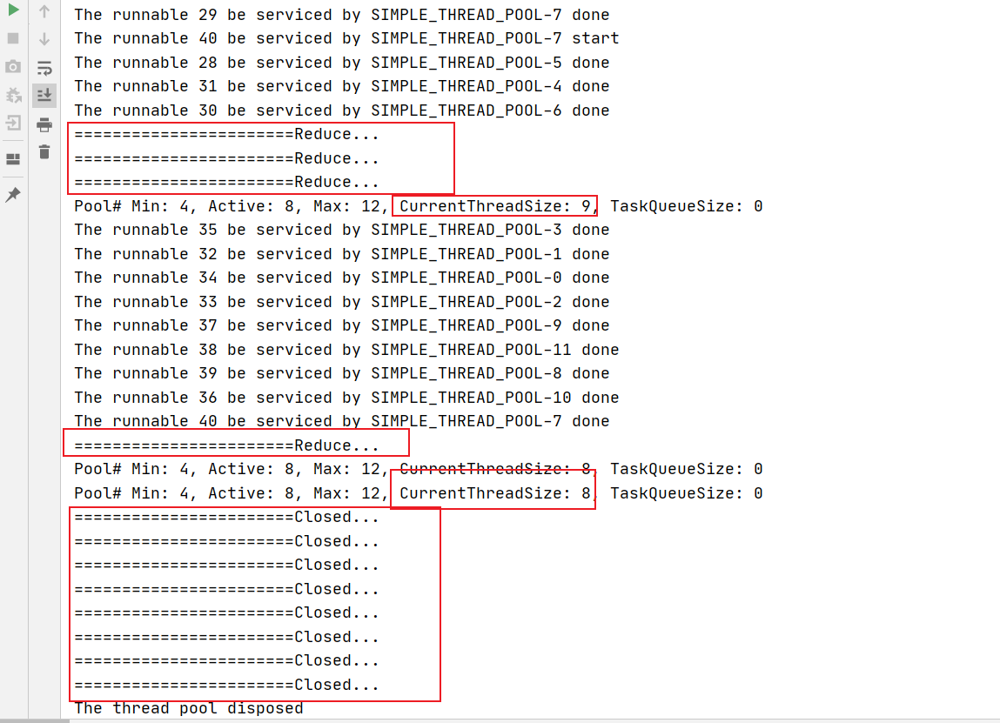


### 4.ThreadPoolExecutor源码分析

继承关系图：

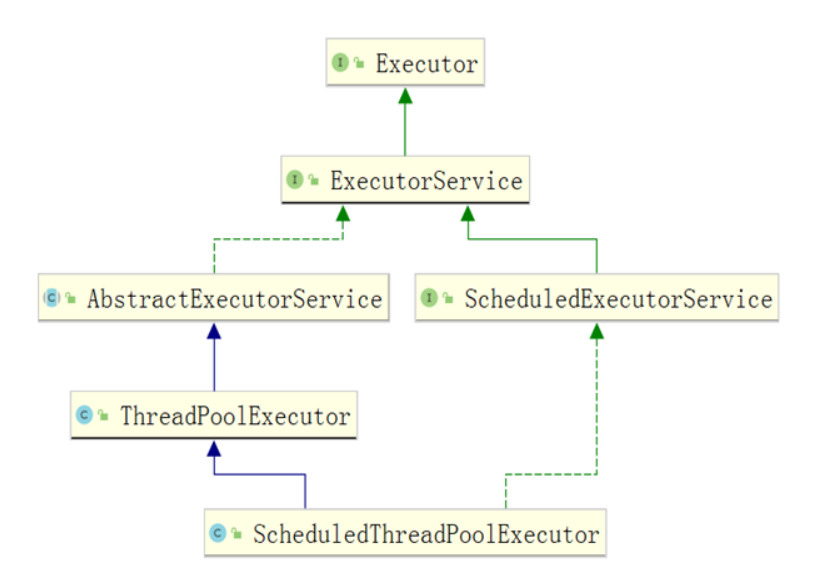

#### 4.1.ThreadPoolExecutor的简单介绍

1. 为什么需要线程池

   在需要线程来执行一些任务时，肯定要经历创建线程和销毁线程的过程。当下次又需要用到线程时，会再次的创建线程，执行完后销毁线程。频繁的创建线程和销毁线程是非常耗费资源的，所以需要线程池来帮我们统一管理线程的创建，执行，销毁。

   在服务器启动的时候，就已经创建了若干个线程。当需要线程执行任务的时候，就从这若干个线程中拿一个。没有空闲线程的话，可以做排队处理。线程任务执行完，也不进行销毁，让其回到原来的地方，留待下一次被复用。可以避免重复的创建和销毁线程。

2. JDK提供了 Executors这个工具类，为什么还要手动创建线程池

   它提供了很多封装好的线程池，但是我们一般会自己new一个线程池ThreadPoolExecutor。因为Executores提供的线程池中的参数都是封装死的，不一定适合服务器硬件和当前的业务，而且线程池创建的线程的名字也不是我们控制的。所以直接使用Executores提供的线程池，导致我们无法很好的把控制线程池，没法让线程池发挥最优的效果。所以我们要自己控制线程池的核心参数，让线程池的性能尽可能高。

3. Executors提供的几个线程池

   底层都是创建的ThreadPoolExecutor线程池，我们详细看看几个参数

   - Executors.newCachedThreadPool(); //快

     ```java
     * new ThreadPoolExecutor(0, Integer.MAX_VALUE, 60L, TimeUnit.SECONDS, new SynchronousQueue<Runnable>());
     *      核心线程数0，
     *      最大线程数2^31 - 1
     *      空闲线程等待任务的最长时间：60s
     *      SynchronousQueue同步阻塞队列：其中没有容量的概念，因为只有任务被消费后，才能向其中添加新的任务。
     *
     * 没有核心线程数且最大线程数是最大值，意味着只要有任务没有被执行，就会立即创建一个线程去执行。
     *
     * 缺点：因为最大线程是2^31 - 1，那么意味着在并发量特别大时，只要有队列中任务且没有空闲线程，那么就会创建线程去消费。很可能造成CPU占用率达到100%。
     ```

   - Executors.newFixedThreadPool(10); //慢

     ```java
     * new ThreadPoolExecutor(nThreads, nThreads, 0L, TimeUnit.MILLISECONDS, new LinkedBlockingQueue<Runnable>());
     *      核心线程数 10
     *      最大线程数 10 ---> 意味着固定的10个核心线程不会死亡，会被留着复用
     *      空闲线程等待任务的最长时间：0s  
     *      new LinkedBlockingQueue(Integer.MAX_VALUE) ---> 有界阻塞队列，容量是最大值
     ```

   - Executors.newSingleThreadExecutor(); //最慢

     ```java
     * new ThreadPoolExecutor(1, 1, 0L, TimeUnit.MILLISECONDS, new LinkedBlockingQueue<Runnable>()))
     *       核心线程数 1
     *       最大线程数 1
     *       空闲线程等待任务的最长时间：0s  ---> 意味着固定的1个核心线程不会死亡，会被留着复用
     *       new LinkedBlockingQueue(Integer.MAX_VALUE) ---> 有界阻塞队列，容量是最大值
     ```

4. 自己定义一个线程池

   ```java
   public class ThreadPoolDemo1 {
       public static void main(String[] args) throws ExecutionException, InterruptedException {
           ThreadPoolExecutor executor = new ThreadPoolExecutor(
                   1,
                   2,
                   500,
                   TimeUnit.SECONDS,
                   new LinkedBlockingQueue<>(),
                   new ThreadFactory() {
                       @Override
                       public Thread newThread(Runnable r) {
                           Thread t = new Thread(r, "测试-");
                           return t;
                       }
                   },
                   new ThreadPoolExecutor.AbortPolicy()
           );
   
           /**
            * execute和submit的简单区别：
            *  execute只能提交runnable任务，runnable任务没有返回结果
            *  submit可以提交callable任务，submit会返回一个Future对象，通过future.get阻塞，拿到callable中的返回结果
            */
           executor.execute(new Runnable() {
               @Override
               public void run() {
                   while (true) {
                       try {
                           Thread.sleep(1000);
                       } catch (InterruptedException e) {
                           e.printStackTrace();
                       }
                   }
               }
           });
   
           Future<Object> future = executor.submit(new Callable<Object>() {
               @Override
               public Object call() throws Exception {
                   return "abc";
               }
           });
           Object o = future.get();
           System.out.println(o);
       }
   }
   ```

5. execute和submit的简单区别：

   - execute只能提交runnable任务，runnable任务没有返回结果

     ```java
     executor.execute(new Runnable() {
         @Override
         public void run() {
             while (true) {
                 try {
                     Thread.sleep(1000);
                 } catch (InterruptedException e) {
                     e.printStackTrace();
                 }
             }
         }
     });
     ```

   - submit可以提交callable任务，submit会返回一个future对象，通过future.get阻塞，拿到callable中的返回结果

     ```java
     Future<Object> future = executor.submit(new Callable<Object>() {
         @Override
         public Object call() throws Exception {
             return "abc";
         }
     });
     Object o = future.get();
     System.out.println(o);
     ```


#### 4.2.ThreadPoolExecutor的核心参数

```java
public ThreadPoolExecutor(int corePoolSize,
                          int maximumPoolSize,
                          long keepAliveTime,
                          TimeUnit unit,
                          BlockingQueue<Runnable> workQueue,
                          ThreadFactory threadFactory,
                          RejectedExecutionHandler handler) {
}
```

```java
        ThreadPoolExecutor executor = new ThreadPoolExecutor(
                2,
                3,
                500,
                TimeUnit.SECONDS,
                new ArrayBlockingQueue<>(2),
                new ThreadFactory() {
                    @Override
                    public Thread newThread(Runnable r) {
                        Thread t = new Thread(r, "测试-");
                        return t;
                    }
                },
                new ThreadPoolExecutor.AbortPolicy()
        );
```

根据上面定义的线程池来说一下相关的参数：

- 核心线程数 ：2
- 最大线程池 ：3
- 非核心线程的空闲时间 ：500
- 空闲时间单位 ：秒
- 工作队列 ：一个容量为2的有界阻塞队列
- 线程工厂
- 拒绝策略

当一次性提交6个任务时：

- 先创建2个核心线程去执行任务1和任务2。
- **第3和第4个任务会先放到工作队列中。**
- 因为最大线程数是3所以还可以创建一个非核心线程来执行任务5。
- 第6个任务因为线程数达到了最大，且任务队列已满，会触发拒绝策略。


#### 4.3.JDK提供的四种拒绝策略

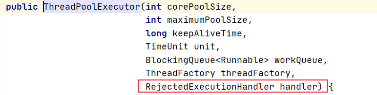

创建线程池ThreadPoolExecutor时要传入一个拒绝策略，代码层面就是要传入一个RejectedExecutionHandler接口的实现类。JDK为我们提供了4种拒绝策略

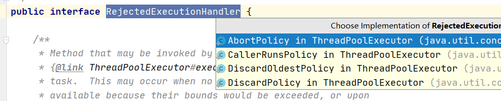

- ThreadPoolExecutor.AbortPolicy：是ThreadPoolExecutor的内部类，会直接在主线程上抛一个运行时异常

  ```java
  public void rejectedExecution(Runnable r, ThreadPoolExecutor e) {
              throw new RejectedExecutionException("Task " + r.toString() +
                                                   " rejected from " +
                                                   e.toString());
          }
  ```

- ThreadPoolExecutor.CallerRunsPolicy：触发时，会将提交的任务交给主线程运行

  ```java
  public void rejectedExecution(Runnable r, ThreadPoolExecutor e) {
              if (!e.isShutdown()) {
                  r.run();
              }
          }
  ```

- ThreadPoolExecutor.DiscardOldestPolicy：触发时，弹出任务队列对头任务，然后再提交这个任务。

  ```java
  public void rejectedExecution(Runnable r, ThreadPoolExecutor e) {
              if (!e.isShutdown()) {
                  e.getQueue().poll();
                  e.execute(r);
              }
          }
  ```

- ThreadPoolExecutor.DiscardPolicy：触发时什么都不做，也就是提交任务触发拒绝策略时，把刚才提交的任务忽略了，丢弃掉。

  ```java
  public void rejectedExecution(Runnable r, ThreadPoolExecutor e) {
          }
  ```


#### 4.4.一个重要属性 AtomicInteger ctl

1. ctl本质就是一个int类型的数值。

   ctlOf(RUNNING, 0)：RUNNING | 0 因为是和0与运算，所以结果还是RUNNING。所以ctl的初始value值就是RUNNING。

   ctl表述了两个状态：

   - 1.高三位表示线程池当前的状态
   - 2.低29位标识线程池当前的工作线程个数

   ```java
       private final AtomicInteger ctl = new AtomicInteger(ctlOf(RUNNING, 0));
   
   	// 32 - 3 = 29。主要用来进行位移运算的
   	private final int COUNT_BITS = Integer.SIZE - 3;
   	
   	// 工作线程数的最大数量：2的29次方 - 1。即包括核心线程也包括非核心线程
   	// 0001 1111 1111 1111 1111 1111 1111 1111
       private final int CAPACITY   = (1 << COUNT_BITS) - 1;
   
       // -1       : 1111 1111 1111 1111 1111 1111 1111 1111
       // -1 << 29 : 1110 0000 0000 0000 0000 0000 0000 0000
   	// 接受新任务并处理排队任务
       private final int RUNNING    = -1 << COUNT_BITS;
   
       // 0        : 0000 0000 0000 0000 0000 0000 0000 0000
       // 0 << 29  : 0000 0000 0000 0000 0000 0000 0000 0000
   	// 不接受新任务，但处理排队的任务
       private final int SHUTDOWN   =  0 << COUNT_BITS;
   
       // 1        : 0000 0000 0000 0000 0000 0000 0000 0001
       // 1 << 29  : 0010 0000 0000 0000 0000 0000 0000 0000
   	// 不接受新任务，不处理排队任务，并中断正在进行的任务
       private final int STOP       =  1 << COUNT_BITS;
   
       // 2        : 0000 0000 0000 0000 0000 0000 0000 0010
       // 2 << 29  : 0100 0000 0000 0000 0000 0000 0000 0000
   	// 所有任务都已终止，workerCount 为零，线程转换到状态 TIDYING 将运行 terminate() 钩子方法
       private final int TIDYING    =  2 << COUNT_BITS;
   
       // 3        : 0000 0000 0000 0000 0000 0000 0000 0011
       // 3 << 29  : 0110 0000 0000 0000 0000 0000 0000 0000
   	// terminate() 钩子方法完成
       private final int TERMINATED =  3 << COUNT_BITS;
   
   	// 计算出当前线程池的状态：c的高三位不变，低29位全变为0
       private static int runStateOf(int c)     { return c & ~CAPACITY; }
   	// 计算当前线程池中的工作线程个数：c高三位变为0，低29位不变
       private static int workerCountOf(int c)  { return c & CAPACITY; }
   	private static int ctlOf(int rs, int wc) { return rs | wc; }
   ```

2. private static int ctlOf(int rs, int wc) { return rs | wc; }

   ctl属性初始化时用到了这个方法，且参数2是0。因为是与运算，那么ctlOf的结果就是参数1，RUNNING。

   意味着创建一个ThreadPoolExecutor线程池后，其中会初始化一个AtomicInteger属性ctl，且AtomicInteger的value是RUNNING。

   ```java
   private final AtomicInteger ctl = new AtomicInteger(ctlOf(RUNNING, 0));
   
   private static int ctlOf(int rs, int wc) { return rs | wc; }
   
   public AtomicInteger(int initialValue) {
           value = initialValue;
       }
   ```

   

3. private static int runStateOf(int c)     { return c & ~CAPACITY; } 计算出当前线程池的状态

   CAPACITY 是				    0001 1111 1111 1111 1111 1111 1111 1111

   取反后高三位都是1 ：	1110 0000 0000 0000 0000 0000 0000 0000

   那么c & ~CAPACITY的结果就是c的高三位不变，低位全是0。**所以runStateOf方法的到的就是参数c的高三位**，c的高三位代表线程池状态。

   c是ctl的value，所以当c的value是RUNNING时，c为1110 0000 0000 0000 0000 0000 0000 0000

   c & ~CAPACITY：			1110 0000 0000 0000 0000 0000 0000 0000

4. private static int workerCountOf(int c) { return c & CAPACITY; } 计算当前线程池中的工作线程个数

   c一般都是ctl的value，所以当c的value是RUNNING时

   c为									1110 0000 0000 0000 0000 0000 0000 0000

   CAPACITY 是				    0001 1111 1111 1111 1111 1111 1111 1111 

   c & CAPACITY				  0000 0000 0000 0000 0000 0000 0000 0000

   这里怎么理解：CAPACITY的低29位都是1，且高3位是0。**那么c & CAPACITY的结果就是c的高三位全是0，低29位不变。**所以workerCountOf方法得到的就是参数的低29位，即当前线程池中的工作线程个数。

#### 4.5.线程池的状态

```java
    // -1       : 1111 1111 1111 1111 1111 1111 1111 1111
    // -1 << 29 : 1110 0000 0000 0000 0000 0000 0000 0000
	// 接受新任务并处理排队任务
    private final int RUNNING    = -1 << COUNT_BITS;

    // 0        : 0000 0000 0000 0000 0000 0000 0000 0000
    // 0 << 29  : 0000 0000 0000 0000 0000 0000 0000 0000
	// 不接受新任务，但处理排队的任务
    private final int SHUTDOWN   =  0 << COUNT_BITS;

    // 1        : 0000 0000 0000 0000 0000 0000 0000 0001
    // 1 << 29  : 0010 0000 0000 0000 0000 0000 0000 0000
	// 不接受新任务，不处理排队任务，并中断正在进行的任务
    private final int STOP       =  1 << COUNT_BITS;

    // 2        : 0000 0000 0000 0000 0000 0000 0000 0010
    // 2 << 29  : 0100 0000 0000 0000 0000 0000 0000 0000
	// 剩余任务都处理完或workerCount为零，线程转换到状态 TIDYING 并且将运行 terminate()方法
    private final int TIDYING    =  2 << COUNT_BITS;

    // 3        : 0000 0000 0000 0000 0000 0000 0000 0011
    // 3 << 29  : 0110 0000 0000 0000 0000 0000 0000 0000
	// terminate()方法完成
    private final int TERMINATED =  3 << COUNT_BITS;
```

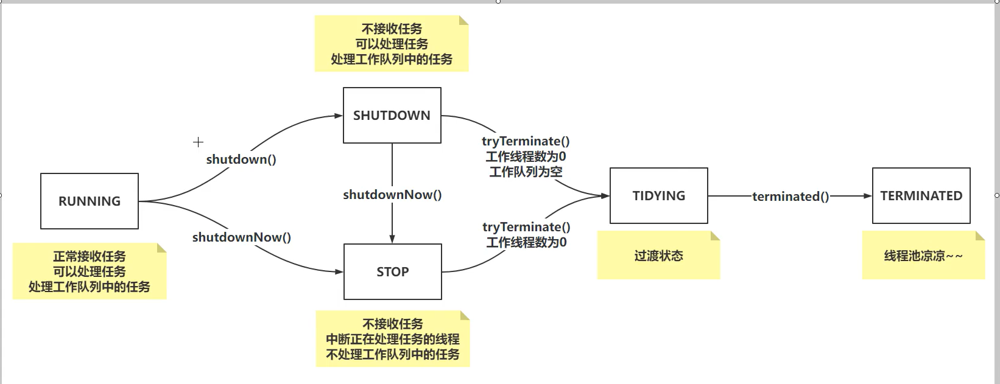

- RUNNING：线程刚创建时是RUNNING状态，RUNNING状态是线程池正常运行的状态。可以正常接受任务，继续处理进行中的任务，处理工作队列中的任务。

- SHUTDOWN：手动调用shutdown方法后线程池会转变为该状态。处于该状态的线程池不能接受新任务，但是可以处理进行中的任务和工作队列中的任务。

- STOP：手动调用shutdownNow方法后线程池会转变为该状态。处于该状态的线程池不能接受新任务，中断正在处理任务的线层并且不再处理工作队列中的任务。

- TIDYING：一种过渡状态，意味着该线程池即将终止，并且会执行terminated()方法结束线程池。

  - shutdown和shutdownNow方法都会调用tryTerminate()方法

    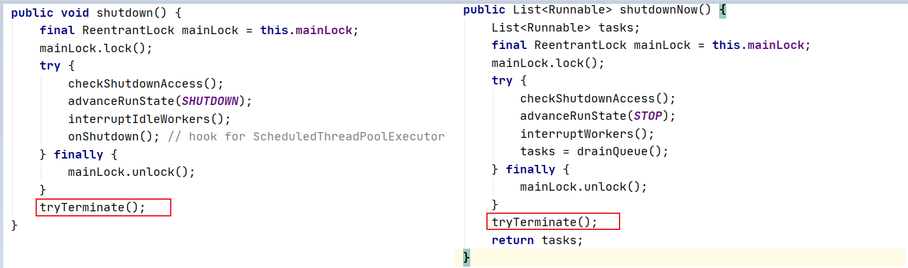

  - shutdown方法意味着线程池将不再接受新任务，并且要处理完已经接受的任务：当处理完剩余的任务后，线程池的当前线程数为0并且任务队列为空。此时可以调用tryTerminate()方法，将线程状态置位TIDYING状态，意味着线程池即将终止。

  - shutdownNow方法意味着线程池不能接受新任务，中断正在处理任务的线层并且不再处理工作队列中的任务：当这些动作完成后，线程池当前工作线程数为0。此时可以调用tryTerminate()方法，将线程状态置位TIDYING状态，意味着线程池即将终止。

- TERMINATED：执行完terminated()方法后，线程池处于TERMINATED状态。

  - terminated()方法默认是个空方法，可以自定义终止逻辑。


#### 4.6.execute方法

2. execute的大致执行流程

   - 主线程，业务线程执行execute方法提交任务到线程池。
   - 判断线程池中的当前工作线程是否小于核心线程数
     - 是：创建核心线程并执行任务
     - 否：判断任务能不能加到任务队列。
       - 能：将任务加到工作队列，等待工作线程执行
       - 否：判断工作线程是否已经达到最大线程数。
         - 是：触发拒绝策略
         - 否：创建非核心线程，并执行这次提交的任务。

   

2. execute源码分析

   ```java
   public void execute(Runnable command) {
       
       if (command == null)
           throw new NullPointerException();
       int c = ctl.get();
       
       // 1.判断当前的工作线程数是否小于corePoolSize：注意不是判断当前核心线程是否小于corePoolSize，可以这样判断的原因是优先创建核心线程，核心线程也属于工作线程
       if (workerCountOf(c) < corePoolSize) {
           // 1.1.如果是，通过addWorker方法创建一个新的核心线程。
           if (addWorker(command, true))
               // 1.2.核心线程创建成功execute方法结束，意味着任务提交成功。并且addWorker方法会更新ctl的value值，低位加1.
               return;
           // 1.3.说明创建核心线程没成功：因为存在并发提交任务可能其他线程成功提交了任务，并且工作线程达到了核心线程数，所以会创建核心线程数失败。因为其他线程可能成功提交了任务，所以还要更新一下ctl的value值。
           c = ctl.get();
       }
       
       // 2.当前工作线程数达到或超过核心线程数或者创建核心线程失败
       // 判断线程池是不是运行状态并且尝试把任务加到工作队列。
       // 注意：这是一个短路与 && 判断：如果不是RUNNING状态，也不会将任务加到队列中
       if (isRunning(c) && workQueue.offer(command)) {
           
           int recheck = ctl.get();
           // 2.1.是RUNNING状态且任务成功加到了队列：再次判断线程池是否是运行状态（因为并发提交时，有可能其他线程调用了线程池的shutdown/shutdownNow方法）.
           // 如果不是running，那么不能提交这次任务，所以要从队列移除刚才入队的任务，并且拒绝该次任务提交。
           if (!isRunning(recheck) && remove(command))
               reject(command);
           
           // 2.2.走到这里有两种情况：
           // 		1.第二次判断后发现线程池还是RUNNING状态而且因为是短路与&&判断，所以不会执行移除刚才入队的任务。
           //		2.第二次判断不是RUNNING状态但是移除任务失败了
           else if (workerCountOf(recheck) == 0)
               // 2.3.不是RUNNING状态但是移除任务失败了，并且此时工作队列中还有任务但是已经没有工作线程了。当线程池是shutdown状态就会出现一个问题：因为没有线程处理刚才入队的任务，任务队列就不会为空。那么就不会调用tryTerminate()方法进入TYDYING状态，也就不会进入TERMINATED状态终止线程池。
               // 2.4.添加一个空任务非核心线程，为了处理在工作队列中排队的任务。非核心线程空闲后会自动销毁，线程池会成功终止
               addWorker(null, false);
       }
       
       // 3.走到这里说明：
       // 		1.线程池不是RUNNING状态：不能接受新任务，直接拒绝
       //		2.任务队列已满：此时将尝试新增一个非核心线程。如果达到最大线程数，不能新增非核心线程，也会触发拒绝策略。
       else if (!addWorker(command, false))
           // 3.1.如果失败，说明线程池当前工作线程数达到最大线程数或者线程池已经处于shutdown/stop状态，不能再接收新任务。
           reject(command);
   }
   ```
   
   - 第一个核心：通过execute方法，查看线程池的整体执行流程，以及一些避免并发情况的判断
   
   - 第二个核心：为什么线程池会添加一个空任务的非核心线程到线程池。
   
     - 在将任务加到队列中时会在前后检查两次线程池状态：如果第一次检查线程池状态为RUNNING，然后任务成功入队列，但是第二次检查发现线程池状态不是RUNNING了，此时就可能出现一种情况。
   
     - 第一次检查线程池状态发现是RUNNING意味着线程池是可以接受新任务的，然后会将任务入队列。但是由于这不是一个原子操作，在并发的情况下其他线程会通过调用shutdown方法该线程池置为shutdown状态。
   
     - 此时线程池是SHUTDOWN状态，处于该状态的线程池在做完一些动作后，最终会销毁所有创建出来的线程。如果恰好在线程池中的工作线程都销毁了后，任务入队列动作成功。此时就会出现线程池没有工作线程了，但是任务队列还有任务待处理。如果是shutdown状态，就会因为任务队列不为空导致不会调用tryTerminate()方法进入TYDYING状态，也就不会进入TERMINATED状态终止线程池。
   
     - 所以会在任务入队列后，要再做第二次检查。检查线程池状态是否不为RUNNING，如果将任务加到队列中发现线程池状态不为RUNNING了，那么要将任务从队列移除。如果检查线程池不为RUNNING但是移除任务失败的话，那么要继续检查线程池中是否还有工作线程，如果没那么就创建一个空任务的非核心线程，让其处理这个不应该添加到队列中并且没有移除掉的任务。
   
#### 4.7.addWorker方法

首先我们先明确addWorker方法就是**添加工作线程并启动工作线程**的。我们将addWorker方法分成两部分来看。

##### 4.7.1.部分1：对线程池状态和工作线程数量的判断

```java
private boolean addWorker(Runnable firstTask, boolean core) {
    // 部分1：对线程池状态和工作线程数量的判断
    // 外层for循环的标识
    retry:
    // 外层循环主要判断线程池状态
    for (;;) {
        // 获取ctl的value值
        int c = ctl.get();
        // 获取线程池的状态
        int rs = runStateOf(c);

        // 线程池状态就5种，并且是大小是递增的：111 000 001 010 011，SHUTDOWN就是000
        // 如果线程池状态 >= SHUTDOWN那么说明线程池状态不是RUNNING，那么继续做后续判断，查看这次提交的任务是否可以不处理
        if (rs >= SHUTDOWN &&
            // 按理说如果发现线程池状态不是RUNNING的话，那么是不会接受新任务的，但是有一个特殊情况需要单独处理。
        	// 那就是当线程池状态是SHUTDOWN，且提交的任务时null，且任务队列不为空：那么会创建一个空任务的非核心工作线程，来处理任务队列中的任务。不满足这个情况，那就不处理新任务，直接返回false。
            // 为什么必须是SHUTDOWN状态，因为STOP状态即使任务队列中还有任务也不需要处理，会直接阻塞所有工作线程然后进入TIDING状态。TIDING和TERMINATED状态更不用说了，是由SHUTDOWN和STOP状态转换来的。不会走到这个方法。
            ! (rs == SHUTDOWN && firstTask == null && ! workQueue.isEmpty()))
            // 综述一下：当线程池状态不为RUNNING 且 不满足线程池状态SHUTDOWN，addWorker(null, false)，任务队列不为空。此时不处理新任务，直接返回false。
            return false;

        // 走到这里说明：线程池状态是RUNNING或者线程池状态为SHUTDOWN，addWorker(null, false)，任务队列不为空。
        // 主要是判断线程数量
        for (;;) {
            // 获取当前工作线程数量
            int wc = workerCountOf(c);
            // 判断工作线程是否大于最大值
            if (wc >= CAPACITY ||
                // 工作线程没有达到最大值，继续判断：
                // 如果是核心线程当前工作线程是否大于设置的核心线程数；如果是非核心线程当前工作线程是否大于设置的最大线程数
                // 这里如果core=true，也就是要创建核心线程的。为什么判断的是当前线程数是否超过核心线程数，而不是核心线程数是否超过核心线程数呢？因为优先创建的是核心线程，核心线程也属于工作线程。超过的话说明核心线程数也超过了corePoolSize。
                wc >= (core ? corePoolSize : maximumPoolSize))
                // 当前工作线程已经达到最大值了，不能再创建线程了。
                return false;
            
            // 以CAS的方式（避免并发），对工作线程数+1，ctl的value加1。如果成功，直接跳出外层for循环。
            if (compareAndIncrementWorkerCount(c))
                // 带标签的break会跳出标签所指的循环并中断该循环。
                break retry;
            
            // 如果CAS失败，可能是有两个任务一起添加过来，说明有并发操作。重新获取一下ctl的value值
            c = ctl.get();  // Re-read ctl
            // 再判断一下线程池状态，和之前的状态是否一致。
            if (runStateOf(c) != rs)
                // 如果不一样，那么要跳到外侧循环，重新再判断一下线程池的状态。
                continue retry;
            // else CAS failed due to workerCount change; retry inner loop
            // 否则继续内循环，重新判断线程数量
        }
    }

    // 部分2：添加工作线程，并启动工作线程
    boolean workerStarted = false;
    boolean workerAdded = false;
    Worker w = null;
    try {
        w = new Worker(firstTask);
        final Thread t = w.thread;
        if (t != null) {
            final ReentrantLock mainLock = this.mainLock;
            mainLock.lock();
            try {
                // Recheck while holding lock.
                // Back out on ThreadFactory failure or if
                // shut down before lock acquired.
                int rs = runStateOf(ctl.get());

                if (rs < SHUTDOWN ||
                    (rs == SHUTDOWN && firstTask == null)) {
                    if (t.isAlive()) // precheck that t is startable
                        throw new IllegalThreadStateException();
                    workers.add(w);
                    int s = workers.size();
                    if (s > largestPoolSize)
                        largestPoolSize = s;
                    workerAdded = true;
                }
            } finally {
                mainLock.unlock();
            }
            if (workerAdded) {
                t.start();
                workerStarted = true;
            }
        }
    } finally {
        if (! workerStarted)
            addWorkerFailed(w);
    }
    return workerStarted;
}
```

##### 4.7.2.部分2：添加工作线程，并启动工作线程

```java
private boolean addWorker(Runnable firstTask, boolean core) {
    // 部分1：对线程池状态和工作线程数量的判断
    retry:
    for (;;) {
        int c = ctl.get();
        int rs = runStateOf(c);

        // Check if queue empty only if necessary.
        if (rs >= SHUTDOWN &&
            ! (rs == SHUTDOWN &&
               firstTask == null &&
               ! workQueue.isEmpty()))
            return false;

        for (;;) {
            int wc = workerCountOf(c);
            if (wc >= CAPACITY ||
                wc >= (core ? corePoolSize : maximumPoolSize))
                return false;
            if (compareAndIncrementWorkerCount(c))
                break retry;
            c = ctl.get();  // Re-read ctl
            if (runStateOf(c) != rs)
                continue retry;
            // else CAS failed due to workerCount change; retry inner loop
        }
    }

    // 部分2：添加工作线程，并启动工作线程
   	// 先声明了两个布尔变量：工作线程是否启动了，工作线程是否添加了
    boolean workerStarted = false;
    boolean workerAdded = false;
    // Worker就是工作线程
    Worker w = null;
    try {
        // new Worker构建工作线程，将任务赋给Worker中的firstTask，并且通过ThreadFactory初始化一个thread。
        w = new Worker(firstTask);
        // 拿到Worker中绑定的Thread线程
        final Thread t = w.thread;
        // 肯定不会为null的：只是一个健壮性判断。如果ThreadFactory线程工厂失败的话，可能得到一个null
        if (t != null) {
            // 加锁：避免
            // 如果没加锁的话：当我正在添加工作线程的时候，其他线程可能执行了线程池的shutdown/shutdownNow方法。那么此时到底要不要新增这个工作线程是个复杂的问题。
            // 为了避免添加工作线程的时候，其他线程执行shutdown线程池的情况：我们要让添加工作线程和shutdown/shutdownNow方法都加上同一把锁。即this.mainLock;
            final ReentrantLock mainLock = this.mainLock;
            mainLock.lock();
            try {
                // Recheck while holding lock.
                // Back out on ThreadFactory failure or if
                // shut down before lock acquired.
                // 因为可能在加锁之前，线程池状态发生了改变，在此处重新获取ctl，拿到线程池的状态。
                int rs = runStateOf(ctl.get());

                // 如果线程池状态是RUNNING，就创建工作线程
                if (rs < SHUTDOWN ||
                    // 如果线程池状态位SHUTDOWN并且传入的任务为null
                    (rs == SHUTDOWN && firstTask == null)) {
                    // 开始添加工作线程
                    // 判断当前线程是否已经处于RUNNING状态：因为是才创建的线程，还没有调用start，所以不会出现这个情况。只是一个健壮性判断
                    if (t.isAlive()) // precheck that t is startable
                        throw new IllegalThreadStateException();
                    // 将构建好的Worker对象添加到workers中：HashSet<Worker> workers
                    workers.add(w);
                    // 获取工作线程个数
                    int s = workers.size();
                    // 如果现在的工作线程数，大于历史最大的工作线程数，就重新赋值历史最大工作线程数largestPoolSize
                    if (s > largestPoolSize)
                        largestPoolSize = s;
                    // 工作线程是否添加了置为true
                    workerAdded = true;
                }
            } finally {
                // 添加工作线程的动作结束：解锁
                mainLock.unlock();
            }
            if (workerAdded) {
                // 添加工作线程成功了，启动线程
                t.start();
                // 工作线程是否启动了置为true
                workerStarted = true;
            }
        }
    } finally {
        // 如果启动工作线程失败
        if (! workerStarted)
            // 补救措施：移除workers中的这个工作线程，CAS将工作线程数-1，尝试将线程池状态置为TIDYING。
            addWorkerFailed(w);
    }
    return workerStarted;
}


```

##### 4.7.3.addWorkerFailed(Worker w)

```java
// 启动工作线程失败后做的补救操作
private void addWorkerFailed(Worker w) {
    // 加锁
    final ReentrantLock mainLock = this.mainLock;
    mainLock.lock();
    try {
        // 判断之前创建工作线程是否成功
        if (w != null)
            // 如果工作线程创建了，因为启动失败那么将这个线程从workers中移除
            workers.remove(w);
        // CAS方式将工作线程数 - 1
        decrementWorkerCount();
        // 尝试将线程池状态变为TIDYING状态
        tryTerminate();
    } finally {
        // 释放锁
        mainLock.unlock();
    }
}
```

#### 4.8.Worker内部类

```java
private final class Worker
    extends AbstractQueuedSynchronizer
    implements Runnable
{
    /**
      * This class will never be serialized, but we provide a
      * serialVersionUID to suppress a javac warning.
      */
    private static final long serialVersionUID = 6138294804551838833L;

    // 工作线程的Thread对象，实例化Worker对象时就初始化了该属性
    final Thread thread;
    // 需要执行的任务
    Runnable firstTask;
    /** Per-thread task counter */
    volatile long completedTasks;

    /**
      * Creates with given first task and thread from ThreadFactory.
      * @param firstTask the first task (null if none)
      */
    // 创建Worker对象，并指定firstTask和thread
    Worker(Runnable firstTask) {
        // 基于AQS的一个操作，将ASQ中的一个属性state设置为-1：代表当前线程刚刚被初始化出来，不允许被中断。
        setState(-1); // inhibit interrupts until runWorker：禁止中断直到 runWorker
        this.firstTask = firstTask;
        // 这里是根据ThreadFactory创建的线程对象，并且传入的参数是当前的Worker对象，Worker继承了Runnable。所以后面调用thread.start()的话，会调用到Worker对象中的run()方法
        this.thread = getThreadFactory().newThread(this);
    }

    // 调用thread.start时会执行run方法
    public void run() {
        // 传入整个Worker对象
        runWorker(this);
    }

    // Lock methods
    //
    // The value 0 represents the unlocked state.
    // The value 1 represents the locked state.
	// Worker自己实现了一个基于AQS的锁机制：
    // ReentrantLock是可重入锁，但是这里不允许可重入锁。在中断线程时要竞争锁资源，如果线程不允许被中断或者正在运行时，处于SHUTDOWN状态的线程池就会跳过这个工作线程不去中断
    // 中断线程不是立即让线程停止，只是将thread的中断标识置为true。
    protected boolean isHeldExclusively() {
        return getState() != 0;
    }

    // 先把state从0置为1，表示当前线程正在执行任务。
    protected boolean tryAcquire(int unused) {
        if (compareAndSetState(0, 1)) {
            setExclusiveOwnerThread(Thread.currentThread());
            return true;
        }
        return false;
    }

    // 将state置为0，在runWorker中调用了unlock() ---> release(1) ---> tryRelease(arg)调 到了Worker中的tryRelease实现。将state置为，表示当前线程允许被中断。
    protected boolean tryRelease(int unused) {
        setExclusiveOwnerThread(null);
        setState(0);
        return true;
    }

    // 加锁：注意这里不是可重入锁。会调到tryAcquire方法
    public void lock()        { acquire(1); }
    public boolean tryLock()  { return tryAcquire(1); }
    public void unlock()      { release(1); }
    public boolean isLocked() { return isHeldExclusively(); }

    void interruptIfStarted() {
        Thread t;
        if (getState() >= 0 && (t = thread) != null && !t.isInterrupted()) {
            try {
                t.interrupt();
            } catch (SecurityException ignore) {
            }
        }
    }
}
```

1. Worker对象在线程池不同的状态下会涉及到一些中断的操作，此时就可以基于AQS来判断我当前的Worker对象能否被中断。

   比如线程池状态被置为STOP状态，STOP状态的线程要中断所有的工作线程，但是如果是刚刚被创建出来的线程是不允许中断的。比如SHUTDOWN状态的线程池只能中断空闲的线程。那么不同状态下的线程池，在对工作线程进行中断时，要有个能否中断的判断，此时就可以基于AQS的state来进行判断。

#### 4.9.runWorker(Worker w)

上面的源码分析我们发现，在添加一个Worker对象到线程池中的HashSet< Worker > workers后，意味着创建了一个新的线程。因为创建Worker对象时，会通过ThreadFactory线程工厂创建一个线程对象，传入的参数是当前的Worker对象，而且Worker继承了Runnable。然后创建的线程赋值给Worker中的thread属性，提交的任务赋值给firstTask属性。

```java
Worker(Runnable firstTask) {
    setState(-1); 
    this.firstTask = firstTask;
    this.thread = getThreadFactory().newThread(this);
}

public void run() {
    runWorker(this);
}
```

所以后面调用thread.start()的话，会调用到Worker对象中的run()方法。run()方法中绘调用runWorker(this);方法，那么我们提交的任务firstTask在哪里被调用了呢？

我们看下runWorker方法的源码：执行任务的流程，并且做了中断线程相关的lock操作。

```java
final void runWorker(Worker w) {
    // 这个方法的触发是由Worker中的thread调用start触发的，所以拿到的当前线程就是Worker中的thread
    Thread wt = Thread.currentThread();
    // 拿到这次提交给线程池的任务
    Runnable task = w.firstTask;
    w.firstTask = null;
    // unlock() ---> release(1) ---> tryRelease(arg)调到了Worker中的tryRelease实现。将state置为0，表示当前线程允许被中断。因为线程已经开始运行了，所以可以被中断
    w.unlock(); // allow interrupts
    // 任务执行过程中，大的try块中出现了异常为true，正常执行为false。
    boolean completedAbruptly = true;
    try {
        // 获取任务的方式1：如果是正常提交的任务，正常添加的Worker，那么执行t.start()时，走到runWorker方法：第一次走到这个while循环，此时task肯定不为null。主要是处理创建Worker时携带的任务firstTask：addWorker(firstTask, ...)
        // 获取任务的方式2：如果提交任务，但是发生了任务队列不空，却没有工作线程了。那么添加了一个空任务的非核心Worker，此时task == null，就会从任务队列中获取任务getTask()进行处理；或者正常提交任务，第一次循环成功的执行了，那么会把task置为null，然后尝试从队列中获取新的任务getTask()进行处理。反正都是从队列中获取任务：主要处理任务队列中的任务。
        while (task != null || (task = getTask()) != null) {
            // 加锁：因为在SHUTDOWN状态下，执行中的线程是不允许被中断的。而且这里加的不是可重入锁。
            // 并且Worker内部实现的锁并不是可重入锁。因为在中断时，也需要对worker进行lock，不能获取锁就意味着当前工作正在执行任务，不能中断
            w.lock();
            // If pool is stopping, ensure thread is interrupted;
            // if not, ensure thread is not interrupted.  This
            // requires a recheck in second case to deal with
            // shutdownNow race while clearing interrupt
            // 第一个判断：如果线程池是STOP状态，短路||右边不看，并且当前线程的中断标志位是false。那么中断当前线程（将中断标志位置为true）
            // 第二个判断：线程池不是STOP，短路11右边接着判断。如果当前线程中断标志位为true，然后将其复原为false，并且再次判断线程池状态发现是STOP，此时说明是并发操作将线程池置为了STOP状态；并且当前线程的中断标志位是false。。那么中断当前线程（将中断标志位置为true）
            // 反正就是保证当线程池变为STOP状态是，无论是并发导致的还是其他情况，都要将这个工作线程中断。
            if ((runStateAtLeast(ctl.get(), STOP)||(Thread.interrupted()&&runStateAtLeast(ctl.get(),STOP))) 				&& !wt.isInterrupted())
                // 将中断标志位置为true
                wt.interrupt();
            try {
                // 执行任务的前置钩子函数：默认是空方法，可以自定义实现
                // 注意：前置钩子方法内抛出异常，直接走finally，然后不会再往下走了。即不会走completedAbruptly = false;所以completedAbruptly还是true，后置钩子同理。
                beforeExecute(wt, task);
                Throwable thrown = null;
                try {
                    // 执行提交给线程池的任务
                    // 注意：run()出现异常时，会被catch捕获，但是catch还是抛出了异常，外层的try也没有对其再进行捕获处理，所以会执行finally块，不会继续向下走到completedAbruptly = false;
                    // 注意：这里是在Worker对象的run()方法中，直接调用提交的Runnable任务对象task的run()方法。
                    task.run();
                } catch (RuntimeException x) {
                    thrown = x; throw x;
                } catch (Error x) {
                    thrown = x; throw x;
                } catch (Throwable x) {
                    thrown = x; throw new Error(x);
                } finally {
                    // 执行任务的后置钩子函数：默认是空方法，可以自定义实现
                    afterExecute(task, thrown);
                }
            } finally {
                // 将task置为null：这样在后续的循环中会从任务队列中获取新的任务
                task = null;
                // 当前线程（注意不是线程池）执行完成的任务个数+1
                w.completedTasks++;
                // 将state标记位置为0：SHUTDOWN状态的线程池就可以中断该线程了
                w.unlock();
            }
        }
        completedAbruptly = false;
    } finally {
        // 无论执行是出现了异常，还是多次循环都没有出现异常，最后都会走到这里。只不过这两种情况传递的completedAbruptly分别是true/false。
        // 主要用来移除这个工作线程
        processWorkerExit(w, completedAbruptly);
    }
}
```


#### 4.10.getTask()

从上面的runWorker方法中，我们分析了线程执行任务的大致流程。因为线程池中的线程或者说Worker对象肯定不是消费一个任务就销毁的，它会循环的从任务队列中获取任务进行消费。那么下面我们就看看Worker中的线程是如何从工作队列workQueue中获取到任务

```java
private Runnable getTask() {
    // poll()方法会有阻塞时间。我当前的工作线程用poll方法来指定从工作队列中拿到任务时，poll方法是可以指定阻塞时间的，拿到任务就走，拿不到就触发超时，干掉非核心线程。
    // true：工作线程等待任务队列指定时间并且还没有拿到任务，也就是超时了。
    boolean timedOut = false; // Did the last poll() time out?

    // 死循环
    for (;;) {
        // ==================================== 1.主要判断线程池状态 =======================================
        // 获取ctl的value值
        int c = ctl.get();
        // 获取线程池的状态
        int rs = runStateOf(c);

        // 如果进入if代码块，说明需要干掉当前工作线程。注意这里只是一个逻辑-1，还没有从HashSet wokers中移除
        // 如果线程池状态大于等于STOP，那么需要移除当前工作线程
        // 如果线程池状态是SHUTDOWN，并且工作队列为空，需要移除当前工作线程
        if (rs >= SHUTDOWN && (rs >= STOP || workQueue.isEmpty())) {
            // 逻辑移除当前工作线程
            decrementWorkerCount();
            // 返回null，交给processWorkerExit移除当前工作线程
            return null;
        }

        // =================================== 2.主要判断工作线程数量 ======================================
        // 获取工作线程数量
        int wc = workerCountOf(c);

        // allowCoreThreadTimeOut：是否允许核心线程有超时机制。allowCoreThreadTimeOut方法可以改变该值
        // 默认是false，意味着核心线程没有超时机制，即空闲的核心线程也不会销毁。
        // 如果是true，意味着核心线程和非核心线程一样都有超时机制，空闲的核心线程允许等待keepAliveTime时间，超过则销毁。此时核心线程和非核心线程没有区别了，一样的。一般不会设置为true，设置为true的话为什么不直接用Executors.newCachedThreadPool()呢，这个线程池没有核心线程，只要有队列中任务且没有空闲线程，那么就会创建线程去消费

        // 这里谈一下核心线程和非核心线程：回想execute方法中会调用addWorker(task, true)来指定创建核心线程或者非核心线程。但是其实线程池里面的线程没有一个标志专门指定这个线程是核心线程还是非核心线程。判断的依据只有一个就是当前工作线程的数量，当工作线程数量减小到设置的核心线程数时，那么剩下的就都是核心线程。所以当工作线程数大于核心线程数时，空闲下来的线程是会被干掉的，即使创建它时addWorker传入的是true。
        // 所以判断工作线程数量其实就是判断当前线程是不是核心线程：工作线程数小于等于核心线程数当前工作线程就是核心线程，反之就是非核心线程。注意一个前提：allowCoreThreadTimeOut是false。
        
        // timed=true：一般allowCoreThreadTimeOut都是false，不允许核心线程有等待超时机制。那么当工作线程数超过核心线程数，意味着当前线程就是非核心线程。因为当工作线程数量减小到设置的核心线程数时，那么剩下的就都是核心线程。
        // timed=true：意味着核心线程和工作线程都一样，那么无论工作线程有没有大于核心线程数，所有的线程都可以认为是非核心线程，都是可以干掉的，那么当前线程也是非核心线程。
        // 1.timed = false：allowCoreThreadTimeOut是false并且当前工作线程小于核心线程数，那么当前工作线程肯定是核心线程。		// 2.timed = true：意味着当前线程是非核心线程；
        boolean timed = allowCoreThreadTimeOut || wc > corePoolSize;
		
        // 当工作线程大于设置的最大线程数：这个基本不会发生，可以认为这部分是false。
        // 那么当timerd && timedOut 为true，意味着当前工作线程是非核心线程，并且当前工作线程已经尝试过从任务队列获取任务并且等待超时了且没有拿到任务（说明任务队列空，尝试说明肯定不是第一次循环，因为其初始值是false，继续向下看能看到对应的代码和我得注释），也就是已经在队列阻塞过并且超时了。
        if ((wc > maximumPoolSize || (timed && timedOut))
            // 并且工作线程数大于1或者任务队列为空（即使干掉了还有线程能处理剩下的任务）那么尝试干掉这个超时过的非核心线程
            && (wc > 1 || workQueue.isEmpty())) {
            // 基于CAS方式移除掉当前线程：如果2个线程都进到这里，只会有一个线程CAS成功
            if (compareAndDecrementWorkerCount(c))
                // 返回null，交给processWorkerExit移除当前工作线程
                return null;
            // 一个线程CAS成功，另一个线程CAS没有成功，那么其会继续循环，判断线程池状态和数量，尝试拿任务
            continue;
        }

        // =================================== 3.从工作队列中获取任务 ======================================
        try {
            // 当allowCoreThreadTimeOut是false且工作线程小于等于核心线程数，timed是fasle，那么工作线程都是核心线程，走take()
            // 当allowCoreThreadTimeOut是true意味着核心线程和工作线程都一样，那么无论工作线程有没有大于核心线程数，所有的线程都可以认为是非核心线程，都是可以干掉的。那么当前线程也是非核心线程，走poll，超时就干掉。
            Runnable r = timed ?
                // poll方法从队列获取任务，当任务不可用时，会阻塞指定的时间。超过时间就干掉非核心线程
                workQueue.poll(keepAliveTime, TimeUnit.NANOSECONDS) :
            	// take方法从队列获取任务，当没有任务，会一直阻塞等待。核心线程一般走这里
            	workQueue.take();
            if (r != null)
                // 拿到任务直接返回，结束方法
                return r;
            // r = null，说明没有拿到任务。那么肯定是走的poll方法会返回一个null。
            // 因为当任务队列没有任务时，poll方法等待一段时间，如果还是没有可用的任务，会返回一个null。
            // 如果走的是take()，那么会一直阻塞等待直到有心的任务进来，然后肯定会获取到任务，这个线程肯定也是核心线程。
            // 所以会把timedOut标志置为true，意味着当前线程发生了等到超时了但还没有拿到任务。
            // 然后继续循环：那么当走到 2.判断工作线程数量这部分((wc > maximumPoolSize || (timed && timedOut)) && (wc > 1 || workQueue.isEmpty()))代码时，就很可能进到if块，然后移除当前线程。
            timedOut = true;
        } catch (InterruptedException retry) {
            // 当线程在队列中阻塞等待可用的任务时，是可能会被其他线程打断的，那么此时会走到这里。被打断无论是走的poll还是take都说明没有等待超时，所以timeOut置为false。
            timedOut = false;
        }
    }
}
```

我们说take会一直阻塞线程，那么是线程什么时候会唤醒呢？我们看一下ArrayBlockingQueue的take实现

```java
public E take() throws InterruptedException {
    final ReentrantLock lock = this.lock;
    lock.lockInterruptibly();
    try {
        while (count == 0)
            // 当任务队列空，会在这里阻塞
            notEmpty.await();
        // 当任务队列不为空，会在这里唤醒，Condition.signal()
        return dequeue();
    } finally {
        lock.unlock();
    }
}
```

#### 4.11.processWorkerExit(Worker w, boolean completedAbruptly)

##### 4.11.1.回顾小结一下，什么时候会干掉线程

1. 线程池状态不对

   程池状态大于等于STOP，那么需要移除当前工作线程。

   线程池状态是SHUTDOWN，并且工作队列为空，需要移除当前工作线程。

   ```java
   // 如果进入if代码块，说明需要干掉当前工作线程。注意这里只是一个逻辑-1，还没有从HashSet wokers中移除
   // 如果线程池状态大于等于STOP，那么需要移除当前工作线程
   // 如果线程池状态是SHUTDOWN，并且工作队列为空，需要移除当前工作线程
   if (rs >= SHUTDOWN && (rs >= STOP || workQueue.isEmpty())) {
       // 逻辑移除当前工作线程
       decrementWorkerCount();
       // 返回null，交给processWorkerExit移除当前工作线程
       return null;
   }
   ```

2. 非核心并且超时过了的线程

   当前工作线程是非核心线程并且已经在队列阻塞过并且超时了，并且工作线程数大于1或者任务队列为空（即使干掉了还有线程能处理剩下的任务），此时会干掉这个非核心并且超时过了的线程。

   ```java
   // 当工作线程大于设置的最大线程数：这个基本不会发生，可以认为这部分是false。
   // 那么当timed && timedOut 为true，意味着当前工作线程是非核心线程，并且当前工作线程已经尝试过从任务队列获取任务并且等待超时了且没有拿到任务（说明任务队列空，尝试说明肯定不是第一次循环，因为其初始值是false，继续向下看能看到对应的代码和我得注释），也就是已经在队列阻塞过并且超时了。
   if ((wc > maximumPoolSize || (timed && timedOut))
       // 并且工作线程数大于1，或者任务队列为空，那么可以尝试干掉这个超时过的非核心线程
       && (wc > 1 || workQueue.isEmpty())) {
       // 基于CAS方式移除掉当前线程：如果2个线程都进到这里，只会有一个线程CAS成功
       if (compareAndDecrementWorkerCount(c))
           // 返回null，交给processWorkerExit移除当前工作线程
           return null;
       // 一个线程CAS成功，另一个线程CAS没有成功，那么其会继续循环，判断线程池状态和数量，尝试拿任务
       continue;
   }
   ```

3. 执行processWorkerExit(w, true)方法

   当firstTask也就是当前Worker为其指定的第一个任务不为null 但是 后续获取任务时返回null，此时就会跳出while循环，执行processWorkerExit(w, true)方法来移除当前线程。

   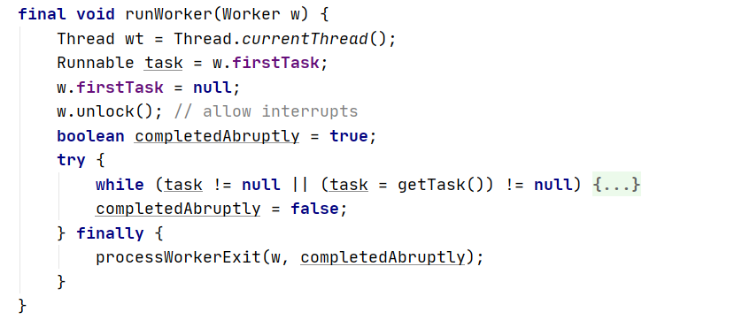

   


##### 4.11.2.源码分析

1. 我们先回顾一下，什么时候boolean completedAbruptly参数会传true。

   ```java
final void runWorker(Worker w) {
       Thread wt = Thread.currentThread();
       Runnable task = w.firstTask;
       w.firstTask = null;
       w.unlock(); 
       boolean completedAbruptly = true;
       try {
           // 这里出现异常的话，会直接跳到最下面的finally3，所以completedAbruptly不会被改为false，还是true
           while (task != null || (task = getTask()) != null) {
               // 同上
               w.lock();
               // 同上
               if ((runStateAtLeast(ctl.get(), STOP) ||
                    (Thread.interrupted() &&
                     runStateAtLeast(ctl.get(), STOP))) &&
                   !wt.isInterrupted())
                   wt.interrupt();
               try {
                   // 前置钩子：这里出现异常的话会走下面的finally2，注意接着会直接跳到finally3里面，不会走completedAbruptly = false，所以completedAbruptly还是true
                   beforeExecute(wt, task);
                   Throwable thrown = null;
                   try {
                       // 这里出现异常的话会被catch，catch块中又抛出了异常，所以会先走下面的finally1，再走finally2，并且不会走completedAbruptly=false，再走finally3。因为在catch异常又被抛出了，相当于没有处理异常，后续只会执行finaly块中的代码。completedAbruptly还是true
                       task.run();
                   } catch (RuntimeException x) {
                       thrown = x; throw x;
                   } catch (Error x) {
                       thrown = x; throw x;
                   } catch (Throwable x) {
                       thrown = x; throw new Error(x);
                   } finally { // finally1
                       // 后置钩子：这里异常的话会走下面的finally2，因为异常没有被catch住进行处理，接着会直接走finally3不会走completedAbruptly=false，completedAbruptly还是true
                       afterExecute(task, thrown);
                   }
               } finally { // finally2
                   task = null;
                   w.completedTasks++;
                   w.unlock();
               }
           }
           completedAbruptly = false;
       } finally { // finally3
           // 无论执行是出现了异常，还是多次循环都没有出现异常，最后都会走到这里。只不过这两种情况传递的completedAbruptly分别是true，false
           processWorkerExit(w, completedAbruptly);
       }
   }
   ```
   
2. 源码分析

   我们发现只要出现了异常，那么completedAbruptly就是true。只有当task != null为false并且task = getTask()) != null为false时，也即后续从任务队列中取任务时任务队列中没有任务了，也就是正常结束了，那么才会走completedAbruptly = false;

   所以当runWorker出现了异常processWorkerExit(w, true); 正常执行结束processWorkerExit(w, false);来移除这个线程

   ```java
   private void processWorkerExit(Worker w, boolean completedAbruptly) {
       // completedAbruptly=true，如果执行上层方法runWorker时出现了异常，那么调用decrementWorkerCount
       if (completedAbruptly) // If abrupt, then workerCount wasn't adjusted
           // 因为出现了不在预期内的异常，手动扣减工作线程数。
           decrementWorkerCount();
   
       final ReentrantLock mainLock = this.mainLock;
       // 加锁：能保证 += 操作并发安全
       mainLock.lock();
       try {
           // 更新线程池执行完成的任务个数：completedTaskCount线程池完成的任务，completedTasks当前线程完成的任务
           completedTaskCount += w.completedTasks;
           // 移除当前线程
           workers.remove(w);
       } finally {
           mainLock.unlock();
       }
   
       // 尝试关闭线程池（状态转换为TIDYING -> TERMINATED），为什么要尝试关闭线程池：我们在4.11.1回顾了什么时候会干掉线程时
       // 1.程池状态不对：大于等于STOP，那么需要移除当前工作线程。线程池状态是SHUTDOWN，并且工作队列为空，需要移除当前工作线程。 // 2.当前工作线程是非核心线程并且已经在队列阻塞过并且超时了，并且工作线程数大于1或者任务队列为空（即使干掉了还有线程能处理剩下的任务），此时会干掉这个非核心并且超时过了的线程。
       // 这两种情况都会导致getTask返回null，然后触发processWorkerExit方法，如果是情况一。线程池状态不对，那么会就有必要调用tryTerminate方法来尝试关闭线程池到TIDYING状态。不能关闭的话就不能关闭，也没影响。
       tryTerminate();
   
       int c = ctl.get();
       // 当前线程池状态是否小于STOP：RUNNING或者SHUTDOWN
       // 如果状态大于STOP，那么根本不会走进去，因为STOP即使工作队列有任务也不会处理，直接干掉正在工作的线程
       if (runStateLessThan(c, STOP)) {
           // 如果正常执行任务走到processWorkerExit，completedAbruptly为false
           if (!completedAbruptly) {
               // 线程池的核心线程数的最小值：不够的话会继续创建线程。看下面注释的2.3
               int min = allowCoreThreadTimeOut ? 0 : corePoolSize;
               // 如果核心线程数的最小值是0并且任务队列不为空，那么将核心线程数的最小值设置为1
               if (min == 0 && ! workQueue.isEmpty())
                   min = 1;
               // 还有工作线程在线程池中：直接结束该方法
               if (workerCountOf(c) >= min)
                   return; // replacement not needed
           }
           // 1.没有走if，说明上层方法runWorker出现了异常，然后调用了processWorkerExit。说明之前的工作线程出错了，被干掉之后，然后在这里再创建一个空任务的非核心线程
           // 2.走了if，但是没有走return：
           // 	2.1.如果min=0，并且并且任务队列不为空，那么min设置为1，此时如果工作线程数 < 1：那么意味着任务队列不为空，但是没有线程了，所以需要新增一个空任务的非核心线程
           //	2.2.如果min=0，并且并且任务队列为空，那么min还是0，那么workerCountOf(c)即使是0，也会走到return。
           // 	2.3.如果min=corePoolSize，假设corePoolSize不为0（为零的话就是2.1和2.2的情况）。如果workerCountOf(c) >= min不满足，意味着工作线程数还不够核心线程数，那么也需要继续创建线程。或者说创建核心线程，因为当前线程数还不够设置的核心线程数corePoolSize，所以还需要继续常见核心线程。所以min也可以理解为核心线程数的最小值。而且虽然这里addWorker是传递的是false创建非核心线程，但是不要忘记我们上面分析过核心线程和非核心线程的唯一区别就是工作线程数量。工作线程数量不够corePoolSize那么就都是核心线程，超过那么超过的部分就是非核心线程。超过时corePoolSize，并且等待超时了的线程会被干掉，即使创建它的addWorker传的是true！
           // 3.所以走到这里3种情况：
           // 3.1.上层方法runWorker出现了异常，然后调用了processWorkerExit。说明之前的工作线程出错了，被干掉之后，然后在这里再创建一个空任务的非核心线程
           // 3.2.任务队列不为空，但是没有线程了，所以需要新增一个空任务的非核心线程
           // 3.3.工作作线程数不够核心线程数，那么也需要继续创建线程。或者说创建核心线程。
           addWorker(null, false);
       }
   }
   ```

   

   

   

