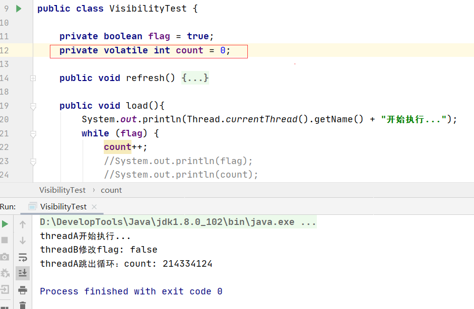

## JMM模型

### 1.一个例子引出的可见性问题

#### 1.1.示例

1. 代码：就是新开两个线程，线程A循环判断flag，当flag=fasle时跳出循环。线程B会在1s后将flag置为false。

   ```java
public class VisibilityTest {
   
       private boolean flag = true;
       private int count = 0;
   
       public void refresh() {
           flag = false;
           System.out.println(Thread.currentThread().getName() + "修改flag: " + flag);
       }
   
       public void load() {
           System.out.println(Thread.currentThread().getName() + "开始执行...");
           while (flag) {
               count++;
           }
           System.out.println(Thread.currentThread().getName() + "跳出循环：count: " + count);
       }
   
       public static void main(String[] args) throws InterruptedException {
           VisibilityTest test = new VisibilityTest();
   
           // 线程A模拟数据加载场景
           Thread threadA = new Thread(() -> test.load(), "threadA");
           threadA.start();
   
           // 让threadA执行一会
           Thread.sleep(1_000L);
   
           // 线程threadB通过flag控制threadA的执行时间
           Thread threadB = new Thread(() -> test.refresh(), "threadB");
           threadB.start();
       }
   }
   ```
   
2. 结果：
   
- 预想中的结果：当线程B在1s后将flag置位false后，线程A会跳出循环，当前这个Java程序终止。
  
- 实际结果：线程B改变了flag的值后，线程A没有感知到，还在循环中没有退出，Java进程也没有结束。
  
  
  
3. 大致分析下问题的原因

   从结果我们能分析出，在线程B修改了flag的值后，线程A仍然在while循环中，说明线程A读取到的flag还是true。按理说我们都是通过同一个test对象调用的load和refresh方法，那么两个方法中的flag是同一个test对象中的属性，即对于线程A和线程B来说是一个共享变量。为什么线程A和线程B两者最后访问的flag值却不同，难道不是同一个吗？

   持有着这个疑问，我们先看几个解决方法。

#### 1.2.几个解决的办法

这里只是列出了几个解决办法，具体分析放到后面。

1. volatile：对共享变量用volatile修饰

   

2. 线程A中加上打印flag/count的语句

   - System.out.println(flag);

     

   - System.out.println(count);

     

   - 大致看下println源码：其实也用到了synchronized，synchronized语义保证了可见性，synchronized能保证可见性的原因也是底层使用了lock前缀指令保证的。
   
     
   
   
   
3. 一般在while(true)中要释放一下时间片：yield。

   底层是与上下文切换有关，上下文切换的话会导致从新从主存加载最新的值。

   

4. 显式的加上内存屏障保证可见性：Unsafe.getUnsafe().storeFence();

   用反射来创建Unsafe实例对象（看1.3的补充）。

   

5. 为当前线程发放一个许可：LockSupport.unpark(Thread.currentThread());

   

6. 为conut加上volatile也行：private volatile int count = 0;

   

7. 将count改成Integer：private Integer count = 0;

   

   


#### 1.3.补充-Unsafe的简单介绍

1. 简单的说一下Unsafe类：
   - Unsafe是java底层提供的一个类，Unsafe类主要用于执行非常底层，不安全的操作。比如直接访问系统内存资源，自主管理内存资源等。这些方法在提升Java运行效率，增强Java语言底层资源调度能力方面起到了很大的作用。

   - 但是由于Unsafe类可以对系统进行非常底层且不安全的操作，对于Unsafe类的使用上有许多的限制。比如其构造私有，虽然提供了静态方法**getUnsafe()**获取其实例，但是一般我们是无法通过该static方法获取到实例。

     

   - Jvm为了防止开发者在代码中调用Unsafe类，在调用**getUnsafe()**方法获取Unsafe实例时会判断当前类加载器是否是引导类加载器。

     - Class var0 = Reflection.getCallerClass();  返[回调](https://so.csdn.net/so/search?q=回调&spm=1001.2101.3001.7020)用者的类，也就是VisibilityTest。因为是在VisibilityTest中调用的Unsafe.getUnsafe()。

     - var0.getClassLoader()：拿到调用者类的类加载器。是我们自己写的类，肯定是应用类加载器：AppClassLoader

     - !VM.isSystemDomainLoader(var0.getClassLoader())：如果这个类不是引导类加载器的话，就抛异常，不允许拿到Unsafe实例。引导类加载器一般返回的是null。

     所以我们直接Unsafe.getUnsafe()得到Unsafe类是会抛异常的。

     

     

2. 用反射来创建Unsafe实例对象

   

### 2.JMM模型

通过上述的例子，我们发现线程A看不到线程B对flag这个共享变量的修改，我们将之称为可见性问题。可见性问题的分析，从Java不好分析，它只能告诉你出现了这个问题。那么我们就要引入Java内存模型-JMM了，我们要从JMM的角度来分析线程间的可见性问题。

JVM构建出来的时候提供了JMM这么一个模型，它不同于JVM的运行时数据区模型，它主要是关于线程间进行通信的这么一个模型。所以说成Java多线程内存模型我感觉更容易理解，也方便与JVM运行时内存区域做区分。

#### 2.1.多CPU多核并发缓存架构

1. 我们先来看一张图：现在的多CPU的多核并发缓存架构图。

   - 物理CPU：物理CPU就是插在主机上的真实的CPU硬件，在Linux下可以数不同的physical id来确认主机的物理CPU个数
   - 核心数：我们常常会听说多核处理器，其中的核指的就是核心数。在Linux下可以通过cores来确认主机的物理CPU核心数。
   - 逻辑CPU：逻辑CPU根超线程技术有关，假如物理CPU不支持超线程技术，那么逻辑CPU的数量等于核心数的数量。如果物理CPU支持超线程技术，那么逻辑CPU的数目是核心数数目的两倍。在Linux下可以通过processors的数目来确认逻辑CPU的数量。

   

   介绍：L1缓存分为指令缓存和数据缓存，L1和L2缓存是核心独享的，L3缓存是核心间共享的。

   

2. 之前的认识：

   之前对CPU和主存仅有一个简单的认识，比如CPU想运行某个程序，先将程序数据从硬盘加载到主存中，然后无论是取指令，取数据等等，都是CPU和内存直接交互。

   但是这样实际有个很大的缺陷：CPU和主存的运行速度差距太大，CPU与主内存直接交互的话，会导致CPU要频繁的等待主内存的处理动作，严重的拖慢了CPU的运行效率。

3. 引入CPU高速缓存

   为了缓解CPU与主内存直接交互导致的效率低下问题，之后在CPU和主内存之间引入了一层CPU高速缓存。可以把这个CPU缓存看成CPU的一部分，一般是集成到CPU内部，而且CPU缓存的读取速度非常快。

   CPU在做运算的时候，先去一级一级的读缓存，如果都没有命中，再去主存将数据加载到CPU缓存中。先CPU缓存交互进行运算，避免了频繁地和主存打交道。所以大部分情况下，CPU做运算时都是和CPU高速缓存打交道，这样运算效率就高了很多。

   

   


4，为什么引入高速缓存：

- 为了避免CPU频繁地直接与内存交互，影响CPU的性能。

- **缓存能利用局部性原理来提高CPU的效率**：在CPU访问存储设备时，无论是存取数据还是存取指令，都趋于聚集在一片连续的区域中，这就是局部性原理。
  
  - 时间局部性：如果一个信息项正在被访问，那么在近期它很可能还会被再次访问。比如循环，递归，方法的反复调用等。
- 空间局部性：如果一个存储器的位置被引用，那么将来他附近的位置也会被引用。比如顺序执行的代码，连续创建两个对象，数组等。
  
   

#### 2.2.JMM定义

1. 定义：站在线程和线程之间如何进行通信交互的角度来理解这个JMM

   Java虚拟机规范中定义了Java内存模型（Java Memory Model，JMM），用于屏蔽掉各种硬件和操作系统的内存访问差异，以实现让Java程序在各种平台上都能达到一致的并发效果。

   Java多线程内存模型跟CPU缓存模型类似，是基于**CPU缓存模型**来建立的。Java内存模型主要在Java层面为开发者做出了一个统一的标准，屏蔽了不同计算机底层对内存访问差异。JMM规范了Java虚拟机与计算机内存是如何协同工作的：**规定了一个线程如何和何时可以看到由其他线程修改过后的共享变量的值，以及在必须时如何同步的访问共享变量。**JMM描述的是一种抽象的概念，一组规则，通过这组规则控制程序中各个变量在共享数据区域和私有数据区域的访问方式。

   JMM规定的这种线程间进行交互的方式，就是围绕并发编程的原子性，有序性，可见性展开的。

2. 内容：

   JMM主要定义了Java线程间通信的方式：JVM会为每个线程分配一个私有的工作内存，用于存储线程私有的数据，除了工作内存还会有一块线程间共享的主内存。对于共享变量的操作，按照JMM的标准，首先会将变量从主存拷贝一份到线程各自的工作内存中，之后对于该变量的访问会先从工作内存中读取，不能直接操作主内存中的共享变量。如果对共享变量有更新的操作，会在操作结束后再将变量写会主内存。
   
   
   
3. JMM与硬件内存架构的对应关系：

   JMM中规定的主内存和工作内存不要对应到具体的硬件上，它只是逻辑概念。具体对应在硬件上可能是内存，缓存，寄存器等很多地方，不要与具体硬件强行关联起来。

   因为Java内存模型与硬件内存架构之间存在差异，硬件内存架构没有区分线程栈和堆。从硬件层面来看，大部分的线程栈和堆都分布在主内存中，部分线程栈和堆可能有时候会出现在CPU缓存中和CPU内部的寄存器中。如下图Java内存模型和计算机硬件内存架构是一个交叉关系。

   

   

### 3.站在JMM的角度分析上面例子

#### 3.1.回顾一下上面的例子

1. 先把代码再贴一遍：

   ```java
   public class VisibilityTest {
   
       private boolean flag = true;
       private int count = 0;
   
       public void refresh() {
           flag = false;
           System.out.println(Thread.currentThread().getName() + "修改flag: " + flag);
       }
   
       public void load(){
           System.out.println(Thread.currentThread().getName() + "开始执行...");
           while (flag) {
               count++;
           }
           System.out.println(Thread.currentThread().getName() + "跳出循环：count: " + count);
       }
   
       public static void main(String[] args) throws InterruptedException {
           VisibilityTest test = new VisibilityTest();
   
           // 线程A模拟数据加载场景
           Thread threadA = new Thread(() -> test.load(), "threadA");
           threadA.start();
   
           // 让threadA执行一会
           Thread.sleep(1_000L);
   
           // 线程threadB通过flag控制threadA的执行时间
           Thread threadB = new Thread(() -> test.refresh(), "threadB");
           threadB.start();
       }
   
       public static void shortWait(long interval) {
           long start = System.nanoTime();
           long end;
           do {
               end = System.nanoTime();
           } while (start + interval >= end);
       }
   }
   ```

2. 从JMM的角度来看看两个线程是怎么访问共享数据的

   线程A和线程B都有一块私有的工作内存，共享变量flag一开始位于主内存中。当两个线程要访问共享变量flag时，会先将flag拷贝一份放到自己的工作内存中。后续再对flag进行访问时，会先从工作内存中读取。

   线程B修改了flag的值后，会将最新的flag值会写到主内存中。但是线程A还是在读取工作内存中的flag值，所以一直处于while循环中。也就是**线程A没有及时的从主内存读取新的flag值，没有及时的更新工作内存中的flag缓存。**

   **当前线程没有读到或者没有及时读到其他线程对共享变量的写操作。**

3. 分析一下while( true )这个循环可能引起的阶饥饿死锁现象

   分时操作系统的调度策略一般基于优先级来抢占。而while( true )这个循环它的优先级非常高，即便我们用了Thread.yield将其CPU占有权让渡出来，因为它的优先级非常高，还是会再次抢到CPU执行权，导致while(true)看起来一直在占用CPU的执行权。

   如果CPU核心数有限，就很可能出现**低优先级线程饥饿**的现象，甚至因为这个饥饿现象而导致的**死锁**。比如一个低优先级的线程持有一个锁，但是由于其优先级较低，一直抢占不到CPU执行权。抢占不到CPU执行权意味着它也没有机会释放持有的锁，而其他线程又在等待该锁的释放，最后导致了死锁。

   所以1s后线程B启动后，基本上会在另一个核心上执行，几乎不可能抢占到线程A所在的核心。

4. 什么时候写会主存

   是更新完成后立马写到主存还是线程执行结束后写到主存？首先可以肯定不是更新完成后立马写到主存，一般是在某一时刻，当线程发现已经不再使用这个数据时，会回收这块内存，然后写回主存。线程执行结束时是肯定会刷回缓存的。

5. 工作内存中的缓存是有失效时间的。

   当工作内存中的缓存失效时，会从主内存中重新获取该值。

   

   那么如果我们有**什么机制能使线程A中的缓存失效**的话，就可以保证代码达到我们想要的结果。

   

#### 3.2.主内存和工作内存之间的交互操作细节

1. 关于主内存和工作内存之间的具体交互协议

   即一个变量如何从主内存拷贝到工作内存，如何从工作内存同步到主内存之间的实现细节，Java内存模型定义了一下八种**原子操作**来完成。**为什么不是工作内存和工作内存之间？因为工作内存和工作内存之间不能直接通信。**

   - lock（锁定）：作用于主内存的变量，把一个变量标识为一条线程独占状态。
   
   - unlock（解锁）：作用于主内存变量，把一个处于锁定状态的变量释放出来，释放后的变量才可以被其他线程锁定。
   
   - read（读取）：作用于主内存变量，把一个变量值从主内存传输到线程的工作内存中，以便随后的load动作使用。
   
   - load（载入）：作用于工作内存中变量，它把read操作从主内存中得到的变量值放入工作内存的变量副本中。
   
- use（使用）：作用于工作内存的变量，把工作内存中的一个变量值传递给执行引擎，每当虚拟机遇到一个需要使用变量的值的字节码指令时将会执行这个操作。
  
- assign（赋值）：作用于工作内存的变量，它把一个从执行引擎接收到的值赋值给工作内存的变量，每当虚拟机遇到一个给变量赋值的字节码指令时执行这个操作。
  
   - store（存储）：作用于工作内存的变量，把工作内存中的一个变量的值传送到主内存中，一遍随后的write的操作。
   
   - write（写入）：作用于主内存的变量，它把store操作得到的值传送到主内存的变量中。
   
     
   
   
   
   2. 结合上面的例子，看一下相关的原子操作
   
      
   
   
### 4.Volatile

我们在上面的例子看到，为共享变量flag加上volatile修饰后，程序能达到我们预期的效果。甚至为count加上volatile后，也能达到效果。那么现在我们详细分析一下volatile的底层原理。

#### 4.1.volatile的内存语义

1. volatile的特性：

   可见性：当对一个volatile变量进行读操作时，总是能看到任意线程对这个volatile变量最后的写操作，也就是能看到最新的volatile变量。

   原子性：对任意单个volatile变量法的读/写具有原子性，但类似于**volatile++这种复合操作不具有原子性**。基于这点我们通常会认为volatile不具有原子性。volatile仅仅保证对**单个volatile变量的读/写具有原子性**，不同于互斥锁能确保对整个临界区代码的执行原子性。

   有序性：被volatile修饰的变量的读写操作的前后会加上各种特定的内存屏障来禁止指令重排序来保障有序性。

2. volatile写-读的内存语义

   当写一个volatile变量时，JMM会把该线程对应的本地内存中的共享变量值刷新到主内存。

   当读一个volatile变量时，JMM会把该线程对应的本地内存置为无效，线程加下来将从主内存中读取共享变量。

3. 在32位处理器中，**JMM不保证对64位的long型和double型变量的写操作具有原子性**

   JVM在32位处理器上运行时，可能会把一个64位的long/double型变量的写操作拆分为两个32位的写操作来执行。这两个32位的写操作可能会被分配到不同的总线事务中执行，此时对这个64位变量的写操作将不具有原子性。但是对其的读操作时具有原子性的。

   64位的long/double型变量，只要它是volatile变量，对改变量的读/写就具有原子性。

#### 4.2.volatile在hotspot的实现

##### 4.2.1.bytecodeInterpreter.cpp实现

1. 一般JVM指令或关键字会有对应的c/c++代码来实现：比如volatile我们就可以从JVM源码的bytecodeInterpreter.cpp类中找到其的具体实现。这种用代码实现的JVM指令，其优点是实现相对简单且容易理解，缺点是执行慢。

2. 判断缓存行数据是否被volatile修饰，然后调用一个storeload()方法，应该是加上一个StoreLoad内存屏障

   

3. 因为JVM是跨平台的，我们主要看Linux系统x86架构的实现：orderAccess_linux_x86.inline.hpp

   storeload()方法调用fence()方法：fence方法中先判断OS是不是多核，加上一个**汇编层面指令lock**。**那么加上StoreLoad内存屏障大概率是通过汇编指令lock实现的。**

   如果是单核不作处理，因为单核不存在可见性，顺序性等问题。

   

   

##### 4.2.2.模版解释器实现

JVM一直在进行优化，其实现在执行这些常用指令/关键字时不走上面的c++代码逻辑。而是按照模版解释器templateInterpreter的方式，为这些常用的指令都写了一段对应的汇编代码。启动时将每个指令与对应的汇编代码入口绑定，直接将执行效率拉满。

追溯到最后的汇编指令后，volatile底层其实还是使用了**lock前缀指令**，来实现它的可见性，顺序性。  


### 5.LOCK前缀指令

#### 5.1.Lock前缀指令概述

1. LOCK前缀指令的作用

   - 确保后续指令执行的原子性。在Pentium及之前的处理器中，带有lock前缀的指令在执行期间会锁住总线，使得其它处理器暂时无法通过总线访问内存，很显然，这个开销很大。在新的处理器中，Intel使用缓存锁定来保证指令执行的原子性，缓存锁定将大大降低lock前缀指令的执行开销。

   - LOCK前缀指令会让当前处理器缓存的写操作的同时引起其他处理器中的该缓存失效，并且马上将其写回内存。

   - LOCK前缀指令具有类似于内存屏障的功能，禁止该指令与前面和后面的读写指令重排序。

2. LOCK前缀指令做了什么？

   在修改内存操作时，使用lock前缀指令来执行加锁的读-修改-写操作，这种机制用于多处理器系统中处理器之间进行可靠的通讯，具体描述如下：

   - 在Pentium和早起的IA-32处理器中，lock前缀指令会使处理器执行当前指令时产生一个LOCK#信息（总线锁定信号），该信号总是引起显示总线锁定出现。
   - 在Pentium4，Inter Xeon和P6系列处理器中，intel在原有总线锁的基础上做了一个很有意义的优化。如果对内存的访问有高速缓存命中且只影响一个单独的高速缓存行，那么Lock指令就只会**锁住该缓存行**来保证原子性，而不是总线锁锁住整个总线。同时这条总线上的其他处理器会使相应高速缓存失效，以保证系统内存的一致性，这个操作过程就叫做**缓存锁定。**

#### 5.2.总线仲裁机制

注意我们上面说了**处理器内部的缓存行锁定**。在引入这个概念时，我们先引入其他的概念，即总线仲裁机制。

**操作系统自身会有一套机制来保证基本操作的原子性，比如总线事务，总线仲裁机制和原语。**

1. 总线事务

   在计算机中，数据通过总线在处理器和内存之间进行传递。每次处理器和内存之间的数据传递都是通过一些列步骤完成的，这一系列步骤称之为**总线事务（Bus Transaction）**，总线事务包括读事务和写事务。读事务从内存传送数据到处理器，写事务从处理器传送数据到内存，每个事务会读/写内存中一个或多个物理上连续的字。

   这里的关键是，总线会**同步并发的事务**，在一个处理器执行总线事务期间，总线会禁止其他的处理器和I/O设备执行内存的读/写。

2. 总线仲裁机制

   

   假设处理器A,B和C同时向总线发起总线事务，这次**总线总裁（Bus Arbitation）**会对竞争做出裁决，这里假设总线在仲裁会判定处理器A在竞争中获胜，此时处理器A继续它的总线事务，而其他两个处理器则要等待处理器A的总线事务完成后才能再次执行内存访问。假设在处理器A执行总线事务期间（无论这个总线事务是读事务还是写事务），处理器D向总线发起了总线事务，此时处理器D的请求会被总线禁止。

   总线的这种工作机制可以把所有处理器对内存的访问以串行化的方式执行，在任意时间点，最多只能有一个处理器可以访问内存。这个特性确保了单个总线事务对内存的读/写操作具有原子性。

3. 总线仲裁机制的局限性

   依靠总线总裁机制，处理器能保证基本内存操作的原子性。但是上述机制只能保证最基本的原子性，涉及到复杂的内存操作处理器是不能自动保证其原子性的，比如跨总线宽度，跨多个缓存行和跨页表的访问。（这句话我的说法可能不对，只是为了将这些概念关联起来而推测的自圆其说）

   还有对于long，double这种64位变量类型的数据操作，在64位操作系统上处理没有问题，但是在32位的处理器上处理的话，cpu会把它分成两个32的高低位来处理，相当于两个总线事务，这样总线仲裁机制就不能保证原子性。

   此时就需要依赖上面提到的**总线锁定和缓存行锁定**这两个机制来保证复杂内存操作的原子性。 


#### 5.3.总线锁定和缓存锁定

1. 总线锁定

   操作系统提供了总线锁定的机制，比如CPU-1要做i++操作的时候，其在总线上发出一个LOCK#信号，其他处理器和内存的通信会被锁住。此时在总线锁定期间，其他处理器不仅不能操作该共享变量，而且内存中的其他内存地址的数据也不能访问，其他CPU和内存的通信相当于被完全阻塞住了。可以想象，这种机制的效率低小，开销过大，所以后续又引入了针对特定缓存的缓存行锁定。

2. 缓存锁定

   由于总线锁定阻止了其他处理器和所有内存之间的通信，也就是发出LOCK#总线锁定信号的CPU可能只需要锁住特定的一块内存区域，所以此时锁住整个总线就显得开销过大。

   缓存锁定是指要访问的内存区域如果CPU缓存命中且只影响一个单独的高速缓存行，并且在**执行lock指令时该缓存行被锁定**。那么当执行锁操作回写到内存时，处理器不会在总线上声明LOCK#信号（总线锁定信号），因为该缓存行已经被锁定了，直接在该缓存行上进行原子操作。

   那么是什么机制来锁住该缓存行呢？答案就是依靠**缓存一致性协议来锁定该缓存行**，进而保证操作的原子性。

3. 基本总线事务/总线仲裁+总线锁定+缓存锁定共同保证了复杂操作的原子性

   32位的IA-32处理器支持对系统内存中的位置进行锁定的原子操作。这种操作通常用于管理共享的数据结构，当多个处理器同时试图修改相同的共享数据时，处理器会使用三种相互依赖的机制来执行锁定的原子操作。

   - 操作系统会提供一些基本的机制保证原子操作。
   - 总线锁定，使用LOCK#信号结合LOCK前缀指令
   - 缓存锁定，使用缓存一致性协议来对缓存行进行锁定，确保原子操作可以在CPU缓存行上执行。

#### 5.4.缓存一致性协议

1. 缓存行的概念

   缓存是分段（line）的，一个段对应一块存储空间，我们称之为缓存行，它是CPU缓存中可分配的最小存储单元，通常大小是64字节。当CPU看到一条读取内存的指令时，它会把内存地址传递给一级缓存，如果没有名中会把整个缓存段从内存（或者更高一级的缓存）中加载进来。注意，这里说的一次加载整个缓存段，这就是局部性原理。

   缓存行大小一般是64字节，linux下查看Cache Line大小：

   

   

2. 总线嗅探**Bus Snooping**

   缓存一致性协议有多种，主流的缓存一致性协议都是基于总线嗅探机制的。CPU缓存不仅仅在内存传输的时候才与总线打交道，而是一直在监视着总线上的每一个事物，跟踪其他缓存在做什么。那么当一个修改共享缓存快的事务出现在总线上，所有的处理器都会得到通知。这个过程就是总线嗅探，处理器以此来里发现其他处理器对共享数据的修改。

   **当在总线上监视到了共享内存发生了修改时，处理器会执行响应的动作来确保缓存一致性。具体的动作要根据遵循的缓存一致性协议，可以是刷新缓存快或者是缓存快失效，它可能还涉及到缓存快状态的改变。**

3. 缓存一致性协议：MESI

   MESI协议是当前最主流的缓存一致性协议，它是以缓存行的4种状态来命名的。该协议要求在每个缓存行上维护两个状态位，使得每个缓存行可能处于M，E，S和I这四种状态之一。

   M：被修改的，该缓存行中的值相对于内存中的值来说是已经被修改的，与主存的值不同。如果别的CPU内核要读主存这块数据，该缓存行必须会写到主存，且状态置为S共享的。

   E：独占的，处于这一状态的缓存行数据，只在本CPU有缓存且数据与内存一致。当本CPU对该缓存行执行写操作时，变为M已修改状态。

   S：共享的，处于这一状态的缓存行数据在多个CPU缓存中都有缓存，且与内存一致。

   I：无效的，本CPU中的这份缓存已经无效。

4. 那么缓存一致性协议是怎么实现缓存行锁定的呢？

   通过M，E，S，I这四种状态实现逻辑上上的锁定。

   当处理器想要写某个缓存行时，只有在其缓存行是M或者E的时候才能执行，也就是说只有在这两种状态下，处理器是独占这个缓存行的。如果它没有独占权，它必须先发送一条“我要独占权”的请求给总线，这会通知其他处理器把它们拥有的同一缓存段的拷贝失效。只有在获得的独占权后，处理器才能开始修改数据，并且此时这个处理器知道，这个缓存行只有我这一份有效的数据，在我自己的缓存里，所有不会有任何冲突。写操作完成后，会将新值立马更新到主存。

   反之，如果有其他处理器想读取这个缓存行时，刚才独占这个缓存的CPU会通过总线嗅探机制马上接收到这一信息。此时独占或已修改的缓存行会把内容写会内存，并且置为共享状态。

5. 并非所有情况都会使用缓存一致性的：缓存锁定失效的情况

   - 如被操作的数据不能被缓存在CPU内部或操作数据跨越多个缓存行(状态无法标识)，则处理器会调用总线锁定;
   - 另外当CPU不支持缓存锁定时，自然也只能用总线锁定了，比如说奔腾486以及更老的CPU。 

#### 5.5.结合MESI在看下Volatile

加上volatile后，底层会使用lock前缀指令，开启缓存一致性协议。

线程A和线程B的本地内存中都有一个共享变量a的缓存，而且此时的状态是S。当线程A写这个共享变量后，会将其状态置位M，同时通知其他线程将该缓存置位 I 无效状态，然后将新的a值刷新到主内存中。之后当线程B读取a时，发现本地内存中的a是无效的，然后就会去主存中读到最新的a值。


#### 5.6.伪共享问题

1. 介绍：

   多核处理器中多个线程在多次频繁操作同一个缓存行中的不同变量时，那么就会导致这个缓存行频繁的失效，导致多个线程频繁的去主存中重新加载数据。即使它们操作的数据是不会互相影响的，也会互相导致要操作的数据失效，重新加载，导致效率低下。即使在代码层面看着两个线程操作的数据之间完全没有联系，这种不合理的资源竞争情况就是伪共享 Flase Sharing。

   ```java
   public class FalseSharingTest {
   
       public static void main(String[] args) throws InterruptedException {
           testPointer(new Pointer());
       }
   
       private static void testPointer(Pointer pointer) throws InterruptedException {
           long start = System.currentTimeMillis();
   
           Thread t1 = new Thread(() -> {
               for (int i = 0; i < 100000000; i++) {
                   pointer.x++;
               }
           });
   
           Thread t2 = new Thread(() -> {
               for (int i = 0; i < 100000000; i++) {
                   pointer.y++;
               }
           });
   
           t1.start();
           t2.start();
           t1.join();
           t2.join();
   
           long end = System.currentTimeMillis();
   
           System.out.println(pointer.x + "," + pointer.y);
           System.out.println(end - start);
       }
   }
   
   class Pointer {
   
       volatile long x;
   
       volatile long y;
   }
   ```

   

2. 分析一下上面的代码：
   - 每个线程都缓存了一个pointer对象，pointer对象有两个long型的变量x，y，pointer对象显然不会大于64字节，所以pointer对象（尤其是x，y属性在一个缓存行中）在每个线程的缓存中不会跨缓存行存储。
   - 当线程t1修改了pointer中的x值后，会把pointer这个缓存从S状态改为M状态，同时t2中的pointer缓存置为 I 失效状态。当t2要修改pointer中的y值时，发现pointer已经失效了，那么就会从主存重新加载pointer的值。
   - 其实代码层面来看两个线程操作的数据是互不干扰的，但是因为volatile底层用到lock前缀指令，开启了缓存一致性协议。这样每次都会导致其他线程中的该缓存失效，让其从主存加载，效率极低。

3. 看一下加volatile和不加valatile的运行结果：

   

4. 避免伪共享的方案

   - 1.填充数据，导致共享数据跨缓存行，导致缓存一致性协议失效。因为缓存一致性协议只能为单独的缓存行加上4种状态。

     ```java
     class Pointer {
         volatile long x;
          //避免伪共享： 缓存行填充
         long p1, p2, p3, p4, p5, p6, p7;
         volatile long y;
     }
     ```

     

     提高了效率，但是因为volatile应用的缓存一致性协议，所以效率肯定还是比不过不加volatile。

   - 2.使用 @sun.misc.Contended 注解（java8）注意需要配置jvm参数：-XX:-RestrictContended

     ```java
     class Pointer {
         // 2.避免伪共享：使用 @sun.misc.Contended 注解（java8）注意需要配置jvm参数：-XX:-RestrictContended
         @Contended
         volatile long x;
         // 1.避免伪共享： 缓存行填充
         // long p1, p2, p3, p4, p5, p6, p7;
         volatile long y;
     }
     ```

     


### 6.解决上述例子中的可见性问题

1. Thread.yield解决可见性

   - yield会让线程A释放CPU的执行权，意味着后续会发生线程的上下文切换。线程A会先**保存上下文**，当线程A再次抢占到CPU执行权后，会**加载上下文来恢复现场**。这个过程称为上下文切换。加载上下文时，因为线程A之前在工作内存中的缓存都会失效，所以会重新从主存中读取到最新的共享变量。然后根据程序计数器，读取到下一条要执行的指令。从该条指令继续执行。

   - 程序计数器：每个Java线程都有自己的程序计数器，程序计数器会存储当前线程要存储的下一条指令的地址。这是一个逻辑上的概念，对应在JVM运行时数据区的一小块内存，不是硬件上的PC寄存器。
   - 因为yield会涉及到线程的切换，导致线程A重新加载上下文来恢复现场。在加载上下文时之前的缓存已经失效，会从主存中读取到最新的值作为缓存。

2. Unsafe.getUnsafe().storeFence();

   ```java
   try {
   
       Constructor<Unsafe> constructor = null;
       constructor = Unsafe.class.getDeclaredConstructor(null);
       constructor.setAccessible(true);
       Unsafe unsafe = constructor.newInstance();
       unsafe.storeFence();
   } catch (Exception e) {
       e.printStackTrace();
   }
   ```

   **JVM会执行OrderAccess::storeload()方法，然后调用到硬件的lock前缀指令**：当前处理器对该共享变量进行写操作时会锁住该缓存行，使其他处理器中的缓存失效。并且当通过总线嗅探机制发现其他处理器要读取该共享变量时，会立即将其更新到主存。

3. System.out.println(flag)或System.out.println(count);

   为什么加上一句println打印后，也能解决可见性问题。

   

   println是一个synchronized方法，其底层也会用到lock前缀指令。所以synchronized关键字也能保证内存可见性。

4. private Integer count = 0;

   

   final修饰的不可变数据也会保证内存可见性。

5. 小结：Java中保证可见性的方式大致可分为两种

   1. jvm层面调用执行OrderAccess::storeload()方法，然后调用硬件的lock前缀指令。

      volatile，sychronized

   2. 上下文切换：Thread.yield

### 7.有序性

#### 7.1.指令重排序：

指令重排序：

在不影响单线程程序执行结果的前提下，计算机为了最大限度的发挥机器性能，会对机器指令重排序优化，**重排序会遵循as-if-serial与happens-before原则**。


**提高CPU效率案例**：就比如上图的重排序，可以提高CPU效率。如果按照左边的顺序运算：加载x，加载y，加载x，x参与运算。右边顺序：加载y，加载x，参与运算。明显右边少执行1条指令，这种重排序可以利用到空间局部性原理，进而提高CPU效率。

代码在编译时会有**语义分析**，能分析出代码指令之间是否有依赖关系，如果没有依赖关系，就可能发生重排序。

#### 7.2.as-if-serial

as-if-serial语义：

as-if-serial语义的意思是：不管怎么重排序（编译器和处理器为了提高并行度），单线程程序的执行结果不能改变。编译器，runtime和处理器都必须遵守as-if-serial语义。

为了遵守as-if-serial语义，编译器和才处理器不会对存在数据依赖关系的语句指令做重排序，因为这种重排序会改变执行结果。但是如果操作之间 不存在数据依赖关系，这些操作就可能被编译器和处理器重排序。

#### 7.3.happens-before原则

1. 概念

   从JDK5开始，JMM使用happens-before的概念来阐述多线程之间的内存可见性。在JMM中，如果一个操作执行的结果需要对另一个操作课件，那么这两个操作之间必须存在happens-before关系。Java使用新的JSR-133内存模型，提供了happens-before原则来辅助保证程序执行的原子性，可见性以及有序性问题。

   它是在Java层面，给我们用来判断数据是否存在竞争，线程是否安全的依据。

2. happens-before原则定义如下：

   - 1.如果一个操作需要happens-before另一个操作，那么第一个操作的执行结果将对第二个操作可见，而且第一个操作的执行顺序排在第二个操作之前。
   - 2.两个操作之间存在happens-before关系，并不意味着一定要按照happens-before原则制定的顺序来执行。如果重排序之后的执行结果与按照happens-before关系来执行的结果一致，那么这种重排序并不非法。

3. happens-before原则内容如下：

   - 程序顺序原则：即在一个线程内必须保证语义串行行，也就是说按照代码顺序执行。
   - volatile规则：volatile变量的写，先发生于读，这保证了volatile变量的可见性。简单的解释就是，volatile变量在每次被线程访问时，都强迫从主内存中读该变量的值，而当该变量发生变化时，又会强迫将最新的值刷新到主内存中。任何时刻，不同的线程总是能够看到该变量的最新值。
   - 锁定规则：一个unLock操作先行发生于后面对同一个锁的lock操作；
   - 线程启动规则：线程的start()方法先于它的执行逻辑run()，即如果线程A在执行线程B的start方法之前修改了共享变量的值，那么当B线程执行start方法时，线程A对共享变量的修改对线程B可见。
   - 传递性 A先于B ，B先于C 那么A必然先于C
   - 线程终止规则 线程的所有操作先于线程的终结，Thread.join()方法的作用是等待当前执行的线程终止。假设在线程B终止之前，修改了共享变量，线程A从线程B的join方法成功返回后，线程B对共享变量的修改将对线程A可见。
   - 线程中断规则 对线程 interrupt()方法的调用先行发生于被中断线程的代码检测到中断事件的发生，可以通过Thread.interrupted()方法检测线程是否中断。
   - 对象终结规则：一个对象的初始化完成先行发生于他的finalize()方法的开始；

   **也就是满足这些情况的代码，是不能重排序的！**对这些情况重排序，就会发生语义变化，导致结果出错。

4. 我们来详细看看上面每条规则（摘自《深入理解Java虚拟机第12章》）
   
   - 程序次序规则：一段代码在单线程中执行的结果是有序的。注意是执行结果，因为虚拟机、处理器会对指令进行重排序。虽然重排序了，但是并不会影响程序的执行结果，所以程序最终执行的结果与顺序执行的结果是一致的。故而这个规则只对单线程有效，在多线程环境下无法保证正确性。
   - 锁定规则：这个规则比较好理解，无论是在单线程环境还是多线程环境，一个锁处于被锁定状态，那么必须先执行unlock操作后面才能进行lock操作。
   - volatile变量规则：这是一条比较重要的规则，它标志着volatile保证了线程可见性。通俗点讲就是如果一个线程先去写一个volatile变量，然后一个线程去读这个变量，那么这个写操作一定是happens-before读操作的。
   - 传递规则：提现了happens-before原则具有传递性，即A happens-before B , B happens-before C，那么A happens-before C
   - 线程启动规则：假定线程A在执行过程中，通过执行ThreadB.start()来启动线程B，那么线程A对共享变量的修改在接下来线程开始执行后确保对线程B可见。
   - 线程终结规则：假定线程A在执行的过程中，通过制定ThreadB.join()等待线程B终止，那么线程B在终止之前对共享变量的修改在线程A等待返回后可见
   
5. 上面八条是原生Java满足Happens-before关系的规则，但是我们可以对他们进行推导出其他满足happen-before的规则：
   
   - 1.将一个元素放入一个线程安全的队列的操作Happens-before从这个队列中取出这个元素的操作。
   - 2.讲一个元素放入一个线程安全的容器的操作Happens-before从这个容器中取出这个元素的操作。
   - 3.在CountDownLatch上的倒数操作Happens-before CountDownLatch#await()操作。
   - 4.释放Semaphore许可的操作Happens-before获得许可操作。
   - 5.Future表示的任务的所有操作Happens-before Future#get()操作
   - 6.向Executore提交一个Runnable或Callable的操作Happens-Before任务开始执行的操作。
   
6. 如果两个操作不存在上述14条中的任意个Happens-before规则，那么这两个操作就没有顺序的保障，JVM可以对这两个操作进行重排序。如果操作A  **Happens-before** 操作B，那么操作A在内存上所做的操作对操作B都是可见的。happens-before原则是JMM中非常重要的原则，它是判断数据是否存在竞争、线程是否安全的主要依据，保证了多线程环境下的可见性。
#### 7.4.内存屏障

1. 内存屏障又称内存栅栏，是一个CPU指令。如果在指令间插入一条内存屏障指令，意味着禁止编译器和CPU在内存屏障前后的指令执行重排序优化。要保证屏障前面的指令要对屏障后面的语句可见。
   
   JVM规范定义的内存屏障：
   
   - LoadLoad：在两个Load指令之间插入一条内存屏障，能保证load1先于load2执行。
   - StoreStore：在两个Store指令间插入一条内存屏障，能保证store1先于store2执行。
   - LoadStore：在读操作和写操作之间插入一条内存屏障，能保证load先于store执行
   - StoreLoad：在写操作和读操作之间插入一条内存屏障，能保证store先于load执行。
   
   
   
2. StoreLoad这个屏障是个万能屏障，兼具其它三种内存屏障的功能，它的开销是四种屏障中最大的。由于x86只有store load情况可能会重排序，所以只有JSR的StoreLoad屏障对应它的mfence或lock前缀指令，其他屏障对应空操作


3. JVM规定了对volatile修饰的变量进行读写时，会自动的加上一些屏障。CPU底层看到这些指令后，就不会再执行一些重排序的操作了。假设a被volatile修饰的变量：尤其是写和读之间会加上StoreLoad屏障。

   


