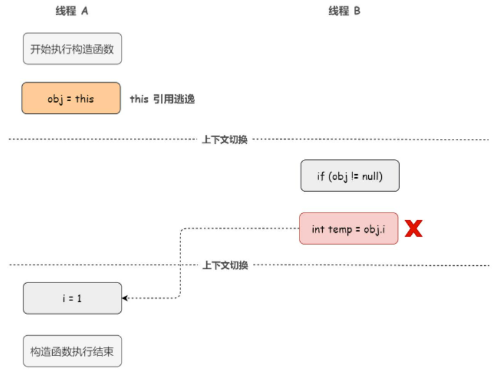

## final关键字

### 1.普通成员变量的初始化

1. 实例化对象的同时初始化成员变量

   - 直接赋值private int a = 1。
   - 用实例/构造代码块赋值
   - 构造方法中为成员变量赋值

   ```java
public class FinalTest {
   
       // 直接赋值
       private int a = 1;
   
       private int b;
       
       private int c;
   
       // 构造代码块为成员变量赋值
       {
           b = 2;
       }
   
       // 构造方法中为成员变量赋值
       public FinalTest() {
   		c = 3;
       }
   }
   ```
   
   
   
2. 但是编译器其实会将这些对成员变量的初始化的代码放到构造函数中去，并且这些代码会被放到对超类的构造函数调用语句之后。所以实际上是这样执行的。
   
     ```java
     public FinalTest() {
         super();
         a = 1;
         b = 2;
         c = 3;
     }
     ```
     
### 2.final成员变量的初始化

1. final修饰的成员变量的初始化必须

   - 直接赋值初始化
   - 用实例/构造代码块赋值
   - 在构造方法中初始化

   ```java
   public class FinalTest {
   
       // 1.直接赋值初始化
       private final int a = 1;
   
       private final int b;
       
       private final int c;
   
       // 2.构造代码块
       {
           b = 2;
       }
   
       // 3.在构造方法中初始化
       public FinalTest() {
           c = 3;
       }
   }
   ```

2. 在不考虑重排序的情况下，编译器会把对对象的成员变量的初始化放在构造方法中完成，包括代码块中对final成员变量的初始化也会放在构造方法中进行。并且对final初始化的代码会放到super()对超类构造函数的调用语句之后执行，因为Java要求构造函数的第一条语句必须是超类构造函数的调用。

   例如上面的代码，其实真正执行FinalTest类的构造函数时是这样的。
   
   ```java
   public FinalTest() {
       super();
   	a = 1;
       b = 2;
       c = 3;
   }
   ```

### 3.指令重排带来的问题
1. 我们先介绍两个前置概念：

   - 对象的初始化：

     先到方法区中确认该类是否被加载了进来--->类加载进来后，new字节码会到堆中为要创建的对象开辟一块内存，**并且为对象中的成员变量赋一个零值（临时的默认初始值）。**--->调用构造方法，对实例对象进行显式赋值，此时会执行成员变量的初始化操作，包括构造方法，代码块中的初始化操作。

     所以对成员变量的赋值操作有两步：先赋零值，在显式初始化。

   - 指令重排：

     处理器或者编译器会基于性能和效率的考虑，在不改变代码最终的结果的情况下，会改变的的执行顺序或者编译顺序。

2. 指令重排带来的可见性问题

   在创建FinalTest的实例对象时，成员变量的显式赋值操作可能会因为指令重排被放到构造方法之后执行。在单线程的情况下这没有任何问题，因为我们最后仍然会得到一个我们想要的初始化后的对象。

   但是如果线程A在构造方法执行完，因为线程调度导致其他线程拿到的这个引用，此时引用指向的对象中的成员变量仅仅被赋了零值，还没有进行显式的初始化。

   ```
   1. 开辟内存空间
   2. 为a赋零值0
   3. 将内存空间返回给对应的接收者
   4. 返回引用
   5. 为a赋值1
   ```

   此时线程B读到的成员变量是还没有初始化完成的零值，之后当线程A执行完成员变量的初始化操作后，线程C读到的成员变量值又变为1。所以也就是其他线程读到的成员变量的值不一致，导致了线程间的可见性问题。

   对于final修饰的成员变量，这种问题更加严重，其他线程看到了不一样的final成员变量，这也破坏了final的语义不可变性。

### 4.final保证可见性

通过上面的介绍，我们了解了在旧的JMM中，一个严重的缺陷就是线程可能看到final值的改变，破坏了final的语义。为了增强final的语义，JSR-133通过为final成员变量增加了写和读的重排序规则。对于final变量，编译器和处理器都要遵守两个重排序规则：

1. 写final域的重排序规则

   编译器会对final域的写指令之后，构造函数return之前，插入一个StoreStore屏障，禁止处理器对这部分代码进行重排序。**这样就可以确保对象引用被任意线程可见之前，对象的final域已经完成了初始化了。**

   注意：对于普通域没有这个要求，所以普通域还是可能发生写指令重排序到构造方法外的。

2. 读final域的重排序规则

   **首次**读一个包含final域的对象，与首次读这个final域，这两个操作之间不可以重排序。编译器会在读final域操作的前面插入一个LoadLoad屏障。**这样就可以保证在首次读一个对象的final域前一定会先读包含这个final域的对象的引用。**

   为什么要制定这样的一个规则：对于大部分编译器和处理器来说，一般不会对初次读对象引用和初次读对象的final域这两个操作进行重排序的，因为这两个操作之间存在**依赖关系**。但是有少数处理器是允许对存在间接依赖关系的操作进行重排序操作的，所以这个规则就是专门针对这种处理器的。

3. 这两个规则在对象的引用没有“逃逸”的情况下，当该对象被完整的构建出来之后。那么就能保证任意线程都能看到这个final域是构造函数初始化后的值。即保证多个线程中看到得到final域都是一致的。

4. 引用逃逸的情况

   上述的规则限定在包含final域的对象被正确的创建了出来，且引用没有发生逃逸。如果发生了this逃逸，效果就不同了。所谓逃逸包括方法逃逸和线程逃逸。

   - 当一个对象在方法里面被定义后，然后作为调用参数传递到其他方法中，那么它就会被外部方法所引用，这种成为方法逃逸。
   - 如果该引用赋值给可以在其他线程中访问的共享变量，能被外部其他线程访问到，这种成为线程逃逸。

   

   this引用逃逸就是一种线程逃逸：

   如下代码：线程A在构造方法还没彻底完成前，将自身的this引用赋值给了一个共享变量obj。当发生线程切换时，线程B执行reader方法时，会发现obj != null，此时就回去读final成员变量，此时访问该未被初始化的成员变量。

   **此时就会导致其他线程读到的成员变量的值不一致，也会破坏final的语义。**

   ```java
   public class FinalReferenceEscapeTest {    
       final int i;    
       static FinalReferenceEscapeTest obj;    
       public FinalReferenceEscapeTest () {        
           i = 1;                   // 1. 写 final 域
           obj = this;              // 2. this 引用在此 "逸出"
       } 
   
       // 线程 A
       public static void writer() { 
           new FinalReferenceEscapeExample(); 
       } 
   
       // 线程  B
       public static void reader() { 
           if (obj != null) {      // 3 
               int temp = obj.i;   // 4 
           } 
       }
   }
   ```

   

   

### 5.小结

因为final修饰的成员变量是只读的，不可变的，这就天然保证了可见性，因为不可变那么每个线程读到的final变量都是一致的。那为什么又要说它的可见性呢？因为成员变量的初始化是有两步的，先进行零值赋值，再构造函数进行初始化赋值，而且编译器存在指令重排的情况。所以可能发生这种情况，我们获取到了对象的引用，但是成员变量只进行了零值赋值，还没有完成显式的初始化。那么此时就会发生其他线程间读取到的final修饰的成员变量在多个线程间不一致的问题。

这里引用《深入理解Java虚拟机》中的一段话：**而final关键字的可见性是指：被final修饰的字段在构造器中一旦被初始化完成，并且构造器没有把this的引用传递出去，那么其他线程就都能看见final字段的值。**

