## CAS及原子操作类

### 1.线程不安全的例子

1. 示例代码：想要10个线程将sum累加到100000.

   ```java
   public class CASDemo1 {
   
       private volatile static int sum = 0;
   
       public static void main(String[] args) throws InterruptedException {
           for (int i = 0; i < 10; i++) {
               int finalI = i;
               Thread thread = new Thread(() -> {
                   System.out.println("测试线程Thread" + finalI + "第一次获取到sum值：" + sum);
                   for (int j = 0; j < 10000; j++) {
                       sum++;
                   }
                   System.out.println("测试线程Thread" + finalI + "操作结束后的sum值：" + sum);
               });
               thread.start();
           }
   
           Thread.sleep(3000L);
   
           System.out.println(sum);
       }
   }
   ```

2. 分析：

   这是一个典型的线程不安全的代码，共享变量的累加赋值操作sum++不是线程安全的。因为在JMM模型中，分为共享内存和每个线各自独立的工作内存，线程对共享变量的操作大致有这么几步。

   - 每个线程首先从工作内存中将sum共享变量拷贝到工作内存
   - 然后从工作内存中对其进行循环累加操作
   - 线程操作结束后（是累加10000次后将共享变量刷新到主存，不是每次累加操作后都会将其刷新到主内），再将其刷新到主存。

   从JMM模型来看，对共享变量的操作，因为涉及到可见性，顺序性，原子性等，所以不能天生到保证线程安全。

   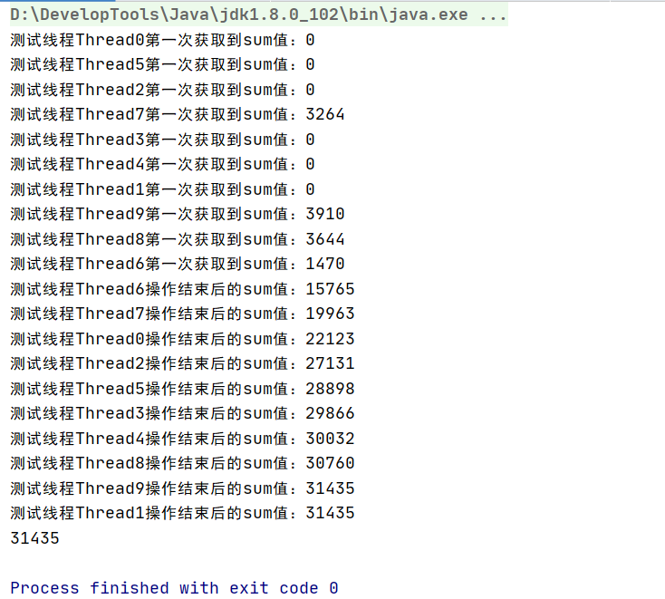

   正因为对共享变量进行写操作时不能及时的刷新到共享内存中，所以会导致在并发的情况下出现数据不安全的情况。在上面的例子中我们想要让10个线程分别累加sum10000次，希望得到最终的sum值是100000。那么就需要让每个线程都分别在其他线程自增的基础上再进行自增。怎么达到这个效果，让每个线程每次进行sum++时，读取到的sum值是最新的，而且每个线程对sum++时都要将其立马刷新到功能内存，并通知其他线程工作内存中的该变量无效，重新读取。

   在10个线程频繁的执行sum++，可能某个线程读取到最新的sum值刚要进行+运算时，其他线程刚刚更新了最新的sum值，这个时候在将更新后的值刷新到主存的话就会覆盖掉其他线程更新的值，导致写丢失。根本原因就是i++/i--不是一个原子操作。

3. 虽然volatile能保证可见性和有序性，即当线程要读一个volatile变量时，总能看到任意线程对这个volatile变量最后的写操作，能读到最新的volatile变量。但是volatile不能保证i++/i--的原子性，所以会造成数据不安全的情况，

   所以volatile能解决线程间共享变量的可见性问题，不能解决线程同步问题。

4. sync实现线程同步来达到我们想要的效果

   ```java
   public class CASDemo1 {
   
       private volatile static int sum = 0;
   
       private static Object MONITOR = "";
   
       public static void main(String[] args) throws InterruptedException {
           for (int i = 0; i < 10; i++) {
               int finalI = i;
               Thread thread = new Thread(() -> {
                   synchronized (MONITOR) {
                       for (int j = 0; j < 10000; j++) {
                           sum++;
                       }
                   }
               });
               thread.start();
           }
   
           Thread.sleep(5000L);
   
           System.out.println(sum);
       }
   }
   ```

   synchronized有性能损耗：这里10个线程竞争激烈，如果用sync会影响到性能。当某个线程没有抢到锁时，会阻塞发生状态变化。因为java是内核级线程，所以如果线程状态发生改变，那么就会发生用户态到内核态的切换，这是一种比较高昂的代价。

5. ReentrantLock实现线程同步
   
   ```java
   public class CASDemo1 {
   
       private volatile static int sum = 0;
   
       private static Object MONITOR = "";
   
       private static ReentrantLock lock = new ReentrantLock();
   
       public static void main(String[] args) throws InterruptedException {
           for (int i = 0; i < 10; i++) {
               Thread thread = new Thread(() -> {
                   lock.lock();
                   try {
                       for (int j = 0; j < 10000; j++) {
                           sum++;
                       }
                   } finally {
                       lock.unlock();
                   }
               });
               thread.start();
           }
           Thread.sleep(5000L);
           System.out.println(sum);
       }
   }
   ```
   

### 2.CAS简介

1. CAS概述：

   Compare And Swap比较并交换，通常指的是这样一种原子操作：针对一个变量，首先比较它的内存值与某个期望值是否相同。如果相同就为它赋予一个期望值。CAS将比较和赋值这两个动作合并成一个原子操作，并且其原子性是直接在硬件层面上得到保障。

   CAS可以看作是乐观锁的一种实现方式，Java原子类中的递增操作就是通过CAS自旋实现的。

   CAS是一种无锁算法，意味着没有线程阻塞。在不使用锁的情况下实现多线程之间的**变量同步**。

2. CAS应用

   在Java中，CAS操作是由Unsafe类提供支持的，该类定义了三种针对不同类型变量的CAS操作，如图：

   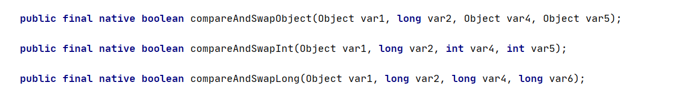

   它们都是native方法，由Java虚拟机提供具体实现，这意味着不同的Java虚拟机对他们的实现可能略有不同。

   以compareAndSwapInt为例，它有4个参数，分别是对象实例，内存偏移量，字段期望值，字段新值。该方法会根据偏移量对对象实例中的相应字段进行CAS操作。

3. 代码演示：

   ```java
   public class CASDemo2 {
       public static void main(String[] args) {
   
           Entity entity = new Entity();
           Unsafe unsafe = null;
           long offset = 0;
           boolean successful = false;
           try {
               // 反射获取Unsafe对象
               Constructor<Unsafe> constructor = Unsafe.class.getDeclaredConstructor(null);
               constructor.setAccessible(true);
               unsafe = constructor.newInstance();
   
               // 获取字段x的内存偏移量
               offset = unsafe.objectFieldOffset(Entity.class.getDeclaredField("x"));
           } catch (Exception e) {
               e.printStackTrace();
           }
   
           // 4个参数分别是：对象实例，字段的内存偏移量，字段期望值，字段更新值
           successful = unsafe.compareAndSwapInt(entity, offset, 0, 3);
           System.out.println(successful + "\t" + entity.x);
   
           successful = unsafe.compareAndSwapInt(entity, offset, 3, 5);
           System.out.println(successful + "\t" + entity.x);
   
           successful = unsafe.compareAndSwapInt(entity, offset, 3, 7);
           System.out.println(successful + "\t" + entity.x);
       }
   
       static class Entity {
           int x = 0;
       }
   }
   ```


### 3.CAS详细介绍

#### 3.1.字段的内存偏移量：对象实例的内存布局

要从对象实例的内存存储布局说起，我们常说的HotSpot虚拟机中，对象在内存中的存储布局可以分为3块区域：对象头，实例数据和对其填充。首先申明：普通对象与数组对象的存储结构存在区别

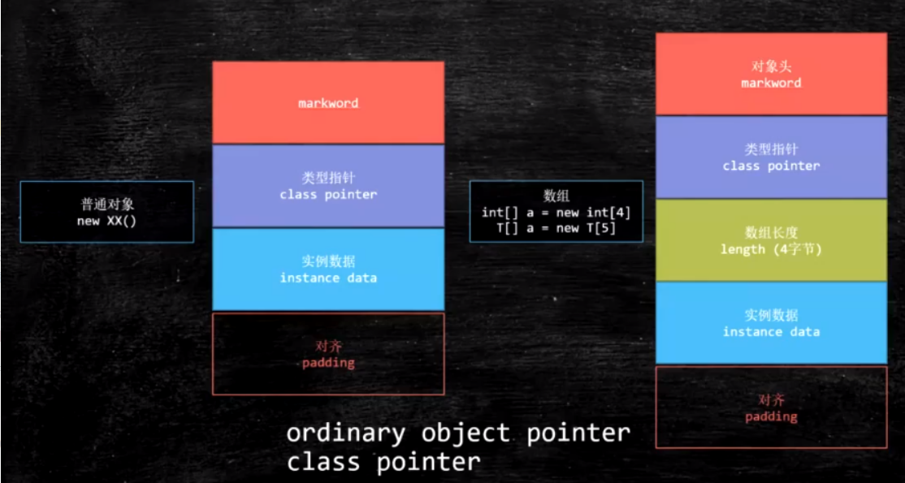

   1. 在HotSpot虚拟机的一般对象头包括2部分内容，数组对象头3部分

      - 第一部分用于存储对象自身的运行时数据，如哈希码（HashCode），GC分代年龄（Eden区-->S0--S1--->老年代），锁状态标志，线程持有锁，偏向线程id，偏向时间戳等。这部分数据的长度在32位和64位的虚拟机中分别是32bit，64bit，官方称为**Mark Word**（运行时元数据）。

      - 对象头的另一部分是类型指针class pointer/Klass word，即对象指向它的类元数据的指针，虚拟机通过这个指针确定对象是哪个类的实例。
      - 如果对象是一个数组，在对象头中还必须包含一块用于存放数组长度的数据，因为虚拟机可以用过不同对象的元数据信息确定Java对象的大小，但是数组的元数据中没有数组大小信息（数组对象的长度和类型是不固定的）。

2. 接下来的实例数据部分是对象真正存储着有效信息的内容，比如程序代码中所定义的各种类型的字段内容，无论是从父类继承下来的还是在子类中自己定义的都会在此处记录下来。这部分的存储顺序会受到虚拟机默认的分配策略参数FieldAllocationStyle和字段在Java源代码中定义顺序的影响。

3. 第三部分对其填充并不是必然存在，也没有特殊含义，是为了保证对象的大小必须是8字节的整数的而预留的占位符，如果对象大小就是8字节的整数倍，该部分可以不存在，否则就需要对其填充来补全。

4. 总结一下图：

   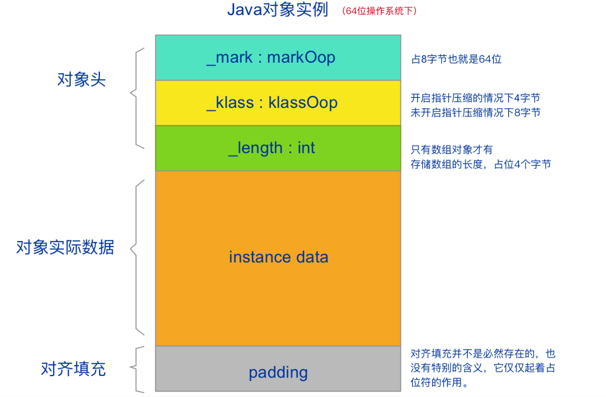

5. 所以对象实例的对象头占用大小是固定的，我们通过字段的偏移量就能从内存中定位到该字段。比如我们上面代码中的entity对象的x字段，默认Jvm对指针进行了压缩，所以对象头是8+4=12字节，int是4字节，所以x字段的偏移量就是12。

   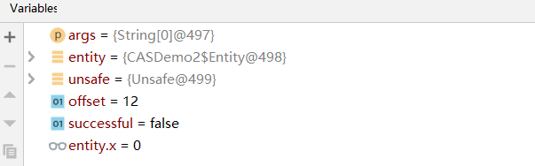

#### 3.2.CAS源码分析

1. HotSpot虚拟机对compareAndSwapInt方法的实现如下

   ```c++
   #unsafe.cpp
   UNSAFE_ENTRY(jboolean, Unsafe_CompareAndSwapInt(JNIEnv *env, jobject unsafe, jobject obj, jlong offset, jint e, jint x))
     UnsafeWrapper("Unsafe_CompareAndSwapInt");
     oop p = JNIHandles::resolve(obj);
     // 根据偏移量，计算value的地址
     jint* addr = (jint *) index_oop_from_field_offset_long(p, offset);
     // Atomic::cmpxchg(x, addr, e) cas逻辑 x:要交换的值   e:期望值
     // cas成功，返回期望值e，等于e，此方法返回true 
     // cas失败，返回内存中的value值，不等于e，此方法返回false
     return (jint)(Atomic::cmpxchg(x, addr, e)) == e;
   ```

2. 核心逻辑在Atomic::cmpxchg方法中，因为不同的操作系统和不同的CPU具体的指令不同，我们这里以linux_64x为例，分析一下Atomic::cmpxchg的实现。

   ```c++
   #atomic_linux_x86.inline.hpp
   inline jint     Atomic::cmpxchg    (jint     exchange_value, volatile jint*     dest, jint     compare_value) {
     //判断当前执行环境是否为多处理器环境
     int mp = os::is_MP();
     //LOCK_IF_MP(%4) 在多处理器环境下，为 cmpxchgl 指令添加 lock 前缀，以达到内存屏障的效果
     //cmpxchgl 指令是包含在 x86 架构及 IA-64 架构中的一个原子条件指令，
     //它会首先比较 dest 指针指向的内存值是否和 compare_value 的值相等，
     //如果相等，则双向交换 dest 与 exchange_value，否则就单方面地将 dest 指向的内存值交给exchange_value。
     //这条指令完成了整个 CAS 操作，因此它也被称为 CAS 指令。
     __asm__ volatile (LOCK_IF_MP(%4) "cmpxchgl %1,(%3)"
                       : "=a" (exchange_value)
                       : "r" (exchange_value), "a" (compare_value), "r" (dest), "r" (mp)
                       : "cc", "memory");
     return exchange_value;
   ```

   这里我们看到了一个汇编指令**cmpxchgl**，比较与交换指令cmpxchgl是包含在x86架构以及IA-64架构中的一个原子条件指令。它会首先比较dest指针指向的内存值和compare_value的值是否相等，如果相等则双向交换dest与exchange_value，否则就单方面的将dest指向的内存值交给exchange_value。

   LOCK_IF_MP(%4)：如果是多核处理器环境，为了保证可见性和顺序性还会加上了LOCK前缀指令。

   所以LOCK前缀指令保证了数据的有序性和可见性，比较与交换指令保证了自旋的原子性。

   

3. 现代各种架构处理器指令集基本上都会提供CAS指令，例如x86和IA-64架构中的cmpxchgl指令和comxchgq指令，sparc架构中的cas指令和casx指令。

   不管是Hotspot中的Atomic:cmpxchg方法，还是Java中的compareAndSwapInt方法，他们本质上都是对相应平台的CAS指令的一层简单封装。CAS指令作为一种硬件原语/指令，有着天然的原子性，这也正是CAS的价值所在。

#### 3.3.自定义一个CAS锁

我们这里自定义一个CAS锁来帮助我们实现上面的需求。

1. UnsafeFactory

   ```java
   public class UnsafeFactory {
   
       /**
        * 获取 Unsafe 对象
        * @return
        */
       public static Unsafe getUnsafe() {
           try {
               Field field = Unsafe.class.getDeclaredField("theUnsafe");
               field.setAccessible(true);
               return (Unsafe) field.get(null);
           } catch (Exception e) {
               e.printStackTrace();
           }
           return null;
       }
   
       /**
        * 获取字段的内存偏移量
        * @param unsafe
        * @param clazz
        * @param fieldName
        * @return
        */
       public static long getFieldOffset(Unsafe unsafe, Class clazz, String fieldName) {
           try {
               return unsafe.objectFieldOffset(clazz.getDeclaredField(fieldName));
           } catch (NoSuchFieldException e) {
               throw new Error(e);
           }
       }
   }
   
   ```

2. CASLock

   ```java
   public class CASLock {
   
       // 加锁标记
       private volatile int state;
   
       private static final Unsafe UNSAFE;
   
       // 字段state的片余量
       private static final long OFFSET;
   
       static {
           UNSAFE = UnsafeFactory.getUnsafe();
           OFFSET = UnsafeFactory.getFieldOffset(UNSAFE, CASLock.class, "state");
       }
   
       // 尝试将state字段做CAS操作
       public boolean cas() {
           return UNSAFE.compareAndSwapInt(this, OFFSET, 0, 1);
       }
   
       public int getState() {
           return state;
       }
   
       public void setState(int state) {
           this.state = state;
       }
   }
   ```

3. CASDemo1

   ```java
   public class CASDemo1 {
   
       private volatile static int sum = 0;
   
       private static CASLock casLock = new CASLock();
   
       public static void main(String[] args) throws InterruptedException {
           for (int i = 0; i < 10; i++) {
               Thread thread = new Thread(() -> {
                   // 自旋：如果if判断为false，那么会继续执行if判断。即一直尝试执行casLock.cas()成功
                   for(;;){
                       // 这里只要某个线程casLock.cas()成功后，意味着state字段变为1，那么其他线程在做casLock.cas()都会失败，相当于加锁
                       // 这里加上casLock.getState() == 0是为了不要每次都尝试casLock.cas()，当casLock.getState() == 0才会进一步尝试casLock.getState() == 0
                       if(casLock.getState() == 0 && casLock.cas()) {
                           try {
                               for (int j = 0; j < 10000; j++) {
                                   sum++;
                               }
                           } finally {
                               // 10000次循环结束后，该线程任务执行完。这里将state重新置为0，其他线程就有机会执行casLock.cas()成功。
                               casLock.setState(0);
                           }
                           // 跳出循环
                           break;
                       }
                   }
               });
               thread.start();
           }
   
           Thread.sleep(3000L);
           System.out.println(sum);
       }
   }
   
   ```


#### 3.4.原子类AtomicInteger实现自增

1. 代码实现

   ```java
   public class CASDemo3 {
   
       private static CASLock casLock = new CASLock();
   
       // AtomicInteger对象实例，并且其中的value字段是0
       private static AtomicInteger sum = new AtomicInteger(0);
   
       public static void main(String[] args) throws InterruptedException {
           for (int i = 0; i < 10; i++) {
               Thread thread = new Thread(() -> {
                   for (int j = 0; j < 10000; j++) {
                       sum.incrementAndGet();
                   }
               });
               thread.start();
           }
   
           Thread.sleep(3000L);
           System.out.println(sum);
       }
   }
   ```

2. 分析一下代码

   private static AtomicInteger sum = new AtomicInteger(0); 创建一个AtomicInteger对象实例，并且其中的value字段是0

   sum.incrementAndGet();会以CAS原子方式实现sum的自增，如果CAS不成功会持续尝试CAS直到CAS成功。

3. sum.incrementAndGet();

   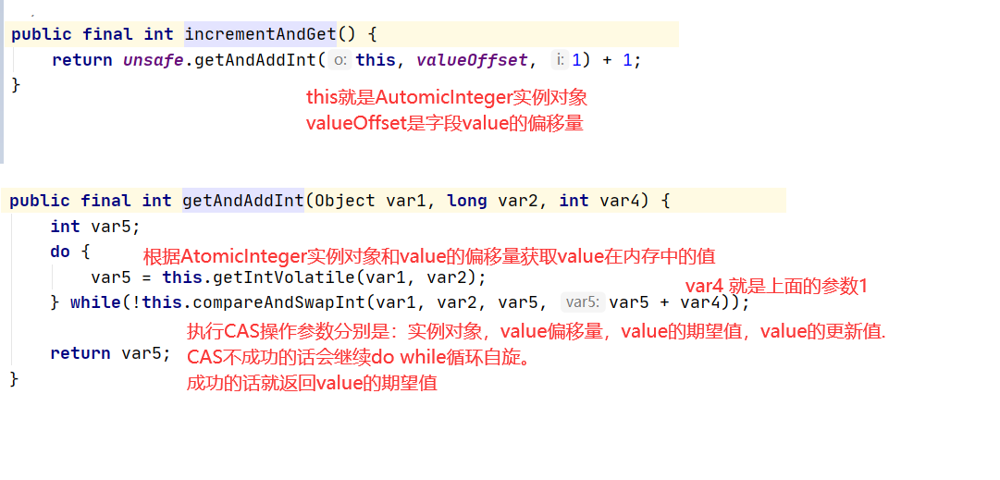

4. 这种CAS失败自旋的操作存在什么问题?

   当某个线程因为CAS不成功而一直自旋的话，相当于这个线程一直在占用着CPU进行空转。 会给CPU带来极大的开销，一直占用着CPU时间片，即使时间片到了还会继续抢占CPU，其他线程也很难抢占到CPU执行权。

5. var5 = this.getIntVolatile(var1, var2);

   获取value最内存中的值，是有volatile保证了其可见性。

   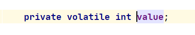

   

#### 3.5.CAS的好处

1. 开销小：CAS是一种无锁算法，通过一个硬件层面的原子指令来实现线程间的同步，避免了使用锁，也不会导致线程阻塞，所以也不会发生操作系统用户态和内核态之间的切换，开销较小。

2. CAS是一种乐观锁的实现方式，保证这个线程可以不断的去执行CAS操作。

   sync属于悲观锁，悲观的认为程序中的并发情况严重，每次都悲观的认为线程不安全，所以会严防死守。每次只允许一个线程执行sync块，其他线程阻塞，内核级线程状态的改变引起操作系统内核状态的切换，这也就导致了性能的下降。

   CAS属于乐观锁，乐观的认为程序中的并发情况不严重，会先尝试执行并发操作。所以CAS会让线程不断的去尝试操作，让其他线程都有机会执行并发操作。

   


#### 3.6.CAS的缺陷
   ```java
   // 自旋：如果if判断为false，那么会继续执行if判断。即一直尝试执行casLock.cas()成功
   for(;;){
       // 这里只要某个线程casLock.cas()成功后，意味着state字段变为1，那么其他线程在做casLock.cas()都会失败，相当于加锁
       // 这里加上casLock.getState() == 0是为了不要每次都尝试casLock.cas()，当casLock.getState() == 0才会进一步尝试casLock.getState() == 0
       if(casLock.getState() == 0 && casLock.cas()) {
           try {
               for (int j = 0; j < 10000; j++) {
                   sum++;
               }
           } finally {
               // 10000次循环结束后，该线程任务执行完。这里将state重新置为0，其他线程就有机会执行casLock.cas()成功。
               casLock.setState(0);
           }
           // 跳出循环
           break;
       }
   }
   ```

1. 自旋 CAS 长时间地不成功，则会给 CPU 带来非常大的开销

   从上面的代码我们分析一下，我们起了10个线程。10个线程都执行for( ; ; )。每次只有一个线程能cas成功，此时其他线程都在for( ; ; )循环中空转。那么如果业务逻辑比较复杂就会出现这样一个情况，一个线程cas成功后在执行业务逻辑，其他线程都在自旋，长时间的cas自旋不成功并且还在占用着CPU，会给CPU带来极大的开销，同时其他线程也很难抢占到CPU执行权。

   当某个线程因为CAS不成功而一直自旋的话，相当于这个线程一直在占用着CPU进行空转。 会给CPU带来极大的开销，一直占用着CPU时间片，即使时间片到了还会继续抢占CPU，其他线程也很难抢占到CPU执行权。

   **注意：**native方法compareAndSwapInt如果失败了就会返回false，但是在AtomicInteger中的incrementAndGet方法对compareAndSwapInt进行了包装，如果compareAndSwapInt失败就会一直循环再次尝试compareAndSwapInt，所以会造成上面的缺点。

2. 原子操作类AtomicInteger只能保证一个共享变量的原子操作

3. ABA问题

#### 3.7.ABA问题

1. 概述

   我们知道CAS算法是一个原子操作，但是它还是有两个动作，取值，然后比较和替换。比如在时刻1需要从内存中取出数据，在时刻2比较并替换。那么在两个时刻差之间数据可能发生变化然后又变化原值。但是线程在比较时发现和期待值一样然后成功进行CAS，并不会感知到数据其实发生了变化。

   比如当多个线程对原子类进行操作的时候，某个线程在短时间内将原子类的值A修改为B，又马上将其修改为A，此时其他线程感知不到这个变化，还是会CAS替换成功。

   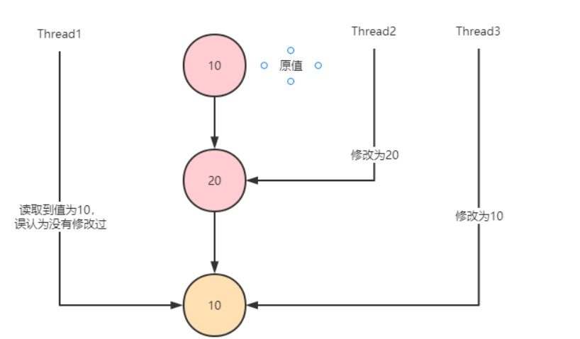


2. 代码演示

   ```java
   public class ABATest {
   
       static Logger logger = Logger.getLogger("com.taoxinglong.cas.ABATest");
   
       public static void main(String[] args) {
           AtomicInteger atomicInteger = new AtomicInteger(1);
   
           new Thread(()->{
               int value = atomicInteger.get();
               logger.info("Thread1 read value: " + value);
   
               // 阻塞1s
               LockSupport.parkNanos(1000000000L);
   
               // Thread1通过CAS修改value值为3
               if (atomicInteger.compareAndSet(value, 3)) {
                   logger.info("Thread1 update from " + value + " to 3");
               } else {
                   logger.info("Thread1 update fail!");
               }
           },"Thread1").start();
   
           new Thread(()->{
               int value = atomicInteger.get();
               logger.info("Thread2 read value: " + value);
               // Thread2通过CAS修改value值为2
               if (atomicInteger.compareAndSet(value, 2)) {
                   logger.info("Thread2 update from " + value + " to 2");
   
                   value = atomicInteger.get();
                   logger.info("Thread2 read value: " + value);
                   // Thread2通过CAS把value值又改回为1
                   if (atomicInteger.compareAndSet(value, 1)) {
                       logger.info("Thread2 update from " + value + " to 1");
                   }
               }
           },"Thread2").start();
       }
   }
   ```

   Thread1不清楚Thread2对value的操作，误认为value=1没有修改过

   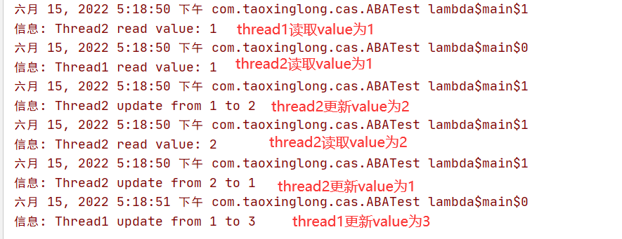

   

3. ABA解决方案：版本号

   数据库有个锁称为乐观锁，是一种基于数据版本实现数据同步的机制，每次修改一次数据，版本就会进行累加。同样Java也提供了相应的原子引用类AtomicStampedReference< V >。

   AtomicStampedReference有两个属性reference和stamp，其中reference相当于value，stamp相当于版本号。每次进行CAS时，不仅会比较value还会比较版本号，只有当value和版本号都与期待值一致时才会进行替换操作。

4. 代码演示

   ```java
   public class AtomicStampedReferenceTest {
   
       static Logger log = Logger.getLogger("com.taoxinglong.atomic.AtomicStampedReferenceTest");
   
       public static void main(String[] args) {
           // 定义AtomicStampedReference ：Pair.reference值为1, Pair.stamp为1；Pair.reference是value，Pair.stamp是版本号。
           AtomicStampedReference atomicStampedReference = new AtomicStampedReference(1,1);
   
           new Thread(()->{
               int[] stampHolder = new int[1];
               // 获取Pair.reference，Pair.stamp，并且将Pair.stamp放到数组中
               int value = (int) atomicStampedReference.get(stampHolder);
               int stamp = stampHolder[0];
               log.info("Thread1 read value: " + value + ", stamp: " + stamp);
   
               // 阻塞1s
               LockSupport.parkNanos(1000000000L);
               // Thread1通过CAS修改value值为3  每次不仅会比较value还会比较stamp，value和stamp都等于期待值才会替换value和stamp stamp是版本，每次修改可以通过+1保证版本唯一性
               if (atomicStampedReference.compareAndSet(value, 3,stamp,stamp+1)) {
                   log.info("Thread1 update from " + value + " to 3");
               } else {
                   log.info("Thread1 update fail!");
               }
           },"Thread1").start();
   
           new Thread(()->{
               int[] stampHolder = new int[1];
               int value = (int)atomicStampedReference.get(stampHolder);
               int stamp = stampHolder[0];
               log.info("Thread2 read value: " + value+ ", stamp: " + stamp);
               // Thread2通过CAS修改value值为2
               if (atomicStampedReference.compareAndSet(value, 2,stamp,stamp+1)) {
                   log.info("Thread2 update from " + value + " to 2");
   
                   // do something
   
                   value = (int) atomicStampedReference.get(stampHolder);
                   stamp = stampHolder[0];
                   log.info("Thread2 read value: " + value+ ", stamp: " + stamp);
                   // Thread2通过CAS修改value值为1
                   if (atomicStampedReference.compareAndSet(value, 1,stamp,stamp+1)) {
                       log.info("Thread2 update from " + value + " to 1");
                   }
               }
           },"Thread2").start();
       }
   }
   ```

   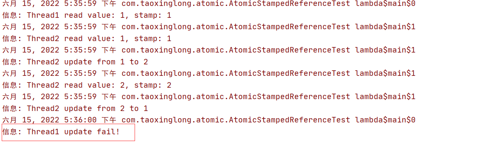

   

#### 3.8.AtomicMarkableReference

可以理解为上面AtomicStampedReference的简化版，就是不关心修改过几次，仅仅关心是否修改过。因此变量mark是boolean类型，仅记录值是否有过修改。


#### 3.9.乐观锁和悲观锁

乐观锁和悲观锁都是锁的一种设计理念

- 悲观锁：
  
- 悲观的认为程序中的并发情况严重，每次都悲观的认为线程不安全，所以会严防死守。每次只允许一个线程执行sync块，其他线程阻塞，内核级线程状态的改变引起操作系统内核状态的切换，这也就导致了性能的下降。
  
- 乐观锁：

  - **乐观锁认为这种线程安全问题发生的可能性比较低，多数情况下不会发生，没有必要上来就加锁。不应该针对这种少数并发不安全的情况，而让所有的线程都串行执行。**
  - **保证线程安全的方式**：在对数据进行更新时会先去判断数据和之前访问的数据是否一致，不一致说明有其他线程对数据做了修改，进而重试或者抛异常。如果和之前访问的数据一致，那么就意味着这次线程安全，可以进行修改。（CAS的判断和修改是一个原子操作。）
  - 避免了使用锁，也不会导致线程阻塞，所以也不会发生操作系统用户态和内核态之间的切换，开销较小。

- 乐观锁的实现：关键是判断之前查询得到的数据是否有被修改过，常见的方式有两种

  - 版本号法：给数据加上一个版本属性，在多线程并发的情况下基于版本号来判断数据有没有被修改过。每当数据做一次修改，版本号就会+1，如果发现版本号发生了变化或者说不符合预期值，那么就说明数据发生了变化，被其他线程修改过。

    所以再更新数据的时候，还要判断版本是否符合预期值：

    ```sql
    set 
    	stock = stock - 1, 
    	version = verison + 1 
    where version = #{预期值}
    ```

    

    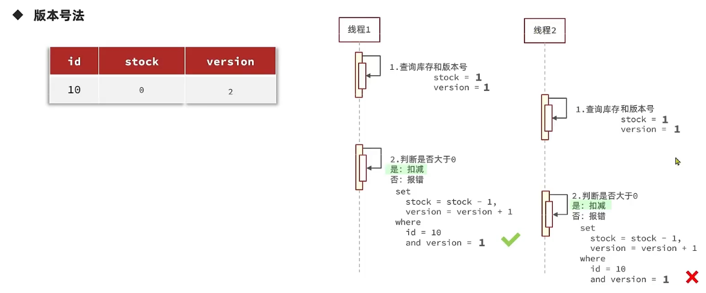

  - CAS：比较然后交换，和版本号的区别在于，版本号法是判断版本号有没有被修改，进而判断数据有没有被修改。CAS是直接判断数据本身没有有被修改（是否符合预期值），如果被修改就交换失败。

    ```sql
    set 
    	stock = stock - 1, 
    where stock = #{预期值}
    ```

    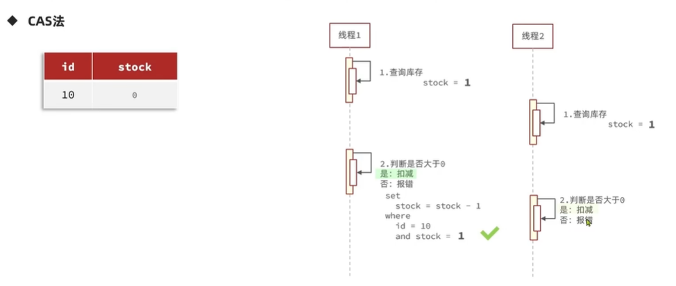

    

- 乐观锁的优缺点：

  - 乐观锁不用去加锁，避免了使用锁，也不会导致线程阻塞。而是在执行过程中做判断，能首先保证大部分并发正常的顺利执行。所以性能要优于悲观锁。
  - 缺点：当同一时刻多个线程都去修改某一个值时，加入某个线程修改成功，那么会导致其他线程全部失败。所以缺点是成功率很低。
  - 改进：
    - 分段加锁，将要操作的数据分成几部分，每部分在进行操作时都应用乐观锁，最后再将结果汇总。那么相当于每次锁定的资源只是这一部分，效率可以提高很多倍。比如ConcurrentHashmap和LongAdder累加器。
    - 有的也可以根据业务做些改进：比如不用每次判断版本是否改变，只要版本不会超过某个范围即可。比如在下订单业务时，将库存作为版本属性进行判断的时候。
  
- 两者适用场景：乐观锁适合修改数据，悲观锁适合插入数据

- 悲观锁要注意控制锁的粒度：通过锁对象（锁定资源的范围），和锁住的代码来控制。


### 4.Atomic包下原子操作类详解

#### 4.1.原子操作类介绍

在并发编程中很容易出现并发安全的问题，一个很简单的例子就是多线程更新共享变量i，在更新时就可能获取不到正确的值。这个问题最常用的方法是通过sync关键字进行线程间的同步互斥来达到线程安全的目的。但是由于sync是采用悲观锁策略，效率不高。

实际上在J.U.C包下的atomic包提供了一系列操作简单，性能高效，并能保证线程安全的类来更新基本类型变量，数据元素，引用类型以及更新对象中的字段类型。atomic包下的这些类都是采用的乐观锁策略执行原子更新策略，具体在Java中使用CAS操作实现。

java.util.concurrent.atomic下的原子类可以分为如下5种：

- 基本类型：AtomicInteger、AtomicLong、AtomicBoolean；

- 引用类型：AtomicReference、AtomicStampedRerence、AtomicMarkableReference；

- 数组类型：AtomicIntegerArray、AtomicLongArray、AtomicReferenceArray

- 对象属性原子修改器：AtomicIntegerFieldUpdater、AtomicLongFieldUpdater、AtomicReferenceFieldUpdater

- 原子类型累加器（jdk1.8增加的类）：DoubleAccumulator、DoubleAdder、LongAccumulator、LongAdder、Striped64

  
  
#### 4.2.原子操作类：基本类型

以AtomicInteger为例，介绍几个常用的方法

```java
//以原子的方式将实例中的原值加1，返回的是自增前的旧值；
public final int getAndIncrement() {
    return unsafe.getAndAddInt(this, valueOffset, 1);
}
 
//incrementAndGet() ：以原子的方式将实例中的原值进行加1操作，并返回最终相加后的结果；
public final int incrementAndGet() {
    return unsafe.getAndAddInt(this, valueOffset, 1) + 1;
}
 
//addAndGet(int delta) ：以原子方式将输入的数值与实例中原本的值相加，并返回最后的结果；
public final int addAndGet(int delta) {
    return unsafe.getAndAddInt(this, valueOffset, delta) + delta;
```

#### 4.3.原子操作类：数组类型

以AtomicIntegerArray为例总结常用的方法

```java
//addAndGet(int i, int delta)：以原子更新的方式将数组中索引为i的元素与输入值相加；
public final int addAndGet(int i, int delta) {
    return getAndAdd(i, delta) + delta;
}
 
//getAndIncrement(int i)：以原子更新的方式将数组中索引为i的元素自增加1；
public final int getAndIncrement(int i) {
    return getAndAdd(i, 1);
}
 
//compareAndSet(int i, int expect, int update)：将数组中索引为i的位置的元素进行更新
public final boolean compareAndSet(int i, int expect, int update) {
    return compareAndSetRaw(checkedByteOffset(i), expect, update);
```

代码演示

```java
public class AtomicIntegerArrayTest {

    static int[] value = new int[]{ 1, 2, 3, 4, 5 };
    static AtomicIntegerArray atomicIntegerArray = new AtomicIntegerArray(value);

    public static void main(String[] args) throws InterruptedException {

        //设置索引0的元素为100
        atomicIntegerArray.set(0, 100);
        System.out.println(atomicIntegerArray.get(0));
        //以原子更新的方式将数组中索引为1的元素与输入值相加
        atomicIntegerArray.getAndAdd(1,5);

        System.out.println(atomicIntegerArray);
    }
}
```

#### 4.4.原子操作类：引用类型

AtomicReference作用是对普通对象的封装，它可以保证你在修改对象引用时的线程安全性。

```java
public class AtomicReferenceTest {

    public static void main( String[] args ) {
        User user1 = new User("张三", 23);
        User user2 = new User("李四", 25);
        User user3 = new User("王五", 20);

        //初始化为 user1
        AtomicReference<User> atomicReference = new AtomicReference<>();
        atomicReference.set(user1);

        //把 user2 赋给 atomicReference：成功，因为期待值就是user1
        atomicReference.compareAndSet(user1, user2);
        System.out.println(atomicReference.get());

        //把 user3 赋给 atomicReference ：此时会失败，因为期待值不是user1了
        atomicReference.compareAndSet(user1, user3);
        System.out.println(atomicReference.get());
    }
}
```

#### 4.5.原子操作类：对象属性原子修改器

AtomicIntegerFieldUpdater可以线程安全地更新对象中的整型变量。

```java
public class AtomicIntegerFieldUpdaterTest {


    public static class Candidate {
        //字段必须是volatile类型
        volatile int score = 0;
    }

    // 指定对象属性原子修改类的泛型为Candidate，属性是score
    public static final AtomicIntegerFieldUpdater<Candidate> scoreUpdater =
            AtomicIntegerFieldUpdater.newUpdater(Candidate.class, "score");

    public static void main(String[] args) throws InterruptedException {

        final Candidate candidate = new Candidate();

        Thread[] t = new Thread[100];
        for (int i = 0; i < 100; i++) {
            t[i] = new Thread(new Runnable() {
                @Override
                public void run() {
                    if (Math.random() > 0.4) {
                        scoreUpdater.incrementAndGet(candidate);
                    }
                }
            });
            t[i].start();
        }
        for (int i = 0; i < 100; i++) {
            t[i].join();
        }
        System.out.println("AtomicIntegerFieldUpdater Score=" + candidate.score);
    }
}
```

对于AtomicIntegerFieldUpdate的使用稍微有一些限制和约束，约束如下：

1. 要更新的字段必须是volatile类型的，在线程之间操作共享变量时能保证可见性。
2. 只能是实例属性，不能是类属性，也就是不能更新static属性
3. 只能是可修改的变量，不能是final。而且final的语义和volatile是冲突的，一个不可变一个保证每次变化后的可见性，所以两个关键字也不能同时存在。
4. 对于AtomicIntegerFieldUpdater和AtomicLongFieldUpdater只能修改int/long类型的字段，不能修改包装类型Integer/Long、如果要修改包装类型需要使用AtomicReferenceFieldUpdater

#### 4.6.原子类型累加器：LongAdder/DoubleAdder详解

1. 引入原因：

   高并发场景下，如果通过CAS来操作一个变量V，肯定是有性能问题的。每个时刻只有一个线程可以CAS成功，其他线程只能在那do while自旋不停的循环空转，而且一直占用着CPU时间片，时间片到了还会继续抢占CPU。

   在并发量较低的情况下，线程冲突的概率比较小，自旋的次数不会很多。但是在高并发环境下，N个线程同时进行自选操作，会出现大量CAS失败并不断进行CAS自旋的情况，此时AtomicLong的自旋会成为性能瓶颈。

   这就是LongAdder/DoubleAdder引入的初衷：解决高并发环境下AtomicLong，AtomicInteger的自旋性能瓶颈。

2. 代码演示

   ```java
   public class LongAdderTest {
   
       public static void main(String[] args) {
           testAtomicLongVSLongAdder(10, 10000);
           System.out.println("==================");
           testAtomicLongVSLongAdder(10, 200000);
           System.out.println("==================");
           testAtomicLongVSLongAdder(100, 200000);
       }
   
       static void testAtomicLongVSLongAdder(final int threadCount, final int times) {
           try {
               long start = System.currentTimeMillis();
               testLongAdder(threadCount, times);
               long end = System.currentTimeMillis() - start;
               System.out.println("条件>>>>>>线程数:" + threadCount + ", 单线程操作计数" + times);
               System.out.println("结果>>>>>>LongAdder方式增加计数" + (threadCount * times) + "次,共计耗时:" + end);
   
               long start2 = System.currentTimeMillis();
               testAtomicLong(threadCount, times);
               long end2 = System.currentTimeMillis() - start2;
               System.out.println("条件>>>>>>线程数:" + threadCount + ", 单线程操作计数" + times);
               System.out.println("结果>>>>>>AtomicLong方式增加计数" + (threadCount * times) + "次,共计耗时:" + end2);
           } catch (InterruptedException e) {
               e.printStackTrace();
           }
       }
   
       static void testAtomicLong(final int threadCount, final int times) throws InterruptedException {
           CountDownLatch countDownLatch = new CountDownLatch(threadCount);
           AtomicLong atomicLong = new AtomicLong();
           for (int i = 0; i < threadCount; i++) {
               new Thread(new Runnable() {
                   @Override
                   public void run() {
                       for (int j = 0; j < times; j++) {
                           atomicLong.incrementAndGet();
                       }
                       countDownLatch.countDown();
                   }
               }, "my-thread" + i).start();
           }
           countDownLatch.await();
       }
   
       static void testLongAdder(final int threadCount, final int times) throws InterruptedException {
           CountDownLatch countDownLatch = new CountDownLatch(threadCount);
           LongAdder longAdder = new LongAdder();
           for (int i = 0; i < threadCount; i++) {
               new Thread(new Runnable() {
                   @Override
                   public void run() {
                       for (int j = 0; j < times; j++) {
                           longAdder.add(1);
                       }
                       countDownLatch.countDown();
                   }
               }, "my-thread" + i).start();
           }
   
           countDownLatch.await();
       }
   }
   ```

   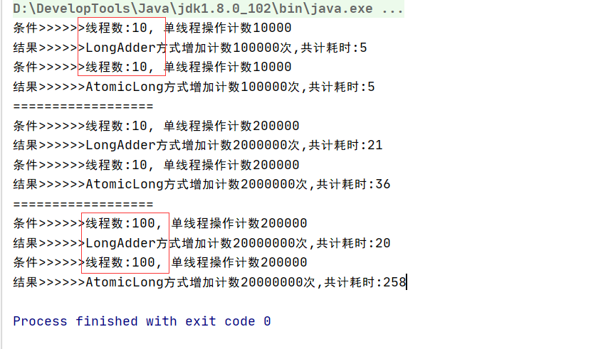

   所以低并发，一般的业务场景下AtomicLong是足够了，如果并发量很多，存在大量写多读少的情况，那么LongAdder可能更合适。

3. LongAdder设计思路

   AtomicLong中有个内部变量value保存着实际的long值，所有的操作都是针对该变量进行的。也就是说，高并发环境下，value变量其实是一个热点，即N个线程竞争一个热点。

   LongAdder的基本思路就是分散热点，将value值分散到一个Cell数组中，这个数组的最大值是逻辑CPU核数（物理CPU核数X2：尽量发挥CPU的最大并发度），每个线程都会根据一个hash算法落到不同的Cell槽中，只对自己槽中的值进行CAS操作。如果hash算法发散的足够均匀，那么在高并发情况下就能充分发挥CPU的并行性，达到较少CAS自旋失败导致的空转损耗。最后将各个槽中的变量值进行累加即可得到最终的结果。

   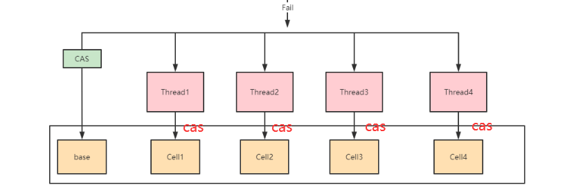

4. 源码分析

   1. LongAdder继承了Striped64：public class LongAdder extends Striped64 implements Serializable

      Striped64中定义了几个重要的属性，我们先看一看：

      ```java
      // 1.CPU逻辑核数，用来决定槽数组的大小
      static final int NCPU = Runtime.getRuntime().availableProcessors();
      
      /**
       * Table of cells. When non-null, size is a power of 2.
       */
       // 数组槽，大小为2的次幂
      transient volatile Cell[] cells;
      
      /**
       * Base value, used mainly when there is no contention, but also as
       * a fallback during table initialization races. Updated via CAS.
       */
       /**
       *  基数，在两种情况下会使用：
       *  1. 没有遇到并发竞争时，直接使用base累加数值
       *  2. 初始化cells数组时，必须要保证cells数组只能被初始化一次（即只有一个线程能对cells初始化），
       *  其他竞争失败的线程会先将数值累加到base上。等cells初始化好之后，再在cell槽上进行CAS
       */
      transient volatile long base;
      
      /**
       * Spinlock (locked via CAS) used when resizing and/or creating Cells.
       * 锁的标记：当对cells数组进行扩容或创建时会用	
       */
      transient volatile int cellsBusy;
      ```

   2. 内部类Cell: Striped64定义了一个内部类Cell，也就是上面说的槽，每个Cell对象存有一个value值，可以通过Unsafe的CAS操作它的value值

      ```java
      // @sun.misc.Contended：为了解决伪共享加的注解
      @sun.misc.Contended static final class Cell {
          	// value值
              volatile long value;
          	// 构造方法
              Cell(long x) { value = x; }
          	// cas比较并交换
              final boolean cas(long cmp, long val) {
                  return UNSAFE.compareAndSwapLong(this, valueOffset, cmp, val);
              }
      
              // 一些Cell类的初始化操作
              private static final sun.misc.Unsafe UNSAFE;
              private static final long valueOffset;
              static {
                  try {
                      UNSAFE = sun.misc.Unsafe.getUnsafe();
                      Class<?> ak = Cell.class;
                      valueOffset = UNSAFE.objectFieldOffset
                          (ak.getDeclaredField("value"));
                  } catch (Exception e) {
                      throw new Error(e);
                  }
              }
          }
      ```

   3. LongAdder#add方法

      ```java
      public void add(long x) {
          Cell[] as; long b, v; int m; Cell a;
          // 一开始cells还没初始化肯定是null，所以第一个线程在base上进行cas，并且cas成功，此时if判断是false不会走进去。
          // 1.存在并发竞争：如果只有一个线程的话，那么每次都只会走(as = cells) != null || !casBase(b = base, b + x)代码，不会进入下面的代码。也就是不存在并发竞争的情况下，直接在base上CAS。
          // 2.存在并发情况：第二个线程if判断，cells还是null，并且第一个线程cas成功会导致第二个线程cas失败，进入下面代码块
          if ((as = cells) != null || !casBase(b = base, b + x)) {
              boolean uncontended = true;
              //分析一下这个短路 || 的逻辑
              if (as == null 
                          || (m = as.length - 1) < 0 
                          || (a = as[getProbe() & m]) == null 
                          || !(uncontended = a.cas(v = a.value, v + x)))
                      longAccumulate(x, null, uncontended);
          }
      }
      
      final boolean casBase(long cmp, long val) {
            return UNSAFE.compareAndSwapLong(this, BASE, cmp, val);
      }
      ```

   4. 分析一下这个短路 || 的逻辑

      ```java
      if (as == null 
          || (m = as.length - 1) < 0 
          || (a = as[getProbe() & m]) == null 
          || !(uncontended = a.cas(v = a.value, v + x)))
          longAccumulate(x, null, uncontended);
      ```

      1. 如果as == null为false，说明数组已经实例化，那么继续判断(m = as.length - 1) < 0 。

      2. 如果(m = as.length - 1) < 0 也为false，说明数组已经实例化了并且长度不为0，那么继续判断(a = as[getProbe() & m]) == null 

      3. (a = as[getProbe() & m]) == null ：其中getProbe() & m就是根据当前线程对象与数组长度进行 & 运算，得出当前线程对应的槽。

         ```java
         static final int getProbe() {
             return UNSAFE.getInt(Thread.currentThread(), PROBE);
         }
         ```

         拿出槽中的元素赋给a，如果不为null，也就是(a = as[getProbe() & m]) == null为false，即槽中的元素也已经赋值好了。那么继续判断!(uncontended = a.cas(v = a.value, v + x)))。

         **注意：此时cells数组已经完全初始化好了，而且其中的每个元素也都赋好值了。**

      4. !(uncontended = a.cas(v = a.value, v + x)))：这里直接对槽中元素的value值进行cas操作，并且判断cas操作是否成功。成功的话true，取反为false。那么就不会走 longAccumulate(x, null, uncontended);

         失败的话，说明多个线程都被hash映射到了同一个槽中，那么就会有线程CAS操作槽中的value失败的情况，此时会走longAccumulate(x, null, uncontended);
         
         

      - 这里先总结一下上面的情况：什么情况下会走到第四步判断？前面3个判断都是false，说明cells数组初始化好了，后续的所有线程都会到对应的槽中的Cell对象的value属性对其进行CAS操作。

      - 如果前面3个判断有一个是true，就说明cells数组还没有初始化好，那么就会走到longAccumulate(x, null, uncontended);方法。

        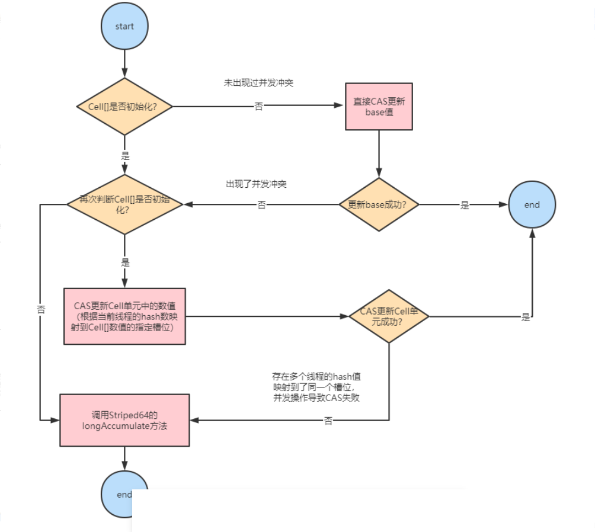

      - 小结：

        如果没有发生并发冲突时（包括多线程交替执行），直接使用base基数。一旦出现了并发冲突，先操作base基数，待cells数组初始化好之后所有的操作都只针对Cell[]数组中的单元Cell对象中的Value属性。
      
        如果Cell[]数组未初始化，会调用父类的longAccumulate去初始化Cell[]，如果Cell[]已经初始化但是冲突（多个线程都散列到一个槽中导致CAS失败）发生在Cell单元内，也会调用longAccumulate，此时有可能会对Cell进行扩容。
      
        
      
     5. Striped64#longAccumulate的流程图如下
   
        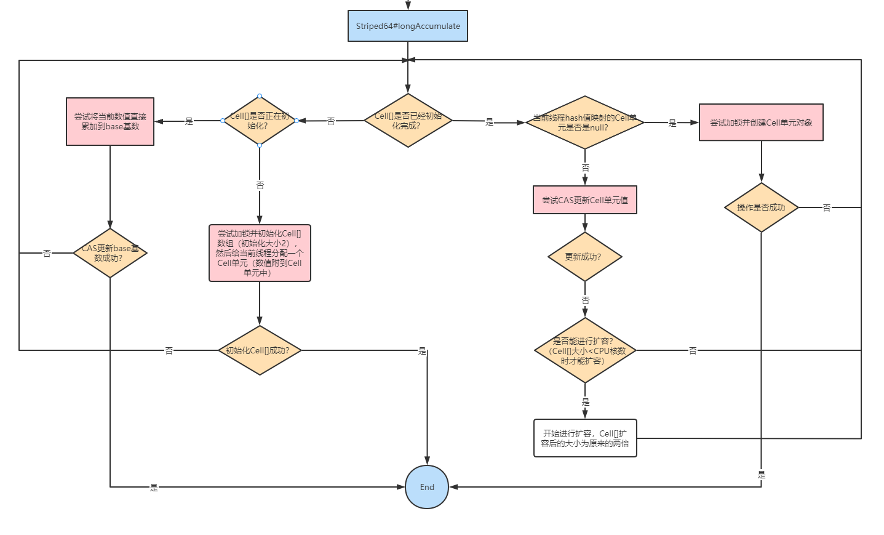
   
   6. LongAdder#sum方法
   
      ```java
      /**
      * 返回累加的和，也就是"当前时刻"的计数值
      * 注意： 高并发时，除非全局加锁，否则得不到程序运行中某个时刻绝对准确的值
      *  此返回值可能不是绝对准确的，因为调用这个方法时还有其他线程可能正在进行计数累加,
      *  方法的返回时刻和调用时刻不是同一个点，在有并发的情况下，这个值只是近似准确的计数值
      */
      public long sum() {
          Cell[] as = cells; Cell a;
          long sum = base;
          if (as != null) {
              for (int i = 0; i < as.length; ++i) {
                  if ((a = as[i]) != null)
                      sum += a.value;
              }
          }
          return sum;
      }    
      ```
   
      由于计算总和时没有对Cell数组进行加锁，所以在累加过程中可能有其他线程对Cell中的值进行了修改，也有可能对数组进行了扩容，所以sum返回的值并不是非常精确的，其返回值并不是一个调用sum方法时的原子快照值。
   
   
   
#### 4.7.LongAccumulator

LongAccumulator是LongAdder的增强版。LongAdder只能针对数值的进行加减运算，而LongAccumulator提供了自定义的函数操作。其构造函数如下。

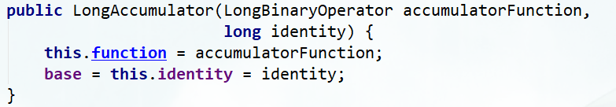

通过LongBinaryOperator，可以自定义对入参的任意操作，并返回结果（LongBinaryOperator接收2个long作为参数，并返回1个long）。LongAccumulator内部原理和LongAdder几乎完全一样，都是利用了父类Striped64的longAccumulate方法。

```java
public class LongAccumulatorTest {

    public static void main(String[] args) throws InterruptedException {
        // 累加 x+y：接收long型的x，y参数，并返回x + y
        LongAccumulator accumulator = new LongAccumulator((x, y) -> x + y, 0);

        ExecutorService executor = Executors.newFixedThreadPool(8);
        // 1到9累加 ： identity + i
        IntStream.range(1, 10).forEach(i -> executor.submit(() -> accumulator.accumulate(i)));

        Thread.sleep(2000);
        System.out.println(accumulator.getThenReset());

    }
}
```

分析一下：

```java
LongAccumulator accumulator = new LongAccumulator((x, y) -> x + y, 0);
accumulator.accumulate(i)
```

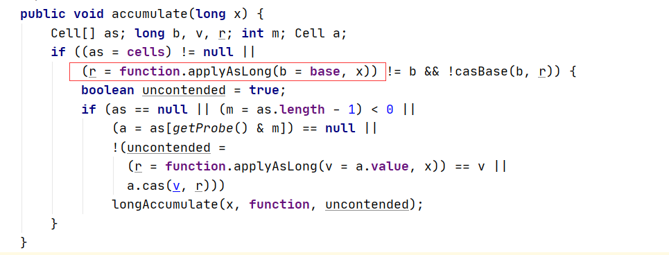

上面的applyAsLong(b=base, x)就调用了new LongAccumulator((x, y) -> x + y, 0);中传入的(x, y) -> x + y方法，其中base初始值就是传入的0。

   


   ​     
   ​     


