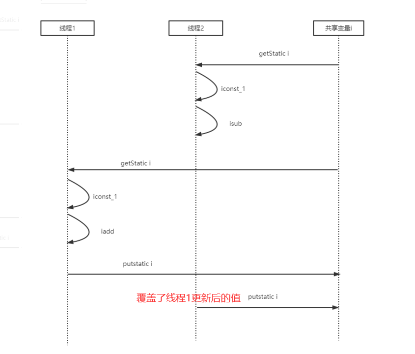
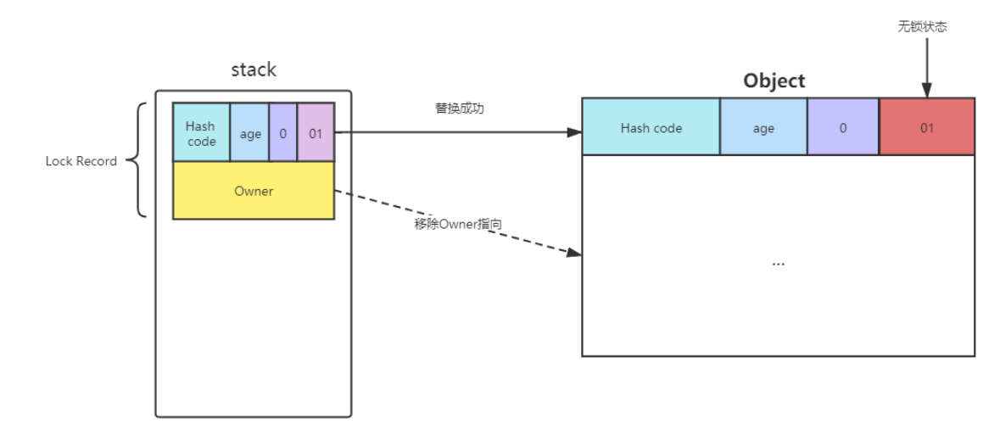

### 1.一个例子

#### 1.1.例子分析

1. 思考：两个线程对初始值为0的静态volatile变量一个做自增5000次，一个做自减5000次，最后结果会是0吗？

   ```java
   public class SyncDemo1 {
   
       // volatile对count++的操作不能保证可见性：因为写操作不能依赖于当前的值
       private static volatile int count = 0;
   
       private static void increment() {
           count++;
       }
   
       private static void decrement() {
           count--;
       }
   
       public static void main(String[] args) throws InterruptedException {
   
           Thread thread1 = new Thread( () -> {
               for (int i=0; i<5000; i++) {
                   increment();
               }
           }, "thread1");
   
           Thread thread2 = new Thread( () -> {
               for (int i=0; i<5000; i++) {
                   decrement();
               }
           }, "thread2");
   
           thread1.start();
           thread2.start();
           thread1.join();
           thread2.join();
   
           System.out.println(count);
       }
   }
   ```

2. 问题分析

   以上的结果可能是正数，负数，零，因为Java中对静态变量的自增，自减并不是原子操作。

   也可以这样理解volatile也不能保证对变量自增，自减的可见性，因为volatile保证可见性的前提是写操作不能依赖于当前的值。

   我们具体看一下count++和count--的Java字节码指令：

   ```java
   0 getstatic #2 <com/taoxinglong/sync/SyncDemo1.count> //从常量池位置1的地方加载 static变量count
   3 iconst_1 //将int类型的常量压入操作数栈位置1处
   4 iadd //自增
   5 putstatic #2 <com/taoxinglong/sync/SyncDemo1.count> // 将修改后的值存入常量池位置2处
   8 return
   ```

   ```java
   0 getstatic #2 <com/taoxinglong/sync/SyncDemo1.count> //从常量池位置1的地方加载 static变量count
   3 iconst_1 //将int类型的常量压入操作数栈位置1处
   4 isub //自减
   5 putstatic #2 <com/taoxinglong/sync/SyncDemo1.count> // 将修改后的值存入常量池位置2处
   8 return
   ```

   在单线程的情况下，这些指令是顺序执行的，所以不会出现问题。但是在多线程情况下，这些指令可能是交错运行的，就会出现问题。

   

   

#### 1.2.相关概念

   1. 临界区 Critical Section

      访问临界资源的那段代码称为临界区。

      每次只允许一个线程访问的资源称为临界资源。

   2. 竟态条件 Race Condition

      多个线程在临界区内执行，由于代码的执行顺序不可知进而导致结果无法预测，称为发生了竟态条件。为了避免临界区发生竟态条件，有几种常见的手段可以达到。
   
      阻塞式的解决方案：synchronized, Lock
      
      非阻塞式的解决方案：原子变量（Atomic下的工具）
      
   3. synchronizde的同步和互斥语义
      
      Java中互斥和同步都可以采用synchronized关键字来完成，但是它们还是有区别的。互斥是保证临界区的竞态条件发生时，同一时刻只能有一个线程执行临界区代码。
      
      同步语义是控制线程执行的先后顺序，比如一个线程等待其他线程运行到某一位置处才能继续运行，获取需要其他线程的执行结果。sync结合线程通讯notify和wait，此时就是同步的语义。
      
      
### 2.synchronized的简单使用

synchronized同步块是Java提供的一种原子性内置锁，Java中的每个对象都可以把它当做一个同步锁来使用，也叫做监视器锁。

这里简单的总结了下synchronized的简单使用：


​      

###  3.synchronized的详细介绍 

#### 3.1.synchroinzed再介绍

1. 传统的锁，包括synchronized重量级锁状态都依赖于系统的同步函数。在linux上使用mutex互斥锁，最底层实现依赖于futex，这些同步函数都涉及到用户态和内核态的切换，进程的上下文切换，成本较高。尤其是对于加了sync关键字但是运行时并没有多线程竞争，或线程接近交替执行的情况，使用传统锁机制效率是非常低的。

2.  synchronized是JVM内置锁，基于Monitor管程机制实现，**早期依赖底层操作系统的互斥原语Mutex（互斥量）。因为依赖操作系统底层的API，所以肯定会发生系统调用从用户态切换到内核态。**这是一个重量级的操作，性能较低。

3. 在JDK1.5后JVM内置锁做了重大优化，如锁粗化（Lock Coarsening），锁消除（Lock Elimination），轻量级锁（Lightweight Locking），偏向锁（Biased Locking），自适应自旋（Adaptive Spining）等技术来减少锁操作的开销。内置锁的并发性能已经基本与Lock持平。

4. Java虚拟机通过一个同步结构支持方法和方法中的指令序列的同步：monitor

   同步方法是通过将方法中的access_flags标志设置为ACC_SYNCHRONIZED来实现的。

   

   

   

   同步代码块是通过monitorenter和monitorexit来实现。两个指令的执行是JVM通过调用操作系统的互斥原语mutex来实现的，被阻塞的线程会被挂起，等待重新调度。这个过程会导致操作系统的用户态和内核态来回切换，对性能有较大影响。

   

   **注意：**发生异常时Synchronized会自动释放锁，由前端编译Javac自动加上的，而RentantLock需要开发者自己在finally块中显式的释放锁。
   
   

#### 3.2.管程/监视器：Monitor

##### 3.2.1.什么是管程

1. Monitor直译为“监视器”，而操作系统领域一般翻译为“管程”。管程是指管理共享变量以及对共享变量的操作过程，让它们支持并发。

   从操作系统原理我们得知，用信号量能解决所有并发问题。但是Java在1.5之前提供的唯一并发机制就是管程，即synchronized关键字及wait()，notify()，notifyAll()这三个方法都是管程的组成部分。因为管程和信号量是等价的，所谓等价指的是能用管程实现信号量，也能用信号量实现管程。但是管程更容易使用，所以Java选择了管程。

##### 3.2.2.MESA模型

我们上面了解到，管程是指管理共享变量以及对共享变量的操作过程，让他们支持并发。那么管程到底是怎么管的？我们从MESA来看看。

1. MESA模型：在管程的发展历史上，先后出现过三种不同的管程模型，分别是Hasen模型，Hoare模型和MESA模型。现在正在广泛使用的是MESA模型，并且Java管程的实现参考的也是MESA模型，下面我们重点介绍MESA模型。

   

2. 在管程模型里，共享变量和对共享变量的操作是被封装起来的，图中最外层的框就代表封装的意思。封装后对外提供一个入口，并且在入口处有一个等待队列。当多个线程同时试图进入管程内部访问共享变量时，此时只允许一个线程进入，其他线程在等待队列中等待。这个主要解决线程互斥的问题。

   管程里还引入了条件变量的概念，而且每个条件变量都对应有一个等待队列。如下图，条件变量A和条件变量B分别都有自己的等待队列。条件变量和条件变量等待队列主要解决线程同步问题。


##### 3.2.3.管程解决互斥同步

1. 在并发编程领域，有两大核心问题：

   - 一个是互斥：即同一时刻只允许一个线程访问共享资源。
   - 另一个是同步：即控制线程执行的先后顺序，解决线程之间如何通信，协作。

   这两大问题，管程都是能够解决的，我们先来看看管程是如何解决互斥问题的。

2. 管程是如何解决互斥问题

   管程解决互斥问题的思路很简单，就是将共享变量以及对共享变量的操作统一封装起来。比如我们想要实现一个线程安全的阻塞队列，一个最直观的想法就是：将线程不安全的队列封装起来，对外提供线程安全的操作方法，然后用某种机制来实现线程安全的访问。

   利用管程可以快速实现这个直观的想法，管程将共享变量——线程不安全的queue和相关的操作入队操作enq、出队操作deq都封装了起来。管程入口出有一个等待队列，多个线程试图访问共享变量时会先排队，管程只允许一个线程进入其他线程等待。对应的就是java中的synchronized关键字。

   管程模型是和面向对象高度契合的，估计这也是Java选择管程的原因。

3. 管程是如何解决同步问题

   在管程模型里，条件变量和条件变量等待队列主要用来解决线程同步问题的。

   假设我们想要实现一个线程安全的阻塞队列，并且对外提供入队和出队方法。执行出队时有个前提条件，就是阻塞队列不能是空，阻塞队列不空这个前提条件对应的就是管程里的条件变量。如果线程T1想要出队，但是进入管程后发现阻塞队列是空的那怎么办？**此时线程T1就去“队列不空”这个条件变量的等待队列中等待，同时允许其他线程进入管程。**

   当线程T1在条件变量“队列不空”等待队列中等待时，有线程T2执行阻塞队列的入队操作并且成功了。此时阻塞度列不空这个条件就满足了，然后线程T2会通知在"队列不空"条件变量等待队列上阻塞的线程，告诉他们需要的条件已经满足了。当这个线程收到通知后，会从等待队列里面出来，然后重新抢占共享变量的执行权，也就是到管程入口的等待队列中排队。对应的就是Java中的wait，notify，notifyAll。

   伪代码：

   ```java
   static String CONDITION1 = "队列不空";
   
   static String CONDITION2 = "队列不满";
   
   public static void main(String[] args) {
   
       // 1.进入管程
   
       // 2.出队
       deq() {
           while (CONDITION1不满足) {
               CONDITION1.wait();
           }
   
           // 队列不满满足：CONDITION2满足，唤醒CONDITION2条件变量等待队列中阻塞的线程
           CONDITION2.notifyAll();
       }
   
       // 3.入队
       enq() {
           while (CONDITION2不满足) {
               CONDITION2.wait();
           }
   
           // 队列不空满足：CONDITION1条件满足，唤醒CONDITION1条件变量等待队列中阻塞的线程
           CONDITION1.notifyAll();
       }
   }
   ```

4. wait，notify，notifyAll

   前面提到的线程T1发现"阻塞队列不空"这个条件不满足时，线程1需要进入到条件变量等待队列中等待。这个过程就是"阻塞队列不空".wait()实现的。当线程T2往阻塞队列中入队成功时，要通过"阻塞队列不空".notifyAll()来唤醒在条件变量等待队列中阻塞的线程T1.让其重新抢占CPU。

5. 代码演示

   下面的代码用管程实现了一个线程安全的阻塞队列，阻塞队列有两个操作人别是入队和出队，这两个方法都是先获取互斥锁，类比管程模型中的入口。

   ```java
   public class BlockedQueue<T>{
       // 控制互斥
       final Lock lock = new ReentrantLock();
       // 条件变量：队列不满
       final Condition notFull = lock.newCondition();
       // 条件变量：队列不空
       final Condition notEmpty = lock.newCondition();
       // 入队
       void enq(T x) {
           lock.lock();
           try {
               while (队列已满){
                   // 等待队列不满
                   notFull.await();
               }
               // 省略入队操作...
               //入队后,通知可出队
               notEmpty.signal();
           }finally {
               lock.unlock();
           }
       }
       // 出队
       void deq(){
           lock.lock();
           try {
               while (队列已空){
                   // 等待队列不空
                   notEmpty.await();
               }
               // 省略出队操作...
               // 出队后，通知可入队
               notFull.signal();
           }finally {
               lock.unlock();
           }
       }
   }
   ```

   在上面的示例代码中，使用了Java并发包里面的Lock和Condition。需要注意的是await()和wait()的语义是一样的；signale()和前面我们提到的notifyAll()语义是一样的。

6. wait()的编程范式

   对于MESA管程模型来说，有一个编程范式，就是需要在一个while循环里面调用wait()。

   Hasen模型，Hoare模型和MESA模型的一个核心区别就是当条件变量满足后，如何通过相关线程。管程要求同一时刻只允许一个线程执行，那当线程T2唤醒T1时，此时T1和T2究竟谁可以执行呢？

   - Hasen模型里面要求notify()放在代码的最后，也就是T2执行完之后才能唤醒T1，这样保证同一时刻只有一个线程执行。
   - Hoare模型里面，T2线程通知完T1后，T2阻塞，T1立马执行，等T1执行完之后，再唤醒T2。也能保证同一时刻只有一个线程执行，但是T2对了一次阻塞唤醒的动作。
   - MESA管程模型里面，T2通知完T1后继续执行。T1虽然仅仅是从条件变量等待队列中被唤醒，并不立即执行,，而是进入到入口的等待队列准备抢占CPU。这样notfiy()的时机不必放到代码最后，T2也没有多余的阻塞唤醒动作，但是有一个副作用。**就是当T1再次执行时，可能曾经满足的条件，现在已经不满足了，所以需要放到一个循环里面不断检验条件变量。**

##### 3.2.4.小结

1. 管程是一个解决并发问题的模型，这个模型的重点在于理解条件变量及条件变量等待队列的工作原理。Java参考了MESA模型，语言内置的synchronized管程对MESA模型进行了精简。MESA模型中条件变量可以有多个，Java内置的synchronized管程只有一个条件变量。

2. Java内置的管程方案synchronized使用简单，synchronized关键字修饰的代码块，在编译器会自动生成相关加锁和解锁的字节码指令，但是只支持一个条件变量。而JDK并发包实现的管程支持多个条件变量，不过并发包里的锁需要开发人员自己进行加锁和解锁的操作。

   并发编程里的两大核心问题——互斥和同步都可以由管程来解决，而且很多并发工具类底层都是管程实现的。学好管程相当于掌握了一把并发编程的万能钥匙。

3. java用两种方式实现了管程：①synchronized+wait、notify、notifyAll②lock+内部的condition。

   第一种只支持一个条件变量，即wait，调用wait时会将其加到条件变量等待队列中，被notify时，会随机通知一个线程加到获取锁的等待队列中。第二种中condition支持中断和增加了时间的等待，lock需要自己进行加锁解锁，更加灵活。

   两个都是可重入锁，但是lock支持公平和非公平锁，synchronized支持非公平锁（线程互斥阻塞队列会先进入cxq队列，这是一个先进后出的栈，所以出栈顺序是后进先出先被唤醒，是非公平的）。


#### 3.3.Monitor机制在JVM中的实现

##### 3.3.1.Java的内置管程sync：JVM实现的管程

Java语言参考了MESA模型，内置的管程synchronized对MESA模型进行了精简。MESA模型中条件变量可以有多个，Java语言内置的管程里只有一个条件变量，模型如下图。


##### 3.3.2.Monitor机制在JVM中的实现

1. **java.lang.Object类**定义了wait()，notify()，notifyAll()方法。这些方法的具体实现依赖于ObjectMonitor.hpp实现，这是JVM内部基于C++实现的一套机制。所以Java的任何对象都是一个MONITOR。

2. ObjectMonitor其主要数据结构如下：hotspot源码ObjectMonitor.hpp

   ```c++
   ObjectMonitor() {
       _header       = NULL;  //对象头  markOop
       _count        = 0;  
       _waiters      = 0,   
       _recursions   = 0;     // sync支持可重入的：锁的重入次数 
       _object       = NULL;  // 存储锁对象
       _owner        = NULL;  // 标识拥有该monitor的线程（当前获取锁的线程） 
       _WaitSet      = NULL;  // 等待线程（调用wait）组成的双向循环链表，_WaitSet是第一个节点
       _WaitSetLock  = 0 ;    
       _Responsible  = NULL ;
       _succ         = NULL ;
       _cxq          = NULL ;  // 多线程竞争锁会先存到这个单向链表中 （FILO栈结构--先进后出意味着非公平）
       FreeNext      = NULL ;
       _EntryList    = NULL ;  // 存放在进入或重新进入时被阻塞(blocked)的线程 (也是存竞争锁失败的线程)
       _SpinFreq     = 0 ;
       _SpinClock    = 0 ;
       OwnerIsThread = 0 ;
       _previous_owner_tid = 0;
   ```

   - _header：对象头  markOop
   - _owner：指向持有当前对象锁的线程
   - _recursions：sync支持可重入的：锁的重入次数 
   - _WaitSet： 等待线程（调用wait）组成的双向循环链表， _WaitSet是第一个节点。
   - _cxq： 多线程竞争锁会先存到这个单向链表中 ，**FILO栈结构--先进后出意味着线程唤醒是非公平的**。
   - _EntryList：另一个唤醒队列。存放重新进入时被阻塞(blocked)的线程 (也是存竞争锁失败的线程)

3. 唤醒的默认策略：sycnhronized是一种非公平的锁

   

   线程在首次获取锁失败时，会先插入到cxq的头部。

   释放锁的默认策略：如果EntryList为空，则将cxq中的元素按照原有顺序插入到EntryList，并唤醒第一个线程，也就是当EntryList为空时，唤醒的是后来的线程。EntryList不为空，直接从EntryList中唤醒线程。

   

4. 代码验证一下

   ```java
   public class SyncQModeDemo {
   
       public static void main(String[] args) throws InterruptedException {
   
           SyncQModeDemo demo = new SyncQModeDemo();
   
           demo.startThreadA();
           //控制线程执行时间
           Thread.sleep(100);
           demo.startThreadB();
           Thread.sleep(100);
           demo.startThreadC();
       }
   
       final Object lock = new Object();
   
       public void startThreadA() {
           new Thread(() -> {
               synchronized (lock) {
                   System.out.println("A get lock");
                   try {
                       //Thread.sleep(300);
                       // A线程释放锁，进入waitSet，300毫秒后再次竞争锁失败，进入EntryList
                       lock.wait(300);
                   } catch (InterruptedException e) {
                       e.printStackTrace();
                   }
                   System.out.println("A release lock");
               }
           }, "thread-A").start();
       }
   
       public void startThreadB() {
           new Thread(() -> {
               synchronized (lock) {
                   try {
                       System.out.println("B get lock");
                       Thread.sleep(500);
                   } catch (InterruptedException e) {
                       e.printStackTrace();
                   }
                   System.out.println("B release lock");
               }
           }, "thread-B").start();
       }
   
       public void startThreadC() {
           new Thread(() -> {
               // C线程首次竞争锁失败，进入cxq队列
               synchronized (lock) {
   
                   System.out.println("C get lock");
               }
           }, "thread-C").start();
       }
   }
   ```

   - A线程释放锁，进入waitSet，300毫秒后自动唤醒再次竞争锁失败，进入EntryList
   - C线程首次竞争锁失败，进入cxq队列
   - B线程执行结束释放锁，会先调度EntryList中的线程A。
   - 从设计的角度，要先让执行了一部分的线程继续执行完1，所以从EntryList中先调度。

   

   

#### 3.4.对象的内存布局

##### 3.4.1.oop-klass模型

简单的说，一个Java类在JVM被分为了两个部分：是实例数据和类描述信息，分别对应OOP和Klass。OOP表示Java对象具体的数据，而Klass用来表示对象的类信息。


1. OOP

   Ordinary Object Pointer（不同对象指针），它用来表示对象的实例信息，看起来像个指针实际上是藏在指针里的对象。OOP是在Java程序运行过程中new创建的，Klass是在class文件加载过程中创建的。

   一个OOP对象包括以下几个部分：

   

   考虑到存储效率，对象头中的Mark Word被设计成一个非固定的数据结构，根据对象状态的不同存储不同的内存，一遍在极小的空间内存储尽量多的信息。

2. Klass

   Klass包含元数据和方法信息，用来描述Java类。一般jvm在加载class文件时，**会在方法区创建InstanceKlass**，表示其元数据，包括常量池，字段，方法等。

   

   这里着重介绍InstanceKlass的两个子字段：

   - _prototype_header：原型头，用于标识Mark Word原型，在对象被创建出来以后，会从 _prototype_header拷贝数据到对象头的Mark Word中。
   - revocation_count：撤销计数器，每次该class的实例对象发生偏向锁撤销操作时，计数器会自增1，当达到批量重偏向阈值20时，会执行批量重偏向；当达到批量撤销的阈值40是，会执行批量撤销。

3. 代码示例

   ```java
   class Model
   {
       public static int a = 1;
       public int b;
   
       public Model(int b) {
           this.b = b;
       }
   }
   
   public static void main(String[] args) {
       int c = 10;
       Model modelA = new Model(2);
       Model modelB = new Model(3);
   }
   
   ```

   上述代码的OOP-Klass模型如下：

   


##### 3.4.2.对象头详解

1. Hotspot虚拟机中，对象在内存存储的布局可以分为三块区域：对象头Header，实例数据Instance Data和对其填充Padding

   - 对象头：比如hash码，对象的年龄分代，对象锁，锁状态标志，偏向锁（线程）ID，偏向事件，数组长度（数组对象才有）等
   - 实例数据：对象真正存储着有效信息的内容，比如各种类型的字段内容，无论是从父类继承下来的还是在子类中自己定义的都会在此处记录下来。
   - 对其填充：由于虚拟机要求对象起始地址必须是8字节的整数倍，所以起到补齐8的整数倍的作用。

2. 对象头详解：Hotspot虚拟机的对象头包括

   - Mark Word：用于存储对象自身的运行时数据，如哈希吗HashCode，GC分代年龄，锁状态标志，线程持有的锁，偏向线程ID，偏向事件戳等。这部分数据长度在32位和64位的虚拟机中分别是32bit和64bit，官方称为Mark Word。

   - Klass Pointer：对象头的另外一部分是klass类型指针，即对象指向它的类元数据的指针。虚拟机通过这个指针来确定这个对象是哪个类的实例。32位4字节，64位一般会开启指针压缩也是4字节。
   
   - 数组长度：只有数组对象才有，数组对象的对象头中用来记录数组长度的部分，4字节。
   
     
   
   - 所以一般new Object()的对象占用16字节大小。
   
3. 使用JOL工具查看内存布局   
   
   推荐一个可以查看普通Java对象的内存布局工具Java Object Layout JOL，使用此工具可以查看new出来的一个java对象的内存布局以及一个普通java对象占用多少字节。
   
   - 引入maven依赖
   
     ```powershell
     <!-- 查看Java 对象布局、大小工具 -->
     <dependency>
         <groupId>org.openjdk.jol</groupId>
         <artifactId>jol-core</artifactId>
         <version>0.10</version>
     <dependency>
     ```
   
   - 测试
   
     ```java
     public static void main(String[] args) throws InterruptedException {
         Object obj = new Object();
         //查看对象内部信息
         System.out.println(ClassLayout.parseInstance(obj).toPrintable());
     }
     ```
   
   - 结果：
   
     - OFFSET：偏移地址，单位字节；
     - SIZE：占用的内存大小，单位为字节；
     - TYPE DESCRIPTION：类型描述，其中object header为对象头；
     - VALUE：对应内存中当前存储的值，二进制32位；
   
     
   
     new Object() 实例对象16字节：Mark Word 8字节，Klcass指针 4字节，对其填充 4字节。
   
#### 3.5.对象是如何记录锁状态的

思考一个问题：synchronized加锁加载对象上，对象是如何记录锁状态的？锁状态被记录在每个对象的对象头的Mark Word中。

##### 3.5.1.Mark Word是如何记录锁状态的

1. Hotspot虚拟机通过markOop类型实现Mark Word，具体实现位于markOop.hpp文件中。由于对象需要存储的运行时数据很多，考虑到虚拟机的内存使用，markOop被设计成一个非固定的数据结构，以便在极小的空间存储尽量多的数据，根据对象的状态复用自己的存储空间啊。

   简单点理解就是：Mark Word结构搞得这么复杂，是因为要节省内存，让同一个内存区域在不同阶段有不同的用处。**处于不同的状态的同一个对象，其Mark Word的结构不同存储不同内容。**

2. Mark Word结构，我们直接看64位

   

   - hash：保存对象的哈希吗，运行期间调用System.identityHashCode()来计算，延迟计算，并把结果赋值到这里。
   - age：保存对象的分代年龄，表示对象被MinorGC并幸存下来的次数，当该次数达到阈值时，对象会晋升到老年代。
   - biased_lock：偏向锁标识位。因为无锁状态和偏向锁的锁状态标志位都是01，所以引入偏向锁标识位来区分这两个状态。
   - lock：锁状态标识位。
     - 11：表示对象待GC回收状态
     - 10：重量级锁
     - 00：轻量级锁
     - 01：偏向锁/无锁状态
   - JavaThread*：保存持有偏向锁的ID。偏向模式的时候，当某个线程持有对象的时候，这里就会被置为该线程的ID。在后面的操作中，就无需再进行尝试获取锁的动作。这个线程ID并不是JVM分配的线程ID号，和Java Thread中的ID是两个概念。
   - epoch：保存偏向时间戳。偏向锁在CAS锁操作过程中，偏向性标识，表示对象更偏向哪个锁。
   - ptr_to_lock_record：轻量级锁状态下，指向栈中锁记录的指针。当锁获取是无竞争时，JVM使用原子操作而不是OS互斥，这种技术称为轻量级锁定。在轻量级锁定的情况下，JVM通过CAS操作在对象的Mark Word中设置指向锁记录的指针。
   - prr_to_heavyweight_monitor：重量级锁状态下，为指向堆中的monitor对象的指针。如果两个不同的新线程同时在竞争同一个对象，则必须将轻量级锁定升级到Monitor以管理等待的线程。在重量级锁定的情况下，JVM在对象的ptr_to_heavyweight_monitor设置指向Monitor的指针。

3. 简化一下

   Mark Word中锁标记枚举

   ```java
   enum { locked_value             = 0,    //00 轻量级锁 
            unlocked_value           = 1,   //001 无锁
            monitor_value            = 2,   //10 监视器锁，也叫膨胀锁，也叫重量级锁
            marked_value             = 3,   //11 GC标记
            biased_lock_pattern      = 5    //101 偏向锁
        }
   ```

   Mark Word结构

   

   

##### 3.5.2.大端模式与小端模式

1. Little-Endian 低地址存放低字节，高地址存放高字节。

   例如16位宽的数0x1234在小端模式CPU内存中的存放方式（假设从地址0x4000开始存放）为

   

2. Big-Endian 低地址存储高字节，高地址存放低字节。

   例如16位宽的数0x1234在大端模式CPU内存中的存放方式（假设从地址0x4000开始存放）为

   

3. 在x86的计算机中，一般采用的是小端模式

   ```java
   /**
    * 判断当前环境字节是大端还是小端字节序存储
    * Little-Endian 低地址存放低字节，高地址存放高字节。
    * Big-Endian 低地址存储高字节，高地址存放低字节。
    * 在x86的计算机中，一般采用的是小端字节序
    */
   public class EndianTest {
   
       public static void main(String[] args) {
           Unsafe unsafe = UnsafeFactory.getUnsafe();
           // 分配8字节内存
           long a = unsafe.allocateMemory(8);
           try {
               // 该地址存一个long值
               unsafe.putLong(a, 0x0102030405060708L);
               // 读一个字节：
               // 如果是小端存储，那么低地址存放低字节，高地址存放高字节：0x0807060504030201 读到08
               // 如果是打断存储，那么低位字节在前，高位字节在后，0x0102030405060708 读到01
               byte b = unsafe.getByte(a);
               ByteOrder byteOrder;
               switch (b) {
                   case 0x01: byteOrder = ByteOrder.BIG_ENDIAN;     break;
                   case 0x08: byteOrder = ByteOrder.LITTLE_ENDIAN;  break;
                   default:
                       byteOrder = null;
               }
               System.out.println(byteOrder);
           } finally {
               unsafe.freeMemory(a);
           }
       }
   }
   ```

   

#### 3.6.偏向锁

在对象头的Mark Word部分存储了当前对象的4种锁状态和一个GC状态，一共有4种状态。无锁状态001，偏向锁101，轻量级锁00，重量级锁10，GC标记11。

这3中锁状态中，偏向锁和轻量级锁都是乐观锁，重量级锁是针对sycnhronized的。JDK1.6通过引入锁升级机制：偏向锁-->轻量级锁-->重量级锁来提高synchronized效率。我们主要详细了解下这3种有锁状态

##### 3.6.1.偏向锁介绍

1. 偏向锁

   偏向锁是一种针对加锁操作的优化手段，指的是这个锁会偏向于Mark Word中记录的线程ID。经过研究发现在大多数情况下，锁不仅不存在多线程竞争，而且总是由同一个线程多次获得，为了消除这种情况下加锁解锁的开销引入了偏向锁。对于没有锁竞争的场合，偏向锁有很好的优化效果。

   偏向锁机制会**为每个新创建的对象开启偏向锁模式**，在进行锁相关操作时，默然应用偏向锁模式。

2. 偏向锁的优势

   偏向锁的目标是优化无竞争且只有一个线程使用锁的情况。相比于轻量级锁每次申请，释放锁都需要至少一次CAS，偏向锁只有初始化时需要一次**CAS将当前线程ID记录到Mark Word中**，且被偏向的线程再次尝试获得锁时只需要做一些检查和向私有的线程栈中添加Lock Record锁记录后即可再次执行同步块，所以**无需再次获取锁的CAS开销**，避免了只有一个线程持有锁时频繁的加锁解锁开销。

5. 匿名偏向状态

   当JVM启用了偏向锁模式（JDK6默认开启），新创建对象的Mark Word中的Thread Id为0，说明此时处于可偏向但未偏向任何线程，**也叫做匿名偏向状态**。 

   锁状态标志位也是101，偏向锁状态。

4. 偏向锁延迟偏向

   偏向锁模式存在偏向锁延迟机制：Hotspot虚拟机在启动后有4s的延迟，之后才会对每个新建的对象开启偏向锁模式。JVM启动时会进行一系列的复杂活动，比如装载配置，系统类初始化等等。在这个过程中会有大量的并发操作和线程安全的操作，导致频繁地使用sync关键字对对象加锁，而且这些锁大多数都不是偏向锁。如果一开就应用偏向锁，会导致频繁的偏向锁撤销和偏向锁升级，反而引入了更大的开销，所以JVM为了避免这个情况默认延迟加载偏向锁：

   - **4s后每个新创建的对象开启偏向锁模式，即使没有锁操作其锁状态标志位也是偏向锁（匿名偏向锁，线程ID为0）。**
   - **4s前为每个对象的锁状态标志位是无锁状态，进行锁操作时默认加的是轻量级锁。**

   具体动作就是4s前所有InstanceKlass中的 _prototype_header字段的locked_bias位设置为0，禁止实例对象开启偏向锁模式。4s后所有的InstanceKlass中的 _prototype_header字段的locked_bias位设置为1，默认之后新创建的对象都开启了偏向锁模式。

   **一个误区：不存在无锁状态到偏向锁状态。**匿名偏向所状态到已偏向状态，无锁状态到轻量级锁。已偏向状态退出同步代码块后还是已偏向状态（mark word）中的线程ID不会变；轻量级锁解锁后会变成无锁状态。

   下面这些JVM参数能够开启/关闭偏向锁：

   ```shell
   // 关闭延迟开启偏向锁
   -XX:BiasedLockingStartupDelay=0
   // 禁止偏向锁
   -XX:-UseBiasedLocking     
   // 启用偏向锁
   -XX:-UseBiasedLocking 
   ```

7. 代码演示延迟偏向

   ```java
   public class ObjectTest {
       public static void main(String[] args) throws InterruptedException {
           Object obj = new Object();
           //obj：无锁标志
           System.out.println(ClassLayout.parseInstance(obj).toPrintable());
   
           new Thread(()->{
               synchronized (obj){
                   // 开启偏向锁之前：锁操作默认是轻量级锁
                   System.out.println(Thread.currentThread().getName()+"\n"+
                                      ClassLayout.parseInstance(obj).toPrintable());
               }
           },"Thread1").start();
   
           new Thread(() -> {
               try {
                   Thread.sleep(5000L);
               } catch (InterruptedException e) {
                   e.printStackTrace();
               }
               Object obj1 = new Object();
               // 休眠4s，偏向锁开启后新创建的对象开启偏向锁模式。处于可偏向但未偏向的匿名偏向状态，锁标志位也是偏向锁，但是线程ID是0
               System.out.println(Thread.currentThread().getName()+"\n"+
                                  ClassLayout.parseInstance(obj1).toPrintable());
               synchronized (obj1) {
                   System.out.println(Thread.currentThread().getName()+"\n"+
                                      ClassLayout.parseInstance(obj1).toPrintable());
               }
           }, "Thread2").start();
       }
   }
   ```

   

8. 如果锁的是ObjectTest.class，ObjectTest.class类对象的锁状态标志位会是什么？

   ```java
   public class ObjectTest {
       public static void main(String[] args) throws InterruptedException {
           new Thread(() -> {
               try {
                   Thread.sleep(5000L);
               } catch (InterruptedException e) {
                   e.printStackTrace();
               }
               synchronized (ObjectTest.class) {
                   // 休眠4s，偏向锁开启后新创建的对象开启偏向锁模式。但是ObjectTest.class类对象是之前就创建好了的，所以他加锁默认是轻量级锁
                   System.out.println(Thread.currentThread().getName()+"\n"+
                                      ClassLayout.parseInstance(ObjectTest.class).toPrintable());
               }
           }, "Thread3").start();
       }
   }
   
   ```

   休眠4s偏向锁开启后新创建的对象开启偏向锁模式。但是ObjectTest.class类对象是之前就创建好了的，所以他加锁默认是轻量级锁

   


##### 3.6.2.偏向锁的获取/升级

1. 概述

   当一个线程访问同步代码块并获取锁时，会在对象头和**栈帧中的锁记录**中以CAS方式存储锁偏向的这个线程ID。以后该线程再进入和退出同步块时不需要花费CAS操作来加锁和解锁，而只需要简单的测试一下对象头的Mark Word里是否存储着指向当前线程的线程ID。如果Mark Word中记录的偏向线程ID还是当前线程，那么当前线程进入临界区就无需重新获取，释放锁，经过简单的动作即可直接执行同步代码块。

2. 具体步骤

   - 验证对象Mark Word中的locked_bias位，是否开启了偏向锁。如果是0，不可偏向走轻量级锁逻辑。如果是1，继续下一步。

   - 接着要验证对象所属的InstanceKlass的_prototype_header的locked_bias位是否为0。因为可能在后续该class因为撤销计数器达到40开启了批量撤销，不允许实例对象开启偏向锁模式，直接走轻量级锁流程。

   - 校验对象的Mark Word中的epoch位和该对象所属的InstanceKlass的 _prototype_header的epoch是否匹配。如果不匹配表明当前对象可以重偏向。一般epoch不等的情况是该class发生了一次批量重偏向，class中的epoch自增了1，没有处于加锁状态对象中的epoch没更新，导致了epoch不一样。所以当后续这些对象再被执行锁操作时，如果该对象是匿名偏向状态，没什么区别直接走偏向锁逻辑。如果该对象是已偏向状态，那么意味着该对象可以重偏向，会先把该对象改成匿名偏向状态，然后CAS操作把Mark Word中的偏向线程ID改为当前线程ID。

   - 当对象作为锁第一次被线程获得时，因为是匿名偏向状态，则会用CAS指令，将mark word中的thread id由0改成当前线程。

   - 当被偏向的线程再次进入同步块中时，检查对象头中记录的线程ID是否是当前线程的ID，如果是说明当前线程已经获得过锁，再通过一些额外检查后会往当前线程的栈中添加一个Displaced Mark word为空的Lock Record，然后直接执行同步代码块。**因为操作的是线程私有的栈，不需要用到CAS指令再重新获取锁**。（这里有两种情况：重新获取锁和重入锁，但是流程差不多）

   - 如果对象头中的线程ID不是当前线程的ID，**JVM会先默认该对象锁是匿名偏向状态**，尝试通过CAS操作替换成当前线程的ID。如果替换成功意味着当前线程获取到偏向锁，可以执行同步代码块。

   - 如果步骤3的CAS操作失败，则意味着CAS操作的期待值线程ID=0（因为JVM会默认此时对象锁是匿名偏向状态）和对象头中的线程ID不一致，那么此时可能发生了锁的竞争。此时会走**撤销偏向锁+偏向锁升级和重偏向**的逻辑。当偏向线程（因为这个偏向的线程可能已经退出同步块了，所以不宜说已获得锁的线程）达到全局GC安全点后会被挂起，检查该线程是否退出同步代码块。

     - 如果已退出，继续检查是否允许重偏向

       - 允许重偏向，则该锁对象可以偏向于当前线程，CAS修改Mark Word中的线程ID字段为当前线程（此时expectValue肯定是偏向线程ID，更新值是当前线程ID，所以能成功CAS）。

       - 不允许重偏向：则将锁对象置为无锁状态，之后再升级为轻量级锁。

     - 如果还在同步代码块中：意味着发生了**锁竞争**，则将锁升级为轻量级锁，原偏向的线程（持有锁线程）继续拥有锁。当前线程则走锁升级的逻辑中。

     


##### 3.6.3.偏向锁的撤销升级

1. 撤销/升级流程

   一般情况下，当锁已经发生偏向后，只要有另一个线程尝试获得偏向锁，则该偏向锁就会升级成轻量级锁。当然这个说法不绝对，因为还有批量重偏向这一机制（下文会讲到）。

   即如果对象头中的线程ID不是当前线程的ID，**JVM会默认该对象锁是匿名偏向状态**，则先尝试通过CAS操作替换成当前线程的ID。如果替换成功意味着当先线程获取到偏向锁，可以执行同步代码块。如果CAS操作失败，则意味着获取锁的时候发生了竞争，此时会走**撤销偏向锁，偏向锁升级**的逻辑。当偏向线程（因为这个偏向的线程可能已经退出同步块了，所以不宜说获得了锁的线程）达到全局GC安全点后会被挂起，检查该线程是否退出同步代码块。

   - 如果已退出，继续检查是否允许重偏向

     - 允许重偏向，则该锁对象可以偏向于当前线程，CAS修改Mark Word中的线程ID字段为当前线程。

     - 不允许重偏向：则将锁对象置为无锁状态，之后再升级为轻量级锁。

   - 如果还在同步代码块中：则将锁升级为轻量级锁，原偏向的线程（持有锁线程）继续拥有锁。当前线程则走锁升级的逻辑中。

   注意一个点：

   - 当发现Mark Word中的线程ID不是当前线程ID时，会尝试通过CAS操作将Mark Word中的线程ID更新为当前线程ID。因为JVM会先默认此时线程ID不相等是因为锁对象的状态是匿名偏向状态，那么**进行CAS操作时传入的线程ID参数的expectValue就是0**。
   - 所以如果锁对象是匿名偏向状态CAS能成功，CAS不能成功的情形就是锁对象的偏向线程ID不为0。
   - 所以即使锁对象的偏向线程ID指向的线程已经退出同步代码块了，或者死亡了。那么新线程再尝试获取该锁时，都会导致CAS失败，进入偏向锁撤销，偏向锁升级的逻辑。不考虑重偏向的情况。
   - 即偏向锁只适合一个线程访问同步块的场景，只要有后续线程访问就会发生锁撤销，锁升级。

2. 获取锁在做校验时，对象头中Mark Word中的偏向锁标志位虽然是1，但是类中的偏向锁标志位是0.

3. 调用了hashCode等生成hashCode的方法：具体看3.6.4

4. 调用了wait/notify等方法：具体看3.6.4

##### 3.6.4.偏向锁状态跟踪

我们前面知道了hotspot延迟开启偏向锁的机制，现在我们分析一下哪些操作会引起偏向锁的撤销。

- **4s前每个对象的锁状态标志位是无锁状态，进行锁操作时默认加的是轻量级锁。**

- **4s后每个新创建的对象开启偏向锁模式，即使没有锁操作其锁状态标志位也是偏向锁（匿名偏向锁，线程ID为0）。**

1. 一个开启了偏向锁模式的对象调用了hashCode还会开启偏向锁模式吗？

   调用锁对象的obj.hashCode()或System.indentityHashCode(obj)方法会导致该对象的偏向锁被撤销。回顾一下Mark Word中处于偏向锁状态时保存的各些数据，偏向锁是没有地方保存hashCode的，所以调用对象的hashCode()会导致偏向锁的撤销和升级。

   注意：对象的hashCode并不是已创建就计算好的，而是在调用hashCode方法后存储在对象头中，且只会生成一次并保存。

   

   轻量级锁和重量级锁状态都可以存储对象的hashCode：轻量级锁会在锁记录中记录hashcode；重量级锁会在Monitor（锁对象）中记录hashcode。

   当对象处于可偏向未偏向状态（匿名偏向状态，线程ID为0）和已偏向状态时，调用HashCode计算将会使得对象的偏向锁状态撤销并升级。

   - 当对象处于匿名偏向状态时，调用hashcode后Mark Word将变为未锁定状态，后续进行锁操作默认是轻量级锁。

      ```java
      new Thread(() -> {
                  Object obj1 = new Object();
                  // 1.匿名偏向状态
                  System.out.println(Thread.currentThread().getName()+"\n"+
                                     ClassLayout.parseInstance(obj1).toPrintable());
                  int i = obj1.hashCode();
                  // 2.匿名偏向状态调用了hashcode后，偏向锁状态撤销，无锁状态
                  System.out.println(Thread.currentThread().getName()+"\n"+
                                     ClassLayout.parseInstance(obj1).toPrintable());
                  synchronized (obj1) {
                      // 3.进行锁操作：轻量级锁
                      System.out.println(Thread.currentThread().getName()+"\n"+
                                         ClassLayout.parseInstance(obj1).toPrintable());
                  }
              }, "Thread4").start();
      ```

      

   - 当对象处于**已偏向**状态时，调用hashcode后将是偏向锁强制**直接升级为重量锁**。

      ```java
      new Thread(() -> {
                  Object obj1 = new Object();
                  // 1.匿名偏向状态
                  System.out.println(Thread.currentThread().getName()+"\n"+
                                     ClassLayout.parseInstance(obj1).toPrintable());
                  synchronized (obj1) {
                      // 2.进行锁操作：偏向锁
                      System.out.println(Thread.currentThread().getName()+"\n"+
                                         ClassLayout.parseInstance(obj1).toPrintable());
                      // 3.已偏向状态调用了hashcode后，偏向锁状态撤销，升级为重量级锁
                      int i = obj1.hashCode();
                      System.out.println(Thread.currentThread().getName()+"\n"+
                                         ClassLayout.parseInstance(obj1).toPrintable());
               }
              }, "Thread5").start();
      ```
      
      
         
   
2. 偏向锁模式的对象调用wait/notify

   偏向锁状态的对象调用notify()会升级为轻量级锁；调用wait()会升级为重量级锁。只考虑已偏向状态下调用wait/notify，因为必须先获取锁对象Monitor后才能调用这俩个方法。

   - 偏向状态下调用notify

     ```java
     new Thread(() -> {
                 Object obj1 = new Object();
                 // 1.匿名偏向状态
                 System.out.println(Thread.currentThread().getName()+"\n"+
                                    ClassLayout.parseInstance(obj1).toPrintable());
                 synchronized (obj1) {
                     try {
                         obj1.notify();
                         // 2.已偏向（只能是已偏向状态，因为wait必须先获取锁Monitor）状态调用notify，偏向锁升级为轻量级锁。
                         System.out.println(Thread.currentThread().getName()+"\n"+
                                            ClassLayout.parseInstance(obj1).toPrintable());
                     } catch (Exception e) {
                         e.printStackTrace();
                     }
                 }
             }, "Thread7").start();
     ```

     

   - 偏向状态下调用wait

     ```java
             Object obj3 = new Object();
             Thread thread6 = new Thread(() -> {
                 // 1.匿名偏向状态
                 System.out.println(Thread.currentThread().getName() + "\n" + ClassLayout.parseInstance(obj3).toPrintable());
                 synchronized (obj3) {
                     try {
                         obj3.wait();
                     } catch (InterruptedException e) {
                         e.printStackTrace();
                     }
                 }
             }, "Thread6");
             thread6.start();
             Thread.sleep(1000L);
             // 2.已偏向（只能是已偏向状态，因为wait必须先获取锁Monitor）状态调用wait，偏向锁升级为重量级锁。
             System.out.println(thread6.getName()+"\n"+ClassLayout.parseInstance(obj3).toPrintable());
     ```

     

3. 偏向线程死亡/退出同步块时，其他线程获取锁

   当前线程去获取锁对象时发现对象头中的线程ID不是当前线程，此时JVM会先默认锁对象的状态是匿名偏向状态（线程ID为0），然后尝试通过CAS操作将Mark Word中的线程ID更新为当前线程ID，那么**进行CAS操作时传入的线程ID参数的expectValue就是0**。如果对象是匿名偏向状态，那么这次CAS肯定能成功。

   - 所以如果锁对象是匿名偏向状态CAS能成功，那么CAS不能成功的情形就是锁对象的偏向线程ID不为0。
   - 所以即使锁对象的偏向线程ID指向的线程已经退出同步代码块了，或者死亡了。那么新线程再尝试获取该锁时，都会导致CAS失败，进入偏向锁撤销，偏向锁升级的逻辑。
   - 即偏向锁只适合一个线程访问同步块的场景，只要有后续线程访问就会发生锁撤销，锁升级。

   如果CAS不成功，那么意味着发生了多个线程对于该锁对象的竞争，此时会走**撤销偏向锁，升级为轻量级锁**的逻辑。当已经获得了锁的线程达到全局安全后会被挂起，检查该线程是否已退出代码块。

   ​	1.如果已退出：则将锁对象置为无锁状态，之后再升级为轻量级锁。

   ​	2.如果还在同步代码块中：则将锁升级为轻量级锁，原持有偏向锁的线程继续持有锁。当前线程则走锁升级的逻辑中。

   代码演示：

   - 演示即使thread1已经死亡了，此时thread2获取MONITOR还是会导致锁升级为轻量级锁

     ```java
     public class BiasedSyncDemo2 {
     
         public static void main(String[] args) throws InterruptedException {
     
             // 待偏向锁模式开启后在执行
             Thread.sleep(5000L);
     
             Object MONITOR = new Object();
     
             Thread thread1 = new Thread("Thread1") {
                 @SneakyThrows
                 @Override
                 public void run() {
                     System.out.println();
                     // thread1获取锁之前
                     System.out.println(Thread.currentThread().getName()+"\n"+
                             ClassLayout.parseInstance(MONITOR).toPrintable());
                     synchronized (MONITOR) {
                     }
                     // 偏向锁
                     System.out.println(Thread.currentThread().getName()+"\n"+
                             ClassLayout.parseInstance(MONITOR).toPrintable());
                     // 退出同步块：线程1死亡
                 }
             };
             thread1.start();
     
             // 等thread1死亡
             Thread.sleep(500L);
             Thread thread2 = new Thread("Thread2") {
                 @Override
                 public void run() {
                     // 获取同步块之前：偏向锁
                     System.out.println(Thread.currentThread().getName()+"\n"+
                             ClassLayout.parseInstance(MONITOR).toPrintable());
                     synchronized (MONITOR) {
                         // 升级为轻量级锁：thread1已经死亡，但是由于MONITOR对象头中的线程ID不为0且不等于thread2的线程ID，thread2获取锁JVM会认为发生了多个线程竞争锁
                         System.out.println(Thread.currentThread().getName()+"\n"+
                                 ClassLayout.parseInstance(MONITOR).toPrintable());
                     }
                 }
             };
             thread2.start();
         }
     }
     ```

   - 演示即使thread1退出了同步块，此时thread2获取MONITOR还是会导致锁升级为轻量级锁

     ```java
     // 演示即使thread1退出了同步块，此时thread2获取MONITOR还是会导致锁升级为轻量级锁
     // thread1已经退出同步代码块，但是由于MONITOR对象头中的线程ID不为0且不等于thread2的线程ID，thread2获取锁，JVM认为存在多个线程竞争锁的情况，发生偏向锁撤销并升级为轻量级锁。
     public class BiasedSyncDemo1 {
     
         public static void main(String[] args) throws InterruptedException {
     
             // 待偏向锁模式开启后在执行
             Thread.sleep(5000L);
     
             Object MONITOR = new Object();
     
             Thread thread1 = new Thread("Thread1") {
                 @SneakyThrows
                 @Override
                 public void run() {
                     System.out.println();
                     // thread1获取锁之前
                     System.out.println(Thread.currentThread().getName()+"\n"+
                             ClassLayout.parseInstance(MONITOR).toPrintable());
                     synchronized (MONITOR) {
                     }
                     // 偏向锁
                     System.out.println(Thread.currentThread().getName()+"\n"+
                             ClassLayout.parseInstance(MONITOR).toPrintable());
                     // 退出同步块：线程1还没死亡
                     Thread.sleep(5000L);
                 }
             };
             thread1.start();
     
             // 等thread1推迟同步块并休眠
             Thread.sleep(500L);
             Thread thread2 = new Thread("Thread2") {
                 @Override
                 public void run() {
                     // 获取同步块之前
                     System.out.println(Thread.currentThread().getName()+"\n"+
                             ClassLayout.parseInstance(MONITOR).toPrintable());
                     synchronized (MONITOR) {
                         // thread1已经退出同步代码块，但是由于MONITOR对象头中的线程ID不为0且不等于thread2的线程ID，thread2获取锁：发生了多个线程竞争锁
                         System.out.println(Thread.currentThread().getName()+"\n"+
                                 ClassLayout.parseInstance(MONITOR).toPrintable());
                     }
                 }
             };
             thread2.start();
         }
     }
     ```

     


##### 3.6.5.偏向锁的重入/解锁

1. 当偏向锁被一个线程获取到时，会让所有者线程的栈中添加一条Displaced Mard Word为空的Lock Record，其中的Owner指向这个锁对象。

   ```java
   public class BiasedSyncDemo3 {
       
       static Object MONITOR = new Object();
   
       public static void main(String[] args) {
           synchronized (MONITOR) {
               System.out.println("11111");
           }
       }
   }
   ```

   


2. 重入：

   ```java
   public class BiasedSyncDemo3 {
   
       static Object MONITOR = new Object();
   
       public static void main(String[] args) {
           synchronized (MONITOR) {
               System.out.println("11111");
               synchronized (MONITOR) {
                   System.out.println("22222");
               }
           }
       }
   }
   ```

   当偏向锁重入时，当前线程会向所有者线程的栈中添加一条Displaced Mard Word为空的Lock Record，其中的Owner指向这个锁对象。

   

3. 解锁

   当偏向锁解锁时，也会遍历栈中的Lock Record空间，找到最新入栈的一个指向当前所有锁对象的Lock Record并将其移除掉（具体是设置Owner为null的逻辑移除，还是内存块移除，就不深究了。）。

   
   
   注意偏向**锁解锁后，即退出同步块后，锁对象的状态还是偏向锁状态**，此时处于偏向未锁定状态。


##### 3.6.6.批量重偏向与批量撤销

1. 回顾

   我们上面说了，如果一个MONITOR对象已经有了非0的偏向线程ID，那么如果后续又其他线程尝试获取这个锁时，会先用CAS操作将Mark Word中的线程ID换为当前线程ID。因为此时CAS操作会失败，所以会触发偏向锁的撤销和升级。**即当锁已经发生偏向后，只要有其他线程尝试获得偏向锁，该偏向锁就会升级为轻量级锁。**

   现在我们对这个说法进行补充，在大多数情况下这个说法是正确的。当偏向锁已经偏向于一个线程时，即使偏向线程不在占用锁，甚至已经死亡，后续该锁也很难在偏向于其他线程。此时如果有其他线程视图获取次偏向锁，则会撤销偏向锁，进入锁升级流程。

2. 引入偏向锁的目的

   我们再回顾一下引入偏向锁的目的，尽量减少不必要的轻量级锁的执行。轻量级锁的获取及释放依赖多次CAS原子指令，而偏向锁只在初次获取锁时执行一次CAS更新线程ID，所以相较于轻量级锁节省了很多CAS的操作。但是发生多线程竞争锁时，需要进行锁撤销和锁升级流程，如果**撤销升级的开销还大于节省的CAS开销**，那么偏向锁反而不能带来性能优势。

3. 偏向锁撤销过程

   回顾一下偏向锁的撤销，当有其他线程尝试获取已偏向锁时，触发偏向锁撤销流程。会在安全点暂停原所有者线程，检查该线程是否已退出代码块。

   ​	1.如果已退出（**偏向未锁定状态**）：则将锁对象置为无锁状态，之后再升级为轻量级锁。

   ​	2.如果还在同步代码块中（**偏向已锁定状态**）：则将锁升级为轻量级锁，原持有偏向锁的线程继续持有锁。当前线程则走锁升级的逻辑中。

   如果该class衍生的多个对象都执行偏向锁撤销时，这是一笔不小的开销，反而导致性能下降。于是引入了批量重偏向与批量撤销机制。

4. 批量重偏向与批量撤销

   - 批量重偏向 bulk rebias

     避免短时间内大量偏向锁的撤销。例如一个线程创建了大量对象并对其执行了初始的同步操作，后来另一个线程也将这些对象作为锁对象进行同步操作，这就会导致大量的偏向锁撤销操作。当达到阈值后，就会触发批量重偏向，**如果原偏向锁持有者线程不在执行同步块，则锁可以偏向于新线程。**

   - 批量撤销 bulk revoke

     在明显多线程竞争剧烈的场景下使用偏向锁是不合适的，例如生产者-消费者模式，肯定会有多个线程参与竞争。当触发批量撤销后，会直接把class中的偏向锁标志置为0，同时该class已经是偏向锁模式的实例会批量撤销偏向锁，该class先创建的实例的mark word是无锁状态。

5. 原理

   - JVM会为每个class维护一个偏向锁撤销计数器，每一次该class的实例对象发生偏向锁撤销操作时，该计数器+！，当这个值达到**重偏向阈值20**时，JVM就认为该类不适合偏向模式或者需要重新偏向另一个线程，会触发批量重偏向。

     每个class对象会有一个epoch字段，每个处于偏向锁状态对象的mark word中也有该字段，其初始值就为创建该对象时class中的epoch值。 每次发生批量重偏向时，class对象中的epoch会+1，同时遍历JVM所有存活线程的栈，找到正在使用的该class的偏向锁对象，然后更新他们的epoch值。这一步是为了保证不会重偏向正在使用的锁，否则会破坏线程安全性。

     那么**该class的其他没有正在使用的偏向锁对象中的epoch就会和class对象中的epoch不一致**，此时如果其他线程尝试获取这些锁对象就不会触发撤销操作，而是直接通过CAS操作将mark word中的Thread ID改为当前线程的ID，也就是**这些偏向锁对象都可以发生重偏向。**

   - 假设达到重偏向阈值后该class的偏向撤销计数器继续增长（epoch等于class对象的epoch的锁对象还触发偏向锁撤销），当达到批量撤销的阈值40后，JVM就会认为该class的使用场景存在多线程竞争，会标记该class为不可偏向。之后对于该class的实例对象锁，直接走轻量级锁的逻辑。

6. 演示代码
   
   ```java
   public class BiasedLockingTest {
       public static void main(String[] args) throws  InterruptedException {
           //延时产生可偏向对象
           Thread.sleep(5000);
           // 创建一个list，来存放锁对象
           List<Object> list = new ArrayList<>();
           
           // 线程1：1-50全部是偏向锁
           new Thread(() -> {
               for (int i = 0; i < 50; i++) {
                   // 新建50个锁对象：都是偏向锁模式
                   Object lock = new Object();
                   synchronized (lock) {
                       list.add(lock);
                   }
               }
               try {
                   //已经退出同步代码块：为了防止JVM线程复用，在创建完对象后，保持线程thead1状态为存活
                   Thread.sleep(100000);
               } catch (InterruptedException e) {
                   e.printStackTrace();
               }
           }, "thead1").start();
   
           //睡眠3s钟保证线程thead1创建对象完成
           Thread.sleep(3000);
           System.out.println("打印thead1，list中第20个对象的对象头：");
           System.out.println((ClassLayout.parseInstance(list.get(19)).toPrintable()));
   
           // 线程2
           new Thread(() -> {
               for (int i = 0; i < 40; i++) {
                   Object obj = list.get(i);
                   synchronized (obj) {
                       if(i>=15&&i<=21||i>=38){
                           System.out.println("thread2-第" + (i + 1) + "次加锁执行中\t"+
                                   ClassLayout.parseInstance(obj).toPrintable());
                       }
                   }
                   // 17还没达到阈值走撤销升级偏向锁，升级为轻量级锁。退出同步块后，是无锁状态
                   // 19达到阈值20，走批量重偏向，mark word中线程IDCAS更新为线程2，退出同步块后还是已偏向状态
                   if(i==17||i==19){
                       System.out.println("thread2-第" + (i + 1) + "次释放锁\t"+
                               ClassLayout.parseInstance(obj).toPrintable());
                   }
               }
               try {
                   Thread.sleep(100000);
               } catch (InterruptedException e) {
                   e.printStackTrace();
               }
           }, "thead2").start();
   
           // 线程2执行完：1-19对象发生偏向锁撤销升级；20-50偏向锁重入，此时阈值是20.
           Thread.sleep(3000);
   
           // 线程3执行：1-19还是走轻量级锁，20-39发生偏向锁撤销升级，阈值到达40，40-50发生批量撤销，走轻量级锁。
           new Thread(() -> {
               for (int i = 0; i < 50; i++) {
                   Object lock =list.get(i);
                   if(i>=17&&i<=21||i>=35&&i<=41){
                       System.out.println("thread3-第" + (i + 1) + "次准备加锁\t"+
                               ClassLayout.parseInstance(lock).toPrintable());
                   }
                   // 第40次加锁时，
                   synchronized (lock){
                       if(i>=17&&i<=21||i>=35&&i<=41){
                           System.out.println("thread3-第" + (i + 1) + "次加锁执行中\t"+
                                   ClassLayout.parseInstance(lock).toPrintable());
                       }
                   }
               }
           },"thread3").start();
           
           Thread.sleep(3000);
           System.out.println("查看新创建的对象");
           // 触发了批量撤销后该类新创建的对象默认是无锁状态，发生同步操作时走的轻量级锁逻辑
           System.out.println((ClassLayout.parseInstance(new Object()).toPrintable()));
   
           LockSupport.park();
       }
   }
   ```
   
   创建50个锁对象：
   
   线程1：1-50全部是偏向锁
   
   线程2执行完：1-19对象发生偏向锁撤销升级；20-50偏向锁重入，此时阈值是20。
   
   线程3执行：1-19还是走轻量级锁，20-39发生偏向锁撤销升级，阈值到达40，40-50发生批量撤销，走轻量级锁。
   
   
   
7. 小结

   - 批量重偏向和批量撤销是针对类的优化，和对象无关。
   - 当某个类已经出发批量撤销机制后，JVM会认为当前类有较为严重的并发问题，后续该类的实例默认是无锁状态，走轻量级锁。

##### 3.6.7.几个问题

1. 怎么确定偏向锁有没有被占用

   如果偏向锁对象属于匿名可偏向状态，即偏向线程ID=0，那么线程可以直接获取到偏向锁。如果锁对象属于已偏向状态，那么就从记录的线程ID去查找锁记录，如果未找到，则说明此对象属于**已偏向未锁定状态**，此时会先判断是否允许重偏向（判断epoch）来决定是重偏向还是走锁升级流程。如果找到了锁记录，说明此对象锁属于**已偏向已锁定状态**，此时会直接走锁升级的流程。

2. 重偏向的时候需要先撤销偏向锁吗

   不需要，重偏向仅仅需要通过CAS更新线程的id，如果成功对象锁会重偏向于新的线程，如果失败代表发生了竞争，此时才会撤销偏向锁，走锁升级的逻辑。

#### 3.7.轻量级锁

##### 3.7.1.轻量级锁介绍

1. 轻量级锁

   轻量级锁是JDK1.6之后加入的新型锁机制，它的名字中的“轻量级”是相对于使用操作系统互斥量来实现的传统所而言的，因此传统的锁机制就称为“重量级”锁。轻量级锁并不是用来代替重量级锁的，它的本意是在没有多线程竞争或者竞争程度很小时，避免直接使用传统的重量级锁产生的性能消耗。

   从上面偏向锁的升级我们发现，倘若偏向锁失败，虚拟机并不会立即升级为重量级锁，它还会尝试使用一种称为轻量级锁的优化手段，此时Mark Word的结构也变为轻量级锁的结构。轻量级搜索适应的场景是多个线程交替执行同步块，这种场景的竞争程度很低，此时使用重量级锁是没必要的，因此JVM引入了轻量级锁的概念。如果存在同一时间多个线程访问同一把锁的场合，就会导致轻量级锁膨胀为重量级锁。

2. 优点

   竞争的线程不会阻塞，使用自旋提高程序响应速度。

3. 缺点

   如果竞争线程一直获取不到所，长时间的自旋会造成CPU消耗。

4. 使用场景

   适用于少量线程竞争锁对象，且线程持有锁的时间步长，追求响应速度的场景。

##### 3.7.2.轻量级锁的加锁过程

1. 入口：轻量级锁的进入方式一般有以下3种

   - 对象处于未锁定状态，此状态下的对象不能进入偏向锁模式，当有线程尝试获取锁是会直接走轻量级锁流程。

     

   - 对象锁已经偏向于线程（且不能重偏向，也就是epoch等于class中的epoch）

     当锁已经偏向于线程，且线程不能重偏向的情况下，其他线程尝试获取该锁时，会触发偏向锁撤销，升级为轻量级锁的流程。

     

   - 对象被轻量级锁定

     当对象已经被轻量级锁定时，会判断是否是锁重入，如果是重入会在栈中记录一个新的Lock Reocrd。如果不是重入，会膨胀微重量级锁。

     注意：即使膨胀为重量级锁，没有获取到锁的线程也不会马上阻塞，而是通过自适应性自旋尝试获取锁。当自旋次数达到临界值后，才会阻塞未获取到的线程。因为JVM认为获取到锁的线程大概率会很快的释放锁，所以会先让竞争锁的线程自旋等待一会，这样做也是为了尽可能的避免用户态到内核态的切换。

     

2. 加锁流程

   1. 判断对象是否是无锁状态，如果是执行2，如果不是执行4.

   2. 在栈中建立一个Lock Record锁记录，将无锁状态对象的Mark Word拷贝到锁记录的Displaced Mark Word中，将锁记录的Owner指向锁对象。

   3. 尝试通过CAS将锁对象的Mark Word中指针更新为指向线程中的Lock Record。如果更新成功，该线程获取到轻量级锁，并且将对象头的锁状态标志位改为10轻量级锁（Lock Reocrd中的标志还是无锁状态）。如果更新失败执行4.

   4. 走到这一步，说明对象时轻量级锁定状态，判断对象头的Mark Word书否指向当前线程。如果是，则这次是锁重入，在栈中放一个新的Lock Record指向锁对象，并且将Lock Record的Displaced Mark Word设置为null。如果不是，说明不是锁重入，发生了锁竞争。

   5. 线程获取轻量级锁失败，锁膨胀为重量级锁，对象头的Mark Word改为指向重量级锁Monitor的指针。获取失败的线程不会立即阻塞，先适应行自旋尝试获取锁，达到临界值时，系统调用mutex让竞争线程被阻塞。

      

3. 适应性自旋

   自适应意味着自旋的时间不在固定，而是由前一次在同一个锁上的自选时间以及锁的拥有者的状态来决定的。如果在同一个锁对象上，某一个线程刚刚成功获得过锁，并且该线程正在运行中。那么虚拟机就会认为这次自旋也是很有可能再次成功，进而它将允许自旋等待持续相对更长的时间。如果对于某个锁，自选很少成功获得过，那么以后尝试获取这个锁时很可能直接阻塞线程，避免浪费处理器资源。

##### 3.7.3.轻量级锁的重入和膨胀

1. 重入：当对象处于加锁状态时，会去检验Mark Word是否指向当前线程，如果是则新建一个Lock Record放到栈中，并将Lock Record中的DIsplaced Mark Word设置null，说明是重入锁。

   

2. 膨胀：

   发现指向的不是当前线程的栈，则会触发锁膨胀，膨胀为重量级锁。

   Thread2把锁膨胀为重量级锁，Thread1获取到重量级锁，Thread2适应性自旋尝试获取锁，到达临界值后进入等待队列阻塞。

   

   注意执行锁膨胀的是Thread2，不是原轻量级锁的持有者Thread1。

##### 3.7.4.轻量级锁解锁

1. 解锁过程：因为存在重入锁的情况，所以解锁就要考虑到这个情况。

   - 检索当前线程栈中的锁记录，找到最新一条和此对象有关的Lock Record。如果该Lock Record的Displaced Mark Word为null，说明轻量级锁被重入了，那么此时解锁只需要将Owner的指向移除即可。如果不是执行2

     

   - 通过CAS把当前线程栈帧中的Lock Record中的Displaced Mark Word替换到对象头的Mark Word中（其中会有锁对象的处于无锁状态的信息，比如hashCode），这一步是要**还原之前无锁状态时锁对象的信息**。如果替换成功，则轻量级锁解锁成功；如果替换失败执行3。

     

   - 此时说明轻量级锁已经膨胀为了重量级锁，锁对象的Mark Word已经改变不在是expectValue（Mark Word的指针不再是指向栈中的Lock Record而是指向Monitor），所以CAS的替换操作会失败。然后执行重量级锁释放流程，释放重量级锁，同时唤醒被阻塞的线程，让其去竞争锁。

     

   

##### 3.7.5.小结

   1. 轻量级锁是否会自旋

      轻量级锁不会自旋，自旋发生在产生竞争后，竞争线程（没有持有锁的线程）会把锁膨胀为重量级锁。且该线不会立刻阻塞，而是先尝试自适应自旋等到所有者释放锁。如果在自旋期间锁被释放，即可抢占到执行同步块，避免线程挂起阻塞的次数（涉及系统调用，存在用户态和内核态切换，这才是重量级锁最大的开销）。如果自旋时间到达临界值，则会被阻塞。

      **所以轻量级锁不会自旋，反而是重量级锁在竞争时会自旋。**

   2. 轻量级锁怎么实现锁重入

      当轻量级锁已经被线程持有，且该线程再次去获取该锁时。发现锁对象的Mark Word指向的是当前线程，则会向栈中新增一个Displaced Mark Word为null的Lock Record，同时Owner指向该线程，实现锁重入。当重入锁解锁时，只需要将Owner置为null即可。

   3. 轻量级锁相较于偏向锁而言，加入了有锁和无锁的状态切换。即使当竞争产生升级到重量级锁时，也不会马上阻塞线程。而是通过适应性自旋来决定是否阻塞，提高了性能。

#### 3.8.重量级锁

1. synchronized是JVM内置锁，基于Monitor管程机制实现。早期的synchronized类似传统的锁机制，依赖底层操作系统的互斥原语Mutex和同步函数实现。因为是操作系统底层的API，所以会发生系统调用，发生操作系统从用户态到内核态的切换。这是效率非常低而且成本较高的重量级操作，所以在引入偏向锁和轻量级锁的优化手段后，这种机制的sync称为重量级锁。

   在没有多线程竞争，或者线程接近交替执行并发度很低的情况下，使用传统的重量级锁是不符合场景的且效率低下的。所以在后续引入了偏向锁和轻量级锁。

2. 重量级锁的入口

   - 一般是从轻量级锁模式膨胀到重量级锁：当一个线程尝试去竞争轻量级锁，并且经过判断后发现不是锁重入，也就是该锁对象指向的线程不是当前线程，意味着发生了该锁的竞争。此时当前线程会将该锁膨胀为重量级锁，并且先尝试自适应自旋等待获取锁（避免直接阻塞），当达到自旋临界值后系统调用阻塞线程。已获取到锁对象线程现在持有的是重量级锁，继续其同步操作。
   - 也可以从偏向锁直接升级为重量级锁：已偏向状态的锁对象，调用HashCode/Wait后会直接升级为重量级锁。因为本来轻量级锁或者重量级锁的自适应自旋优化就是为了减少线程挂机阻塞的次数，所以调用wait导致线程直接阻塞，然后锁对象直接膨胀到重量级锁。

3. jvm对sync的其他优化

   - 锁粗化：假设对同一个对象连续反复地加锁和解锁，甚至加锁加锁操作在一个循环体中。JVM会扩大加锁同步的范围，把锁粗化成包含整个操作序列。

     ```java
     StringBuffer buffer = new StringBuffer();
     /**
      * 锁粗化：append是一个sync方法
      */
     public void append(){
         buffer.append("aaa").append(" bbb").append(" ccc");
     }
     ```

     上述代码每次调用buffer.append方法都需要加锁和解锁，JVM会检测到有一连串的操作是对同一个对象加锁和解锁，JVM就会将其合并成一次范围更大的加锁解锁操作。即在第一次append方法时加锁，在最后一次append方法后解锁。

   - 锁消除：所消除即删除不必要的加锁操作。锁消除是Java虚拟机在JIT编译期间，通过对运行上下文扫描分析出不存在线程竞争的同步互斥操作，通过锁消除来优化无意义的锁操作。经过逃逸分析，发现锁对象是一个线程的局部变量，不会发生线程竞争，此时的加锁/解锁操作就是多余的，JVM会分析出这种情况，此时JIT编译器就会消除这个锁操作。

     ```java
     public class LockEliminationTest {
         /**
          * 锁消除
          * -XX:+EliminateLocks 开启锁消除(jdk8默认开启）
          * -XX:-EliminateLocks 关闭锁消除
          * @param str1
          * @param str2
          */
         public void append(String str1, String str2) {
             StringBuffer stringBuffer = new StringBuffer();
             stringBuffer.append(str1).append(str2);
         }
     
         public static void main(String[] args) throws InterruptedException {
             LockEliminationTest demo = new LockEliminationTest();
             long start = System.currentTimeMillis();
             for (int i = 0; i < 100000000; i++) {
                 demo.append("aaa", "bbb");
             }
             long end = System.currentTimeMillis();
             System.out.println("执行时间：" + (end - start) + " ms");
         }
     }
     ```

     StringBuffer的append是个同步方法，但是append方法中的StringBuffer是一个局部变量，而且不会从该方法中逃逸出去，因此该对象是线程安全的。无需对象进行锁操作，可以将锁消除。

4. 逃逸分析

   如何将堆上的对象分配到栈，需要使用逃逸分析手段。这是一种可以有效减少Java程序中同步负载和内存堆分配压力的跨函数全局数据流分析算法。**通过逃逸分析，Java HotSpot编译器能够分析出一个新的对象的引用的适用范围从而决定是否要将这个对象分配到堆上。**没有发生逃逸的对象，则可能分配到栈上，随着方法执行的结束，栈空间就被移除。

   - 方法逃逸(对象逃出当前方法)

     当一个对象在方法中被定义后，它可能被外部方法所引用，例如作为调用参数传递到其他地方中。

   - 线程逃逸((对象逃出当前线程)

      这个对象甚至可能被其它线程访问到，例如赋值给类变量或可以在其它线程中访问的实例变量。

   使用逃逸分析，JIT编译器可以对代码做出如下优化：

   - 栈上分配：将堆分配转化为栈分配，如果一个对象在方法中被创建，且指向该对象的指针不会发生逃逸，那么就可以将对象在栈上分配内存。
   - 同步省略：如果一个对象被发现只能从一个线程被访问到，那么对于这个对象的操作可以不考虑同步。
   - 分离对象或标量替换：有的对象可能不需要作为一个连续的内存结构存在，也能被访问到。那么对象的部分或全部可以不存储在内存，而是存储在CPU寄存器中（这里的分析不好，直接看下面的分析）。对于Java语言就是可以不存储在堆中，而是存储在栈中。
   - 注意：这些优化不是作用在字节码上，意思是如果你javap命令查看字节码的话，还是能看到这些“不高效”的代码。这些优化的作用是即时编译器JIT做的，所以只能在字节码文件被加载到类中运行时，才起作用。

5. 唤醒的默认策略：

   线程在首次获取锁失败时，会先插入到cxq的头部。释放锁的默认策略：如果EntryList为空，则将cxq中的元素按照原有顺序插入到EntryList，并唤醒第一个线程，也就是当EntryList为空时，唤醒的是后来的线程。EntryList不为空，直接从EntryList中唤醒线程。

6. synchronized和ReentrantLock的区别

   - sync是JVM层面的实现，ReentrantLock是JDK层面的实现。
   - sync的锁状态是无法在代码中直接判断的，但是ReentranLock可以通过ReentrantLock#isLock判断。
   - sync是非公平的，ReentrantLock可以是公平也可以是非公平的。
   - Synchronized是不可以被中断的，而`ReentrantLock#lockInterruptibly`方法是可以被中断的；
   - 在发生异常时Synchronized会自动释放锁（由javac编译时自动实现），而ReentrantLock需要开发者在finally块中显示释放锁；
   - ReentrantLock获取锁的形式有多种：如立即返回是否成功的tryLock(),以及等待指定时长的获取，更加灵活；
   - Synchronized在特定的情况下**对于已经在等待的线程**是后来的线程先获得锁（上文有说），而ReentrantLock对于**已经在等待的线程**一定是先来的线程先获得锁；
   
7. **竞争激烈的情况下ReentrantLock效率比Sync高，但是竞争不高的情况下Sync因为偏向锁和轻量级锁的优化效率反而更高。**

### 4.LockSupprot应用

#### 4.1.Java休眠线程的方法

1. Thread.sleep(long millis)

   必须指定休眠时间，休眠时不会释放持有的锁且线程状态位TIMED_WAITING，可中断进入Runnable状态，并且需要捕获InterruptedException。

2. Object.wait()

   可以指定时间参数，休眠时会释放持有的锁且线程状态为WAITING，可中断进入Runnable状态，并且需要捕获InterruptedException异常。

   wait()方法使用必须结合sync代码块，否则运行时会抛出java.lang.IllegalMonitorStateException异常。

   相比LockSupport.park()，notify只能在wait()之后执行，否则会丢失唤醒信号。

3. LockSupport.park()

   通过二元信号量实现的阻塞，休眠时线程状态为WAITING，无需捕获InterruptException异常但也会响应中断。不会释放持有的锁，可以通过unpark唤醒，unpark方法可以比park先执行且不会丢失唤醒信号。

   而且unpark(Thread t)可以唤醒指定的线程。

#### 4.2.使用park/unpark阻塞唤醒线程

1. LockSupprot是JDK中用来实现线程阻塞和唤醒的工具。使用它可以在任何场合使线程阻塞，可以指定任何线程进行唤醒。因为不会丢失唤醒信号所以不用担心阻塞和唤醒操作的顺序，但是连续唤醒多次的效果等同于唤醒一次。JDK并发包下的锁和其他同步工具的底层实现中大量使用了LockSupprot进行线程的阻塞和唤醒，掌握它的用法和原理可以让我们更好的理解锁和其他同步工具的底层实现。

2. 相比LockSupport，使用wait，notify来实现等待唤醒功能又如下明显的缺点

   1. wait和notify都是Object中的方法，在调用这两个方法前必须先获得锁对象，这限制了其使用场合——只能在同步代码块中。
   2. 当**对象的等待队列**中有多个线程时，notify只能随机选择一个线程唤醒，无法唤醒指定的线程。
   3. notify必须在wait之后执行，否则会丢失唤醒信号。

   使用LockSupport的话，我们可以在任何场合使线程阻塞，同时也可以指定要唤醒的线程，相当的方便。

   ```java
   public class LockSupportTest {
       public static void main(String[] args) throws InterruptedException {
           Thread parkThread = new Thread(new ParkThread());
           parkThread.start();
   
           Thread.sleep(3000L);
           System.out.println("唤醒parkThread");
           // 唤醒：为指定线程parkThread提供“许可”
           LockSupport.unpark(parkThread);
       }
   
       static class ParkThread implements Runnable {
   
           @Override
           public void run() {
               System.out.println("ParkThread开始执行");
               // 阻塞：等待“许可”
               LockSupport.park();
               System.out.println("ParkThread执行完成");
           }
       }
   }
   ```

#### 4.3.LockSupport阻塞和唤醒线程原理

1. 每个线程都有Parker实例：源码文件：thread.hpp

   ```c++
   // JSR166 per‐thread parker
   private:
   	Parker* _parker;
   public:
   	Parker* parker() { return _parker; }
   ```

2. parker 类的定义如下 ：源码文件 park.hpp

   ```c++
   // Parker 类继承 os::PlatformParker。 针对不同操作系统进行适配，比如linux在os_linux.cpp中实现了park，unpark方法
   class Parker : public os::PlatformParker {
   
       private:
           volatile int _counter ; // 通行的许可证，当 _count > 0 时park方法直接返回。unpark会将_counter置为1
           Parker * FreeNext ;
           JavaThread * AssociatedWith ; // Current association
   
       public:
           Parker() : PlatformParker() {
               _counter = 0 ;
               FreeNext = NULL ;
               AssociatedWith = NULL ;
           }
   
       protected:
           ~Parker() { ShouldNotReachHere(); }
   
       public:
           // For simplicity of interface with Java, all forms of park (indefinite,
           // relative, and absolute) are multiplexed into one call.
           void park(bool isAbsolute, jlong time);
           void unpark();
           // Lifecycle operators
           static Parker * Allocate (JavaThread * t) ;
           static void Release (Parker * e) ;
   
       private:
           static Parker * volatile FreeList ;
           static volatile int ListLock ;
   
   };
   ```

   - Parker类继承os::PlatformParker，针对不同操作系统进行适配。
   - 有一个_counter属性， _counter字段 > 0时，可以通行，即park方法会直接返回，同时 _counter会被赋值为0。否则当前线程陷入条件等待。unpark方法可以将 _counter置为1，并且唤醒当前等待的线程。

3. LockSupprot就是通过控制变量 _counter来控制线程阻塞和唤醒的，原理有点类似于信号量机制。形象的理解， _counter相当于一个凭证，这个凭证最多只有1个。

   - 当调用park方法时，如果有凭证会直接消耗掉这个凭证，然后park方法直接退出不会阻塞线程。如果没有凭证，就必须阻塞线程等待一个可用的凭证。
   - 调用unpark时，它会将 _counter置为1。
   - park方法执行流程
     1. 判断是否 _counter > 0，如果是说明前面被unpark过不需要等待，同时将 _counter置为0.
     2. 否则将当前线程阻塞
   - unpark方法执行流程
     1. _counter置为1。
     2. 判断_counter的旧值：小于1，唤醒阻塞的线程。

4. 为什么可以先唤醒线程后阻塞线程：因为unpark可以在park之前调用发放一个凭证，且在之后也不会丢失这个凭证，再调用park时可以直接消耗这个凭证。

