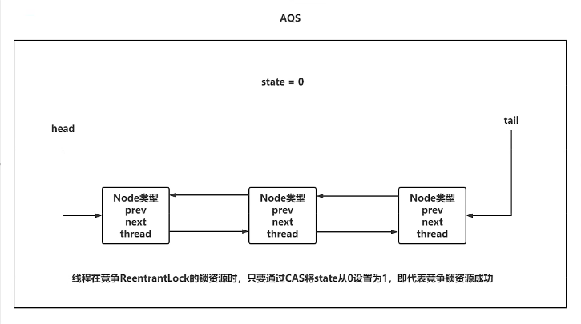
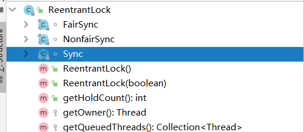
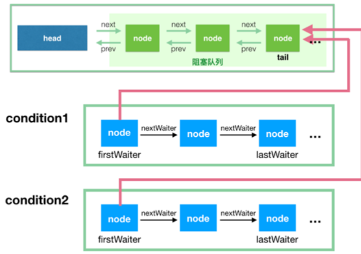
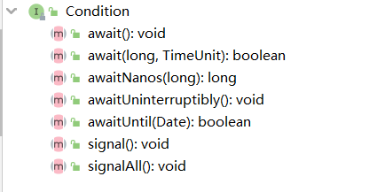
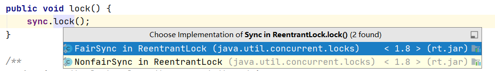
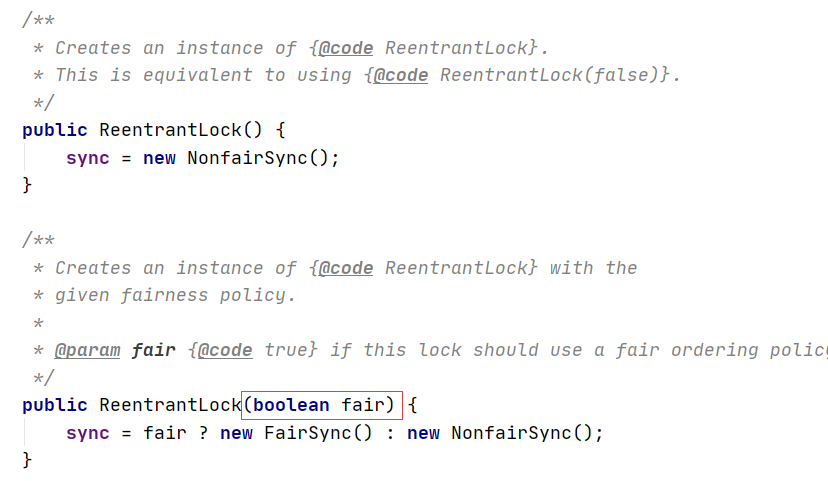
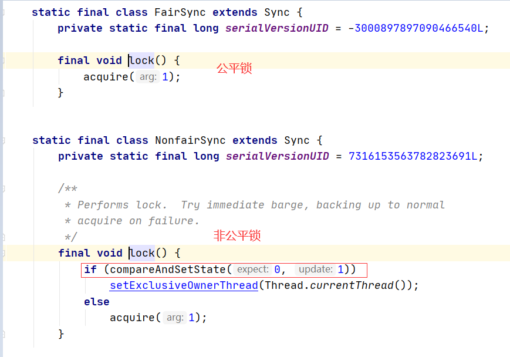

### 1.管程回顾

1. 介绍：

   管程是操作系统层面的概念，指的是管理共享变量以及对共享变量操作的过程，让他们支持并发。在管程的发展历史上，先后出现过三种不同的管程模型，分别是Hasen模型，Hoare模型和MESA模型，现在正在广泛使用的是**MESA模型**。

   

   在管程模型里，共享变量和对共享变量的操作是被封装起来的，图中最外层的框就代表封装的意思。封装后对外提供一个入口，并且在入口处有一个等待队列。当多个线程同时试图进入管程内部访问共享变量时，此时只允许一个线程进入，其他线程在等待队列中等待。这个主要解决线程互斥的问题。

   管程里还引入了条件变量的概念，而且每个条件变量都对应有一个等待队列。如下图，条件变量A和条件变量B分别都有自己的等待队列。条件变量和条件变量等待队列主要解决线程同步问题。

2. JVM层面实现的管程

   synchronized是JVM对管程的实现，为每个Java对象都实现了管程机制，主要要由synchronized和wait，notify，notifyAll方法组成。

   JVM内部基于C++实现的了一套管程机制，主要体现在hotspot源码ObjectMonitor.hpp中。

   ```java
   ObjectMonitor() {
       _header       = NULL;  //对象头  markOop
       _count        = 0;  
       _waiters      = 0,   
       _recursions   = 0;     // sync支持可重入的：锁的重入次数 
       _object       = NULL;  // 存储锁对象
       _owner        = NULL;  // 标识拥有该monitor的线程（当前获取锁的线程） 
       _WaitSet      = NULL;  // 等待线程（调用wait）组成的双向循环链表，_WaitSet是第一个节点
       _WaitSetLock  = 0 ;    
       _Responsible  = NULL ;
       _succ         = NULL ;
       _cxq          = NULL ;  // 多线程竞争锁会先存到这个单向链表中 （FILO栈结构--先进后出意味着非公平）
       FreeNext      = NULL ;
       _EntryList    = NULL ;  // 存放在进入或重新进入时被阻塞(blocked)的线程 (也是存竞争锁失败的线程)
       _SpinFreq     = 0 ;
       _SpinClock    = 0 ;
       OwnerIsThread = 0 ;
       _previous_owner_tid = 0;
   ```

   - _header：对象头  markOop
   - _owner：指向持有当前对象锁的线程
   - _recursions：sync支持可重入的：锁的重入次数 
   - _WaitSet： 等待线程（调用wait）组成的双向循环链表， _WaitSet是第一个节点。
   - _cxq： 多线程竞争锁会先存到这个单向链表中 ，**FILO栈结构--先进后出意味着线程唤醒是非公平的**。
   - _EntryList：另一个唤醒队列。存放重新进入时被阻塞(blocked)的线程 (也是存竞争锁失败的线程)

3. Java层面的管程实现呢？

   1. **sync的特点**：

      解锁是JVM控制的，无法手动控制。

      1.5之前sycn比较重。

      只有一个条件变量及条件变量等待队列。

      阻塞唤醒，wait/notify必须在同步块中进行。

      没法唤醒指定线程。

      只能是非公平锁。

   2. Java层面管程的实现

      基于sync的一些限制，Doug Lea编写了Lock，Condition，AbstractQueuedSynchronizer等相关接口和抽象类，实现了Java层面的管程实现。

### 2.AQS介绍

#### 2.1.什么是AQS

1. AbstractQueuedSynchronizer 是一个抽象类，也就是我们常说的AQS，或者翻译为抽象队列同步器。Java在JUC并发包下提供了很多同步器的实现，这些同步器基本都是围绕着管程这个概念实现的，所以它们具有一些公共的基础行为。比如等待队列，条件变量等待队列，独占获取，共享获取等，而这些公共行为被AbstractQueuedSynchronizer ，AQS抽取出来作为了一个公共的抽象层供其他同步器继承或者实现。

   

2. AQS是一个抽象队列同步器框架，可以用来实现一个依赖状态的同步器。JDK中提供的大多数同步器如Lock，Latch，Barrier等，都是基于AQS框架来实现的。

   - 一般是通过一个内部同步器类Sync继承AQS
   - 将同步器所有调用都映射Sync对应的方法。

3. 比如ReentrantLock

   

   

   内部有一个同步器类Sync继承了AbstractQueuedSynchronizer，还有公平锁同步器和非公平锁同步器又继承Sync。

4. AQS的一些特点

   - 阻塞/挂起等待线程
   - 共享锁/独占锁模式都能实现
   - 公平锁/非公平锁都能实现
   - 可重入
   - 允许中断：t1.interrupt

#### 2.2.AQS抽象类介绍

1. AQS内部维护了一个核心属性：volatile int state。state表示资源（锁）的可用状态，state有3种访问方式。

   - getState()
   - setState()
   - compareAndSetState()
2. AQS定义两种资源共享方式
   - Exclusive-独占，只有一个线程能执行，如ReentrantLock
   - Share-共享，多个线程可以同时执行，如Semaphore/CountDownLatch
3. AQS定义了两种队列
   - 同步等待队列：主要用于维护获取锁失败时入队的线程。
   - 条件等待队列：调用await()的时候会释放锁，然后线程会加入到条件队列。调用signal()唤醒的时候会把条件队列中的线程节点移动到同步队列中，等待再次获取锁。
4. AQS定义了4个队列中节点的状态和一个默认状态
   - 初始值0，初始状态，表示当前线程节点在sync队列中，等待着获取锁。
   - CANCELLED，值为1，表示当前线程节点被取消。
   - SIGNAL，值为-1，表示当前线程节点的下一个线程结点被park挂起，后续锁释放后需要unpark唤醒
   - CONDITION，值为-2，表示当前线程节点在等待condition条件变量，也就是在condition队列中。
   - PROPAGATE，值为-3，表示当前场景下后续的acquireShared共享锁获取能够得以执行。
5. 不同的自定义同步器竞争共享资源的方式也不同，一般分为共享锁和互斥锁模式，自定义同步器在实现时只需要实现共享资源state的获取与释放方式即可。至于**具体线程等待队列的维护，如获取资源失败入队，挂起，释放资源唤醒，出队等，这些AQS已经在顶层实现好了**。自定义同步器实现时主要实现以下几种抽象方法：
   - isHeldExclusively()：该线程是否正在独占资源，只有用到condition才需要去实现它。
   - tryAcquire(int)：独占方式，尝试获取资源，成功返回true，失败返回false。
   - tryRelease(int)：独占方式，尝试释放资源，成功返回true，失败返回false。
   - tryAcquireShared(int)：共享方式，尝试获取资源。负数表示失败；0表示成功但没有剩余可用资源了；正数表示成功且有剩余资源。
   - tryReleaseShared(int)：共享方式，尝试释放资源。如果释放后允许唤醒后续等待节点返回true，否则返回false。

#### 2.3.AQS中的等待队列

1. 同步等待队列

   AQS中的同步等待队列也称为CLH队列，CLH队列是Craig，Landin，Hagersten三人发明的一种基于**双向链表数据结构的队列，是FIFO先进先出等待队列**。Java中的CLH队列是原CLH队列的一个变种，线程由原自旋机制改为阻塞机制。AQS依赖CLH同步队列来完成同步状态的管理：

   - 当前线程如果获取同步状态失败时，AQS则会将当前线程构造成一个节点放到同步队列中、如果是第一个结点会让其再次尝试获取锁，如果不是第一个结点会直接将其park阻塞挂起（ReentrantLock逻辑）。

   - 当同步状态释放时，会把离首节点最近的有效节点唤醒，使其再次尝试获取同步状态。

   - 通过signal或signalAll将条件队列中的节点转移到同步队列：比如CyclicBarrier每次调用await都会将count-1并且将当前线程如条件队列，当count=0时，就会调用signal将条件队列中等待的线程出队并且入队到同步队列。

     

2. 条件等待队列：AQS中条件队列是使用单向链表保存的，用nextWaiter来连接

   - 调用await方法阻塞线程
   - 当前线程存在于同步队列的头结点，调用await方法进行阻塞，从同步队列转化到条件队列。


### 3.Condition简单介绍

Condition定义了条件变量等待队列的阻塞唤醒的相关操作。



1. 调用Condition#await方法会释放当前持有的锁，然后阻塞当前线程，同时向Condition队列尾部添加一个节点，所以调用Condition#await方法的时候必须持有锁。
2. 调用Condition#signal方法会**将Condition队列的首节点移动到阻塞队列尾部**，然后唤醒因调用Condition#await方法而阻塞的线程(唤醒之后这个线程就可以去竞争锁了)。所以调用Condition#signal方法的时候必须持有锁，持有锁的线程唤醒被因调用Condition#await方法而阻塞的线程。

### 4.ReentrantLock简单介绍

ReentrantLock是一种基于AQS框架的应用实现，是JDK中的一种线程并发访问的同步手段。它的功能类似于synchronized，是一种互斥锁，可以保证线程安全。相较于synchronized，ReentrantLock具备如下特点。

- 可中断
- 可以设置超时时间
- 可以设置为公平锁
- 支持多个条件变量。
- 和sync一样也支持重入。

1. 可中断

   通过lock.lockInterruptibly()方法获取锁时，和lock()一样，没有获取到也会进入等待队列。除此之外还表示当前线程可以被中断，并且捕获中断异常。

   ```java
   @Slf4j
   public class ReentrantLockDemo3 {
   
       public static void main(String[] args) throws InterruptedException {
           ReentrantLock lock = new ReentrantLock();
   
           Thread t1 = new Thread(() -> {
               log.debug("t1启动...");
               try {
                   // 因为主线程已经获得了锁，此时线程t1会进入等待队列。但是因为是lockInterruptibly()方法获取锁，说明t1是可以被中断的。
                   log.debug("t1尝试获取锁");
                   lock.lockInterruptibly();
                   try {
                       log.debug("t1获得了锁，执行业务逻辑");
                   } finally {
                       lock.unlock();
                   }
               } catch (InterruptedException e) {
                   e.printStackTrace();
                   log.debug("t1等锁的过程中被中断");
               }
   
           }, "t1");
   
   
           lock.lock();
           try {
               log.debug("main线程获得了锁");
               t1.start();
               //先让线程t1执行
               Thread.sleep(1000);
               //t1.interrupt();
               log.debug("线程t1执行中断");
           } finally {
               lock.unlock();
           }
       }
   }
   ```

2. 设置超时时间

   lock.tryLock(1, TimeUnit.SECONDS) ： 获取锁时设置超时时间

   ```java
   @Slf4j
   public class ReentrantLockDemo4 {
   
       public static void main(String[] args) throws InterruptedException {
           ReentrantLock lock = new ReentrantLock();
   
           Thread t1 = new Thread(() -> {
               log.debug("t1启动...");
               try {
                   // 设置超时时间
                   if (!lock.tryLock(1, TimeUnit.SECONDS)) {
                       log.debug("等待 1s 后获取锁失败，返回");
                       return;
                   }
               } catch (InterruptedException e) {
                   e.printStackTrace();
                   return;
               }
   
               try {
                   log.debug("t1获得了锁");
               } finally {
                   lock.unlock();
               }
   
           }, "t1");
   
           lock.lock();
           try {
               log.debug("main线程获得了锁");
               t1.start();
               //先让线程t1执行
               Thread.sleep(2000);
           } finally {
               lock.unlock();
           }
       }
   }
   ```


### 5.ReentrantLock源码分析

#### 1.ReentrantLock的介绍

Java中提供的锁，或者说悲观锁互斥锁。一般有两种：synchronized和Lock锁（实现Lock接口的锁）。ReentrantLock就是一个实现了Lock接口的互斥锁，可以让多线程互斥执行一段代码。

简单的使用方式

```java
public class ReentrantlockDemo1 {
    public static void main(String[] args) {
        ReentrantLock lock = new ReentrantLock();

        lock.lock();
        try {
            System.out.println("执行业务");
        } finally {
            lock.unlock();
        }
    }
}
```


#### 2.ReentrantLock的lock方法源码

1. 进入到lock方法后，发现内部调用了sync.lock()方法，该方法有两个实现

   

   - FairSync：公平锁

     每个线程在执行lock方法时，会先查看是否有线程排队，如果有直接去排队，如果没有才回去尝试获取锁。

   - NonfairSync：非公平锁

     每个线程在执行lock方法时，会先尝试锁资源，获取不到再排队。

   更推荐非公平锁，效率更高。

2. 同步锁对象：`private final Sync sync;`

   - 无参构造默认使用非公平锁，有参构造可以指定使用公平锁还是非公平锁。

     

   - private final Sync sync

     同步锁对象类Sync是一个内部抽象类，继承自AQS，abstract static class Sync extends AbstractQueuedSynchronizer。

     非公平锁内部类和公平锁内部类都继承了同步锁类：

     - static final class NonfairSync extends Sync
     - static final class FairSync extends Sync

     所以实际上**非公平锁对象和公平锁对象对应的内部类都是AQS的子类**。

3. 简单看一下lock

   1. 公平锁直接调用**公平锁对象的acquire**方法尝试获取锁

      非公平锁会先基于CAS的方式尝试获取锁资源，如果CAS失败才会执行**非公平锁对象的acquire**方法尝试获取锁。

   
   
   

2. 分析

   ```java
   // 非公平锁的lock方法
   final void lock() {
       // 1.以CAS方式尝试将state从0改为1
       if (compareAndSetState(0, 1))
           // 1.1.CAS成功的话，将当前线程设置到AQS中的exclusiveOwnerThread属性（exclusiveOwnerThread继承自父类AbstractOwnableSynchronizer）。代表当前线程拿着锁资源与后面的可重入锁有关系。
           setExclusiveOwnerThread(Thread.currentThread());
       else
           // 2.CAS不成功，执行非公平锁对象的acquire
           acquire(1);
   }
   
   // 公平锁的lock方法
   final void lock() {
       // 1.直接执行公平锁对象的acquire方法
       acquire(1);
   }
   ```


#### 3.ReentrantLock的acquire方法

acquire是AQS中的方法，无论是公平锁对象还是非公平锁对象都没有重写该方法，调用的是同一个方法。

但是在acquire方法内部的**tryAcquire方法调用的是公平锁和非公平锁两者各自的实现**，此处有区别。

```java
// 无论是公平锁还是非公平锁对象都会调用到AQS中的这个acquire方法
public final void acquire(int arg) {
    // 1.tryAcquire分为两种实现：公平锁和非公平锁
    // 1.1.公平锁操作：如果state为0，继续判断是否有线程在排队，没有获取锁成功，有的话当前线程就去排队。如果state不为0，判断是否是锁重入操作，如果是直接获取锁。
    // 1.2.非公平锁操作：如果state为0，直接尝试CAS修改state值，CAS成功则成功获取锁。如果state不为0，判断是否是锁重入操作，如果是直接获取锁。
    if (!tryAcquire(arg) &&
        // 2.tryAcquire失败，继续判断acquireQueued方法，先看其中的addWaiter方法
        // 2.1.addWaiter：在线程没有通过tryAcquire拿到锁资源时，需要将当前线程封装为Node对象，去AQS内部排队。
        // 2.2.acquireQueued：查看当前线程是否是排在对头，是的话就让其尝试获取所资源。如果长时间没拿到锁，需要将当前线程挂起。
        acquireQueued(addWaiter(Node.EXCLUSIVE), arg))
        // 3.中断当前线程：调用interrupt方法
        selfInterrupt();
}
```

#### 4.ReentrantLock的tryAcquire方法

无论是acquire还是tryAcquire都是AQS中的方法，区别在于acquire是AQS中实现好的，tryAcquire没有具体实现。ReentrantLock中的公平锁内部类FairSync和非公平锁内部类NonfairSync继承了AQS且分别实现了tryAcquire方法。

tryAcquire方法：尝试获取锁资源。

1. 回顾一下补码和原码

   ```java
   package taoxl.chapter1;
   
   /**
    * 描述：回顾一下补码和原码
    *
    *  正数的原码和补码一致
    *  负数的原码符号位不变，数值为取反再+1
    *  正数的补码 ---> 负数的补码 ： 连同符号为一起取反再+1
    *
    * @author txl
    * @date 2021-01-04 16:25
    */
   public class Exercise {
       public static void main(String[] args) {
           System.out.println((0 + 15)/2);
           System.out.println(2.0e-6);//0.000002
           System.out.println(2.0e-6 * 100000000.1);//100000000.1 = 1.000000001e8
   
           // 十进制        补码
           // -1 :                             1111 1111 1111 1111 1111 1111 1111 1111
           // -2 :                             1111 1111 1111 1111 1111 1111 1111 1110
           // -2 << 30                         1100 0000 0000 0000 0000 0000 0000 0000
           // -2^31(-0) :                      1000 0000 0000 0000 0000 0000 0000 0000
           // +0 :                             0000 0000 0000 0000 0000 0000 0000 0000
           // -(1 * 2^30) = -2^30              1100 0000 0000 0000 0000 0000 0000 0000
           int i = -(1 << 30);
           // -(1 * 2^31) = -2^31              1000 0000 0000 0000 0000 0000 0000 0000
           int m = -(1 << 31);//
           // -(1 * 2^31) + 1 = -(2^31 - 1)    1000 0000 0000 0000 0000 0000 0000 0001
           int n = -(1 << 31) + 1;
           // 1 << 31 - 1; = 2^31 - 1          0111 1111 1111 1111 1111 1111 1111 1111
           int a = (1 << 31) - 1;
   
           // 可以把+0理解成0，-0理解成单独定义为-2^n
           // -2^31, -(2^31 - 1), ..., -1, -----> 0, 1, ..., +(2^31 - 1)
           System.out.println(i);// -1073741824
           System.out.println(m);// -2147483648
           System.out.println(n);// -2147483647
           System.out.println(a);//  2147483647
       }
   }
   ```

2. 非公平锁的实现逻辑

   ```java
   protected final boolean tryAcquire(int acquires) {
       return nonfairTryAcquire(acquires);
   }
   
   // 参数acquires为1
   final boolean nonfairTryAcquire(int acquires) {
       // 拿到当前线程
       final Thread current = Thread.currentThread();
       // 拿到AQS的state值
       int c = getState();
       // 1.如果state为0，这就代表当前没有线程占用锁资源
       if (c == 0) {
           // 1.1.直接基于CAS的方式，尝试修改state，从0->1。如果成功就代表拿到锁资源
           if (compareAndSetState(0, acquires)) {
               // 1.2.当前线程拿到锁资源，并且设置exclusiveOwnerThread为当前线程，即指定锁资源的拥有者
               setExclusiveOwnerThread(current);
               // 1.3.返回true，那么上层的调用者acquire会直接结束，不用走排队逻辑
               return true;
           }
           // 1.4.如果CAS失败，意味着包括当前线程有多个线程在同时CAS，其他线程成功的将state设置为1，当前线程就失败了。直接返回false
       }
       // 2.走到此处意味着state不为0，继续判断占用锁资源的是不是当前线程。
       else if (current == getExclusiveOwnerThread()) {
           // 2.1.锁重入操作，对state加1
           int nextc = c + acquires;
           // 2.2.超过锁重入的最大次数，假设32为机器
           // 最大正值：0111 1111 1111 1111 1111 1111 1111 1111  (2^31)-1
           // 加1后：  1000 0000 0000 0000 0000 0000 0000 0000   -2^31
           // 所以当nextc < 0时意味着超出了最大的重入次数。
           if (nextc < 0) // overflow
               throw new Error("Maximum lock count exceeded");
           // 2.3.设置AQS的state
           setState(nextc);
           // 返回true代表拿到了锁：结束上层的调用者acquire方法
           return true;
       }
       // 没拿到锁资源：state=0，但是CAS没有竞争过其他线程或者state不为0且该次不是锁重入（锁的持有者不是当前线程）。返回false会导致上层的调用者acquire进入到排队逻辑
       return false;
   }
   ```

3. 公平锁的实现逻辑

   ```java
   protected final boolean tryAcquire(int acquires) {
       // 拿到当前线程
       final Thread current = Thread.currentThread();
       // 获取AQS的state
       int c = getState();
       // 1.如果state=0，表示目前锁空闲
       if (c == 0) {
           // 1.2.查看有没有线程排队
           if (!hasQueuedPredecessors() &&
               // 1.2.1.没有线程在排队，CAS尝试获取锁资源
               compareAndSetState(0, acquires)) {
               // 1.2.1.1.CAS获取锁成功：设置exclusiveOwnerThread为当前线程，即指定锁资源的拥有者
               setExclusiveOwnerThread(current);
               return true;
           }
           // 1.3.有线程在排队或者CAS没有获取成功（没有竞争过其他线程的CAS）：或直接跳转到下面的return false
       }
       // 2.state不为0
       else if (current == getExclusiveOwnerThread()) {
           // 2.1.将AQS的state+1
           int nextc = c + acquires;
           // 2.2.是否超过锁重入的最大次数
           if (nextc < 0)
               throw new Error("Maximum lock count exceeded");
           // 2.3.设置AQS的state
           setState(nextc);
           // 返回true代表拿到了锁，结束上层的调用者acquire方法
           return true;
       }
       // 没拿到锁资源：state=0但是有线程在排队或者state=0没有线程在排队但是CAS没有竞争过其他线程或者state不为0且该次不是锁重入（锁的持有者不是当前线程）。返回false会导致上层的调用者acquire进入到排队逻辑
       return false;
   }
   ```


4. 公平锁和非公平锁的tryAcquire方法的区别

   - 当判断state=0后，意味着当前锁资源空闲：
     - 公平锁会先查看是否有线程正在排队，如果有直接返回false。如果没有线程排队，执行CAS尝试获取锁资源。如果此次CAS失败，意味着其他线程也在CAS获取锁且当前线程没有竞争过其他线程，导致返回false。
     - 非公平锁不管有没有线程排队，直接以CAS的方式尝试获取锁资源。
   - 返回false的情况：没拿到锁资源，返回false会导致上层的调用者acquire进入到排队逻辑
     - 公平锁：
       - state=0但是有线程在排队
       - state=0没有线程在排队但是CAS没有竞争过其他线程
       - state不为0且该次不是锁重入（锁的持有者不是当前线程）
     - 非公平锁：
       - state=0，但是CAS没有竞争过其他线程
       - state不为0且该次不是锁重入（锁的持有者不是当前线程）

   

#### 5.ReentrantLock的addWaiter方法   

```java
public final void acquire(int arg) {
    if (!tryAcquire(arg) &&
        acquireQueued(addWaiter(Node.EXCLUSIVE), arg))
        selfInterrupt();
}
```

acquire会调用到锁对象各自实现的tryAcquire方法，如果tryAcquire返回false，才会调用到acquireQueued，acquireQueued又先调用addWaiter方法。也就是**当tryAcquire没有获取到锁时，才会执行到addWaiter方法。**

现在要将没有获取到锁资源的线程封装成一个NODE，在AQS中排队。

1. addWaiter(Node.EXCLUSIVE), arg)：其中的static final Node EXCLUSIVE = null，表示锁模式是互斥锁，除了互斥锁模式还有共享锁，但是**ReentrantLock实现的是互斥锁**。要将没有获取到锁资源的线程封装成一个NODE，在AQS中排队。

   ```java
   // 将没有获取到锁资源的线程封装成一个NODE，在AQS中排队：参数mode为null，以为锁模式是互斥锁
   private Node addWaiter(Node mode) {
       // 1.根据当前线程创建一个互斥锁模式的Node节点
       Node node = new Node(Thread.currentThread(), mode);
       // 2.拿到尾节点
       Node pred = tail;
       // 3.如果尾节点不为null，说明有线程正在排队
       if (pred != null) {
           // 3.1.新结点的prev指针指向尾节点
           node.prev = pred;
           // 3.2.当存在并发排队时：CAS保证尾指针tail只指向一个新结点。
           if (compareAndSetTail(pred, node)) {
               // 3.2.1.之前的尾节点的next指针指向新结点
               pred.next = node;
               // 3.2.2.排队成功，返回新结点
               return node;
           }
       }
       // 4.如果队列为空，或者当前线程CAS失败，会执行enq方法，将当前NODE排到AQS中的队列末尾。
       enq(node);
       // 5.返回新入队的线程Node
       return node;
   }
   ```

2. enq(node)：如果队列为空，或者当前线程CAS失败，会执行enq方法，将当前NODE排到AQS中的队列末尾。

   ```java
   private Node enq(final Node node) {
       // 1.死循环：保证当先线程不断尝试，一定能排到AQS队列末尾。
       for (;;) {
           // 2.获取tail节点，尾节点
           Node t = tail;
           // 2.1.如果尾节点为空，即队列为空。
           if (t == null) { // Must initialize：为队列初始化一个空的头结点
               // 2.2.CAS尝试将一个空的Node设置为新的Head头结点：
               // 这里AQS中的head属性一开始是null，CAS会更新head属性的值，相当于head指向了新的尾节点。
               if (compareAndSetHead(new Node()))
                   // 2.2.1.CAS成功尾指针和头指针都指向新的头结点
                   tail = head;
               	// 2.3.之后会继续循环，此时队列就不为空了，会走到else中。
           } else {
               // 2.2.队列不为空：将当前线程Node插入到队列的末尾作为tail尾节点，循环知道插入成功。
               // 2.2.1.当前线程节点的prev指针指向头结点
               node.prev = t;
               // 2.2.2.CAS更新尾节点
               if (compareAndSetTail(t, node)) {
                   // 2.2.3.之前尾节点的Next指向新的尾节点。
                   t.next = node;
                   return t;
               }
           }
       }
   }
   ```

3. 大致逻辑

   将当前线程作为参数，初始化一个互斥锁模式的Node节点。

   尝试将当前线程Node插入到AQS队列的末尾：

   - 队列为空：执行enq入队逻辑，先初始化一个空的Node作为头结点，继续循环再将当前线程Node插入作为尾节点。
   - 队列不为空：直接CAS将当前Node插入作为尾节点。如果并发导致当前线程的CAS操作，那么也会走到enq里循环CAS入队尾。
   
4. **设计的精髓**

   并发场景下入队和出队操作：都是靠CAS来保证，compareAndSetTail(pred, node)。CAS操作来更新尾节点的next指针，让其指向要入队的新节点。

   并发场景下的队列初始化：也是靠CAS来保证，compareAndSetHead(new Node()) 。 创建一个空的Node，并用CAS更新head头结点的值为新创建的Node。

#### 6.ReentrantLock的acquireQueued方法   

也就是**当tryAcquire没有获取到锁时，会执行到acquireQueued方法。**

addWaiter方法以当前线程构造一个Node入队尾，然后返回这个Node。

acquireQueued以这个新入队的Node和arg=1作为参数开始执行：

- 如果Node是第一个结点：那么在此尝试让其获取锁，如果获取失败，那么就走挂起流程，此时该线程就被挂起了，直到持有锁的线程将其唤醒。
- 如果Node不是第一个结点：那么直接走挂起流程，此时该线程就被挂起了。直到持有锁的线程将其唤醒，然后再次执行for循环，直到最后获取锁跳出该方法。

```java
public final void acquire(int arg) {
    if (!tryAcquire(arg) &&
        acquireQueued(addWaiter(Node.EXCLUSIVE), arg))
        selfInterrupt();
}
```

1. 源码分析

   ```java
   // 第一个线程Node，竞争锁资源；非第一个Node，挂起线程。
   final boolean acquireQueued(final Node node, int arg) {
       // 竞争失败标志位
       boolean failed = true;
       try {
           // 线程中断标志
           boolean interrupted = false;
           for (;;) {
               // 1.拿到node节点的prev指针指向的节点：node上一个节点
               final Node p = node.predecessor();
               // 2.如果node节点是第一个结点（不算头结点），再次执行tryAcquire直接尝试去获取锁
               if (p == head && tryAcquire(arg)) {
                   // 2.1.当前线程竞争锁资源成功：更新头结点为当前线程Node，并且将Node的prev和thread置为null。
                   setHead(node);
                   // 2.2.之前的头结点的next指针置为null：方便GC
                   p.next = null; // help GC
                   // 2.3.竞争失败标志位置为false：意为竞争锁资源成功。
                   failed = false;
                   // 2.4.返回中断标志位：默认false
                   return interrupted;
               }
               // 3.node节点不是第一个结点：：意味着排队节点不止一个要发生竞争了
               // 4.或者node是第一个结点但是获取锁没有成功:
               // 4.1.公平锁：持有锁的线程还没有释放锁，导致即使是第一个结点也无法获取到锁，会将当前线程挂起，直到被唤醒才会继续执行。
               // 4.2.非公平锁的话：当前线程CAS没有竞争过另一个线程或者锁资源已被占有且该次不是重入锁
            	if (shouldParkAfterFailedAcquire(p, node) &&
                   // 5.如果判断可以挂起的话，这里挂起线程。线程在此处阻塞，知道被唤醒后，又会执行for循环，直到获取锁。
                   parkAndCheckInterrupt())
                	interrupted = true;
           }
       } finally {
           // 这里什么时候会执行：99.99%都不会走到此处，因为上面是一个死循环会一直竞争锁资源，竞争成功后failed会被置为false。只有当parkAndCheckInterrupt()挂起线程时，JVM内部抛出了异常才会走到这里。
           if (failed)
               // 取消获取锁
               cancelAcquire(node);
       }
   }
   ```
   
2. shouldParkAfterFailedAcquire(Node pred, Node node) ：找到当前节点的上一个有效节点，更新链表。
   
   ```java
   // 节点等待状态：默认状态是Node.waitStatus = 0
   
   // 该节点被取消了：等待队列中的该节点已被置为无效了，那么要将链表的指向更新一下，绕过这个无效的节点，
   static final int CANCELLED =  1;
   
   // 正常的状态
   static final int SIGNAL    = -1;
   
   // 在条件变量等待队列中：调用了Condition.await()
   static final int CONDITION = -2;
   
   // 共享锁相关的等待状态
   static final int PROPAGATE = -3;
   
   // shouldParkAfterFailedAcquire：找到当前节点的上一个有效节点，再将其挂起
   private static boolean shouldParkAfterFailedAcquire(Node pred, Node node) {
       
       // 拿到上一个节点的waitStatus
       int ws = pred.waitStatus;
       
       // 如果上一个节点的waitStatus = -1，意味着当前节点可以挂起
       if (ws == Node.SIGNAL)
           // 返回true：导致上层调用线程挂起的方法
           return true;
       
       // 如果上一个节点的waitStatus > 0，那么肯定是CANCELLED 1，此时要更新链表，绕过无效节点
       if (ws > 0) {
           do {
               // 让当前节点的prev指针指向上上个结点
               node.prev = pred = pred.prev;
           } while (pred.waitStatus > 0); // 继续判断上上个结点的waitStatus是不是CANCELLED
           // 循环向上找到一个节点的waitStatus的状态不是CANCELLED，让找到节点的next指向当前节点，
           pred.next = node;
       } else {
   		// ws <= 0：因为ws = -1时直接返回true，那么此时ws可能是0，-2，-3在此处会将其更新成-1.
           compareAndSetWaitStatus(pred, ws, Node.SIGNAL);
       }
       // 返回false：上次的调用因为这个返回会再次循环
       return false;
   }
   ```
   
   shouldParkAfterFailedAcquire：主要是找到当前节点的上一个有效节点，再将其挂起
   
3. parkAndCheckInterrupt()：最后调用LockSupport.park(this); --> UNSAFE.park()方法挂起线程

   ```java
   private final boolean parkAndCheckInterrupt() {
       LockSupport.park(this);
       return Thread.interrupted();
   }
   
   public static void park(Object blocker) {
       Thread t = Thread.currentThread();
       setBlocker(t, blocker);
       UNSAFE.park(false, 0L);
       setBlocker(t, null);
   }
   ```

   那么显然获取锁的线程在释放锁时，会调用LockSupport.unpark()来唤醒挂起的线程。


#### 7.ReentrantLock的unlock方法

- unlock逻辑是不分公平和非公平的，释放锁通过sync的release方法执行。

- 释放锁的核心就是将state从大于0的数值减小到0，即为释放锁成功。每次release会减1，如果是重入锁那么state会大于1，需要release多次。

- unlock方法会调用LockSupport.unpark()来唤醒挂起的线程。

  ```java
  public static void park(Object blocker) {
      Thread t = Thread.currentThread();
      setBlocker(t, blocker);
      UNSAFE.park(false, 0L);
      setBlocker(t, null);
  }
  ```

#### 8.ReentrantLock的release方法

1. release

   ```java
   public final boolean release(int arg) {
       // tryRelease将state-1后看看锁有没有释放成功
       if (tryRelease(arg)) {
           // 释放成功，进行后续操作
           Node h = head;
           // 如果头结点不为null，并且当前head的等待状态不为0：说明shouldParkAfterFailedAcquire方法已将头结点的waitStatus从0更新成-1，即有线程Node在排队等待且被挂起了。
           if (h != null && h.waitStatus != 0)
               // 线程Node在排队等待且线程被挂起了：需要唤醒被挂起的线程
               unparkSuccessor(h);
           return true;
       }
       // fasle：tryRelease将state-1后锁仍然没有释放成功，说明发生了锁重入，需要多次调用release释放。
       return false;
   }
   ```

2. tryRelease

   ```java
   // tryRelease将state-1后看看锁有没有释放成功
   protected final boolean tryRelease(int releases) {
       // 获取state并减1
       int c = getState() - releases;
       // 如果当前释放锁的线程不是持有锁的线程：抛异常
       if (Thread.currentThread() != getExclusiveOwnerThread())
           throw new IllegalMonitorStateException();
       // 释放锁成功标志位
       boolean free = false;
       // state-1后是否为0
       if (c == 0) {
           // 释放锁成功
           free = true;
           // 将占用互斥锁的线程标识位null
           setExclusiveOwnerThread(null);
       }
       // state-1后还大于0，说明该锁被当前线程重入了，需要释放多次。这里更新一下state。
       setState(c);
       return free;
   }
   ```

3. unparkSuccessor

   ```java
   // 唤醒AQS中被挂起线程：参数是头结点
   private void unparkSuccessor(Node node) {
       
       int ws = node.waitStatus;
       if (ws < 0)
           // 将头节点head的waitStatus设置为0
           compareAndSetWaitStatus(node, ws, 0);
   
       // 拿到下一个结点
       Node s = node.next;
       // 如果下一个结点为null或者状态为CANCEL，需要找到离Head节点最近的有效Node
       if (s == null || s.waitStatus > 0) {
           s = null;
           // 从后往前找这个节点：（为什么从后往前找，因为在addWaiter中是操作新结点的prev指针指向尾节点，所以这里从后往前找
           for (Node t = tail; t != null && t != node; t = t.prev)
               if (t.waitStatus <= 0)
                   s = t;
       }
       // 找到了离head最近的一个有效节点
       if (s != null)
           // 唤醒该线程Node
           LockSupport.unpark(s.thread);
   }
   ```

4. 小结

   - 在释放锁时，每次release会将state-1，只有当state被减为0后，才意味着释放锁，然后去唤醒被挂起的线程。

   - 如果是重入锁的释放，需要在代码中多次调用unlock。

   - 在唤醒挂起线程时2，如果head的next状态不正确，会从后往前找到离head最近的节点进行唤醒。

   - 为什么从后往前找：

     因为addWaiter在将没有获取到锁资源的线程封装成一个NODE，放到在AQS中排队时，是先将当前线程的prev指针赋值，最后才将上一个节点的next指针赋值，为了避免丢失节点或者跳过线程，必须从后往前找。


   

   


