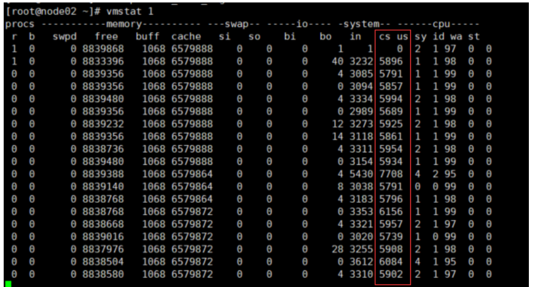
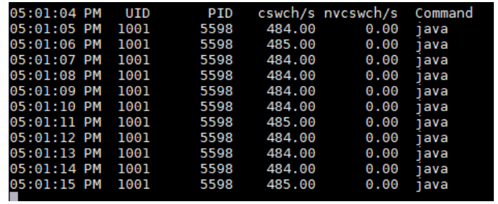

# 1.相关知识概念

## 1.进程和线程

### 1.1.进程的概念：Process

​	程序是由指令和数据构成的，当要运行一个程序时，会从磁盘把这个程序的数据加载至内存，此时就开启了一个进程。其中程序的代码会被编译解析成一条条指令被CPU加载执行。

​	进程指的是一个具有一定独立功能的程序，在一个数据集合上的一次动态执行过程。是操作系统进行资源的分配和调度得到一个独立单位，是运行时的应用程序的体现，是竞争计算机资源的基本单位。每一个进程都有一个自己的地址空间，即进程空间（虚拟地址），该空间的大小与处理及的位数有关。

​	进程可以视为程序运行的一个实例，大部分程序可以同时运行多个实例进程：记事本，画图，浏览器。也有的程序只能启动一个实例进程：网易云音乐，360安全卫士。

​	操作系统会以进程为单位，分配系统资源，进程是操作系统分配资源的最小单位。

### 1.2.进程内存空间（进程的内存映像）

- 以32位机器为例，地址总线是32位，可寻址的最大内存空间是2^32Bytes，即4GBytes。每一个运行的进程理论上都可以获得一个最大为4GB的`逻辑地址空间`。这个空间被分成两个部分：`内核空间`和`用户空间`，其中用户空间分配从0x00000000到0xC0000000共3GB的地址，而内核空间分配了0xC0000000到0xFFFFFFFF高位的1GB地址，如下图：

  

  

- 而进程的`用户空间`，这部分的虚拟空间内容（3GB），就是进程的内存映像，他一共包含4个部分的内容：

  - text代码段：是只读的，存放要执行的指令，text section
  - data数据段：存放全局变量或者静态变量
  - heap堆：运行时分配的内存，如malloc函数申请的内存，或者new()申请的内存。
  - stack栈：存放局部变量和函数的返回地址。

  

- 上面进程的内存映像中看到的地址都是逻辑地址或者叫做虚拟地址，它是面向程序而言的，各个程序的虚拟地址是成套的独立的，都是从0x00起始。物理地址是内存单元实际的地址，是指令和数据的真实内存地址。CPU在执行指令的时候，会先将逻辑地址经过一个MMU（Memory Managment Unit）叫做内存管理单元的硬件设备转换成物理地址，然后再进行跳转。

### 1.3.线程的概念：Thread

- 和一个应用程序（进程）相关的所有执行任务，都放到一个进程中，这些进程内部执行任务的就是线程。线程可以理解为进程中独立运行的子任务，比如打开一个QQ进程，在QQ这个进程中，传输文字会开一个线程来执行，传输语音会开一个线程，下载文件开一个线程，视频开一个线程...这些任务在宏观上都可以同时运行，其中每一个任务都可以理解成一个线程在工作，这些工作线程实现了QQ功能完整的运行。
- 线程依托于进程存在，个线程必须有一个父进程，线程就是从属于当前进程的一个执行活动。线程可以共享进程的内存空间，而且也有属于自己的内存空间，这段空间叫做线程栈，是在建立线程时由系统分配的，主要用于保存线程内部使用的数据。
- 亦可以理解：线程就是一串指令流，将指令流中的一条条指令以一定顺序交给CPU执行。

### 1.4.进程和线程的区别

- 进程作为操作系统资源分配的最小单位，线程作为CPU调度的最小单位。
- 开销差异：线程基本不拥有系统资源，只拥有一点在运行中必不可少的资源（如程序计数器，一组寄存器和栈），所以它的创建及销毁和上下文切换的开销很少。
- 进程间相互独立，有独立的地址空间。线程存在于进程内是进程的一个子集。线程可以理解为进程中的实体，一个进程可以拥有多个线程，一个线程必须有一个父进程。

- 多进程的程序要比多线程的程序健壮：进程有独立的地址空间，一个进程崩溃后，在保护模式下不会对其他进程产生影响。而线程只是进程中的一个执行任务流，线程有自己的堆栈和全局变量，但是线程之间没有单独的地址空间，一个线程意外的死掉可能会造成整个进程死掉：比如除数为零这类意外的死掉，默认情况就会中止整个进程。
- 通信差异：
  - 进程通信比较复杂，尤其是不同计算机之间进行通信，可能需要通过网络，并遵守共同的协议。同一台计算机上的进程可以用管道通信，尤其是具有亲缘关系的父子进程。
  - 线程间通信相对简单，因为他们共享进程的内存空间，所以可以用共享变量来进行通信。

### 1.5.进程间的通信方式

1. 管道pipe及有名管道named pipe：管道可用于具有亲缘关系的父子进程间通信，有名管道除了具有管道所具有的功能外，它还允许无沁园关系进程间的通信。
2. 信号signal：信号是在软件层次上对中断机制的一种模拟，它是比较复杂的通信方式，用于通知进程有某事件发生。一个进程收到一个信号与处理器收到一个中断请求可以说是一致的。
3. 消息队列 message queue：消息队列是消息的链接表，它克服了上两种通信方式中信号量有限的缺点，具有写权限的进程可以按照一定的规则向消息队列中添加新消息；对消息队列有读权限的进程则可以从消息队列中读取信息。
4. 共享内存 shared memory：可以说这是最有用的进程间通信方式。它使得多个进程可以访问同一块内存空间，不同进程可以及时看到对方进程中对共享内存中数据的更新。比如分布式锁。这种方式需要依靠某种同步操作，比如互斥锁和信号量等。
5. 信号量 semaphore：主要作为进程之间及同一进程的不同线程之间的同步互斥手段。
6. 套接字 socket：这是一种更为一般的进程间通信机制，它可以用于网络中不同机器之间的进程间通信，应用非常广泛。

### 1.6.线程的同步互斥

​	**我们要学习并发知识体系，就是要解决线程间的同步，互斥，拆分大任务协同分工的。**

1. 线程同步是指线程之间所具有的一种制约关系，一个线程的执行依赖于另一个线程的消息，当它没有得到另一个线程的消息时等待，知道消息到达时才被唤醒。wait和notify
2. 线程互斥是指对于共享的进程系统资源，在各单个线程访问时具有排他性，当有若干个线程都要使用某一共享资源时，任何时可最多只允许一个线程去使用，其他要使用该资源的线程必须等待，直到占用资源者释放该资源。线程互斥可以看成是一种特殊的线程同步。
3. 四种线程同步互斥的控制方法：
   - 临界区：在一段时间内只允许一个线程访问的资源就是临界资源，通过对多线程的串行化来访问公共资源或一段代码，速度快，适合控制数据访问。
   - 互斥量：为协调共同对一个共享资源的单独访问而设计的。
   - 信号量：为控制一个具有优先数量的用户资源而设计的。
   - 事件：用来通知线程有一些事件已发生，从而启动后继任务的开始。

## 2.上下文切换

1. 概念：我们如今用的操作系统大部分都是基于分时多任务机制设计的，为某个进程/线程都会分配一个很小的时间片，时间片结束时CPU会从当前进程/线程切换到另一个进程/线程。这个过程就是上下文切换。上下文指的发生切换时该进程/线程的CPU现场或者状态，主要指CPU寄存器和程序计时器在该时间点的内容。我们要将这些上下文保存下来，以待后续CPU再将其调度上来，能接着从切换处运行。

   - 寄存器是CPU内部的一块非常小，非常快的内存，它存放一些常用值，方便CPU对常用值的读取，来加快计算机执行速度。
   - 程序计数器是一种专门的寄存器，保存着正在执行着的指令地址/或下一条指令地址，这取决于具体的系统。

2. 更具体的动作：上下文切换可以更详细的描述为内核对CPU上的进程（包括线程）执行以下动作

   1. 暂停一个进程的处理，并将该进程的CPU状态（上下文）存储起来。
   2. 从内存获取下一个进程的上下文，并在CPU寄存器中恢复它。
   3. 返回到程序计数器指示的位置（即返回到进程被中断的代码行）以恢复进程的执行。

3. 频繁的上下文切换是非常耗费计算机性能的：上下文切换只能在内核模式下发生，那么就涉及到用户态到内核态的转换，这一定会发生时间的损耗。

   - 内核模式 Kernel Mode：在内核模式下，执行代码可以完全且不受限制的访问底层硬件。它可以执行CPU指令和引用任何内存地址。内核模式通常为操作系统的最低级别，最受信任的功能保留，内核模式下的崩溃是灾难性的，它们会让整个电脑瘫痪。
   - 用户模式 User Mode：在用户模式下，执行代码不能直接访问硬件或引用内存。在用户模式下运行的代码必须委托系统api来访问硬件或内存，由于这种隔离提供的保护，用户模式下的崩溃总是可恢复的。

4. **频繁上下文切换通常是计算密集型**的：就CPU时间而言，上下文切换对系统来说是一个巨大的成本，浪费吞吐量，他可能是操作系统上成本最高的操作。因此操作系统设计中的一个主要焦点就是尽可能的避免不必要的上下文切换。Linux的一个重要优势就是他的上下文切换和模式切换成本极低。

5. 应用程序一般会在以下几种情况切换到内核模式

   - 发生系统调用
   - 异常事件：当发生某些预先不可知的异常时，就会切换到内核态，执行相关的异常事件。
   - 设备中断：在使用外围设备时，如外围设备完成了用户请求，就会向CPU发送一个中断信号，此时CPU就会暂停执行原本的下一条指令，转去处理中断事件。此时如果原来在用户态，就会切换到内核态。

   CAS操作只是通过一个原子指令，CPU可以直接执行这个指令来保证并发安全，所以不会设计到用户态到内核态的切换。仅仅是一个指令而已。

6. 通过命令查看CPU山下文切换情况：

   - vmstat 1 ：查看linux系统每1秒CPU上下文切换数据

     

     其中cs列就是CPU上下文切换的统计，当然上下文切换不等价于线程切换，很多操作会造成CPU上下文切换：线程，进程切换；系统调用；中断。

   - pidstat ‐w ‐p 5598 1 :  显示进程5598每一秒的切换情况              

     

     其中cswch表示主动切换，nvcswch表示被动切换。从统计数据中看到，该进程每秒主动切换次数达到将近500次，因此代码中可能存在大量的睡眠、唤醒操作。

   - 通过命令 cat /proc/5598/status 查看进程的状态信息

     voluntary_ctxt_switches: 40469351

     nonvoluntary_ctxt_switches: 2268

     这两项就是该进程从启动到当前总的上下文切换情况。

## 3.**查看进程线程的方法**

1. windows
   - 任务管理器可以查看进程和线程数，也可以用来杀死进程
   - tasklist 查看进程
   - taskkill 杀死进程

2. linux
   - ps -fe 查看所有进程
   - ps -fT -p  查看某个进程（PID）的所有线程
   - kill 杀死进程
   - top 按大写 H 切换是否显示线程
   - top -H -p  查看某个进程（PID）的所有线程

3. Java
   - jps 命令查看所有 Java 进程
   - jstack  查看某个 Java 进程（PID）的所有线程状态
   - jconsole 来查看某个 Java 进程中线程的运行情况（图形界面）

## 4.并发和并行

- 1.无论是单核还是多核CPU，操作系统都营造出了一种可以同时运行多个（多于CPU核心数）程序的假象。这种假象是靠操作系统对进程的调度以及CPU的快速上下文切换来实现的：每个进程执行一个时间片就会停下来，然后CPU切换到下个被操作系统调度上来的进程中使之运行。因为切换的很快，用户感知不到这种切换，使得用户认为操作系统同时在运行着多个程序。

- 2.并发concurrent：是指多个程序`看起来`同时运行的现象，或者说多进程可以同时运行或者多指令可以同时运行的现象，重点在于它是一种现象。这里的同时运行表示的不是真的同一时刻有多个进程在运行的现象，而是提供一种让用户看起来多个程序同时运行起来了。实际上，对于单核心CPU来说，这些进程是轮流占用着一个CPU，同一时刻运行着一个线程。
- 3.并行parallel：比如4核心CPU，是同一时刻是可以同时运行4个进程的。
- 4.所以，并发和并行它们虽然都说是`多个进程同时运行`，但是它们的同时不是一个概念。并行的同时，是同一时刻可以多个进程处于运行态；并发的同时，是经过上下文快速切换，使得用户感觉上是多个进程都在运行的假象。
- 5.我们写出来的多进程/线程代码，并不意味着一定会并行执行。并行与否是由操作系统来决定的，操作系统只会尽可能的让不同的进程/线程使用不同的CPU核心，但不能100%的保证这些进程/线程会并行。所以并行与否程序员无法控制，只能让操作系统来决定。
- 6.引用Pob Pike的一段描述（GoLang之父）：
  - 并发是同一时间内，应对处理多个任务的能力。能处理，能应对，`但是具体怎么处理，不一定是同时刻运行所有的程序任务`。
  -  并行是能`同一时刻能做多件事情`的能力。

并发和并行的目的都是为了充分的利用CPU，提高CPU的利用率，尽可能的不让CPU处于闲置的状态，最大化的提高CPU的使用率。

- 并行Paraller：指在同一时刻，能有多条指令同时在多个处理器上同时执行。无论是微观还是宏观来看，多个任务同时运行的情况。并行是一个真实的物理架构，从物理角度看是有多个处理器的，从指令的角度看也是可以有多个指令同时执行
- 并发：指在同一时刻只能有一条指令执行，但多个进程指令被快速的轮换执行，使得在宏观上具有多个进程同时执行的效果。但在微观上并不是同时执行的，只是每个进程执行一个很短的时间片，然后快速切换的下一个进程。因为切换的很快，用户感知不到这种切换，使得用户认为操作系统在同时运行着多个任务。

## 5.异步和同步

1.从方法的调用角度来讲：

- 需要等待结果返回，才能继续运行的就是同步。
- 不需要等待结果返回，就能继续运行就是异步。
- 注意：同步在多线程中还有另外一层意思，是让多个线程步调一致。

2.设计：

​	多线程可以让方法执行变为异步的（即不要干巴巴等着），比如读取磁盘文件是，假设读取操作花费了5秒中，如果没有线程调度机制，这等待5秒钟，调用者就什么都做不了，无法继续往下执行。

3.应用：

- 开一个新线程来导出下载文件，视频转换，转存操作，定时任务
- tomcat的异步servlet也是类似的目的，让用户线程处理耗时较长的操作，避免阻塞tomcat的工作线程
- 多线程可以充分利用多核CPU的优势。

## 6.线程一定越多效率越高吗

一个实例应用的效率和线程数量是呈现一个抛物线的趋势的，即应用的效率随着线程的增加会到达一个顶峰，之后再增加线程不会带来效率的提升，反而线程的开销比如上下文切换带来的负担大于其带来的效率方面的提升。CPU可能在线程的切换等工作上花费的时间太多了，反而得不偿失。

