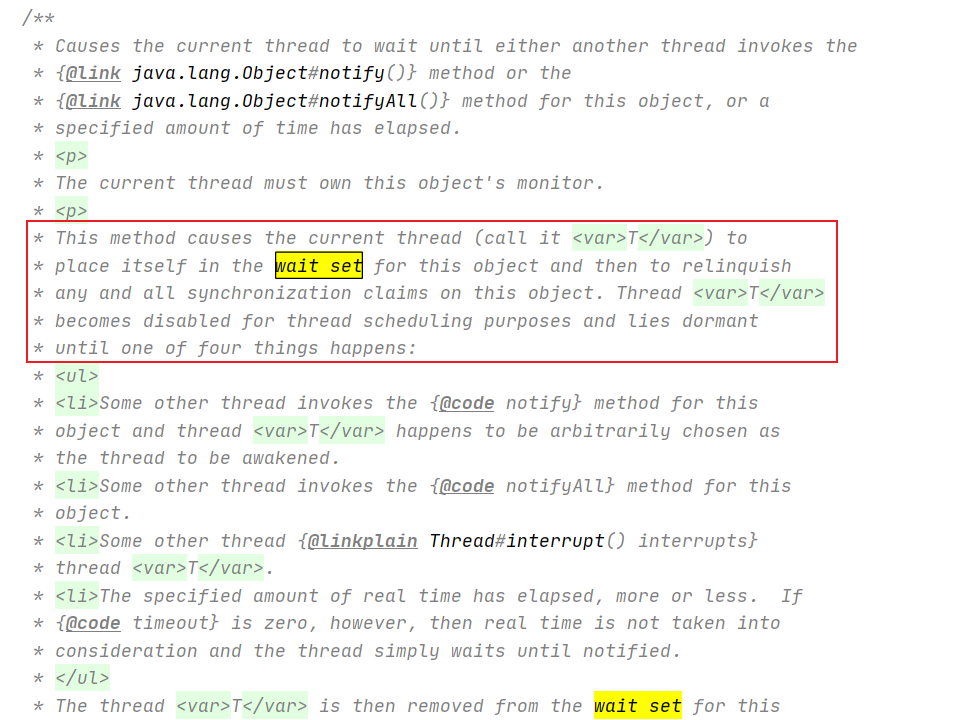

### 1.单例模式

#### 1.1.饿汉式单例

1. 线程安全的，但是没有实现单例对象的懒加载

   ```java
   public class SingletonObject1 {
   
       private static final SingletonObject1 instance = new SingletonObject1();
   
       // 不对外提供构造
       private SingletonObject1(){}
   
       // 对外提供一个静态方法：获取单例对象
       public static SingletonObject1 getInstance() {
           return instance;
       }
   }
   ```

#### 1.2.懒汉式单例 

1. 实现了懒加载，但是线程不安全：创建单例对象的时候不是线程同步的，所以在多线程的情况下可能会创建出多个单例对象

   ```java
   public class SingletonObject2 {
   
       private static SingletonObject2 instance;
   
       // 不对外提供构造
       private SingletonObject2(){}
   
       // 对外提供一个静态方法：获取单例对象
       public static SingletonObject2 getInstance() {
           // 在多线程的情况下，可能会创建出多个实例对象
           if (null == instance)
               instance = new SingletonObject2();
           return instance;
       }
   }
   ```

2. 懒加载且线程安全的单例：但是不仅创建单例时要拿锁，读单例对象时也要拿锁。让获取单例对象这个方法变成串行化的了，效率较低。

   ```java
   public class SingletonObject3 {
   
       private static SingletonObject3 instance;
   
       // 不对外提供构造
       private SingletonObject3(){}
   
       // 对外提供一个静态方法：获取单例对象
       public synchronized static SingletonObject3 getInstance() {
           if (null == instance)
               instance = new SingletonObject3();
           return instance;
       }
   }
   ```

#### 1.3.Double Check Lock模式

1. DCL双重锁检查：当instance为null时，说明要进行写操作，此时才去尝试拿锁。避免了每次读操作也要拿锁。

   隐患：由于可能存在的指令重排，导致得到一个不空但是没有初始化的instance。在外部使用这个instance中的属性/方法时，回报NPE。

   指令重排：JVM在进行编译代码的时候，从优化提高效率的角度，可能不会按照代码编写的顺序来编译代码，当然这是在不影响最终结果的情况下。JVM认为这种重排在**单线程下不影响最终的结果**，也不违反as-if-serial和happens-before原则，而且可以提高效率，那么就可能发生这种编译时重排，甚至运行时重排。

   instance = new SingletonObject4()：这段代码正常情况下经过编译，CPU运行指令会经过这三步。

      - 1.给对象分配内存空间
      - 2.初始化对象
      - 3.将instance引用指向分配的内存空间（此时instance引用就不是null了）

   如果经过指令重排，可能是这样的运行顺序：

      - 1.给对象分配内存空间
      - 2.将instance引用指向分配的内存空间（此时instance引用就不是null了）
      - 3.初始化对象

   结果：就是在多线程的情况下，线程A创建了一个instance且指向了堆内存的一块区域，但是还没有进行初始化。然后CPU时间片被其他线程抢到，发现Instance不为null，得到返回的这个不为null但是对象属性没有经过初始化的单例对象。此时当使用了这个单例对象中的属性/方法时，很容易就会报NPE。

   ```java
   public class SingletonObject4 {
   
       private static SingletonObject4 instance;
   
       private SingletonObject4(){}
   
       // double check
       public static SingletonObject4 getInstance() {
           if (null == instance) {
               synchronized(SingletonObject1.class) {
                   if (null == instance) {
                       instance = new SingletonObject4();
                   }
               }
           }
           return SingletonObject4.instance;
       }
   }
   ```

3. volatile解决指令重排带来的问题：没有禁止指令重排，只是能规避它带来的问题

   volatile能保证内存的可见性：保证多个线程看到的数据是同一份，每一刻线程读取到的该变量值都是内存中最新的那个值，线程每次操作该变量都要先读取该变量。

   volatile能保证有序性：必须遵循读这个数据前，写的完整过程（堆开辟空间+初始化）必须全部完成。

   ```java
   public class SingletonObject5 {
   
       /**
        * volatile：不能保证原子性，
        *  1.能保证内存的可见性：保证多个线程看到的数据是同一份，每一刻线程读取到的该变量值都是内存中最新的那个值，线程每次操作该变量都系要先读取该变量。
        *  2.能保证有序性：必须遵循读这个数据前，写的完整过程（堆开辟空间+初始化）必须全部完成。
        */
       private static volatile SingletonObject5 instance;
   
       private SingletonObject5(){}
   
       // double check
       public static SingletonObject5 getInstance() {
           if (null == instance) {
               synchronized(SingletonObject1.class) {
                   if (null == instance) {
                       instance = new SingletonObject5();
                   }
               }
           }
           return SingletonObject5.instance;
       }
   }
   
   ```

#### 1.4.更优雅的单例模式

1. 将延迟加载和线程安全交给JVM的类加载机制

   类的初始化阶段：主要调用< clinit >方法，对类进行初始化，为类变量赋初始值。而且JVM会保证每个类只会被加载一次：虚拟机会使用加锁的方式让< clinit >()方法只调用一次，保证类只加载一次。实现线程安全的延迟初始化。

   什么时候类会被初始化：只有类或接口被Java程序首次主动使用时才初始化他们。类级的内部类，也就是静态的成员式内部类，该内部类的实例与外部类的实例没有绑定关系。只有被调用到时才会装载，实现延迟加载。

   **所以类的初始化阶段天然实现了懒加载，而且是线程同步的。所以类变量天然就是懒加载的而且是线程同步的。**

   ```java
   public class SingletonObject6 {
      
       private SingletonObject6(){}
   
       // 类的初始化只发生在调用时
       public static class InstanceHolder {
           private final static SingletonObject6 instance = new SingletonObject6();
       }
   
       public static SingletonObject6 getInstance() {
           return InstanceHolder.instance;
       }
   
       public static void main(String[] args) {
           SingletonObject6.getInstance();
       }
   }
   ```

   

#### 1.5.枚举实现的单例模式

1. 代码演示

   ```java
   public class SingletonObject7 {
   
       private SingletonObject7(){}
   
       /**
        * 内部定义一个枚举类和定义一个内部类差不多，这个类都只有再被首次在主动使用时，触发类的初始化阶段，对其中的静态成员变量进行初始化。
        * 而且这个初始化被JVM加上了锁：保证了线程安全
        *
        * 而且枚举可以避免反序列化破坏单例。
        */
       private enum Singleton {
           // 每一个枚举对象其实都是默认通过static来定义的：类似于静态成员变量
           // public static final T INSTANCE;
           INSTANCE;
   
           private final SingletonObject7 instance;
   
           // 枚举的构造函数只会被执行一次
           Singleton() {
               instance = new SingletonObject7();
           }
   
           public SingletonObject7 getInstance() {
               return instance;
           }
       }
   
       public static SingletonObject7 getInstance() {
           return Singleton.INSTANCE.getInstance();
       }
   }
   ```

   

#### 1.6.再看饿汉式单例

1. 如果一个单例类除了这个单例之外，没有其他静态变量或静态方法，那么直接使用饿汉式是很合适的。

   ```java
   public class SingletonObject1 {
      
          /**
           * 类的初始化阶段：主要是调用<clinit>方法：为静态变量初始化。
           * 什么时候类会被初始化：只有类或接口被首次主动使用时才执行类的初始化阶段。并且虚拟机会采用同步加锁的方式执行clinit保证类只会加载一次。
           * 那我们看这个静态变量：
           *  其实在这个类中它也是懒加载的。因为类的初始化阶段只有当类被主动使用时才会触发，这就保证了懒加载。
           *  更重要的是：这个单例类中只有这个静态单例属性，没有其他静态变量或静态方法。在这种情况下除了获取单例外，
           *            通常没有其他会导致这个类初始化的动作，类的初始化本身就已经是一种懒加载了。
           *  为什么又说这种写法不是懒加载呢：
           *      因为考虑到这个单例类中可能还有其他静态成员变量和成员方法，当其他的静态成员变量，静态成员方法被访问时，
           *      也会触发类的初始化，导致单例也会被初始化，即使此时我们不想使用单例对象。
           *  所以：如果一个单例类除了这个单例之外，没有其他静态变量或静态方法，那么直接使用饿汉式式是很合适的。
           */
          private static final SingletonObject1 instance = new SingletonObject1();
      
          // 不对外提供构造
          private SingletonObject1(){}
      
          // 对外提供一个静态方法：获取单例对象
          public static SingletonObject1 getInstance() {
              return instance;
          }
      }
   ```

### 2.Wait Set概念

1. wait set是一个逻辑上的概念，每个对象都可以认为有一个wait set

2. obj.wait()：意味着当前线程就进入到obj的wait set中，变成WAITING状态，等待notify唤醒，或者interrupt中断

3. 当一个处于某个Obj的wait set的线程被notify时，会从WAITING状态回到Runnable状态，然后开始抢占Obj这个锁。抢到的话，就从上次wait的地方开始执行。

4. 看一下wait(long timeout)的代码注释：

   


